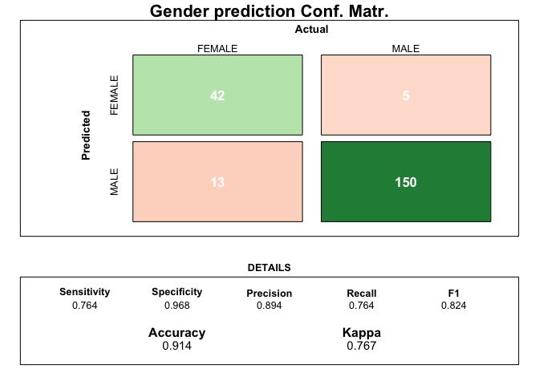
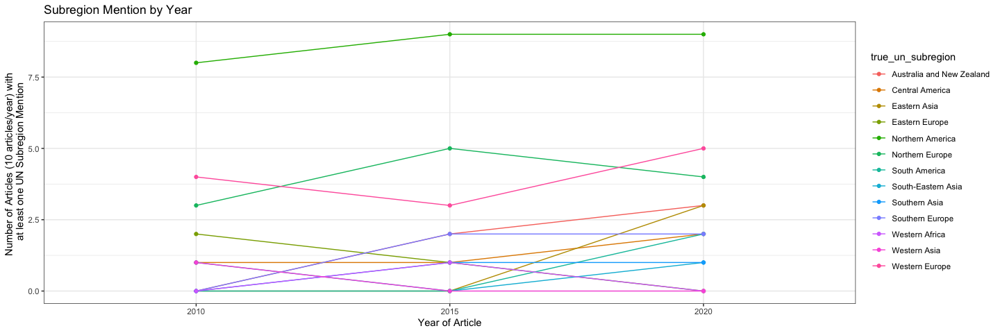
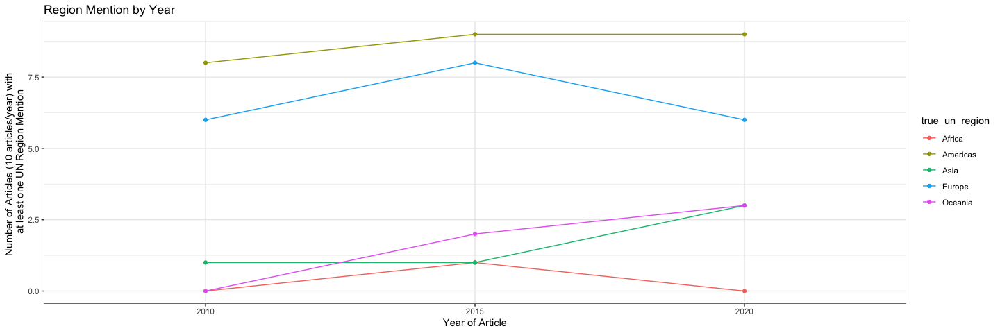

nature\_news\_disp
================
Natalie Davidson
12/16/2020

## Nature News Disparities -- gender + location

This document is a first attempt to analyze the Nature News content to see if there are differences in geographic and gender representation. Currently, this work only looks at a benchmark dataset with 10 articles per year, for the years 2010, 2015, 2020. The benchmark dataset currently consists of 2 files

1.  `benchmark_quote_table_hand_annotated` contains mapping between the speaker and their name and gender
    -   `benchmark_quote_table_raw` is the output from coreNLP which we will compare against
2.  `benchmark_location_table_hand_annotated` contains a mapping between all found (organizations, states, provencces, countries) with a (normalized country name, UN region, and UN sub-region)
    -   `benchmark_location_table_raw` is the output from coreNLP which we will compare against

**All analysis shown below depends on the functions described in `/analyze_benchmark_data/analyze_benchmark_data.R`**

## Quote Analysis

### reading in the quote data

``` r
# get the project directory
proj_dir = here()

# get benchmark (bm) file and read it
bm_quote_file = paste(proj_dir, 
                    "/data/benchmark_data/benchmark_quote_table_hand_annotated.tsv", 
                    sep="")

bm_quote_df = read_benchmark_quote_file(bm_quote_file)
```

Lets look at what the file

``` r
head(bm_quote_df)
```

    ##         file_id      true_speaker true_gender
    ## 1 4641259a.html  Sergio Baranzini        MALE
    ## 2 4641259a.html  Sergio Baranzini        MALE
    ## 3 4641259a.html Stephen Kingsmore        MALE
    ## 4 4641259a.html  Daniel Geschwind        MALE
    ## 5 4641259a.html Stephen Kingsmore        MALE
    ## 6 4641259a.html Stephen Kingsmore        MALE
    ##                                                                                                                                  quote
    ## 1                                                                 one was exposed to the perfect combination of environmental triggers
    ## 2 It isn't just sequence — they went from sequence to epigenome to expression. That's what really makes [the study] something special.
    ## 3                                                                         "we really ought to look at sequencing of the brain tissue,"
    ## 4                                                        "What they've done here is create a very nice template for others to follow,"
    ## 5                                                  "Both twins came into the world with the same set of high risks for developing MS,"
    ## 6                                                      "There had to be some trigger that caused one to develop it and the other not,"

Here we get the `file_id`, the true speaker of the quote, their true gender, and the quote in question. Now lets find what we get out of coreNLP, which we will compare against

``` r
# 
raw_quote_file = paste(proj_dir, 
                    "/data/benchmark_data/benchmark_quote_table_raw.tsv", 
                    sep="")

raw_quote_df = read_corenlp_quote_files(raw_quote_file)

head(raw_quote_df)
```

    ##              file_id        est_speaker est_gender  canonical_speaker
    ## 1 d41586-020-00889-6              Addex       MALE       spokesperson
    ## 2 d41586-020-00889-6              Addex       MALE        Neena Nizar
    ## 3 d41586-020-00889-6              Addex       MALE       spokesperson
    ## 4 news.2010.179.html Adrian de Ferranti       MALE Adrian de Ferranti
    ## 5 d41586-020-01756-0    Alexis Kalergis       MALE            Unknown
    ## 6 news.2010.179.html      Andrew Osmond       MALE            Unknown
    ##         partial_name
    ## 1              Addex
    ## 2              Addex
    ## 3              Addex
    ## 4 Adrian de Ferranti
    ## 5           Kalergis
    ## 6      Andrew Osmond
    ##                                                                                                                                                                                                                  quote
    ## 1                                                                                                                                                                                   The COVID-19 situation is dynamic,
    ## 2                                                                                                                        I feel like we were chugging along on a train and then somebody dropped a huge boulder on it.
    ## 3                                                                                                         We are now seeing impacts on clinical-trial continuity in all the regions where we conduct clinical studies.
    ## 4 It is an endorsement of the council and it's also a message to us that we've got a lot to do and we've got a terrific organization to bring into the twenty-first century and continue with the job we have in hand.
    ## 5                                                                                                                                              all human vaccines used in Chile are obtained from foreign laboratories
    ## 6                                                                                                                                                                  outgoings are now substantially in excess of income

The main columns of interest are `est_gender` and `est_speaker`, which we will compare between lines that have the same `quote` and `file_id`.

### analyzing quote data

First, lets look at the *benchmark* data, to see if there exist any gender disparity evidence. 

Ok, so we see some signal. Now what does it look like for our estimated gender?


Nice, it looks pretty close. Things called `NO_EST` are when a quote was found, but no gender was able to be estimated. Let's take a closer look at the errors 

### analyzing location data

``` r
# get benchmark (bm) file and read it
bm_loc_file = paste(proj_dir, 
                    "/data/benchmark_data/benchmark_location_table_hand_annotated.tsv", 
                    sep="")

bm_loc_df = read_benchmark_location_file(bm_loc_file)

raw_loc_file = paste(proj_dir, 
                    "/data/benchmark_data/benchmark_location_table_hand_annotated.tsv", 
                    sep="")

raw_loc_df = read_corenlp_location_files(raw_loc_file)
```

The location data tries to find an organization, state, province, or country. After this it tries to tag it to a canonically named country, and UN defined regions. Let's take a look.

``` r
head(bm_loc_df)
```

    ##         file_id                                             text
    ## 1 4641259a.html National Center for Genome Resources in Santa Fe
    ## 2 4641259a.html                         University of California
    ## 3 4641259a.html                                  Yale University
    ## 4 4641259a.html                                               US
    ## 5 4641259a.html                                       New Mexico
    ## 6 4641259a.html                                      Connecticut
    ##                 ner                   true_country true_un_region
    ## 1      ORGANIZATION United States of America (USA)       Americas
    ## 2      ORGANIZATION United States of America (USA)       Americas
    ## 3      ORGANIZATION United States of America (USA)       Americas
    ## 4           COUNTRY United States of America (USA)       Americas
    ## 5 STATE_OR_PROVINCE United States of America (USA)       Americas
    ## 6 STATE_OR_PROVINCE United States of America (USA)       Americas
    ##   true_un_subregion
    ## 1  Northern America
    ## 2  Northern America
    ## 3  Northern America
    ## 4  Northern America
    ## 5  Northern America
    ## 6  Northern America

``` r
head(raw_loc_df)
```

    ##         file_id                                             text
    ## 1 4641259a.html National Center for Genome Resources in Santa Fe
    ## 2 4641259a.html                         University of California
    ## 3 4641259a.html                                  Yale University
    ## 4 4641259a.html                                               US
    ## 5 4641259a.html                                       New Mexico
    ## 6 4641259a.html                                      Connecticut
    ##                 ner                    est_country est_un_region
    ## 1      ORGANIZATION United States of America (USA)      Americas
    ## 2      ORGANIZATION United States of America (USA)      Americas
    ## 3      ORGANIZATION United States of America (USA)      Americas
    ## 4           COUNTRY United States of America (USA)      Americas
    ## 5 STATE_OR_PROVINCE United States of America (USA)      Americas
    ## 6 STATE_OR_PROVINCE United States of America (USA)      Americas
    ##   est_un_subregion
    ## 1 Northern America
    ## 2 Northern America
    ## 3 Northern America
    ## 4 Northern America
    ## 5 Northern America
    ## 6 Northern America

Similar to before we will match columns baed on their names, in `raw_loc_df` it has `est_` columns and in `bm_loc_df` is has matching `true_` columns

Now lets first look at the benchmark data 
