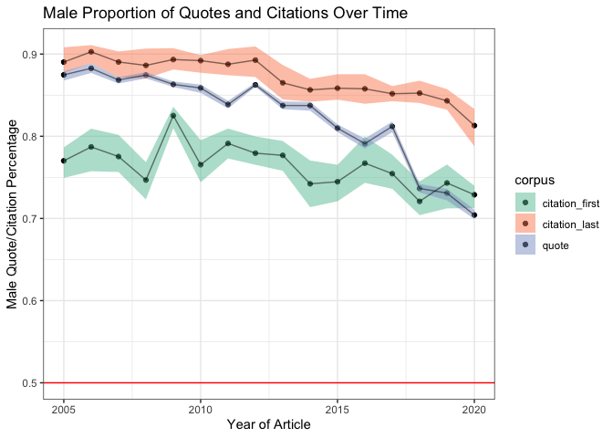
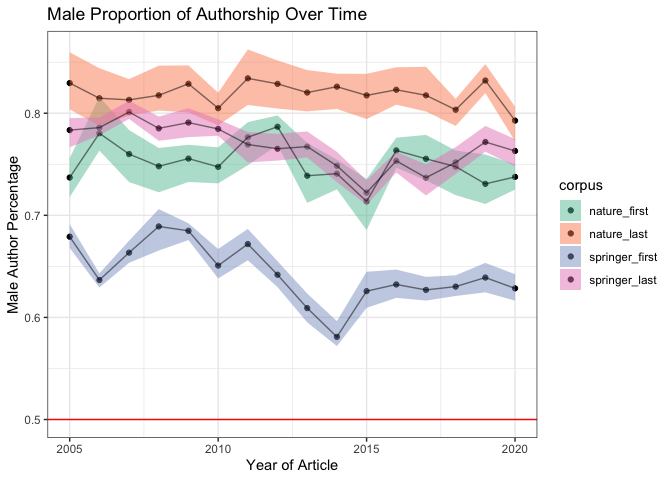
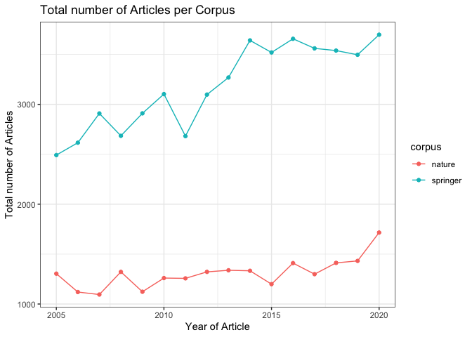
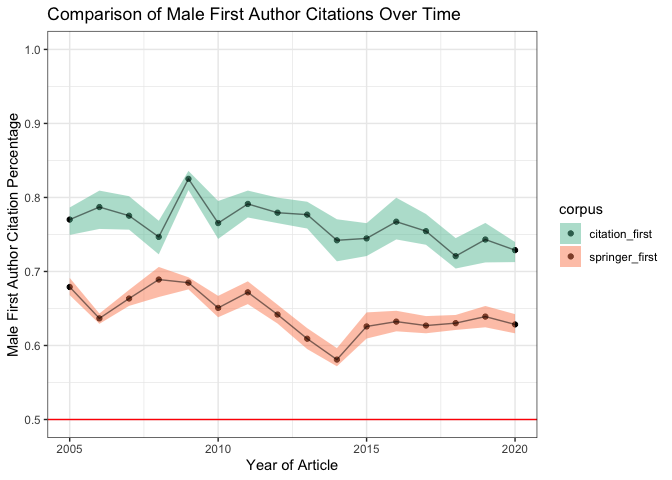
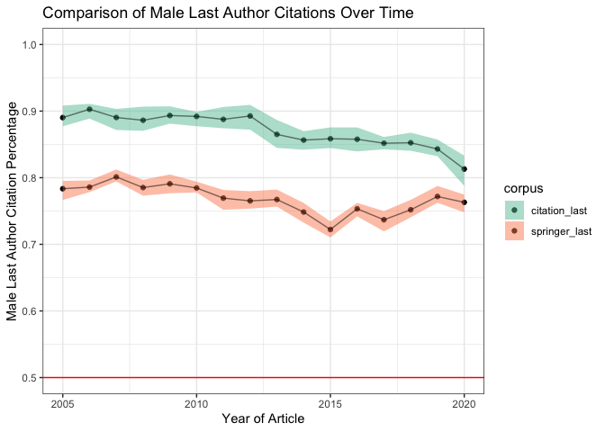

background\_gender\_analysis
================
Natalie Davidson
3/01/2021

## Data Description

This document compares two "foreground" datasets (gender of quoted authors and gender of cited authors) and compares it to two possible "background" datasets (random sampling of 36K Springer articles, and all nature articles)

Foreground files:

1.  `./data/author_data/cited_author_gender.tsv` has the gender for each first and last authors that were cited in any nature news article between 2005-2020. Only articles that are indexed by Springer are included in this analysis.

2.  `./data/scraped_data/quote_table_raw_20*.tsv` has all quotes with estimated gender for the speaker. It is generated after scraping all articles from a year between 2005-2020 (`./nature_news_scraper/run_scrape_benchmark.sh`) then running it through coreNLP with additional processing (`./process_scraped_data/run_process_target_year.sh`)

Background files:

1.  `./data/author_data/springer_author_gender.tsv` has the gender of first and last authors from a randomly selected 36K Springer articles from 2005-2020.

2.  `./data/scraped_data/nature_author_gender.tsv` has the gender of first and last authors from all Nature articles from 2005-2020.

## Foreground Gender Breakdown

Read in the quote and citation data from Nature News.

``` r
# get the project directory, everything is set relative to this
proj_dir = here()

cited_file = file.path(proj_dir, "/data/author_data/cited_author_gender.tsv")
cited_df = read_gender_files(cited_file)
head(cited_df)
```

    ##       author                            doi year author_pos            file_id
    ## 1   †genetic        doi:10.1038/nature08186 2011       last news.2011.620.html
    ## 2   †genetic        doi:10.1038/nature08186 2014       last        nature13645
    ## 3 aanindeeta        doi:10.1038/nature17185 2016      first            531180a
    ## 4      aaron        doi:10.1038/nature13124 2014      first        nature13067
    ## 5      aaron doi:10.1038/s41467-019-13176-4 2020       last d41586-020-00094-5
    ## 6      aaron  doi:10.1038/s41586-019-0953-5 2019      first d41586-019-02974-x
    ##   est_gender gender
    ## 1       <NA>   <NA>
    ## 2       <NA>   <NA>
    ## 3       <NA>   <NA>
    ## 4       MALE   MALE
    ## 5       MALE   MALE
    ## 6       MALE   MALE

``` r
# read in the all quotes for all news articles and all years 
full_quote_df = NA
quote_files = list.files(file.path(proj_dir,"/data/scraped_data/", sep=""), full.names = T)
quote_files = grep("quote_table_raw_", quote_files, value=T)
for(quote_file in quote_files){
    
    quote_df = read_corenlp_quote_files(quote_file)
    quote_df$year = str_extract(quote_file, "[1-9][0-9]+") # curr_year
    quote_df$type = substring(basename(quote_file), 
                            22, nchar(basename(quote_file))-4)
    
    full_quote_df = rbind(full_quote_df, quote_df)
}
full_quote_df = full_quote_df[-1,]
full_quote_df = full_quote_df[full_quote_df$est_gender %in% c("FEMALE", "MALE"), ]

head(full_quote_df)
```

    ##   file_id       est_speaker est_gender canonical_speaker     partial_name
    ## 2 434970a Arnold Sommerfeld       MALE     Edward Teller       Sommerfeld
    ## 3 438567a      Arthur Smith       MALE   Arthur E. Smith  Arthur E. Smith
    ## 4 437634a  Bertrand Russell       MALE  Bertrand Russell Bertrand Russell
    ## 5 434029a             Boxma       MALE           Unknown            Boxma
    ## 6 438031a           Bradley       MALE     F. H. Bradley    F. H. Bradley
    ## 7 435748a            Brooks       MALE   C. E. P. Brooks  C. E. P. Brooks
    ##                                                                                          quote
    ## 2     as if I was born in Germany only by mistake, and only came to my true homeland at age 28
    ## 3                                                                                       tongue
    ## 4 If ever these evils are eradicated, his name should stand very high indeed among the heroes.
    ## 5                                                                            true missing link
    ## 6                                          Finding bad reasons for what we believe on instinct
    ## 7                                                                                 Fog and Soot
    ##   year           type
    ## 2 2005 news-and-views
    ## 3 2005 news-and-views
    ## 4 2005 news-and-views
    ## 5 2005 news-and-views
    ## 6 2005 news-and-views
    ## 7 2005 news-and-views

### compare proportions over all years

From the Nature News corpus, we predict the gender of quoted speakers and cited (first and last) authors. Now lets plot the trend of predicted proportion of Male speakers/authors over time 

## Background Gender Breakdown

Now we read in the background data: random sampling of Springer articles and all Nature articles.

``` r
# get the project directory, everything is set relative to this
proj_dir = here()


# read in the springer author data
springer_file = file.path(proj_dir, "/data/author_data/springer_author_gender.tsv")
springer_df = read_gender_files(springer_file)
head(springer_df)
```

    ##            author                                doi year author_pos est_gender
    ## 1          (aegis      doi:10.1007/s10751-019-1553-3 2019       last       <NA>
    ## 2 [authorinst]the doi:10.1140/epjc/s10052-016-4346-8 2016       last       <NA>
    ## 3            a-mf         doi:10.1038/sj.onc.1210387 2007      first       <NA>
    ## 4          aaltje        doi:10.1186/1471-2318-12-19 2012       last       MALE
    ## 5           aalya     doi:10.1186/1753-6561-6-S5-O16 2012      first       MALE
    ## 6             aam          doi:10.1186/1479-0556-4-1 2006      first       MALE
    ##   gender
    ## 1   <NA>
    ## 2   <NA>
    ## 3   <NA>
    ## 4   MALE
    ## 5   MALE
    ## 6   MALE

``` r
# read in the nature author data
nature_file = file.path(proj_dir, "/data/author_data/nature_author_gender.tsv")
nature_df = read_gender_files(nature_file)
head(nature_df)
```

    ##       author                            doi year author_pos            file_id
    ## 1     aakash doi:10.1038/s41586-020-03052-3 2020      first s41586-020-03052-3
    ## 2 aanindeeta        doi:10.1038/nature17185 2016      first        nature17185
    ## 3      aaron  doi:10.1038/s41586-020-3009-y 2020      first  s41586-020-3009-y
    ## 4      aaron        doi:10.1038/nature07885 2009       last        nature07885
    ## 5      aaron        doi:10.1038/nature03831 2005       last        nature03831
    ## 6      aaron        doi:10.1038/nature04790 2006       last        nature04790
    ##   est_gender gender
    ## 1       MALE   MALE
    ## 2       <NA>   <NA>
    ## 3       MALE   MALE
    ## 4       MALE   MALE
    ## 5       MALE   MALE
    ## 6       MALE   MALE

### compare gender authorship proportions over all years

Now lets look at all author publication gender and plot the trend over time. We see that the Springer corpus has many more articles sampled from it than the Nature corpus. We also see that there is an increase in Springer articles from 2005-2020; this is caused by name format changes. In this analysis, an article is only considered if it has a name where the gender is able to be guessed. In 2005, more journals were shortening the name such that only initials were used, thus reducing the number of articles able to be analyzed.

Since the number of articles in Nature are small and the resulting proportion of male authors noisy, we will use the Springer background in the following comparison.



## Compare Foreground and Background

Now we will compare the identified quotes and cited authors from Nature News and compare the proportions of male speakers/authors against the previously shown background set of Springer articles.



Now breakdown the quotes into the different submagazines.


