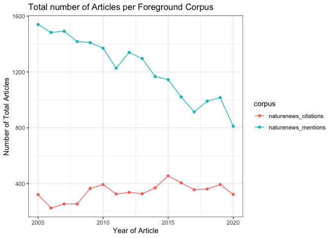
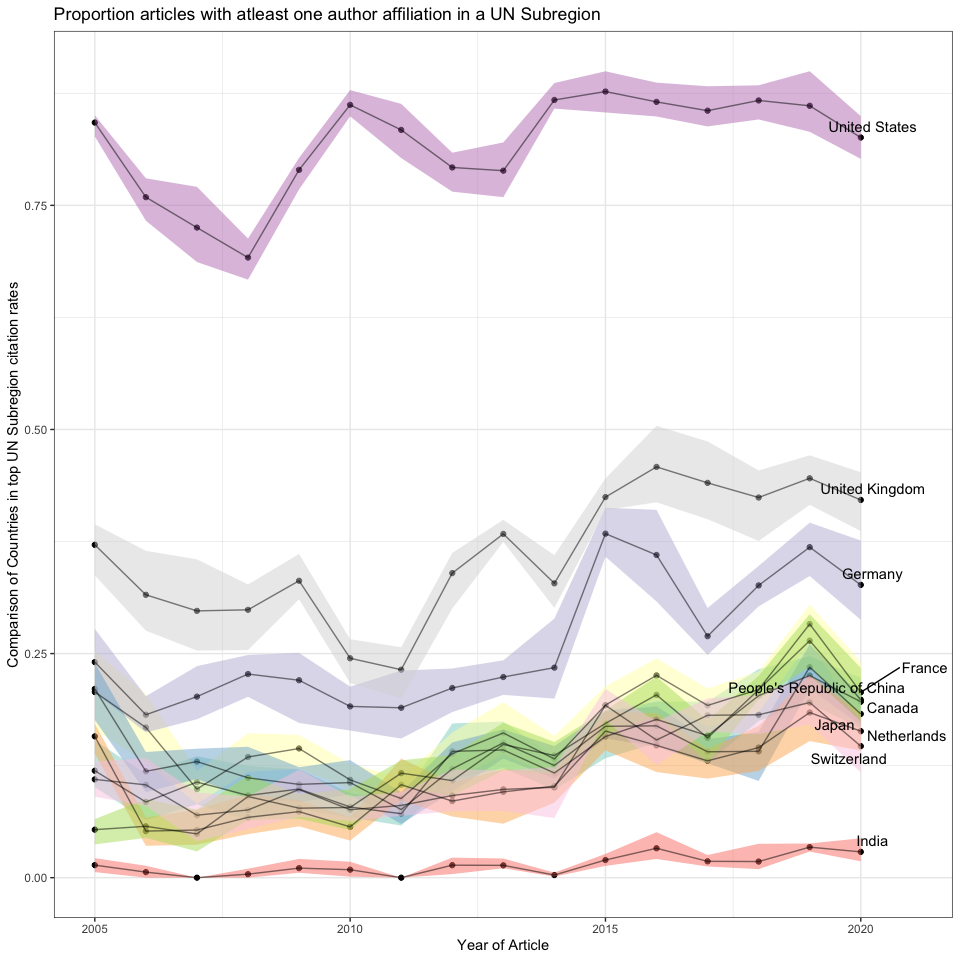
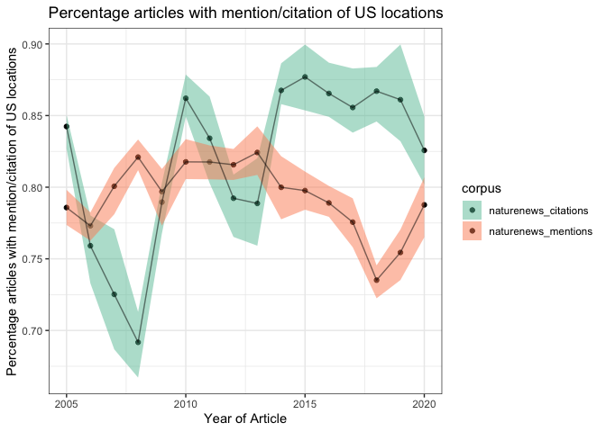
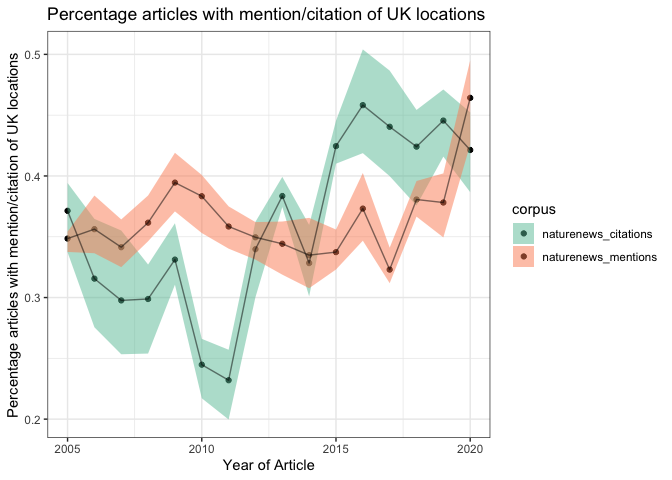
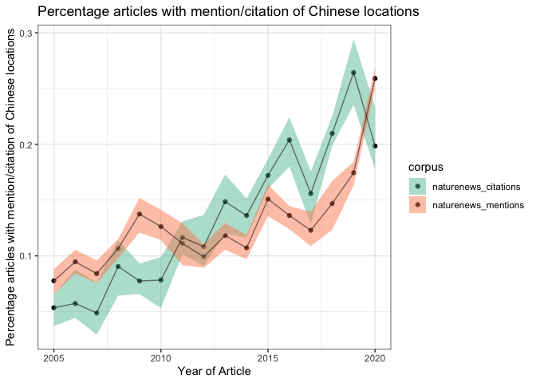
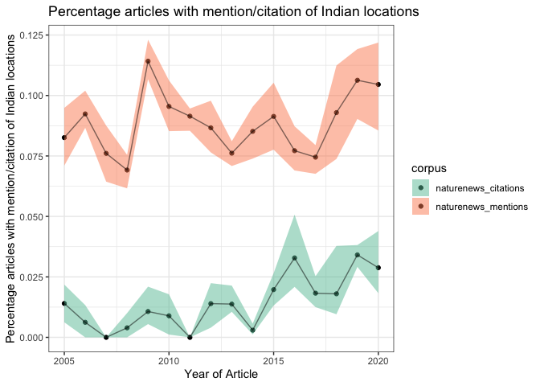
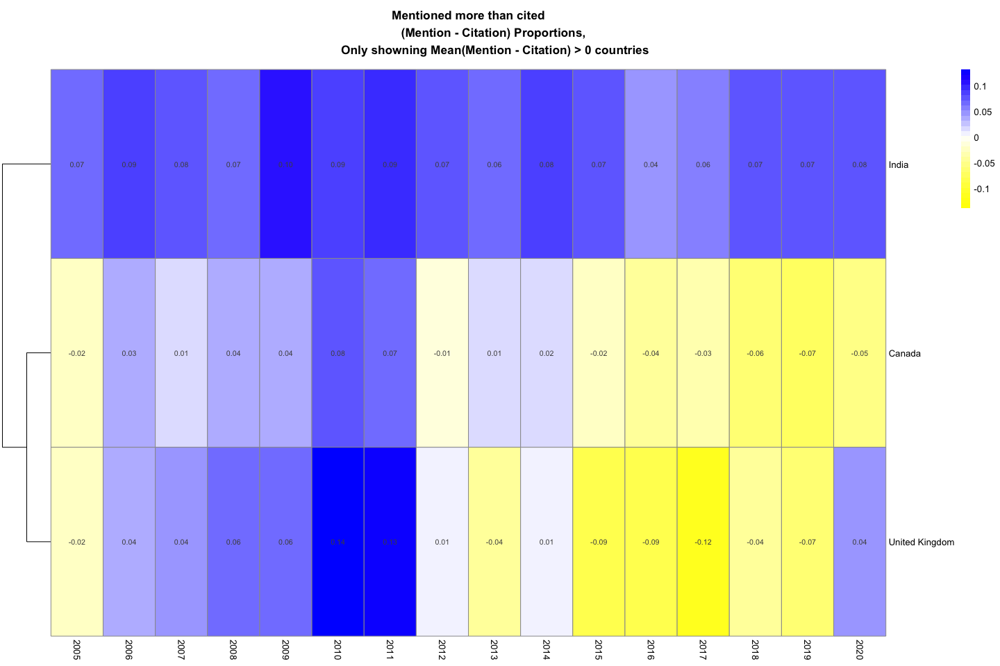
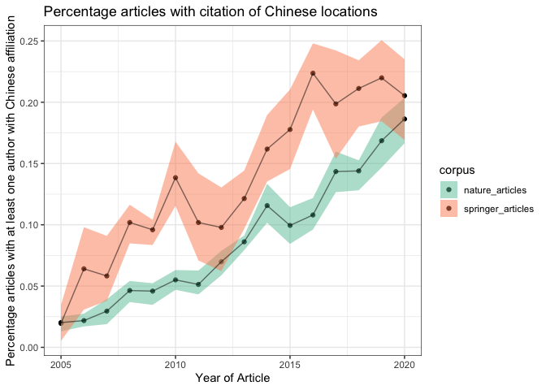

location\_with\_bg\_analysis
================
Natalie Davidson
3/2/2021

## Data Description

This document compares two "foreground" datasets (locations mentioned and locations of authors cited in nature news articles) and compares it to two possible "background" datasets (random sampling of 36K Springer articles, and all nature articles)

The source data file is: `./data/author_data/all_author_country.tsv`

The four corpi are indexed by the `corpus` column:

1.  `nature_news`: **foreground** country of a location mentioned in any Nature News article

2.  `news_citation`: **foreground** country of Nature News cited authors affiliation.

3.  `nature_articles`: **background** country of author affiliation from Nature articles.

4.  `springer`: **background** country of author affiliation from random subset of Springer articles.

The `num_entries` column denotes the number of articles with at least ONE author from a particular country The `address.country_code` column denotes the UN 2-digit country code

A reference data file is: `./data/author_data/total_num_articles_per_corpus.tsv` This file contains the number of articles per corpus for reference.

## Foreground Location Breakdown

Read in the country data from all sources.

``` r
# get the project directory, everything is set relative to this
proj_dir = here()

# read in the cited author data
country_file = file.path(proj_dir, "/data/author_data/all_author_country.tsv")
country_df = data.frame(fread(country_file))

un_info = get_country_info()
country_df = merge(country_df, un_info)
```

### compare cited vs mentioned regions over all years

From the Nature News corpus, lets compare the countries of locations mentioned in Nature news articles against the countries of cited authors.

Here lets first look at the total number of articles considered (number of nature news articles per year, and the number of articles cited by Nature News and indexed by Springer)



Let's first compare different UN subregions to one another in the two cohorts.

    ## [1] "United States"
    ## [1] "United Kingdom"
    ## [1] "People's Republic of China"
    ## [1] "Germany"
    ## [1] "France"
    ## [1] "Canada"
    ## [1] "Switzerland"
    ## [1] "Netherlands"
    ## [1] "Japan"
    ## [1] "India"

    ## [1] "United States"
    ## [1] "United Kingdom"
    ## [1] "People's Republic of China"
    ## [1] "Germany"
    ## [1] "France"
    ## [1] "Canada"
    ## [1] "Switzerland"
    ## [1] "Netherlands"
    ## [1] "Japan"
    ## [1] "India"



Now lets look at the proportion of articles with atleast 1 country mention or atleast 1 authors' affiliate country cited by Nature News.

We first look at individual countries.



Now lets take the mention proportion - citation proportion for each country. This will help us understand if some countries are studied more or publish more, or its equal.



## Background location Breakdown

Now aggregate the background data: all Springer articles and all Nature articles.

Here lets first look at the total number of articles considered (number of nature articles per year, and the number of Springer articles)


So Springer has many more articles than Nature. Let's look comparatively at different countries to check their frequencies. We see that Nature is very biased towards US/UK in comparison to springer. I believe springer has non-english journals, but needs to be checked.

    ## [1] "United States"
    ## [1] "United Kingdom"
    ## [1] "People's Republic of China"
    ## [1] "Germany"
    ## [1] "France"
    ## [1] "Canada"
    ## [1] "Switzerland"
    ## [1] "Netherlands"
    ## [1] "Japan"
    ## [1] "India"

    ## [1] "United States"
    ## [1] "United Kingdom"
    ## [1] "People's Republic of China"
    ## [1] "Germany"
    ## [1] "France"
    ## [1] "Canada"
    ## [1] "Switzerland"
    ## [1] "Netherlands"
    ## [1] "Japan"
    ## [1] "India"



<!-- Now lets compare nature news citations rate against Springer and Nature articles for a few countries. -->
<!-- We see that the citation rate mostly tracks the Nature article rate. -->
<!-- ```{r citation_v_springer_v_nature, out.width="50%", echo=FALSE, warning=FALSE, message=F} -->
<!-- nature_bg_df = get_aggr_region(country_df, num_art_df,  -->
<!--                                curr_corpus="nature_articles", "country") -->
<!-- springer_bg_df = get_aggr_region(country_df, num_art_df,  -->
<!--                                  curr_corpus="springer", "country") -->
<!-- cited_df = get_aggr_region(country_df, num_art_df,  -->
<!--                            curr_corpus="news_citation", "country") -->
<!-- compare_df = rbind(nature_bg_df, springer_bg_df, cited_df) -->
<!-- ggplot(subset(compare_df, country == "United States"), aes(x=as.numeric(year), y=prop, -->
<!--                               fill=corpus, color=corpus)) + -->
<!--     geom_point() + geom_line() + theme_bw() +  -->
<!--     xlab("Year of Article") +  -->
<!--     ylab("Percentage articles with at least one author with US affiliation") + -->
<!--     ggtitle("Percentage articles with citation of US locations") +  -->
<!--     scale_fill_brewer(palette="Set2") -->
<!-- ggplot(subset(compare_df, country == "United Kingdom"), aes(x=as.numeric(year), y=prop, -->
<!--                               fill=corpus, color=corpus)) + -->
<!--     geom_point() + geom_line() + theme_bw() +  -->
<!--     xlab("Year of Article") +  -->
<!--     ylab("Percentage articles with at least one author with UK affiliation") + -->
<!--     ggtitle("Percentage articles with citation of UK locations") +  -->
<!--     scale_fill_brewer(palette="Set2") -->
<!-- ggplot(subset(compare_df, country == "People's Republic of China"), aes(x=as.numeric(year), y=prop, -->
<!--                               fill=corpus, color=corpus)) + -->
<!--     geom_point() + geom_line() + theme_bw() +  -->
<!--     xlab("Year of Article") +  -->
<!--     ylab("Percentage articles with at least one author with Chinese affiliation") + -->
<!--     ggtitle("Percentage articles with citation of Chinese locations") +  -->
<!--     scale_fill_brewer(palette="Set2") -->
<!-- ggplot(subset(compare_df, country == "India"), aes(x=as.numeric(year), y=prop, -->
<!--                               fill=corpus, color=corpus)) + -->
<!--     geom_point() + geom_line() + theme_bw() +  -->
<!--     xlab("Year of Article") +  -->
<!--     ylab("Percentage articles with at least one author with Indian affiliation") + -->
<!--     ggtitle("Percentage articles with mention/citation of Indian locations") +  -->
<!--     scale_fill_brewer(palette="Set2") -->
<!-- ``` -->
<!-- Now lets take the Nature authorship - Nature News citation proportion for each country.  -->
<!-- This will help us understand if Nature News focuses more on research from a specific country. -->
<!-- ```{r authorship_minus_citation, fig.align='center', fig.width = 15, fig.height = 10, echo=FALSE, warning=FALSE, message=F} -->
<!-- nature_bg_df = get_aggr_region(country_df, num_art_df,  -->
<!--                                curr_corpus="nature_articles", "country") -->
<!-- cited_df = get_aggr_region(country_df, num_art_df,  -->
<!--                            curr_corpus="news_citation", "country") -->
<!-- colnames(nature_bg_df)[6] = "nature_prop" -->
<!-- colnames(cited_df)[6] = "citation_prop" -->
<!-- compare_df = merge(nature_bg_df[,c("year", "country", "nature_prop")],  -->
<!--                       cited_df[,c("year", "country", "citation_prop")]) -->
<!-- compare_df$diff = compare_df$nature_prop - compare_df$citation_prop -->
<!-- compare_matr = compare_df %>% -->
<!--                     dcast(country ~ year, value.var="diff") -->
<!-- row.names(compare_matr) = compare_matr$country -->
<!-- compare_matr = compare_matr[,-1] -->
<!-- top_diff_country_idx = which(apply(compare_matr, 1, mean) > 0) -->
<!-- sub_matr = compare_matr[top_diff_country_idx,] -->
<!-- max_val = max(abs(sub_matr)) -->
<!-- breaks = c(seq(-1*max_val, max_val, by = 0.01)) -->
<!-- color_pmap <- colorRampPalette(c("yellow", "white", "blue"))(length(breaks)) -->
<!-- pheatmap(sub_matr, cluster_rows = T,  -->
<!--          cluster_cols = F, display_numbers = T,  -->
<!--          main = "Authored More than Cited \n -->
<!--                 (Authors - Citation) Proportions,  -->
<!--                 Only showning Mean(Nature Authors - Citation) > 0.001 countries", -->
<!--          color = color_pmap, breaks = breaks) -->
<!-- bottom_diff_country_idx = which(apply(compare_matr, 1, mean) < -0.001) -->
<!-- sub_matr = compare_matr[bottom_diff_country_idx,] -->
<!-- max_val = max(abs(sub_matr)) -->
<!-- breaks = c(seq(-1*max_val, max_val, by = 0.01)) -->
<!-- color_pmap <- colorRampPalette(c("yellow", "white", "blue"))(length(breaks)) -->
<!-- pheatmap(sub_matr, cluster_rows = T,  -->
<!--          cluster_cols = F, display_numbers = T,  -->
<!--          main = "Cited more than Authored \n -->
<!--                 (Authors - Citation) Proportions,  -->
<!--                 Only showning Mean(Nature Authors - Citation) < -0.001 countries", -->
<!--          color = color_pmap, breaks = breaks) -->
<!-- ``` -->
<!-- Now lets compare nature news mentions rate against Springer and Nature articles for a few countries. -->
<!-- ```{r four_countries_v_springer_v_nature,  out.width="50%", echo=FALSE, warning=FALSE, message=F} -->
<!-- nature_bg_df = get_aggr_region(country_df, num_art_df,  -->
<!--                                curr_corpus="nature_articles", "country") -->
<!-- springer_bg_df = get_aggr_region(country_df, num_art_df,  -->
<!--                                  curr_corpus="springer", "country") -->
<!-- cited_df = get_aggr_region(country_df, num_art_df,  -->
<!--                            curr_corpus="nature_news", "country") -->
<!-- compare_df = rbind(nature_bg_df, springer_bg_df, cited_df) -->
<!-- ggplot(subset(compare_df, country == "United States"), aes(x=as.numeric(year), y=prop, -->
<!--                               fill=corpus, color=corpus)) + -->
<!--     geom_point() + geom_line() + theme_bw() +  -->
<!--     xlab("Year of Article") +  -->
<!--     ylab("Percentage articles with at least one author with US affiliation") + -->
<!--     ggtitle("Percentage articles with mention of US locations") +  -->
<!--     scale_fill_brewer(palette="Set2") -->
<!-- ggplot(subset(compare_df, country == "United Kingdom"), aes(x=as.numeric(year), y=prop, -->
<!--                               fill=corpus, color=corpus)) + -->
<!--     geom_point() + geom_line() + theme_bw() +  -->
<!--     xlab("Year of Article") +  -->
<!--     ylab("Percentage articles with at least one author with UK affiliation") + -->
<!--     ggtitle("Percentage articles with mention of UK locations") +  -->
<!--     scale_fill_brewer(palette="Set2") -->
<!-- ggplot(subset(compare_df, country == "People's Republic of China"), aes(x=as.numeric(year), y=prop, -->
<!--                               fill=corpus, color=corpus)) + -->
<!--     geom_point() + geom_line() + theme_bw() +  -->
<!--     xlab("Year of Article") +  -->
<!--     ylab("Percentage articles with at least one author with Chinese affiliation") + -->
<!--     ggtitle("Percentage articles with mention of Chinese locations") +  -->
<!--     scale_fill_brewer(palette="Set2") -->
<!-- ggplot(subset(compare_df, country == "India"), aes(x=as.numeric(year), y=prop, -->
<!--                               fill=corpus, color=corpus)) + -->
<!--     geom_point() + geom_line() + theme_bw() +  -->
<!--     xlab("Year of Article") +  -->
<!--     ylab("Percentage articles with at least one author with Indian affiliation") + -->
<!--     ggtitle("Percentage articles with mention of Indian locations") +  -->
<!--     scale_fill_brewer(palette="Set2") -->
<!-- ``` -->
