name\_origin\_with\_bg\_analysis
================
Natalie Davidson
4/6/2021

## Data Description

This document compares one "foreground" datasets (estimated name origin of authors cited in nature news articles) and compares it to two possible "background" datasets (random sampling of 36K Springer articles, and all nature articles)

The source data file is: `./data/author_data/all_author_fullname_pred.tsv`

The three corpi are indexed by the `corpus` column:

1.  `news_citation`: **foreground** country of Nature News cited authors affiliation.

2.  `nature_articles`: **background** country of author affiliation from Nature articles.

3.  `springer_articles`: **background** country of author affiliation from random subset of Springer articles.

To subset for only articles with a specific country affiliation we will use this file: `./data/author_data/all_author_country.tsv`

## Foreground Location Breakdown

Read in the name data.

``` r
# get the project directory, everything is set relative to this
proj_dir = here()

# read in the cited author data
name_pred_file = file.path(proj_dir, 
                         "/data/author_data/all_author_fullname_pred.tsv")
name_pred_df = data.frame(fread(name_pred_file))

name_info_file = file.path(proj_dir, 
                         "/data/author_data/all_author_fullname.tsv")
name_info_df = data.frame(fread(name_info_file))

# format the prediction table  table
colnames(name_pred_df)[1] = "author"
name_origin_vec = colnames(name_pred_df)[2:ncol(name_pred_df)]
name_origin = apply(name_pred_df[,2:ncol(name_pred_df)], 1, 
                    function(x) name_origin_vec[which(x == max(x))])
name_pred_df$name_origin = name_origin

name_df = merge(name_info_df, name_pred_df[,c("author", "name_origin")])

# remove any names that may have got through that are not real names
name_df = name_df[grep("collab|group", tolower(name_df$author), invert=T), ]
name_df = unique(name_df)
head(name_df)
```

    ##           author year author_pos                                    file_id
    ## 5   A A Bidokhti 2018       last              doi:10.1007/s12040-018-1013-5
    ## 6       A Adwani 2005      first                 doi:10.1186/1477-7800-2-27
    ## 7      A Apessos 2005      first                 doi:10.1038/sj.bjc.6602260
    ## 8    A Ardavanis 2005      first                 doi:10.1038/sj.bjc.6602378
    ## 9       A Auluck 2005      first                 doi:10.1038/sj.bdj.4812658
    ## 10 A B Niculescu 2015      first brain-study-seeks-roots-of-suicide-1.18870
    ##                  corpus   name_origin
    ## 5     springer_articles CelticEnglish
    ## 6     springer_articles       African
    ## 7     springer_articles      European
    ## 8     springer_articles CelticEnglish
    ## 9     springer_articles     EastAsian
    ## 10 naturenews_citations      European

### QC

From each corpus, lets compare the total number of articles considered (the number of articles cited by Nature News and indexed by Springer, number of nature articles, and number of springer articles)

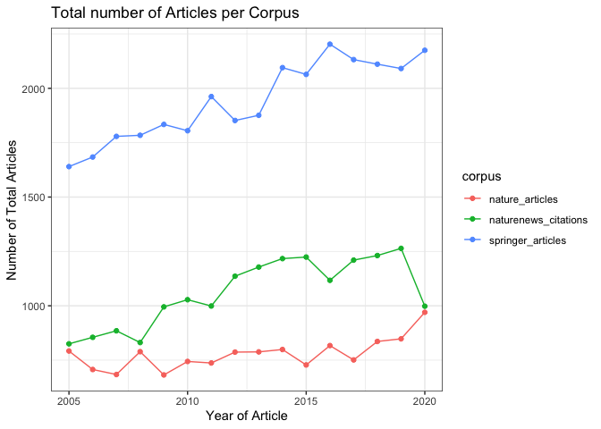

### Name Origin Comparison

For each corpus, lets compare the number of articles with an estimated name origin for the first and last authors.

    ## [1] "CelticEnglish"
    ## [1] "African"
    ## [1] "European"
    ## [1] "EastAsian"
    ## [1] "SouthAsian"
    ## [1] "Hispanic"
    ## [1] "Muslim"
    ## [1] "Israel"

    ## [1] "CelticEnglish"
    ## [1] "African"
    ## [1] "European"
    ## [1] "EastAsian"
    ## [1] "SouthAsian"
    ## [1] "Hispanic"
    ## [1] "Muslim"
    ## [1] "Israel"

    ## [1] "CelticEnglish"
    ## [1] "African"
    ## [1] "European"
    ## [1] "EastAsian"
    ## [1] "SouthAsian"
    ## [1] "Hispanic"
    ## [1] "Muslim"
    ## [1] "Israel"

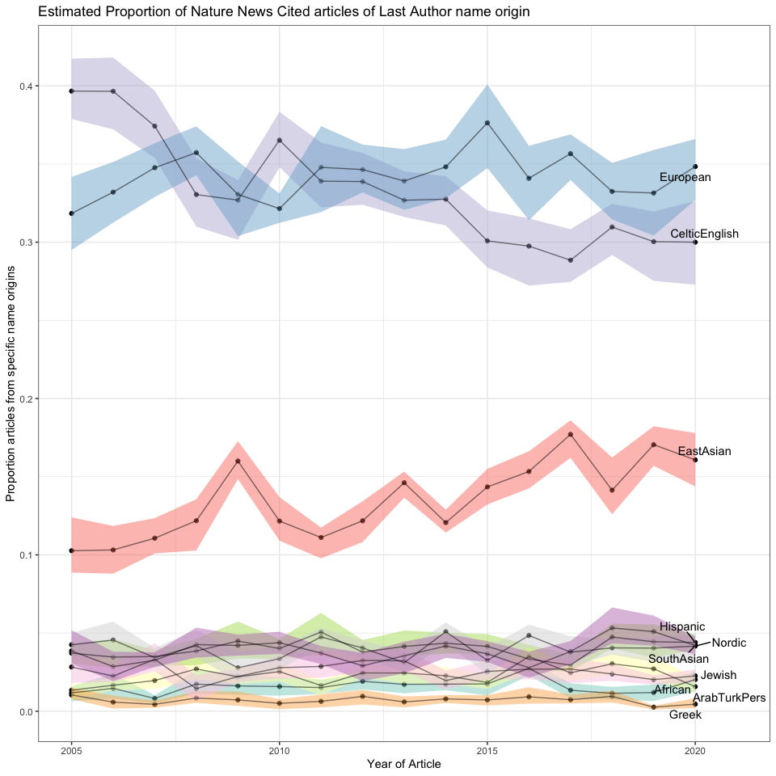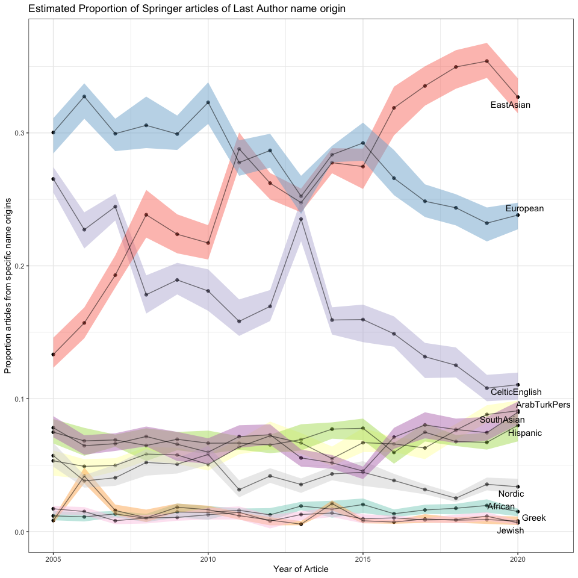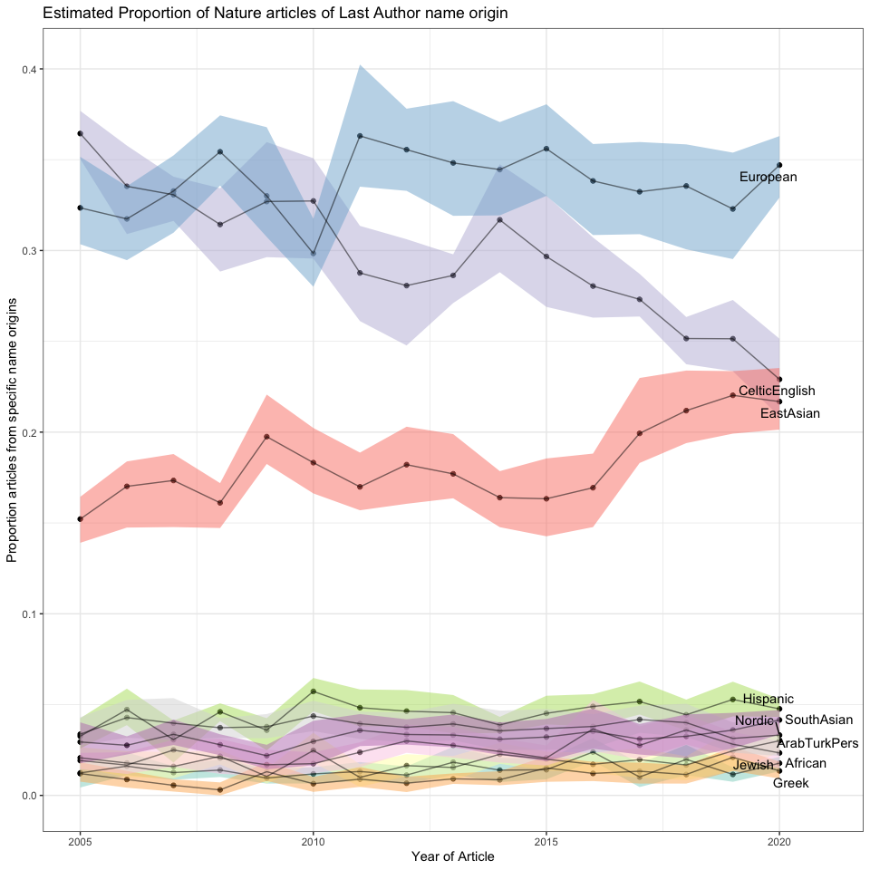

The previous plots are likely confounded by country affiliation. Here we would like to filter to only authors that are affiliated with US / UK.

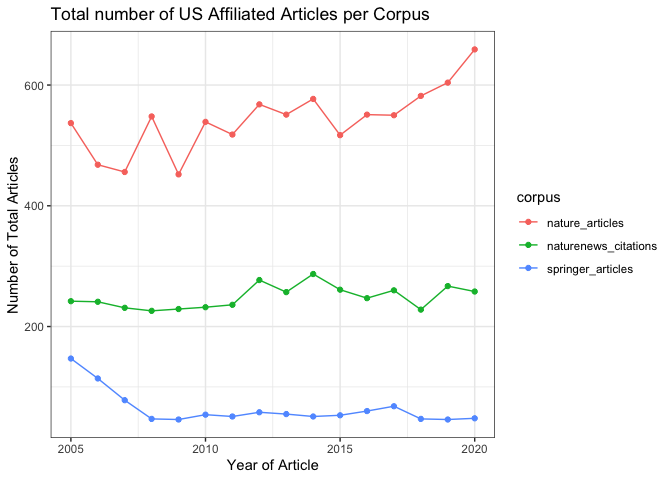

    ## [1] "European"
    ## [1] "CelticEnglish"
    ## [1] "Hispanic"
    ## [1] "SouthAsian"
    ## [1] "Muslim"
    ## [1] "Israel"
    ## [1] "African"
    ## [1] "EastAsian"

    ## [1] "European"
    ## [1] "CelticEnglish"
    ## [1] "Hispanic"
    ## [1] "SouthAsian"
    ## [1] "Muslim"
    ## [1] "Israel"
    ## [1] "African"
    ## [1] "EastAsian"

    ## [1] "European"
    ## [1] "CelticEnglish"
    ## [1] "Hispanic"
    ## [1] "SouthAsian"
    ## [1] "Muslim"
    ## [1] "Israel"
    ## [1] "African"
    ## [1] "EastAsian"


Now lets look at the proportion of articles with atleast 1 country mention or atleast 1 authors' affiliate country cited by Nature News.

We first look at individual countries.

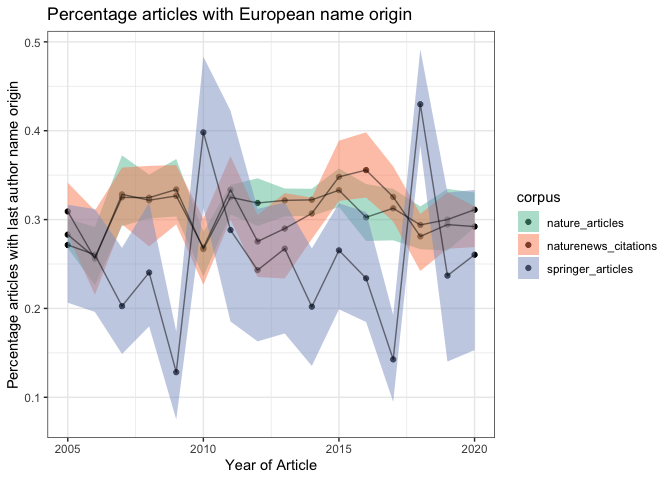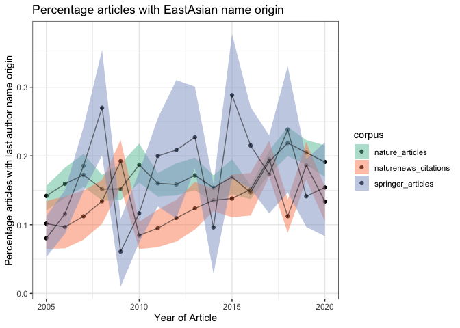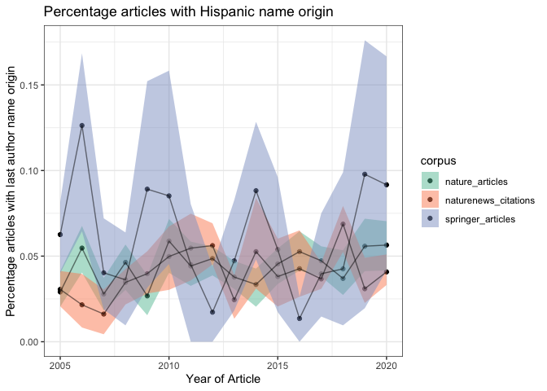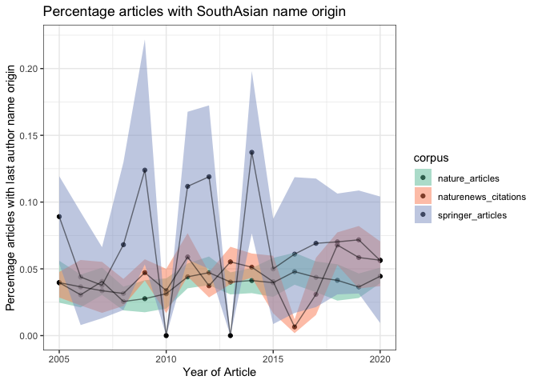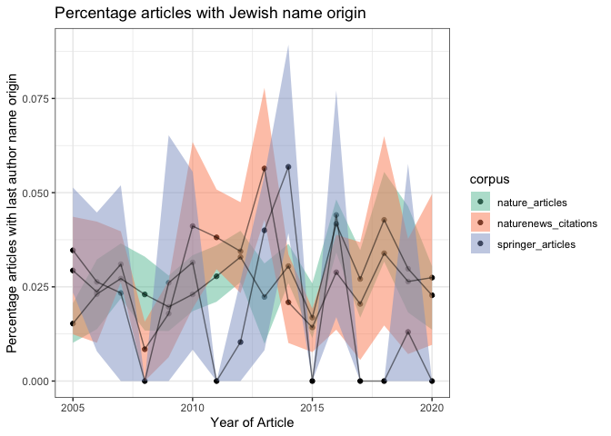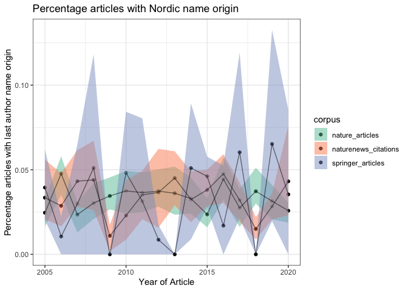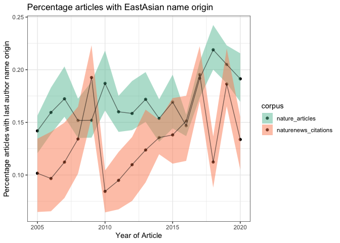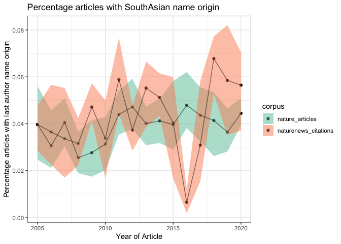
