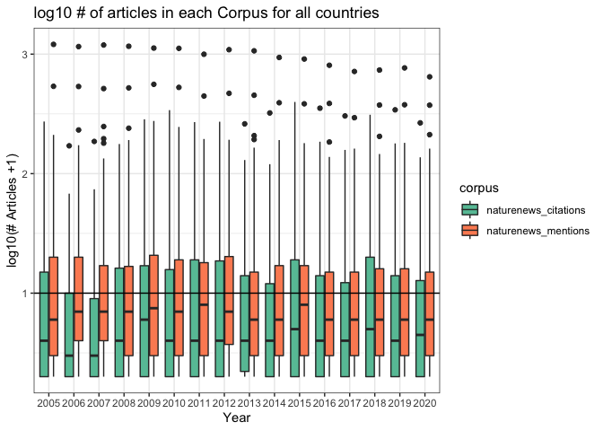
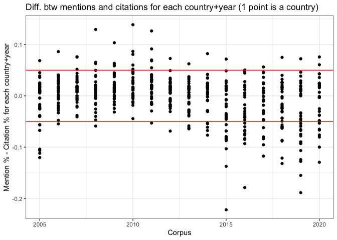
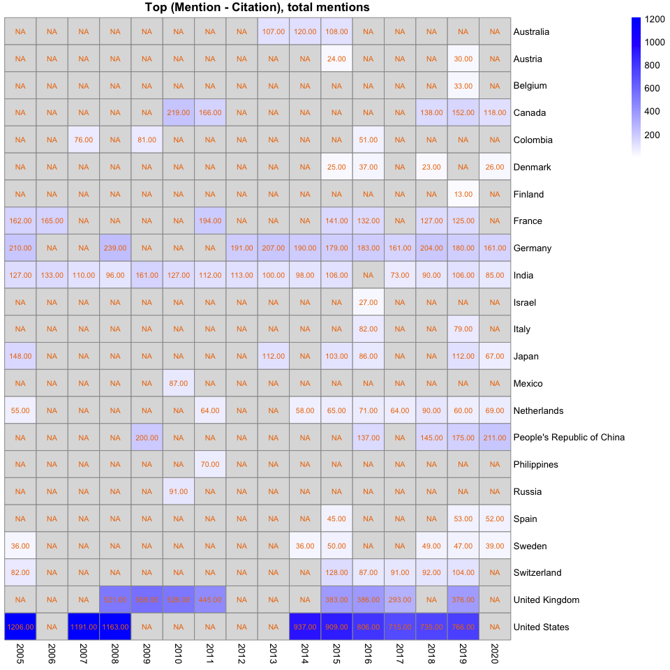

Mention\_v\_ciation\_analysis
================
Natalie Davidson
3/31/2021

## Data Description

This analysis will compare token frequencies between two types of Nature News articles. To identify the types of articles, we first identify which countries are cited more than mentioned and which countries are mentioned more than cited. This comparison is done on a per year basis. After this, we will take the most exemplary of the 2 country classes (top mentions &gt; cited: Class M & top mentions &lt; cited: Class C). We will compare the token frequencies between a mention of Class C v M.

The source data file for a bootstrap estimate of country mentions and citations: `/data/author_data/all_author_country_95CI.tsv`

The all source text is here: `/data/scraped_data/downloads/*.json`

The country mention to source articles id map here: `/data/scraped_data/location_table_raw_YEAR_ARTICLE-TYPE.tsv`

## Get Top Class C and M Countries

#### Read in the raw country counts.

``` r
# get the project directory, everything is set relative to this
proj_dir = here()

# read in the raw location article counts
raw_file = file.path(proj_dir, "/data/author_data/all_author_country.tsv")
raw_df = fread(raw_file)
raw_df = subset(raw_df, address.country_code != "" & !is.na(address.country_code))
raw_df = subset(raw_df, corpus %in% c("naturenews_mentions", "naturenews_citations"))

# get UN info
un_info = get_country_info()
raw_df = merge(un_info, raw_df)

head(raw_df)
```

    ##   address.country_code              country un_region    un_subregion
    ## 1                   ad              Andorra    Europe Southern Europe
    ## 2                   ae United Arab Emirates      Asia    Western Asia
    ## 3                   ae United Arab Emirates      Asia    Western Asia
    ## 4                   ae United Arab Emirates      Asia    Western Asia
    ## 5                   ae United Arab Emirates      Asia    Western Asia
    ## 6                   ae United Arab Emirates      Asia    Western Asia
    ##              file_id year               corpus
    ## 1            446937a 2007  naturenews_mentions
    ## 2 d41586-019-02846-4 2019  naturenews_mentions
    ## 3            544301a 2017 naturenews_citations
    ## 4 d41586-018-04978-5 2018 naturenews_citations
    ## 5 d41586-019-02338-5 2019  naturenews_mentions
    ## 6            480462a 2011  naturenews_mentions

``` r
# get the total number of mentions and citations
# for each country per year
# we only want to evaluate when we have > 10 in either citations or mentions
mention_total = unique(subset(raw_df, 
                              corpus == "naturenews_mentions", 
                              select=c(file_id, year, address.country_code)) )
tot_country_mention = mention_total %>% 
                group_by(year, address.country_code) %>% 
                summarise(n()) 
```

    ## `summarise()` has grouped output by 'year'. You can override using the `.groups` argument.

``` r
tot_country_mention$corpus = "naturenews_mentions"
colnames(tot_country_mention)[3] = "total"

citation_total = unique(subset(raw_df, 
                               corpus == "naturenews_citations", 
                               select=c(file_id, year, address.country_code)) )
tot_country_citation = citation_total %>% 
                group_by(year, address.country_code) %>% 
                summarise(n()) 
```

    ## `summarise()` has grouped output by 'year'. You can override using the `.groups` argument.

``` r
tot_country_citation$corpus = "naturenews_citations"
colnames(tot_country_citation)[3] = "total"

# show the spread of the mentions and citations
raw_sum_df = rbind(tot_country_citation, tot_country_mention)
ggplot(raw_sum_df, aes(x=as.factor(year), y=log10(total+1), fill=corpus)) +
    geom_boxplot() + theme_bw() + geom_hline(yintercept = log10(10), color="black") +
    xlab("Year") + ylab("log10(# Articles +1)") +
    ggtitle("log10 # of articles in each Corpus for all countries") + 
    scale_fill_brewer(palette="Set2")
```



``` r
# now get the country + year pairings in a format easy to join on later
raw_sum_df = reshape2::dcast(raw_sum_df, year+address.country_code ~ corpus, value.var="total")
raw_sum_df[is.na(raw_sum_df)] = 0
colnames(raw_sum_df)[3:4] = c("tot_citations", "tot_mentions")
```

#### Read in the bootstrapped estimate of % of articles with country counts.

``` r
# read in the cited author data
ci_file = file.path(proj_dir, "/data/author_data/all_author_country_95CI.tsv")
ci_df = fread(ci_file)
ci_df = subset(ci_df, country != "" & !is.na(country))

# get UN info
un_info = get_country_info()
ci_df = merge(un_info, ci_df)

head(ci_df)
```

    ##       country address.country_code un_region  un_subregion year bottom_CI
    ## 1 Afghanistan                   af      Asia Southern Asia 2020         0
    ## 2 Afghanistan                   af      Asia Southern Asia 2016         0
    ## 3 Afghanistan                   af      Asia Southern Asia 2018         0
    ## 4 Afghanistan                   af      Asia Southern Asia 2011         0
    ## 5 Afghanistan                   af      Asia Southern Asia 2006         0
    ## 6 Afghanistan                   af      Asia Southern Asia 2014         0
    ##   top_CI mean               corpus
    ## 1      0    0 naturenews_citations
    ## 2      0    0 naturenews_citations
    ## 3      0    0 naturenews_citations
    ## 4      0    0 naturenews_citations
    ## 5      0    0 naturenews_citations
    ## 6      0    0 naturenews_citations

``` r
# now filter for only the country-year pairings that have enough counts
ci_df = merge(raw_sum_df, ci_df)

# show the spread of the mentions and citations
ggplot(ci_df, aes(x=as.factor(year), y=as.numeric(mean), fill=corpus)) +
    geom_boxplot(position="dodge") + theme_bw() + 
    xlab("Year") + ylab("Est. % of articles") +
    ggtitle("Est. % of articles in each Corpus for all countries and years") + 
    scale_fill_brewer(palette="Set2")
```


``` r
# show the spread where a mentions or citations >20 
ggplot(subset(ci_df, tot_citations > MIN_ART | tot_mentions > MIN_ART), 
       aes(x=as.factor(year), y=as.numeric(mean), fill=corpus)) +
    geom_boxplot(position="dodge") + theme_bw() + 
    xlab("Year") + ylab("Est. % of articles") +
    ggtitle("Est. % of articles in each Corpus, cutoff > 20 for either mention or citation") + 
    scale_fill_brewer(palette="Set2")
```


``` r
# dcast the folder so we can compare mentions to citations
ci_df_cast = reshape2::dcast(ci_df, 
                             year+country+address.country_code+tot_citations+tot_mentions ~ corpus, 
                             value.var="mean")

# calculate the difference between mentions + citations
ci_df_cast$M_C = ci_df_cast$naturenews_mentions - ci_df_cast$naturenews_citations

# show the spread of the difference mentions and citations
ggplot(subset(ci_df_cast, tot_citations > MIN_ART | tot_mentions > MIN_ART), 
       aes(x=as.numeric(year), y=as.numeric(M_C))) +
    geom_point() + theme_bw() + 
    geom_hline(yintercept = MIN_PROP, color="red") +
    geom_hline(yintercept = -1*MIN_PROP, color="red") +
    xlab("Corpus") + ylab("Mention % - Citation % for each country+year") +
    ggtitle("Diff. between mentions and citations for each country and year") + 
    scale_fill_brewer(palette="Set2")
```



``` r
# final dataframe with all filters
top_diff_MC = subset(ci_df_cast, tot_citations > MIN_ART | tot_mentions > MIN_ART)
top_diff_MC = subset(top_diff_MC, M_C > MIN_PROP | M_C < -1*MIN_PROP)
```

#### Plot the top country-year pairings have a large difference in citations vs mentions

``` r
make_heatmap_res <- function(in_df, value_col){
    plot_matr_MC = reshape2::dcast(in_df, 
                             country ~ year, 
                             value.var=value_col)
    row.names(plot_matr_MC) = plot_matr_MC$country
    plot_matr_MC = plot_matr_MC[,-1]
    #plot_matr_MC[is.na(plot_matr_MC)] = 0
    
    max_val = max(abs(plot_matr_MC), na.rm = T)
    breaks = c(seq(-1*max_val, max_val, by = 0.01))
    color_pmap <- colorRampPalette(c("yellow", "white", "blue"))(length(breaks))

    if(max_val > 1){
        breaks = c(seq(1, max_val, by = 1))
        color_pmap <- colorRampPalette(c("white", "blue"))(length(breaks))

    }

    res = list(plot_matr = plot_matr_MC,
               color_pmap = color_pmap,
               breaks = breaks)
    return(res)
}

# plot the Top ptoportion differences
res_MC = make_heatmap_res(top_diff_MC, value_col="M_C")
pheatmap(res_MC$plot_matr, cluster_rows = F, 
         cluster_cols = F, display_numbers = T, 
         main = "Top (Mention - Citation) Proportions",
         color = res_MC$color_pmap, breaks = res_MC$breaks)
```


``` r
# OF the Top proportion differences, only plot the raw # citations
res_cite = make_heatmap_res(top_diff_MC, value_col="tot_citations")
pheatmap(res_cite$plot_matr, cluster_rows = F, 
         cluster_cols = F, display_numbers = T, 
         main = "Top (Mention - Citation), total citations",
         color = res_cite$color_pmap, breaks = res_cite$breaks)
```


``` r
# OF the Top proportion differences, only plot the raw # mentions
res_mention = make_heatmap_res(top_diff_MC, value_col="tot_mentions")
pheatmap(res_mention$plot_matr, cluster_rows = F, 
         cluster_cols = F, display_numbers = T, 
         main = "Top (Mention - Citation), total mentions",
         color = res_mention$color_pmap, breaks = res_mention$breaks)
```


