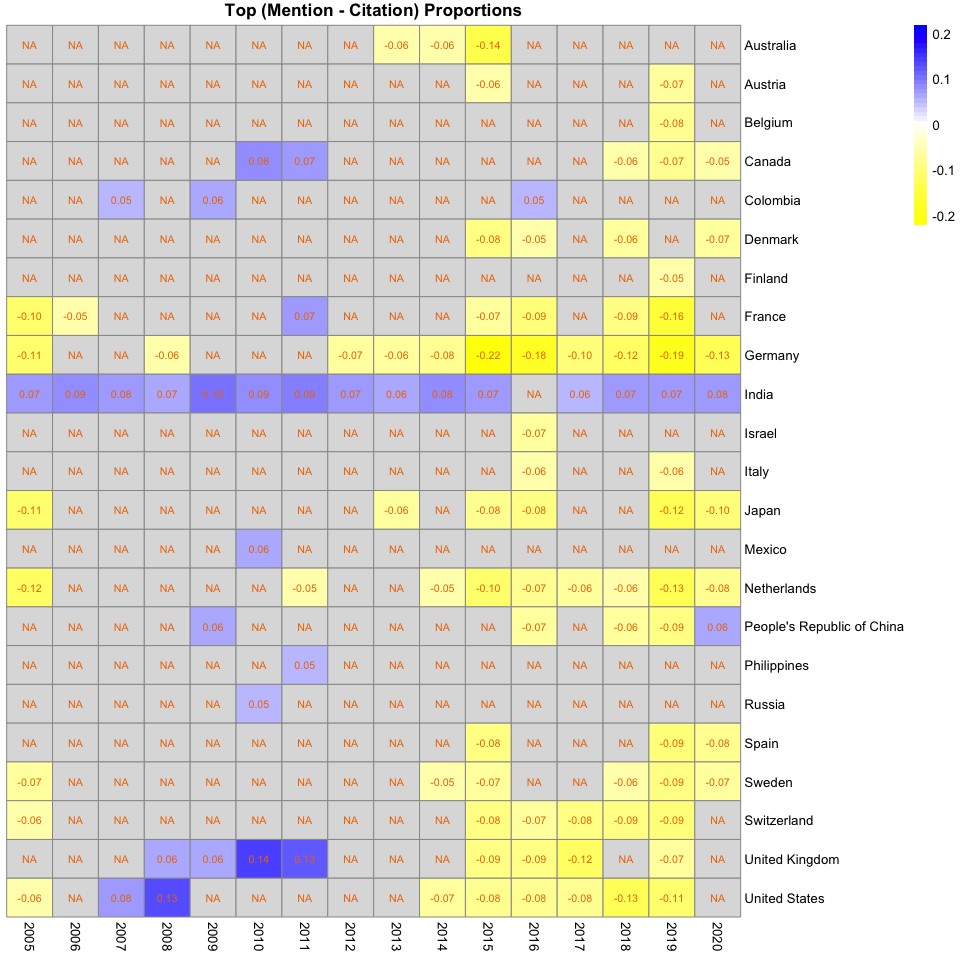

Mention\_v\_citation\_analysis
================
Natalie Davidson
3/31/2021

## Data Description

This analysis will compare token frequencies between two types of Nature News articles. The point of this analysis is to identify how countries are talked about differently. We seperate countries into two groups be separating them into countries that are talked about vs cited. Specifically, we first identify which countries are cited more than mentioned and which countries are mentioned more than cited. After this, we will take the most exemplary of the 2 country classes (top mentions &gt; cited: Class M & top mentions &lt; cited: Class C). We will compare the token frequencies between a mention of Class C v M.

The source data file for a bootstrap estimate of country mentions and citations: `/data/author_data/all_author_country_95CI.tsv`

The all source text is here: `/data/scraped_data/downloads/*.json`

The country mention to source articles id map here: `/data/scraped_data/location_table_raw_YEAR_ARTICLE-TYPE.tsv`

## Get Class C and M Countries

#### Read in the raw country counts.

``` r
# get the project directory, everything is set relative to this
proj_dir = here()

# read in the raw location article counts
raw_file = file.path(proj_dir, "/data/author_data/all_author_country.tsv")
raw_df = fread(raw_file)
raw_df = subset(raw_df, address.country_code != "" & !is.na(address.country_code))
raw_df = subset(raw_df, corpus %in% c("naturenews_mentions", "naturenews_citations"))

# get UN info
un_info = get_country_info()
raw_df = merge(un_info, raw_df)

head(raw_df)
```

    ##   address.country_code              country un_region    un_subregion
    ## 1                   ad              Andorra    Europe Southern Europe
    ## 2                   ae United Arab Emirates      Asia    Western Asia
    ## 3                   ae United Arab Emirates      Asia    Western Asia
    ## 4                   ae United Arab Emirates      Asia    Western Asia
    ## 5                   ae United Arab Emirates      Asia    Western Asia
    ## 6                   ae United Arab Emirates      Asia    Western Asia
    ##                              file_id
    ## 1                            446937a
    ## 2                 d41586-018-07526-3
    ## 3     science-stars-of-china-1.20113
    ## 4 scientists-meet-capitalists-1.9512
    ## 5                 d41586-020-02386-2
    ## 6                            513490a
    ##                                              doi year              corpus
    ## 1                            doi:10.1038/446937a 2007 naturenews_mentions
    ## 2                 doi:10.1038/d41586-018-07526-3 2018 naturenews_mentions
    ## 3     doi:10.1038/science-stars-of-china-1.20113 2016 naturenews_mentions
    ## 4 doi:10.1038/scientists-meet-capitalists-1.9512 2011 naturenews_mentions
    ## 5                 doi:10.1038/d41586-020-02386-2 2020 naturenews_mentions
    ## 6                            doi:10.1038/513490a 2014 naturenews_mentions

``` r
# get the total number of mentions and citations
# for each country per year
# we only want to evaluate when we have > 10 in either citations or mentions
mention_total = unique(subset(raw_df, 
                              corpus == "naturenews_mentions", 
                              select=c(file_id, year, address.country_code)) )
tot_country_mention = mention_total %>% 
                group_by(year, address.country_code) %>% 
                summarise(n()) 
tot_country_mention$corpus = "naturenews_mentions"
colnames(tot_country_mention)[3] = "total"

citation_total = unique(subset(raw_df, 
                               corpus == "naturenews_citations", 
                               select=c(file_id, year, address.country_code)) )
tot_country_citation = citation_total %>% 
                group_by(year, address.country_code) %>% 
                summarise(n()) 
tot_country_citation$corpus = "naturenews_citations"
colnames(tot_country_citation)[3] = "total"

# show the spread of the mentions and citations
raw_sum_df = rbind(tot_country_citation, tot_country_mention)
ggplot(raw_sum_df, aes(x=as.factor(year), y=log10(total+1), fill=corpus)) +
    geom_boxplot() + theme_bw() + geom_hline(yintercept = log10(10), color="black") +
    xlab("Year") + ylab("log10(# Articles +1)") +
    ggtitle("log10 # of articles in each Corpus for all countries") + 
    scale_fill_brewer(palette="Set2")
```


``` r
# now get the country + year pairings in a format easy to join on later
raw_sum_df = reshape2::dcast(raw_sum_df, year+address.country_code ~ corpus, value.var="total")
raw_sum_df[is.na(raw_sum_df)] = 0
colnames(raw_sum_df)[3:4] = c("tot_citations", "tot_mentions")
```

#### Read in the bootstrapped estimate of % of articles with country counts.

``` r
# read in the cited author data
ci_file = file.path(proj_dir, "/data/author_data/all_author_country_95CI.tsv")
ci_df = fread(ci_file)
ci_df = subset(ci_df, country != "" & !is.na(country))

# get UN info
un_info = get_country_info()
ci_df = merge(un_info, ci_df)

head(ci_df)
```

    ##       country address.country_code un_region  un_subregion year bottom_CI
    ## 1 Afghanistan                   af      Asia Southern Asia 2016         0
    ## 2 Afghanistan                   af      Asia Southern Asia 2020         0
    ## 3 Afghanistan                   af      Asia Southern Asia 2012         0
    ## 4 Afghanistan                   af      Asia Southern Asia 2015         0
    ## 5 Afghanistan                   af      Asia Southern Asia 2008         0
    ## 6 Afghanistan                   af      Asia Southern Asia 2014         0
    ##   top_CI mean               corpus
    ## 1      0    0 naturenews_citations
    ## 2      0    0 naturenews_citations
    ## 3      0    0 naturenews_citations
    ## 4      0    0 naturenews_citations
    ## 5      0    0 naturenews_citations
    ## 6      0    0 naturenews_citations

``` r
# merge together the article info + CI info
ci_df = merge(raw_sum_df, ci_df)

# show the spread of the mentions and citations
ggplot(ci_df, aes(x=as.factor(year), y=as.numeric(mean), fill=corpus)) +
    geom_boxplot(position="dodge") + theme_bw() + 
    xlab("Year") + ylab("Est. % of articles") +
    ggtitle("Est. % of articles in each Corpus for all countries and years") + 
    scale_fill_brewer(palette="Set2")
```


``` r
# show the spread where a mentions or citations >20 
ggplot(subset(ci_df, tot_citations > MIN_ART | tot_mentions > MIN_ART), 
       aes(x=as.factor(year), y=as.numeric(mean), fill=corpus)) +
    geom_boxplot(position="dodge") + theme_bw() + 
    xlab("Year") + ylab("Est. % of articles") +
    ggtitle("Est. % of articles in each Corpus, cutoff > 20 for either mention or citation") + 
    scale_fill_brewer(palette="Set2")
```


``` r
# dcast the folder so we can compare mentions to citations
ci_df_cast = reshape2::dcast(ci_df, 
                             year+country+address.country_code+tot_citations+tot_mentions ~ corpus, 
                             value.var="mean")

# calculate the difference between mentions + citations
ci_df_cast$M_C = ci_df_cast$naturenews_mentions - ci_df_cast$naturenews_citations

# show the spread of the difference mentions and citations
ggplot(subset(ci_df_cast, tot_citations > MIN_ART | tot_mentions > MIN_ART), 
       aes(x=as.numeric(year), y=as.numeric(M_C))) +
    geom_point() + theme_bw() + 
    geom_hline(yintercept = MIN_PROP, color="red") +
    geom_hline(yintercept = -1*MIN_PROP, color="red") +
    xlab("Corpus") + ylab("Mention % - Citation % for each country+year") +
    ggtitle("Diff. btw mentions and citations for each country+year (1 point is a country)") + 
    scale_fill_brewer(palette="Set2")
```


``` r
# final dataframe with all filters
top_diff_MC = subset(ci_df_cast, tot_citations > MIN_ART | tot_mentions > MIN_ART)
top_diff_MC = subset(top_diff_MC, M_C > MIN_PROP | M_C < -1*MIN_PROP)
```

#### Plot the top country-year pairings have a large difference in citations vs mentions

In the previous plot, all countries that have at least one point outside of the red lines will be considered either class M (above top red line) or class C (below bottom red line). If a country is found in both groups across the years, it is removed from consideration in later downstream processing. Countries that are in both classes are shown in the heatmap as having both blue and yellow entries across the row.

``` r
make_heatmap_res <- function(in_df, value_col){
    plot_matr_MC = reshape2::dcast(in_df, 
                             country ~ year, 
                             value.var=value_col)
    row.names(plot_matr_MC) = plot_matr_MC$country
    plot_matr_MC = plot_matr_MC[,-1]
    #plot_matr_MC[is.na(plot_matr_MC)] = 0
    
    max_val = max(abs(plot_matr_MC), na.rm = T)
    breaks = c(seq(-1*max_val, max_val, by = 0.01))
    color_pmap <- colorRampPalette(c("yellow", "white", "blue"))(length(breaks))

    if(max_val > 1){
        breaks = c(seq(1, max_val, by = 1))
        color_pmap <- colorRampPalette(c("white", "blue"))(length(breaks))

    }

    res = list(plot_matr = plot_matr_MC,
               color_pmap = color_pmap,
               breaks = breaks)
    return(res)
}

# plot the Top ptoportion differences
res_MC = make_heatmap_res(top_diff_MC, value_col="M_C")
pheatmap(res_MC$plot_matr, cluster_rows = F, 
         cluster_cols = F, display_numbers = T, 
         main = "Top (Mention - Citation) Proportions",
         color = res_MC$color_pmap, breaks = res_MC$breaks,
         number_color = "darkorange2")
```



``` r
# OF the Top proportion differences, only plot the raw # citations
res_cite = make_heatmap_res(top_diff_MC, value_col="tot_citations")
pheatmap(res_cite$plot_matr, cluster_rows = F, 
         cluster_cols = F, display_numbers = T, 
         main = "Top (Mention - Citation), total citations",
         color = res_cite$color_pmap, breaks = res_cite$breaks,
         number_color = "darkorange2")
```


``` r
# OF the Top proportion differences, only plot the raw # mentions
res_mention = make_heatmap_res(top_diff_MC, value_col="tot_mentions")
pheatmap(res_mention$plot_matr, cluster_rows = F, 
         cluster_cols = F, display_numbers = T, 
         main = "Top (Mention - Citation), total mentions",
         color = res_mention$color_pmap, breaks = res_mention$breaks,
         number_color = "darkorange2")
```


``` r
# now make the 2 tables of countries that are cited more vs mentioned more
# class C vs Class M
class_c_counts = subset(top_diff_MC, M_C < 0, select=c("address.country_code", "year") )
class_c_counts$class = "class_c" 
class_c_counts$idx = paste(class_c_counts$address.country_code,
                          class_c_counts$year, sep="_")
class_c_counts$idx = class_c_counts$address.country_code
class_m_counts = subset(top_diff_MC, M_C > 0, select=c("address.country_code", "year") )
class_m_counts$class = "class_m" 
class_m_counts$idx = paste(class_m_counts$address.country_code,
                          class_m_counts$year, sep="_")
class_m_counts$idx = class_m_counts$address.country_code
```

## Compare tokens from articles mentioning class C and M countries

#### Get the raw text ids for each class

``` r
# for every country + year pair in our filtered table (top_diff_MC),
# get the associated raw file ids with the articles' text


# read in the location - to - article information
all_loc_files = list.files(file.path(proj_dir, "/data/scraped_data/"), 
                            pattern="location_table_raw",
                            recursive=F,
                            full.names=T)

# read in all the files
full_loc_df = NA
for(loc_file in all_loc_files){

    loc_df = read_corenlp_location_files(loc_file)
    loc_df$year = str_extract(loc_file, "[1-9][0-9]+") # curr_year
    loc_df$type = substring(basename(loc_file), 
                            25, nchar(basename(loc_file))-4)
    full_loc_df = rbind(full_loc_df, loc_df)
}
full_loc_df = full_loc_df[-1,]
full_loc_df = subset(full_loc_df, est_un_region != "" & 
                                        est_un_subregion != "" &
                                        est_un_region != "NO_EST" & 
                                        est_un_subregion != "NO_EST")
colnames(full_loc_df)[1] = c("address.country_code")

# for best accuracy, only include articles where a country-related noun 
# was mentinoned more than once
loc_dups = data.frame(table(full_loc_df$file_id, full_loc_df$address.country_code))
loc_keep = subset(loc_dups, Freq > 1)
full_loc_df$freq_idx = paste(full_loc_df$file_id, full_loc_df$address.country_code, sep="_")
freq_pass = paste(loc_keep$Var1, loc_keep$Var2, sep="_")
full_mention_df = subset(full_loc_df, freq_idx %in% freq_pass)
full_mention_df$file_idx = paste(full_mention_df$address.country_code,
                      full_mention_df$year,
                      full_mention_df$file_id, sep="_")
full_mention_df$idx = paste(full_mention_df$address.country_code,
                      full_mention_df$year, sep="_")
full_mention_df$idx = full_mention_df$address.country_code
```

#### Get the cited text ids for each class

In order to only look at articles where a country is talked about and not mentioned, we need to filter the mentino articles by cited articles.

``` r
# all the cited articles
cited_country_file = file.path(proj_dir, 
                                "/data/author_data/cited_author_country.tsv")
cited_country_df = data.frame(fread(cited_country_file))
cited_country_df = subset(cited_country_df, country != "")
cited_country_df$country = format_country_names(cited_country_df$country)

# format the countries
cited_country_df_formatted = get_author_country(cited_country_df)
```

    ## Loading required package: tmaptools

``` r
cited_country_df_formatted = unique(cited_country_df_formatted)

# we only care about if a country was cited in an article, 
# not how many times it was cited
cited_country_df_formatted$num_entries = 1
```

#### Now separate the articles from class C and M

We want to separate the articles into different sections: 1) articles with class C country mentions 2) articles with class M country mentions

For both types of mention articles, we want to filter out an article from a country if it was cited in that same article.

``` r
# get all the cited articles
cited_loc = merge(unique(full_mention_df[,c("file_id", "year", "type")]),
                  cited_country_df_formatted)
cited_loc$idx = paste(cited_loc$address.country_code,
                      cited_loc$year, sep="_")
cited_loc$idx = cited_loc$address.country_code
cited_loc$file_idx = paste(cited_loc$address.country_code,
                      cited_loc$year,
                      cited_loc$file_id, sep="_")

# get the cited articles from each class
class_c_citations = subset(cited_loc, idx %in% 
                               class_c_counts$idx)
class_m_citations = subset(cited_loc, idx %in% 
                               class_m_counts$idx)
    
# now get the mention articles from each class
class_c_mentions = subset(full_mention_df, idx %in% 
                               class_c_counts$idx)
class_m_mentions = subset(full_mention_df, idx %in% 
                               class_m_counts$idx)

# filter the mentions by the citations
class_c_mentions = subset(class_c_mentions, 
                          !file_idx %in% class_c_citations$file_idx )
class_m_mentions = subset(class_m_mentions, 
                          !file_idx %in% class_m_citations$file_idx )

# filter out 2020 for this analysis to avoind covid terms
class_c_mentions = subset(class_c_mentions, year != 2020)
class_m_mentions = subset(class_m_mentions, year != 2020)

# filter out countries that may be in both class_c and class_m
# this can be caused by mentions and citations being significantly
# different across years (sometimes M >> C, sometimes C << M)
country_overlap = intersect(class_c_mentions$address.country_code,
                            class_m_mentions$address.country_code)
class_c_mentions = subset(class_c_mentions, 
                          !address.country_code %in% country_overlap )
class_m_mentions = subset(class_m_mentions, 
                          !address.country_code %in% country_overlap )
```

#### Function to calculate word frequencies from raw text for each class

``` r
#' Get the word frequencies across multiple JSON files containing
#' for all years and news types
#'
#' @param class_ids This contains at a minimum a file_id - country - 
#' article_type - year mapping
#' @param class_str name of country class of interest
#' @return word_freq a dataframe of word counts across all relevant articles
get_word_freq_per_class <- function(class_ids, class_str){
        
    # get the word frequencies for class C articles
    class_word_freq = NA
    for(curr_year in unique(class_ids$year)){
        # subset for each year
        curr_year_df = subset(class_ids, year == curr_year)
        
        for(curr_type in unique(curr_year_df$type)){
            # subset for each type within a year
            curr_year_type_df = subset(curr_year_df, type == curr_type)
    
            # make the file name
            curr_file = file.path(proj_dir, "/data/scraped_data/downloads/",
                                  paste("links_crawled_", 
                                        curr_year, "_", 
                                        curr_type, ".json", sep=""))
            
            # calculate the word frequency
            curr_word_freq = calc_word_freq(curr_file, unique(curr_year_type_df$file_id))
            curr_word_freq = as.data.frame(curr_word_freq)
            curr_word_freq$year = curr_year
            curr_word_freq$type = curr_type
            class_word_freq = rbind(class_word_freq, curr_word_freq)
        }
    }
    class_word_freq_total = class_word_freq[-1,]
    class_word_freq = class_word_freq[-1,]
    
    # sum word frequencies across the different JSON files
    class_word_freq = class_word_freq %>%
                    select("word", "n") %>%
                    group_by(word) %>% 
                    summarise(sum(n)) 
    col_id = paste(class_str, "_count", sep="")
    colnames(class_word_freq)[2] = col_id
    
    # sort
    class_word_freq = class_word_freq[
                            order(class_word_freq[,col_id], 
                                  decreasing=T),]
     
    return(class_word_freq)
}


# get the word frequencies for each class of country
class_all_word_freq = get_word_freq_per_class(full_mention_df, class_str = "class_all")

print(head(class_all_word_freq))
```

    ## # A tibble: 6 x 2
    ##   word        class_all_count
    ##   <chr>                 <int>
    ## 1 research              38300
    ## 2 university            36852
    ## 3 researchers           31780
    ## 4 science               23086
    ## 5 scientists            22078
    ## 6 data                  21857

## Calculate word frequencies for each class

Here, we will go through each country, finding the words most specific to articles mentioning this country, but not citing it. This is calculated by finding terms that have the highest the larget ratio: term in country specific articles / term over all articles. Then, we will take the top 100 terms per country, and see which terms show up the most across all countries. This will give us an indication of how class C countries are talked about vs how class M countries are talked about.

These are calculated on a per country basis, because the number of articles per country are very different.

#### Class C

``` r
all_country_word_freq_c = list()
# write out top words for each country
for(curr_country in unique(class_c_mentions$address.country_code)){
    
    # get the word freq for class C mentions
    class_c_word_freq = get_word_freq_per_class(
                            subset(class_c_mentions, address.country_code == curr_country), 
                            class_str = "class_c")
     
    # merge with the word freq for entire corpus
     per_class_word_freq = merge(data.table(class_c_word_freq), 
                                data.table(class_all_word_freq), by="word")
     
        
    # word should be used at least 100 time in the full corpus
    per_class_word_freq = subset(per_class_word_freq, class_all_count > 100)
        
    # get the word frequency scaled by corpus frequency
    per_class_word_freq$ratio = per_class_word_freq$class_c_count / 
                                per_class_word_freq$class_all_count
      
    # write out top words per country
    per_class_word_freq = per_class_word_freq[order(per_class_word_freq$ratio, decreasing=T),]
    print(knitr::kable(head(per_class_word_freq,15), 
                 caption = paste(curr_country, "Class Citation, top terms")))
    
    # save top words
    per_class_word_freq_df = per_class_word_freq[,c("word", "class_c_count")]
    colnames(per_class_word_freq_df)[2] = paste("count", curr_country, sep="_")
    all_country_word_freq_c[[curr_country]] = per_class_word_freq_df
    

}
```

    ## 
    ## 
    ## Table: ch Class Citation, top terms
    ## 
    ## |word          | class_c_count| class_all_count|     ratio|
    ## |:-------------|-------------:|---------------:|---------:|
    ## |eth           |            78|             137| 0.5693431|
    ## |msf           |            71|             132| 0.5378788|
    ## |lausanne      |            82|             155| 0.5290323|
    ## |basel         |            95|             185| 0.5135135|
    ## |zurich        |           189|             405| 0.4666667|
    ## |novartis      |            94|             217| 0.4331797|
    ## |switzerland   |           488|            1266| 0.3854660|
    ## |swiss         |           235|             623| 0.3772071|
    ## |perovskite    |            44|             117| 0.3760684|
    ## |roche         |            78|             212| 0.3679245|
    ## |athletes      |            52|             155| 0.3354839|
    ## |olympic       |            31|             110| 0.2818182|
    ## |immunotherapy |            38|             137| 0.2773723|
    ## |astrocytes    |            32|             116| 0.2758621|
    ## |afm           |            26|             102| 0.2549020|
    ## 
    ## 
    ## Table: de Class Citation, top terms
    ## 
    ## |word       | class_c_count| class_all_count|     ratio|
    ## |:----------|-------------:|---------------:|---------:|
    ## |dfg        |           121|             125| 0.9680000|
    ## |leipzig    |           110|             139| 0.7913669|
    ## |pbo        |            92|             119| 0.7731092|
    ## |germanys   |           237|             322| 0.7360248|
    ## |munich     |           202|             315| 0.6412698|
    ## |denisovans |            99|             161| 0.6149068|
    ## |potsdam    |            79|             130| 0.6076923|
    ## |heidelberg |           116|             208| 0.5576923|
    ## |max        |           516|             926| 0.5572354|
    ## |johannes   |            57|             105| 0.5428571|
    ## |germany    |          1618|            3062| 0.5284128|
    ## |denisovan  |            57|             108| 0.5277778|
    ## |bonn       |            83|             159| 0.5220126|
    ## |planck     |           520|            1003| 0.5184447|
    ## |ludwig     |            57|             114| 0.5000000|
    ## 
    ## 
    ## Table: it Class Citation, top terms
    ## 
    ## |word        | class_c_count| class_all_count|     ratio|
    ## |:-----------|-------------:|---------------:|---------:|
    ## |laquila     |           101|             136| 0.7426471|
    ## |italys      |           112|             175| 0.6400000|
    ## |milan       |            69|             126| 0.5476190|
    ## |italian     |           267|             569| 0.4692443|
    ## |rome        |           123|             311| 0.3954984|
    ## |italy       |           396|            1083| 0.3656510|
    ## |lisa        |            83|             264| 0.3143939|
    ## |virgo       |            53|             179| 0.2960894|
    ## |shale       |            56|             244| 0.2295082|
    ## |sasso       |            28|             126| 0.2222222|
    ## |fermi       |            47|             219| 0.2146119|
    ## |prosecutors |            28|             131| 0.2137405|
    ## |gran        |            29|             146| 0.1986301|
    ## |cultivation |            27|             144| 0.1875000|
    ## |microglia   |            25|             150| 0.1666667|
    ## 
    ## 
    ## Table: jp Class Citation, top terms
    ## 
    ## |word      | class_c_count| class_all_count|     ratio|
    ## |:---------|-------------:|---------------:|---------:|
    ## |blogentry |           118|             124| 0.9516129|
    ## |jaxa      |           137|             149| 0.9194631|
    ## |hayabusa  |           106|             116| 0.9137931|
    ## |obokata   |            99|             112| 0.8839286|
    ## |cdb       |            97|             110| 0.8818182|
    ## |yamanaka  |           153|             177| 0.8644068|
    ## |tohoku    |           104|             128| 0.8125000|
    ## |riken     |           231|             298| 0.7751678|
    ## |japans    |           415|             568| 0.7306338|
    ## |fukushima |           268|             369| 0.7262873|
    ## |takahashi |            74|             103| 0.7184466|
    ## |ut        |           130|             203| 0.6403941|
    ## |tokyo     |           394|             622| 0.6334405|
    ## |stap      |            82|             132| 0.6212121|
    ## |sasai     |            68|             120| 0.5666667|
    ## 
    ## 
    ## Table: nl Class Citation, top terms
    ## 
    ## |word        | class_c_count| class_all_count|     ratio|
    ## |:-----------|-------------:|---------------:|---------:|
    ## |leiden      |           120|             152| 0.7894737|
    ## |priming     |            58|             102| 0.5686275|
    ## |netherlands |           541|            1112| 0.4865108|
    ## |ams         |            58|             130| 0.4461538|
    ## |ut          |            88|             203| 0.4334975|
    ## |sofia       |            49|             137| 0.3576642|
    ## |dutch       |           120|             370| 0.3243243|
    ## |bullying    |            52|             175| 0.2971429|
    ## |gaia        |            38|             132| 0.2878788|
    ## |qubits      |           128|             447| 0.2863535|
    ## |qubit       |            42|             150| 0.2800000|
    ## |antennas    |            53|             213| 0.2488263|
    ## |rankings    |            36|             149| 0.2416107|
    ## |amsterdam   |            56|             249| 0.2248996|
    ## |unconscious |            27|             125| 0.2160000|
    ## 
    ## 
    ## Table: at Class Citation, top terms
    ## 
    ## |word          | class_c_count| class_all_count|     ratio|
    ## |:-------------|-------------:|---------------:|---------:|
    ## |austria       |           107|             214| 0.5000000|
    ## |austrian      |            50|             105| 0.4761905|
    ## |vienna        |            87|             293| 0.2969283|
    ## |afm           |            28|             102| 0.2745098|
    ## |wooden        |            24|             126| 0.1904762|
    ## |superposition |            28|             155| 0.1806452|
    ## |causal        |            24|             139| 0.1726619|
    ## |qubit         |            22|             150| 0.1466667|
    ## |glacier       |            42|             295| 0.1423729|
    ## |citizen       |            32|             239| 0.1338912|
    ## |iaea          |            18|             138| 0.1304348|
    ## |entangled     |            31|             245| 0.1265306|
    ## |confocal      |            13|             106| 0.1226415|
    ## |census        |            23|             197| 0.1167513|
    ## |radioactivity |            16|             142| 0.1126761|
    ## 
    ## 
    ## Table: au Class Citation, top terms
    ## 
    ## |word         | class_c_count| class_all_count|     ratio|
    ## |:------------|-------------:|---------------:|---------:|
    ## |csiro        |           172|             180| 0.9555556|
    ## |aus          |           165|             197| 0.8375635|
    ## |australias   |           230|             301| 0.7641196|
    ## |queensland   |           139|             199| 0.6984925|
    ## |toads        |            79|             119| 0.6638655|
    ## |melbourne    |           229|             362| 0.6325967|
    ## |brisbane     |            74|             119| 0.6218487|
    ## |aboriginal   |            90|             147| 0.6122449|
    ## |wolbachia    |            75|             124| 0.6048387|
    ## |australian   |           542|             921| 0.5884908|
    ## |commonwealth |            66|             114| 0.5789474|
    ## |sydney       |           209|             367| 0.5694823|
    ## |canberra     |           122|             230| 0.5304348|
    ## |australia    |          1098|            2129| 0.5157351|
    ## |reef         |           228|             443| 0.5146727|
    ## 
    ## 
    ## Table: be Class Citation, top terms
    ## 
    ## |word          | class_c_count| class_all_count|     ratio|
    ## |:-------------|-------------:|---------------:|---------:|
    ## |owen          |            48|             125| 0.3840000|
    ## |belgium       |           108|             311| 0.3472669|
    ## |transgender   |            40|             116| 0.3448276|
    ## |shale         |            75|             244| 0.3073770|
    ## |archaeopteryx |            31|             108| 0.2870370|
    ## |beer          |            54|             221| 0.2443439|
    ## |consciousness |            36|             177| 0.2033898|
    ## |fracking      |            16|             102| 0.1568627|
    ## |conscious     |            34|             229| 0.1484716|
    ## |ali           |            20|             141| 0.1418440|
    ## |citizen       |            31|             239| 0.1297071|
    ## |quasars       |            15|             117| 0.1282051|
    ## |phytoplankton |            18|             145| 0.1241379|
    ## |tipping       |            16|             137| 0.1167883|
    ## |testosterone  |            19|             163| 0.1165644|
    ## 
    ## 
    ## Table: es Class Citation, top terms
    ## 
    ## |word         | class_c_count| class_all_count|     ratio|
    ## |:------------|-------------:|---------------:|---------:|
    ## |spanish      |           143|             327| 0.4373089|
    ## |barcelona    |            62|             167| 0.3712575|
    ## |grb          |            41|             114| 0.3596491|
    ## |cuba         |            45|             133| 0.3383459|
    ## |spain        |           194|             661| 0.2934947|
    ## |neanderthals |           113|             538| 0.2100372|
    ## |jellyfish    |            45|             222| 0.2027027|
    ## |tehran       |            20|             102| 0.1960784|
    ## |iodide       |            19|             102| 0.1862745|
    ## |paintings    |            26|             145| 0.1793103|
    ## |afterglow    |            19|             108| 0.1759259|
    ## |cas          |            35|             215| 0.1627907|
    ## |madrid       |            36|             223| 0.1614350|
    ## |nio          |            46|             293| 0.1569966|
    ## |computation  |            22|             159| 0.1383648|
    ## 
    ## 
    ## Table: il Class Citation, top terms
    ## 
    ## |word        | class_c_count| class_all_count|     ratio|
    ## |:-----------|-------------:|---------------:|---------:|
    ## |weizmann    |           109|             113| 0.9646018|
    ## |palestinian |            95|             162| 0.5864198|
    ## |ut          |           116|             203| 0.5714286|
    ## |israel      |           373|             681| 0.5477239|
    ## |israeli     |           131|             240| 0.5458333|
    ## |jerusalem   |            68|             128| 0.5312500|
    ## |territories |            50|             138| 0.3623188|
    ## |seeding     |            45|             141| 0.3191489|
    ## |jordan      |            63|             214| 0.2943925|
    ## |ultrasound  |            36|             155| 0.2322581|
    ## |organelles  |            26|             124| 0.2096774|
    ## |transcripts |            26|             128| 0.2031250|
    ## |ribosome    |            26|             131| 0.1984733|
    ## |ovarian     |            31|             163| 0.1901840|
    ## |feng        |            22|             116| 0.1896552|
    ## 
    ## 
    ## Table: se Class Citation, top terms
    ## 
    ## |word           | class_c_count| class_all_count|     ratio|
    ## |:--------------|-------------:|---------------:|---------:|
    ## |macchiarini    |           120|             121| 0.9917355|
    ## |uppsala        |            99|             119| 0.8319328|
    ## |karolinska     |           132|             185| 0.7135135|
    ## |ki             |            71|             110| 0.6454545|
    ## |lund           |            83|             133| 0.6240602|
    ## |ut             |           116|             203| 0.5714286|
    ## |sweden         |           327|             600| 0.5450000|
    ## |swedish        |           113|             292| 0.3869863|
    ## |astrocytes     |            40|             116| 0.3448276|
    ## |stockholm      |            98|             313| 0.3130990|
    ## |archaeopteryx  |            31|             108| 0.2870370|
    ## |apps           |            40|             141| 0.2836879|
    ## |neonicotinoids |            26|             105| 0.2476190|
    ## |dopamine       |            67|             284| 0.2359155|
    ## |domestication  |            23|             102| 0.2254902|
    ## 
    ## 
    ## Table: dk Class Citation, top terms
    ## 
    ## |word       | class_c_count| class_all_count|     ratio|
    ## |:----------|-------------:|---------------:|---------:|
    ## |denmark    |           132|             363| 0.3636364|
    ## |willerslev |            48|             132| 0.3636364|
    ## |danish     |            45|             141| 0.3191489|
    ## |greenland  |           108|             527| 0.2049336|
    ## |copenhagen |            84|             548| 0.1532847|
    ## |citizen    |            33|             239| 0.1380753|
    ## |offshore   |            40|             311| 0.1286174|
    ## |grids      |            16|             128| 0.1250000|
    ## |bedrock    |            15|             121| 0.1239669|
    ## |biosphere  |            13|             110| 0.1181818|
    ## |plague     |            22|             190| 0.1157895|
    ## |bgi        |            22|             193| 0.1139896|
    ## |turbines   |            24|             211| 0.1137441|
    ## |retirement |            26|             238| 0.1092437|
    ## |seabed     |            14|             132| 0.1060606|
    ## 
    ## 
    ## Table: fi Class Citation, top terms
    ## 
    ## |word          | class_c_count| class_all_count|     ratio|
    ## |:-------------|-------------:|---------------:|---------:|
    ## |finland       |            41|             158| 0.2594937|
    ## |smartphone    |            12|             111| 0.1081081|
    ## |eus           |            18|             168| 0.1071429|
    ## |toxicologist  |            11|             105| 0.1047619|
    ## |xenon         |            27|             260| 0.1038462|
    ## |fungi         |            31|             363| 0.0853994|
    ## |fungal        |            16|             189| 0.0846561|
    ## |scores        |            31|             376| 0.0824468|
    ## |erc           |            16|             210| 0.0761905|
    ## |toxicology    |             8|             117| 0.0683761|
    ## |biobank       |             9|             140| 0.0642857|
    ## |daughters     |             8|             131| 0.0610687|
    ## |monoxide      |            12|             197| 0.0609137|
    ## |chernobyl     |            11|             181| 0.0607735|
    ## |domestication |             6|             102| 0.0588235|

``` r
citations_freq = Reduce(merge, all_country_word_freq_c)
citations_freq$median_count = apply(citations_freq[,2:ncol(citations_freq)], 
                                   1, median)
citations_freq = citations_freq[order(citations_freq$median_count, decreasing = T),]
print(knitr::kable(head(citations_freq,15), 
                       caption = "Overall Class Citation, top terms, count is per country frequency"))
```

    ## 
    ## 
    ## Table: Overall Class Citation, top terms, count is per country frequency
    ## 
    ## |word        | count_ch| count_de| count_it| count_jp| count_nl| count_at| count_au| count_be| count_es| count_il| count_se| count_dk| count_fi| median_count|
    ## |:-----------|--------:|--------:|--------:|--------:|--------:|--------:|--------:|--------:|--------:|--------:|--------:|--------:|--------:|------------:|
    ## |university  |     1367|     3473|      913|     1803|     1510|      308|     2280|      324|      391|      662|      954|      397|      132|          913|
    ## |research    |     1364|     3858|      918|     1870|     1348|      214|     2117|      322|      481|      533|      773|      220|      185|          773|
    ## |cells       |      853|     1671|      326|     2291|      613|       72|      862|       82|       53|      899|      722|       48|       25|          613|
    ## |researchers |     1184|     2859|      610|     1361|     1252|      147|     1767|      275|      364|      545|      771|      245|      102|          610|
    ## |time        |      767|     1887|      474|      906|      827|      125|     1125|      143|      223|      433|      569|      186|       64|          474|
    ## |scientists  |      787|     2276|      589|     1037|      815|      134|     1192|      170|      262|      405|      470|      145|       69|          470|
    ## |data        |     1026|     2100|      468|      857|     1239|      153|     1211|      147|      263|      271|      487|      212|       73|          468|
    ## |cell        |      430|     1295|      234|     1150|      423|       63|      492|       84|       35|      497|      420|       25|       15|          420|
    ## |people      |      904|     1449|      396|      895|      717|      106|      941|      167|      141|      264|      424|      119|       54|          396|
    ## |human       |      444|     1456|      247|      659|      419|       51|      645|       69|      100|      376|      407|      102|       26|          376|
    ## |team        |      721|     1695|      350|      762|      650|      110|      994|      131|      215|      320|      452|      171|       61|          350|
    ## |science     |      643|     2045|      455|     1194|      732|      169|     1132|      190|      319|      344|      309|      161|      102|          344|
    ## |institute   |      576|     1745|      339|      785|      410|      141|      551|       81|      133|      332|      370|       90|       41|          339|
    ## |found       |      467|     1309|      291|      517|      518|       61|      766|      139|      134|      309|      431|      138|       57|          309|
    ## |study       |      557|     1165|      301|      464|      565|      100|      767|      132|      112|      293|      391|      135|       79|          301|

#### Class M

``` r
# first remove all cited articles from the articles with a mention

all_country_word_freq_m = list()
# write out top words for each country
for(curr_country in unique(class_m_mentions$address.country_code)){
    
    # get the word freq for class C mentions
    class_m_word_freq = get_word_freq_per_class(
                            subset(class_m_mentions, address.country_code == curr_country), 
                            class_str = "class_m")
     
    # merge with the word freq for entire corpus
     per_class_word_freq = merge(data.table(class_m_word_freq), 
                                data.table(class_all_word_freq), by="word")
     
        
    # word should be used at least 100 time in the full corpus
    per_class_word_freq = subset(per_class_word_freq, class_all_count > 100)
        
    # get the word frequency scaled by corpus frequency
    per_class_word_freq$ratio = per_class_word_freq$class_m_count / 
                                per_class_word_freq$class_all_count
      
    # write out top words per country
    per_class_word_freq = per_class_word_freq[order(per_class_word_freq$ratio, decreasing=T),]
    print(knitr::kable(head(per_class_word_freq,15), 
                 caption = paste(curr_country, "Class Mention, top terms")))
    
    # save top words
    per_class_word_freq_df = per_class_word_freq[,c("word", "class_m_count")]
    colnames(per_class_word_freq_df)[2] = paste("count", curr_country, sep="_")
    all_country_word_freq_m[[curr_country]] = per_class_word_freq_df

    

}
```

    ## 
    ## 
    ## Table: co Class Mention, top terms
    ## 
    ## |word           | class_m_count| class_all_count|     ratio|
    ## |:--------------|-------------:|---------------:|---------:|
    ## |ut             |            94|             203| 0.4630542|
    ## |ppm            |            46|             134| 0.3432836|
    ## |shuttles       |            29|             104| 0.2788462|
    ## |carbonate      |            64|             239| 0.2677824|
    ## |foam           |            42|             159| 0.2641509|
    ## |sinks          |            33|             137| 0.2408759|
    ## |colombia       |            27|             119| 0.2268908|
    ## |sequestration  |            33|             167| 0.1976048|
    ## |grasses        |            24|             131| 0.1832061|
    ## |shuttle        |           111|             610| 0.1819672|
    ## |soot           |            19|             122| 0.1557377|
    ## |anthropogenic  |            24|             157| 0.1528662|
    ## |boron          |            22|             148| 0.1486486|
    ## |hansen         |            22|             152| 0.1447368|
    ## |photosynthetic |            18|             126| 0.1428571|
    ## 
    ## 
    ## Table: in Class Mention, top terms
    ## 
    ## |word      | class_m_count| class_all_count|     ratio|
    ## |:---------|-------------:|---------------:|---------:|
    ## |blogentry |           118|             124| 0.9516129|
    ## |bangalore |           101|             117| 0.8632479|
    ## |indias    |           435|             570| 0.7631579|
    ## |delhi     |           215|             287| 0.7491289|
    ## |rupees    |            69|             109| 0.6330275|
    ## |pachauri  |            78|             126| 0.6190476|
    ## |newline   |           129|             221| 0.5837104|
    ## |rao       |            83|             144| 0.5763889|
    ## |indian    |           694|            1324| 0.5241692|
    ## |india     |           931|            1950| 0.4774359|
    ## |tiger     |           101|             239| 0.4225941|
    ## |singh     |            68|             166| 0.4096386|
    ## |tigers    |            62|             165| 0.3757576|
    ## |himalayas |            39|             124| 0.3145161|
    ## |shale     |            76|             244| 0.3114754|
    ## 
    ## 
    ## Table: mx Class Mention, top terms
    ## 
    ## |word           | class_m_count| class_all_count|     ratio|
    ## |:--------------|-------------:|---------------:|---------:|
    ## |mexicos        |            61|             127| 0.4803150|
    ## |bison          |            63|             132| 0.4772727|
    ## |mexican        |           108|             232| 0.4655172|
    ## |rust           |            51|             181| 0.2817680|
    ## |wheat          |           110|             476| 0.2310924|
    ## |maya           |            30|             133| 0.2255639|
    ## |maize          |           119|             531| 0.2241055|
    ## |mexico         |           314|            1556| 0.2017995|
    ## |varieties      |            89|             485| 0.1835052|
    ## |monsanto       |            30|             169| 0.1775148|
    ## |tolerant       |            23|             131| 0.1755725|
    ## |autonomous     |            43|             259| 0.1660232|
    ## |nanotechnology |            52|             333| 0.1561562|
    ## |herbicide      |            19|             133| 0.1428571|
    ## |transgenic     |            55|             505| 0.1089109|
    ## 
    ## 
    ## Table: ph Class Mention, top terms
    ## 
    ## |word           | class_m_count| class_all_count|     ratio|
    ## |:--------------|-------------:|---------------:|---------:|
    ## |philippines    |            52|             175| 0.2971429|
    ## |rice           |           214|             757| 0.2826948|
    ## |geoengineering |            28|             210| 0.1333333|
    ## |irrigation     |            18|             147| 0.1224490|
    ## |rust           |            22|             181| 0.1215470|
    ## |bt             |            27|             259| 0.1042471|
    ## |cotton         |            28|             288| 0.0972222|
    ## |varieties      |            47|             485| 0.0969072|
    ## |taylor         |            34|             368| 0.0923913|
    ## |tolerant       |            12|             131| 0.0916031|
    ## |tolerance      |            20|             224| 0.0892857|
    ## |monsanto       |            14|             169| 0.0828402|
    ## |wheat          |            38|             476| 0.0798319|
    ## |sheep          |            17|             226| 0.0752212|
    ## |denisovan      |             8|             108| 0.0740741|
    ## 
    ## 
    ## Table: ru Class Mention, top terms
    ## 
    ## |word       | class_m_count| class_all_count|     ratio|
    ## |:----------|-------------:|---------------:|---------:|
    ## |singer     |            58|             112| 0.5178571|
    ## |moscow     |           139|             294| 0.4727891|
    ## |russias    |           103|             222| 0.4639640|
    ## |russian    |           431|            1126| 0.3827709|
    ## |iaea       |            48|             138| 0.3478261|
    ## |ut         |            65|             203| 0.3201970|
    ## |ukraine    |            43|             142| 0.3028169|
    ## |russia     |           282|             947| 0.2977825|
    ## |ras        |            59|             199| 0.2964824|
    ## |academys   |            31|             123| 0.2520325|
    ## |soviet     |            93|             371| 0.2506739|
    ## |chernobyl  |            36|             181| 0.1988950|
    ## |smallpox   |            33|             168| 0.1964286|
    ## |confocal   |            17|             106| 0.1603774|
    ## |enrichment |            27|             174| 0.1551724|

``` r
mentions_freq = Reduce(merge, all_country_word_freq_m)
mentions_freq$median_count = apply(mentions_freq[,2:ncol(mentions_freq)], 
                                   1, median)
mentions_freq = mentions_freq[order(mentions_freq$median_count, decreasing = T),]

print(knitr::kable(head(mentions_freq,15), 
                       caption = "Overall Class Mention, top terms, count is per country frequency"))
```

    ## 
    ## 
    ## Table: Overall Class Mention, top terms, count is per country frequency
    ## 
    ## |word        | count_co| count_in| count_mx| count_ph| count_ru| median_count|
    ## |:-----------|--------:|--------:|--------:|--------:|--------:|------------:|
    ## |research    |      197|     1374|      300|      191|      549|          300|
    ## |university  |      215|      805|      246|      113|      325|          246|
    ## |time        |      264|      595|      111|       75|      229|          229|
    ## |researchers |      197|      631|      186|      107|      266|          197|
    ## |science     |      108|     1021|      188|      145|      515|          188|
    ## |scientists  |      106|      685|      182|       94|      406|          182|
    ## |energy      |      167|      391|       30|       21|      176|          167|
    ## |data        |      157|      488|       38|       79|      236|          157|
    ## |million     |      153|      445|       59|      116|      168|          153|
    ## |people      |      128|      495|      182|      101|      146|          146|
    ## |world       |      127|      387|      107|      107|      146|          127|
    ## |national    |       76|      438|      116|       56|      132|          116|
    ## |climate     |      322|      324|      112|       79|       81|          112|
    ## |space       |      143|      424|        6|       20|      108|          108|
    ## |team        |      106|      297|       51|       52|      111|          106|

## Calculate the difference in word frequencies between Class C and M using the top words for each class

Here we will calculate the most descriminative words between the two classes, using the country balanced `median_count`.

``` r
# rename the columns for merging
colnames(citations_freq)[which(colnames(citations_freq) == "median_count")] = "median_count_citations"
colnames(mentions_freq)[which(colnames(mentions_freq) == "median_count")] = "median_count_mentions"

# merge and calculate the relative counts
compare_freq = merge(subset(citations_freq, 
                            select=c("word", "median_count_citations")),
                     subset(mentions_freq, 
                            select=c("word", "median_count_mentions")))
compare_freq$compare_ratio =  compare_freq$median_count_citations /
                                compare_freq$median_count_mentions

# get the raw counts for each word, unscaled by country
class_c_word_freq = get_word_freq_per_class(
                        class_c_mentions, 
                        class_str = "class_c")
class_m_word_freq = get_word_freq_per_class(
                        class_m_mentions, 
                        class_str = "class_m")
compare_freq = merge(compare_freq, class_c_word_freq)
compare_freq = merge(compare_freq, class_m_word_freq)


# write out the tables
compare_freq = compare_freq[order(compare_freq$compare_ratio, decreasing=T),]
print(knitr::kable(head(compare_freq,15), 
                       caption = "Overall Class Citation, top terms"))
```

    ## 
    ## 
    ## Table: Overall Class Citation, top terms
    ## 
    ## |word        | median_count_citations| median_count_mentions| compare_ratio| class_c_count| class_m_count|
    ## |:-----------|----------------------:|---------------------:|-------------:|-------------:|-------------:|
    ## |bird        |                     45|                     2|      22.50000|           307|            20|
    ## |quantum     |                    157|                     7|      22.42857|          2033|            57|
    ## |patients    |                    135|                     7|      19.28571|          1523|           133|
    ## |mechanism   |                     30|                     2|      15.00000|           372|            51|
    ## |reading     |                     14|                     1|      14.00000|           185|            22|
    ## |cells       |                    613|                    44|      13.93182|          6531|           600|
    ## |theoretical |                     41|                     3|      13.66667|           472|            60|
    ## |biomedical  |                     26|                     2|      13.00000|           393|            49|
    ## |healthy     |                     39|                     3|      13.00000|           385|            34|
    ## |virus       |                     64|                     5|      12.80000|           809|           157|
    ## |molecule    |                     38|                     3|      12.66667|           514|            57|
    ## |synthetic   |                     38|                     3|      12.66667|           386|            33|
    ## |cell        |                    420|                    35|      12.00000|          3985|           479|
    ## |astronomers |                     35|                     3|      11.66667|           522|            61|
    ## |brain       |                    151|                    13|      11.61538|          2192|           114|

``` r
compare_freq = compare_freq[order(compare_freq$compare_ratio, decreasing=F),]
print(knitr::kable(head(compare_freq,15), 
                       caption = "Overall Class Mention, top terms"))
```

    ## 
    ## 
    ## Table: Overall Class Mention, top terms
    ## 
    ## |word              | median_count_citations| median_count_mentions| compare_ratio| class_c_count| class_m_count|
    ## |:-----------------|----------------------:|---------------------:|-------------:|-------------:|-------------:|
    ## |drought           |                      5|                    17|     0.2941176|           102|            82|
    ## |partnership       |                      5|                    13|     0.3846154|           143|            56|
    ## |fuel              |                     28|                    70|     0.4000000|           605|           289|
    ## |yield             |                     11|                    23|     0.4782609|           216|            93|
    ## |crop              |                     18|                    36|     0.5000000|           273|           158|
    ## |pledged           |                      3|                     6|     0.5000000|            80|            36|
    ## |projected         |                      3|                     6|     0.5000000|            93|            31|
    ## |renewable         |                      9|                    17|     0.5294118|           216|            93|
    ## |coastal           |                      4|                     7|     0.5714286|           182|            52|
    ## |tank              |                      8|                    14|     0.5714286|           157|            82|
    ## |environmentalists |                      3|                     5|     0.6000000|            48|            23|
    ## |germanys          |                      5|                     8|     0.6250000|           258|            31|
    ## |oil               |                     22|                    35|     0.6285714|           421|           215|
    ## |electricity       |                     27|                    41|     0.6585366|           481|           184|
    ## |crossing          |                      2|                     3|     0.6666667|            45|            14|

``` r
# now take the top and bottom
compare_freq = compare_freq[order(compare_freq$compare_ratio, decreasing=T),]
compare_freq_extreme = compare_freq[c(1:15,(nrow(compare_freq)-14):nrow(compare_freq)),]
compare_freq_extreme$word_type = c(rep("Citation", 15), rep("Mention", 15))

# show the enrichment
compare_freq_extreme$word = factor(compare_freq_extreme$word, 
                                      levels = compare_freq_extreme$word)
ggplot(compare_freq_extreme, aes(x=log10(compare_freq_extreme$compare_ratio), 
                                 y=as.factor(compare_freq_extreme$word),
                                 fill=word_type)) +
    geom_bar(stat="identity") + theme_bw() + 
    ylab("Words") + xlab("log10 Ratio Citation : Mention Frequencies") + 
    ggtitle("log10 Ratio Citation : Mention Frequencies for most extreme words, normalized by country") + 
    scale_fill_brewer(palette="Set2")
```


``` r
ggplot(compare_freq_extreme, aes(x=compare_freq_extreme$class_c_count, 
                                 y=as.factor(compare_freq_extreme$word),
                                 fill=word_type)) +
    geom_bar(stat="identity") + theme_bw() + 
    ylab("Words") + xlab("Word Frequencies") + 
    ggtitle("Frequencies for Class C countries for most extreme words") + 
    scale_fill_brewer(palette="Set2")
```


``` r
ggplot(compare_freq_extreme, aes(x=compare_freq_extreme$class_m_count, 
                                 y=as.factor(compare_freq_extreme$word),
                                 fill=word_type)) +
    geom_bar(stat="identity") + theme_bw() + 
    ylab("Words") + xlab("Word Frequencies") + 
    ggtitle("Frequencies for Class M countries for most extreme words") + 
    scale_fill_brewer(palette="Set2")
```


