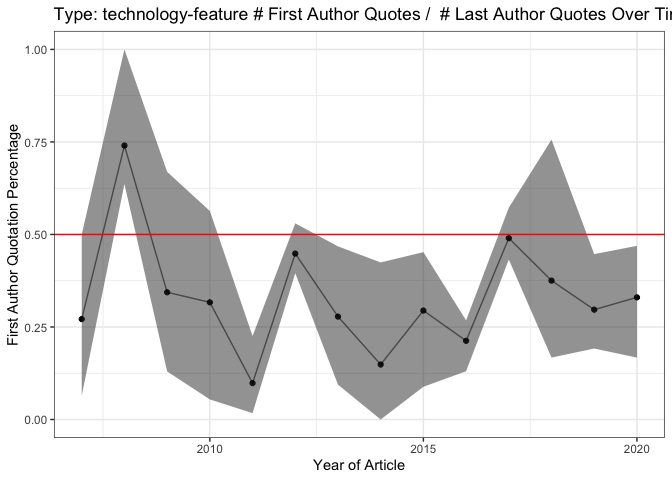

First\_v\_last
================
Natalie Davidson
4/23/2021

## Nature News comparison of first vs last authors in Quotes

This document is a working analysis of the quotes extracted from Nature News content to see if first or last authors are more commonly quoted. The data we will be working with are the following:

1.  `./data/scraped_data/quote_table_raw_20*.tsv` are the output after scraping all articles from a year between 2005 2020 (`./nature_news_scraper/run_target_year_scrape.sh`) then running it through coreNLP with additional processing (`./process_scraped_data/run_process_target_year.sh`)

2.  `./data/author_data/all_author_fullname.tsv` is the output after scraping and processing the citations from nature news articles for the first and last author information. This file is created by running `./process_doi_data/run_background_scrapes.sh`.

**All analysis shown below depends on the functions described in `/analysis_scripts/analysis_utils.R`**

## Read in data

### reading in the quote data

``` r
# read in the quotes from every year and every article type
full_quote_df = NA
quote_files = list.files(paste(proj_dir,"/data/scraped_data/", sep=""), full.names = T)
quote_files = grep("quote_table_raw_", quote_files, value=T)
for(quote_file in quote_files){
    
    quote_df = read_corenlp_quote_files(quote_file)
    quote_df$year = str_extract(quote_file, "[1-9][0-9]+")
    quote_df$type = substring(basename(quote_file), 
                            22, nchar(basename(quote_file))-4)
    
    full_quote_df = rbind(full_quote_df, quote_df)
}
full_quote_df = full_quote_df[-1,]

head(full_quote_df)
```

    ##   file_id       est_speaker est_gender canonical_speaker     partial_name
    ## 2 434970a Arnold Sommerfeld       MALE     Edward Teller       Sommerfeld
    ## 3 438567a      Arthur Smith       MALE   Arthur E. Smith  Arthur E. Smith
    ## 4 437634a  Bertrand Russell       MALE  Bertrand Russell Bertrand Russell
    ## 5 434029a             Boxma       MALE           Unknown            Boxma
    ## 6 438031a           Bradley       MALE     F. H. Bradley    F. H. Bradley
    ## 7 435748a            Brooks       MALE   C. E. P. Brooks  C. E. P. Brooks
    ##                                                                                          quote
    ## 2     as if I was born in Germany only by mistake, and only came to my true homeland at age 28
    ## 3                                                                                       tongue
    ## 4 If ever these evils are eradicated, his name should stand very high indeed among the heroes.
    ## 5                                                                            true missing link
    ## 6                                          Finding bad reasons for what we believe on instinct
    ## 7                                                                                 Fog and Soot
    ##   year           type
    ## 2 2005 news-and-views
    ## 3 2005 news-and-views
    ## 4 2005 news-and-views
    ## 5 2005 news-and-views
    ## 6 2005 news-and-views
    ## 7 2005 news-and-views

### reading in the first and last author data

``` r
name_info_file = file.path(proj_dir, 
                         "/data/author_data/all_author_fullname.tsv")
name_info_df = data.frame(fread(name_info_file))

# we are only interested in the nature news citations
name_info_df = subset(name_info_df, corpus == "naturenews_citations")

head(name_info_df)
```

    ##   year author_pos           author            file_id
    ## 1 2010      first Michael Heinrich            463436a
    ## 2 2012      first     Kai K. Ewert            489372b
    ## 3 2019      first     Grace E. Kim d41586-019-00245-3
    ## 4 2011      first    M. R. Elphick            473161a
    ## 5 2006      first  Nicole Dubilier        nature05208
    ## 6 2010      first Martin Moskovits            464357a
    ##                            doi               corpus
    ## 1 doi:10.1007/0-306-46826-3_33 naturenews_citations
    ## 2      doi:10.1007/128_2010_70 naturenews_citations
    ## 3      doi:10.1007/164_2016_82 naturenews_citations
    ## 4  doi:10.1007/3-540-26573-2_9 naturenews_citations
    ## 5 doi:10.1007/3-540-28221-1_12 naturenews_citations
    ## 6 doi:10.1007/3-540-44948-5_10 naturenews_citations

## match quotes to authors

``` r
# first we only care about files that both have 
# at least one quote and springer indexed citation
file_id_intersect = intersect(full_quote_df$file_id, 
                                name_info_df$file_id)

# go through the files that meet the above criteria
# and match citations to quoted speakers
quote_author_df = NA
missed_names_df = NA
for(curr_id in file_id_intersect){
    
    curr_quote = subset(full_quote_df, file_id == curr_id)
    curr_author = subset(name_info_df, file_id == curr_id)
    
    # we must make approx. name matches
    # so we go through each quoted speaker, 
    # looking for the best cited author match, IF it exists
    names_df = subset(curr_quote, select=c("est_speaker"))
    names_df$author = NA
    for(idx in 1:nrow(names_df)){
        curr_text = names_df$est_speaker[idx]
        
        # remove punctuations just in case
        curr_text = gsub('[[:punct:] ]+', '', curr_text)
        
        # get_matched_string tries to find the name with the 
        # closest substring with no penalty for deletions.
        # Maximum number of mismatches is 3
        names_df$author[idx] = get_matched_string(curr_text, 
                                                  curr_author$author, 
                                                  max_cost = 3)

    }
    # only keep the names we were able to find
    curr_missed_names = subset(names_df, is.na(author))
    names_df = na.omit(names_df)
    
    curr_quote = merge(curr_quote, names_df)
    merged_df = merge(curr_quote[,c("author", "year", "est_speaker", "type", "file_id", "quote")], 
                      curr_author[,c("author", "doi", "author_pos")],
                      by = "author")
    quote_author_df = rbind(quote_author_df, merged_df)
    
    if(nrow(curr_missed_names) > 0){
        missed_names_df = rbind(missed_names_df, curr_missed_names)
    }

    
}
quote_author_df = quote_author_df[-1,]
quote_author_df = unique(quote_author_df)

missed_names_df = missed_names_df[-1,]
```

## QC: look into all missed quotes

Missing names (i.e. names that are quoted, but not found in the citations) can occur for the following reasons:

1.  The parsed name from the quote is incorrect

2.  The quote is commentary, i.e. there is no citation needed for this quote

3.  The quote is not from the first or last author

4.  The quote is from a cited author, but the cited article is not indexed by springer

Unfortunately, there isn't an easy way for me to know exactly which of the reasons a name is missing. We just hope there is no confounders.

``` r
# merge the missing names with the quote table
missed_quote_df = merge(subset(full_quote_df, select = -quote), 
                        unique(missed_names_df))
missed_quote_df = unique(missed_quote_df)

# plot missed names over time
ggplot(missed_quote_df, aes(x=year, fill=type)) +
    geom_bar(position = "stack") + theme_bw() + 
    xlab("Year of Article") + ylab("Total number of Missed Names") +
    ggtitle("Total number of Speakers where no Cited Name Matched") + 
    scale_fill_brewer(palette="Set2")
```


``` r
# compare missed vs found speakers by article type

for(curr_type in unique(missed_quote_df$type)){
    
    # subset by article type
    curr_found_df = subset(quote_author_df, type == curr_type)
    curr_found_df$status = "found"
    curr_miss_df = subset(missed_quote_df, type == curr_type)
    curr_miss_df$status = "missing"

    col_ids = c("file_id", "year", "status", "est_speaker")
    plot_df = rbind(curr_found_df[,col_ids], curr_miss_df[,col_ids])
    
    # aggregate over the missing names
    plot_count_df = plot_df %>% 
                group_by(year, status) %>% 
                summarise(n()) 
    colnames(plot_count_df)[3] = "count"
    
    # plot missed vs found names over time
    gg = ggplot(plot_count_df, aes(x=year, y=count, color=status, group=status)) +
        geom_line() + geom_point() + theme_bw() + 
        xlab("Year of Article") + ylab("# Names") +
        ggtitle(paste0("Type: ", curr_type, " Compare Matched with Unmatched")) + 
        scale_fill_brewer(palette="Set2")
        
    print(gg)
    
}
```


## plot first vs last authors overall

``` r
# take bootstrap estimate of the first v last author
first_cited_prop_df = compute_bootstrap_first_author(quote_author_df, 
                                               year_col_id = "year", 
                                               article_col_id = "file_id",
                                               conf_int=0.95)

ggplot(first_cited_prop_df, aes(x=as.numeric(year), y=mean,
                          ymin=bottom_CI, ymax=top_CI)) +
    geom_point() + geom_ribbon(alpha=0.5) + geom_line(alpha=0.5) + 
    theme_bw() + 
    xlab("Year of Article") + ylab("First Author Quotation Percentage") +
    ggtitle("# First Author Quotes /  # Last Author Quotes Over Time") + 
    scale_fill_brewer(palette="Set2") +
    geom_hline(yintercept=0.5, color="red")
```


## plot first vs last authors by article type

``` r
for(curr_type in unique(missed_quote_df$type)){
    
    # subset by article type
    curr_type_df = subset(quote_author_df, type == curr_type)
        
    first_cited_prop_df = compute_bootstrap_first_author(curr_type_df, 
                                                   year_col_id = "year", 
                                                   article_col_id = "file_id",
                                                   conf_int=0.95)
    
    gg = ggplot(first_cited_prop_df, aes(x=as.numeric(year), y=mean,
                              ymin=bottom_CI, ymax=top_CI)) +
        geom_point() + geom_ribbon(alpha=0.5) + geom_line(alpha=0.5) + 
        theme_bw() + 
        xlab("Year of Article") + ylab("First Author Quotation Percentage") +
        ggtitle("# First Author Quotes /  # Last Author Quotes Over Time") + 
        ggtitle(paste0("Type: ", curr_type, 
                       " # First Author Quotes /  # Last Author Quotes Over Time")) + 
        scale_fill_brewer(palette="Set2") +
        geom_hline(yintercept=0.5, color="red")
    
    print(gg)

}
```


