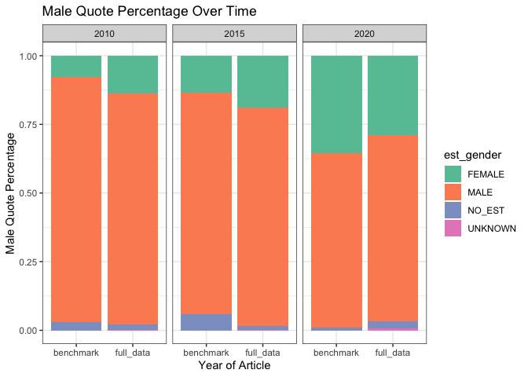
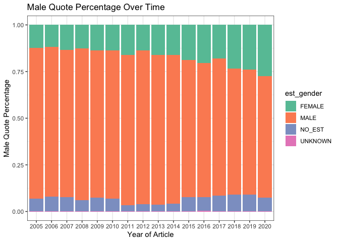

Gender analysis
================
Natalie Davidson
1/12/2021

## Nature News Gender Disparities in Quotes

This document is a working analysis of the quotes extracted from Nature News content to see if there are differences in gender representation. The data we will be working with are the following:

1.  `./data/benchmark_data/benchmark_quote_table_raw.tsv` is the output after scraping a randomly selected set of 10 articles from 2010, 2015, or 2020 (`./nature_news_scraper/run_scrape_benchmark.sh`) then running it through coreNLP with additional processing (`./process_scraped_data/run_process_target_year.sh`)
2.  `./data/scraped_data/quote_table_raw_20*.tsv` are the output after scraping all articles from a year between 2001 2020 (`./nature_news_scraper/run_scrape_benchmark.sh`) then running it through coreNLP with additional processing (`./process_scraped_data/run_process_target_year.sh`)

**All analysis shown below depends on the functions described in `/analysis_scripts/analysis_utils.R`**

## Check Benchmark Consistency

We would like to make sure that our benchmark data is representative of our complete dataset, so let's look at some quote stats to make sure.

### reading in the quote data

First we read in the benchmark data

``` r
# get the project directory, everything is set relative to this
proj_dir = here()

# read in the benchmark quote table
raw_quote_file = paste(proj_dir, 
                    "/data/benchmark_data/benchmark_quote_table_raw.tsv", 
                    sep="")

bm_quote_df = read_corenlp_quote_files(raw_quote_file)

# add the year annotation
year_idx_file = paste(proj_dir, 
                "/data/benchmark_data/coreNLP_input/fileID_year.tsv", 
                sep="")
year_df = data.frame(fread(year_idx_file))
bm_quote_df = merge(year_df, bm_quote_df)


head(bm_quote_df)
```

    ##         file_id year       est_speaker est_gender canonical_speaker
    ## 1 4641259a.html 2010  Sergio Baranzini       MALE           Unknown
    ## 2 4641259a.html 2010  Daniel Geschwind       MALE         Geschwind
    ## 3 4641259a.html 2010  Sergio Baranzini       MALE           Unknown
    ## 4 4641259a.html 2010 Stephen Kingsmore       MALE Stephen Kingsmore
    ## 5 4641259a.html 2010 Stephen Kingsmore       MALE Stephen Kingsmore
    ## 6 4641259a.html 2010  Sergio Baranzini       MALE Stephen Kingsmore
    ##       partial_name
    ## 1 Sergio Baranzini
    ## 2        Geschwind
    ## 3        Baranzini
    ## 4        Kingsmore
    ## 5        Kingsmore
    ## 6        Baranzini
    ##                                                                                                                                    quote
    ## 1                                                                                               "it is an incredibly important negative"
    ## 2                                                          "What they've done here is create a very nice template for others to follow,"
    ## 3 "It isn't just sequence — they went from sequence to epigenome to expression. That's what really makes [the study] something special."
    ## 4                                                    "If we sequenced another dozen twin pairs we could make this much more definitive,"
    ## 5                                                        "There had to be some trigger that caused one to develop it and the other not,"
    ## 6                                                                           "we really ought to look at sequencing of the brain tissue,"

Now we read in the full data for the same years.

``` r
# read in the full year quote table for 2010, 2015, and 2020
full_quote_df = NA
for(curr_year in c(2010, 2015, 2020)){
    quote_file = paste(proj_dir, 
                    "/data/scraped_data/quote_table_raw_", curr_year, ".tsv", 
                    sep="")
    quote_df = read_corenlp_quote_files(quote_file)
    quote_df$year = curr_year

    full_quote_df = rbind(full_quote_df, quote_df)
}
full_quote_df = full_quote_df[-1,]

head(full_quote_df)
```

    ##              file_id       est_speaker est_gender canonical_speaker
    ## 2 news.2010.122.html    Aaron Krochmal       MALE    Aaron Krochmal
    ## 3       463722a.html Aaron Ciechanover       MALE        biochemist
    ## 4       463722a.html Aaron Ciechanover       MALE        biochemist
    ## 5 news.2010.122.html    Aaron Krochmal       MALE    Aaron Krochmal
    ## 6 news.2010.370.html       Abass Alavi       MALE       Abass Alavi
    ## 7 news.2010.383.html            Abbott       MALE          Zambetti
    ##        partial_name
    ## 2    Aaron Krochmal
    ## 3 Aaron Ciechanover
    ## 4 Aaron Ciechanover
    ## 5    Aaron Krochmal
    ## 6       Abass Alavi
    ## 7          Zambetti
    ##                                                                                                                                                                                      quote
    ## 2 "Although aspects of the findings contradict known behavioural and physiological work, the use of molecular genetic techniques is a new step in understanding how the facial pits work."
    ## 3                                                           "It's the only programme that brings together people speaking so many different languages and gets them to work productively."
    ## 4                                                                                                                                "It would be a terrible mistake to go in this direction,"
    ## 5                                                             "The authors used elegant molecular techniques to confirm an idea long substantiated by physiological and behavioural data,"
    ## 6                                                                     "This is a big lesson for all the major institutions that they are going to have to tighten their internal reviews."
    ## 7                                                                                                                                                           "But it's a keystone finding,"
    ##   year
    ## 2 2010
    ## 3 2010
    ## 4 2010
    ## 5 2010
    ## 6 2010
    ## 7 2010

Now we join the tables together for comparison.

``` r
full_quote_df$is_benchmark = "full_data"
bm_quote_df$is_benchmark = "benchmark"

bm_full_quote_df = rbind(full_quote_df, bm_quote_df)
```

### compare benchmark and non-benchmark data



### compare proportions over all years

Now lets look at all years quote information and plot the trend over time 
