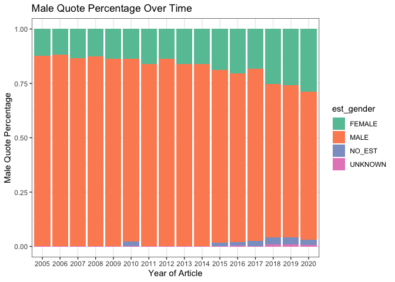
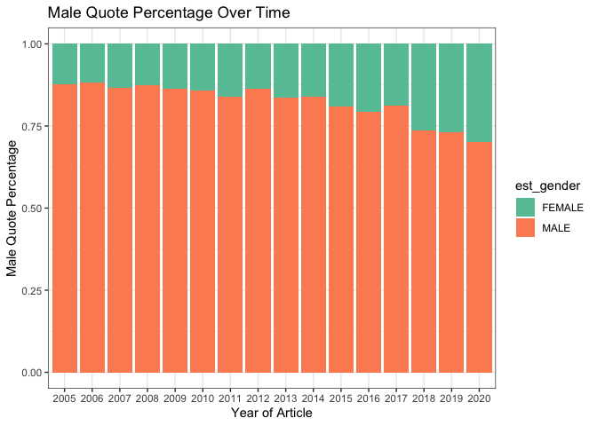

Gender analysis
================
Natalie Davidson
1/12/2021

## Nature News Gender Disparities in Quotes

This document is a working analysis of the quotes extracted from Nature News content to see if there are differences in gender representation. The data we will be working with are the following:

1.  `./data/benchmark_data/benchmark_quote_table_raw.tsv` is the output after scraping a randomly selected set of 10 articles from 2010, 2015, or 2020 (`./nature_news_scraper/run_scrape_benchmark.sh`) then running it through coreNLP with additional processing (`./process_scraped_data/run_process_target_year.sh`)
2.  `./data/scraped_data/quote_table_raw_20*.tsv` are the output after scraping all articles from a year between 2001 2020 (`./nature_news_scraper/run_scrape_benchmark.sh`) then running it through coreNLP with additional processing (`./process_scraped_data/run_process_target_year.sh`)

**All analysis shown below depends on the functions described in `/analysis_scripts/analysis_utils.R`**

## Check Benchmark Consistency

We would like to make sure that our benchmark data is representative of our complete dataset, so let's look at some quote stats to make sure.

### reading in the quote data

First we read in the benchmark data

``` r
# get the project directory, everything is set relative to this
proj_dir = here()

# read in the benchmark quote table
raw_quote_file = paste(proj_dir, 
                    "/data/benchmark_data/benchmark_quote_table_raw.tsv", 
                    sep="")

bm_quote_df = read_corenlp_quote_files(raw_quote_file)

# add the year annotation
year_idx_file = paste(proj_dir, 
                "/data/benchmark_data/coreNLP_input/fileID_year.tsv", 
                sep="")
year_df = data.frame(fread(year_idx_file))
bm_quote_df = merge(year_df, bm_quote_df)


head(bm_quote_df)
```

    ##         file_id year       est_speaker est_gender canonical_speaker
    ## 1 4641259a.html 2010  Sergio Baranzini       MALE Stephen Kingsmore
    ## 2 4641259a.html 2010  Sergio Baranzini       MALE           Unknown
    ## 3 4641259a.html 2010  Daniel Geschwind       MALE         Geschwind
    ## 4 4641259a.html 2010 Stephen Kingsmore       MALE Stephen Kingsmore
    ## 5 4641259a.html 2010  Sergio Baranzini       MALE  Sergio Baranzini
    ## 6 4641259a.html 2010 Stephen Kingsmore       MALE Stephen Kingsmore
    ##   partial_name
    ## 1    Baranzini
    ## 2    Baranzini
    ## 3    Geschwind
    ## 4    Kingsmore
    ## 5    Baranzini
    ## 6    Kingsmore
    ##                                                                                                                                  quote
    ## 1                                                                           we really ought to look at sequencing of the brain tissue,
    ## 2 It isn't just sequence — they went from sequence to epigenome to expression. That's what really makes [the study] something special.
    ## 3                                                          What they've done here is create a very nice template for others to follow,
    ## 4                                                        There had to be some trigger that caused one to develop it and the other not,
    ## 5                                                                 one was exposed to the perfect combination of environmental triggers
    ## 6                                                    Both twins came into the world with the same set of high risks for developing MS,

Now we read in the full data for the same years.

``` r
# read in the full year quote table for 2010, 2015, and 2020
full_quote_df = NA
quote_files = list.files(paste(proj_dir,"/data/scraped_data/", sep=""), full.names = T)
quote_files = grep("quote_table_raw_", quote_files, value=T)
for(quote_file in quote_files){
    
    quote_df = read_corenlp_quote_files(quote_file)
    quote_df$year = str_extract(quote_file, "[1-9][0-9]+") # curr_year

    full_quote_df = rbind(full_quote_df, quote_df)
}
full_quote_df = full_quote_df[-1,]

head(full_quote_df)
```

    ##   file_id       est_speaker est_gender canonical_speaker     partial_name
    ## 2 434970a Arnold Sommerfeld       MALE     Edward Teller       Sommerfeld
    ## 3 438567a      Arthur Smith       MALE   Arthur E. Smith  Arthur E. Smith
    ## 4 437634a  Bertrand Russell       MALE  Bertrand Russell Bertrand Russell
    ## 5 434029a             Boxma       MALE           Unknown            Boxma
    ## 6 438031a           Bradley       MALE     F. H. Bradley    F. H. Bradley
    ## 7 435748a            Brooks       MALE   C. E. P. Brooks  C. E. P. Brooks
    ##                                                                                          quote
    ## 2     as if I was born in Germany only by mistake, and only came to my true homeland at age 28
    ## 3                                                                                       tongue
    ## 4 If ever these evils are eradicated, his name should stand very high indeed among the heroes.
    ## 5                                                                            true missing link
    ## 6                                          Finding bad reasons for what we believe on instinct
    ## 7                                                                                 Fog and Soot
    ##   year
    ## 2 2005
    ## 3 2005
    ## 4 2005
    ## 5 2005
    ## 6 2005
    ## 7 2005

Now we join the tables together for comparison.

``` r
full_quote_df$is_benchmark = "full_data"
bm_quote_df$is_benchmark = "benchmark"

bm_full_quote_df = rbind(full_quote_df, bm_quote_df)
```

### compare benchmark and non-benchmark data


### compare proportions over all years

Now lets look at all years quote information and plot the trend over time 
