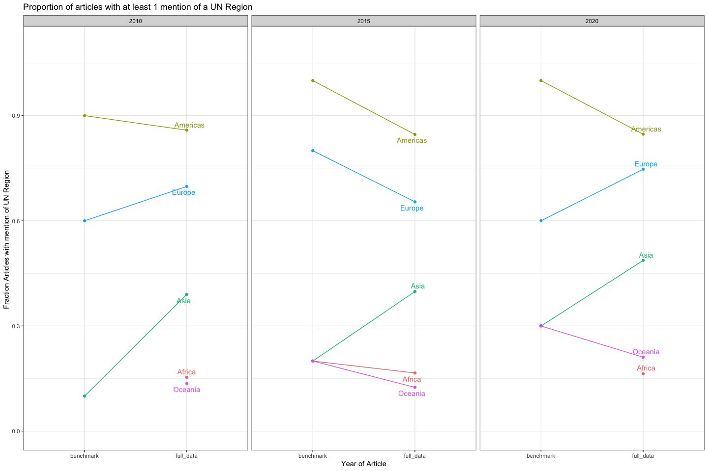
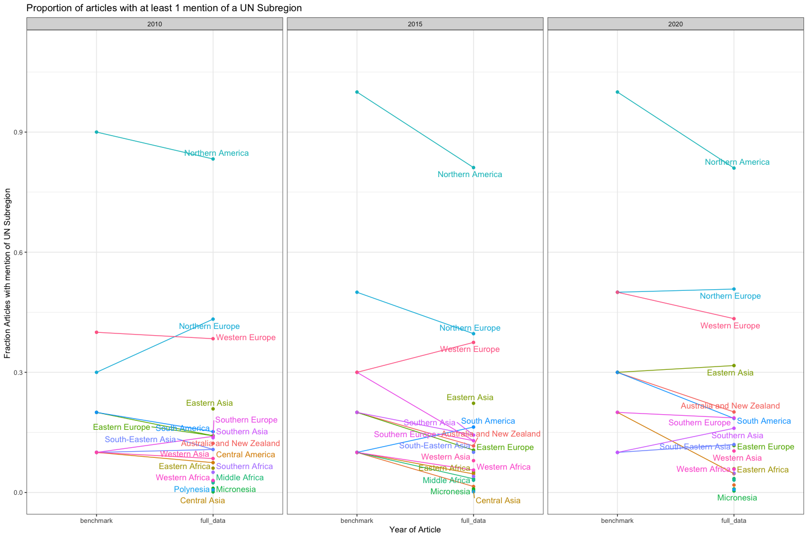
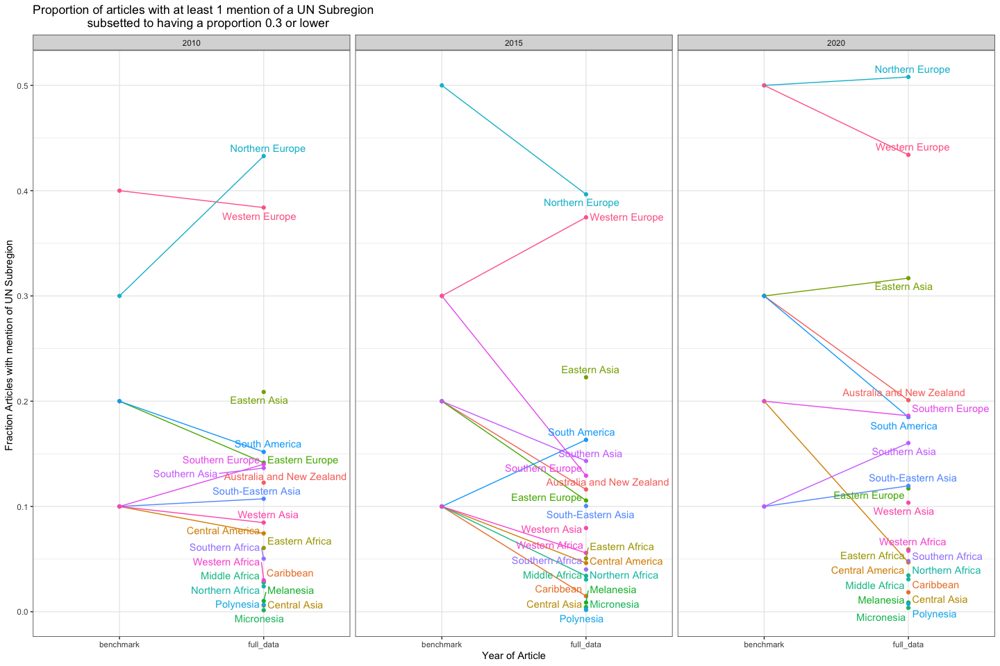
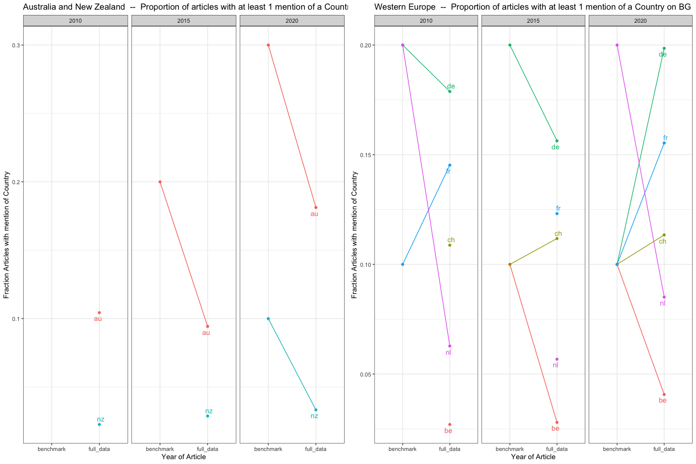
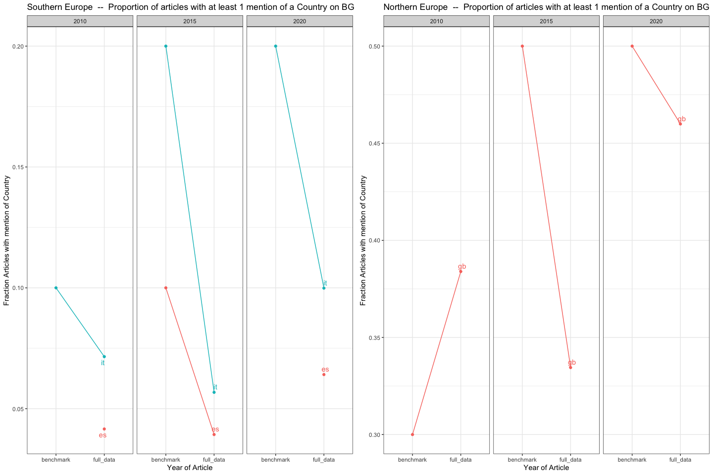
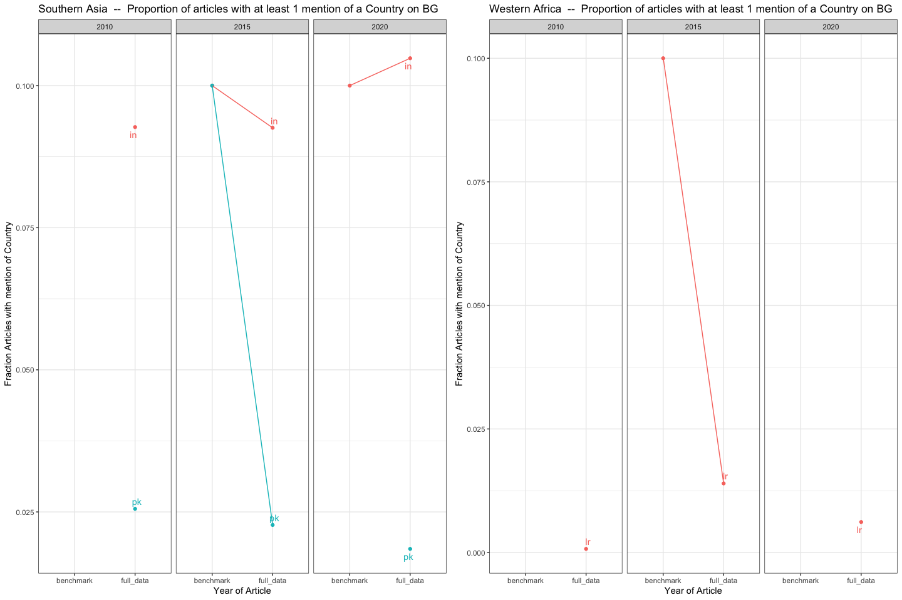

location\_analysis
================
Natalie Davidson
1/22/2021

## Nature News Location Bias

This document is a working analysis of the quotes extracted from Nature News content to see if there are differences in gender representation. The data we will be working with are the following:

1.  `./data/benchmark_data/benchmark_quote_table_raw.tsv` is the output after scraping a randomly selected set of 10 articles from 2010, 2015, or 2020 (`./nature_news_scraper/run_scrape_benchmark.sh`) then running it through coreNLP with additional processing (`./process_scraped_data/run_process_target_year.sh`)
2.  `./data/scraped_data/quote_table_raw_20*.tsv` are the output after scraping all articles from a year between 2001 2020 (`./nature_news_scraper/run_scrape_benchmark.sh`) then running it through coreNLP with additional processing (`./process_scraped_data/run_process_target_year.sh`)

**All analysis shown below depends on the functions described in `/analysis_scripts/analysis_utils.R`**

## Check Benchmark Consistency

We would like to make sure that our benchmark data is representative of our complete dataset, so let's look at some quote stats to make sure.

### reading in the quote data

First we read in the benchmark data

``` r
# get the project directory, everything is set relative to this
proj_dir = here()

# read in the benchmark quote table
bm_loc_file = paste(proj_dir, 
                    "/data/benchmark_data/benchmark_location_table_raw.tsv", 
                    sep="")

bm_loc_df = read_corenlp_location_files(bm_loc_file)
```

    ## Warning in fread(country_file): Detected 12 column names but the data has 13
    ## columns (i.e. invalid file). Added 1 extra default column name for the first
    ## column which is guessed to be row names or an index. Use setnames() afterwards
    ## if this guess is not correct, or fix the file write command that created the
    ## file to create a valid file.

``` r
# add the year annotation
year_idx_file = paste(proj_dir, 
                "/data/benchmark_data/coreNLP_input/fileID_year.tsv", 
                sep="")
year_df = data.frame(fread(year_idx_file))
bm_loc_df = merge(year_df, bm_loc_df)


head(bm_loc_df)
```

    ##         file_id year est_country_code
    ## 1 4641259a.html 2010               us
    ## 2 4641259a.html 2010               us
    ## 3 4641259a.html 2010               us
    ## 4 4641259a.html 2010               us
    ## 5 4641259a.html 2010               us
    ## 6 4641259a.html 2010               us
    ##                                               text               ner
    ## 1                                       new mexico STATE_OR_PROVINCE
    ## 2                                      connecticut STATE_OR_PROVINCE
    ## 3                                               ms STATE_OR_PROVINCE
    ## 4 national center for genome resources in santa fe      ORGANIZATION
    ## 5                                               us           COUNTRY
    ## 6                         university of california      ORGANIZATION
    ##     est_country est_un_region est_un_subregion
    ## 1 United States      Americas Northern America
    ## 2 United States      Americas Northern America
    ## 3 United States      Americas Northern America
    ## 4 United States      Americas Northern America
    ## 5 United States      Americas Northern America
    ## 6 United States      Americas Northern America

Now we read in the full data for the same years.

``` r
# read in the full year quote table for 2010, 2015, and 2020
full_loc_df = NA
for(curr_year in c(2010, 2015:2020)){
    loc_file = paste(proj_dir, 
                    "/data/scraped_data/location_table_raw_", curr_year, ".tsv", 
                    sep="")
    loc_df = read_corenlp_location_files(loc_file)
    loc_df$year = curr_year

    full_loc_df = rbind(full_loc_df, loc_df)
}
```

    ## Warning in fread(country_file): Detected 12 column names but the data has 13
    ## columns (i.e. invalid file). Added 1 extra default column name for the first
    ## column which is guessed to be row names or an index. Use setnames() afterwards
    ## if this guess is not correct, or fix the file write command that created the
    ## file to create a valid file.

    ## Warning in fread(country_file): Detected 12 column names but the data has 13
    ## columns (i.e. invalid file). Added 1 extra default column name for the first
    ## column which is guessed to be row names or an index. Use setnames() afterwards
    ## if this guess is not correct, or fix the file write command that created the
    ## file to create a valid file.

    ## Warning in fread(country_file): Detected 12 column names but the data has 13
    ## columns (i.e. invalid file). Added 1 extra default column name for the first
    ## column which is guessed to be row names or an index. Use setnames() afterwards
    ## if this guess is not correct, or fix the file write command that created the
    ## file to create a valid file.

    ## Warning in fread(country_file): Detected 12 column names but the data has 13
    ## columns (i.e. invalid file). Added 1 extra default column name for the first
    ## column which is guessed to be row names or an index. Use setnames() afterwards
    ## if this guess is not correct, or fix the file write command that created the
    ## file to create a valid file.

    ## Warning in fread(country_file): Detected 12 column names but the data has 13
    ## columns (i.e. invalid file). Added 1 extra default column name for the first
    ## column which is guessed to be row names or an index. Use setnames() afterwards
    ## if this guess is not correct, or fix the file write command that created the
    ## file to create a valid file.

    ## Warning in fread(country_file): Detected 12 column names but the data has 13
    ## columns (i.e. invalid file). Added 1 extra default column name for the first
    ## column which is guessed to be row names or an index. Use setnames() afterwards
    ## if this guess is not correct, or fix the file write command that created the
    ## file to create a valid file.

    ## Warning in fread(country_file): Detected 12 column names but the data has 13
    ## columns (i.e. invalid file). Added 1 extra default column name for the first
    ## column which is guessed to be row names or an index. Use setnames() afterwards
    ## if this guess is not correct, or fix the file write command that created the
    ## file to create a valid file.

``` r
full_loc_df = full_loc_df[-1,]

full_loc_df = subset(full_loc_df, est_un_region != "" & 
                                        est_un_subregion != "" &
                                        est_un_region != "NO_EST" & 
                                        est_un_subregion != "NO_EST")

head(full_loc_df)
```

    ##   est_country_code            file_id                              text
    ## 2               ae news.2010.647.html rochester institute of technology
    ## 3               ae news.2010.491.html rochester institute of technology
    ## 4               ae       468609a.html                               ias
    ## 5               af       464014b.html                       afghanistan
    ## 6               af news.2010.684.html                       afghanistan
    ## 7               af       465990a.html                       afghanistan
    ##            ner          est_country est_un_region est_un_subregion year
    ## 2 ORGANIZATION United Arab Emirates          Asia     Western Asia 2010
    ## 3 ORGANIZATION United Arab Emirates          Asia     Western Asia 2010
    ## 4 ORGANIZATION United Arab Emirates          Asia     Western Asia 2010
    ## 5      COUNTRY          Afghanistan          Asia    Southern Asia 2010
    ## 6      COUNTRY          Afghanistan          Asia    Southern Asia 2010
    ## 7      COUNTRY          Afghanistan          Asia    Southern Asia 2010

Now we join the tables together for comparison.

``` r
full_loc_df$is_benchmark = "full_data"
bm_loc_df$is_benchmark = "benchmark"

bm_full_loc_df = rbind(subset(full_loc_df, year %in% c("2010", "2015", "2020")), 
                       bm_loc_df)
bm_full_loc_df = subset(bm_full_loc_df, est_un_region != "" & 
                                        est_un_subregion != "" &
                                        est_un_region != "NO_EST" & 
                                        est_un_subregion != "NO_EST")
```

### compare benchmark and non-benchmark data

Now lets check how well the benchmark proportions match the full dataset proportions. The number of articles per year in each benchmark set is 10, the total number of articles in the year is between 400-1000. Since the number of articles in the benchmark set is very small, we don't expect exact consistency between the benchmark and total data sets.

#### Lets look at the largest region definition first: UN region



#### Lets look at the UN Subregion level



#### Now Finally the Country Code level, except divided by subregion

    ## $`1`


    ## 
    ## $`2`



    ## 
    ## $`3`


    ## 
    ## $`4`


    ## 
    ## $`5`



    ## 
    ## $`6`


    ## 
    ## $`7`



    ## 
    ## $`8`


    ## 
    ## attr(,"class")
    ## [1] "list"      "ggarrange"

### Compare locations over all years

Now lets see the proportion of articles that mention each UN Subregion.


