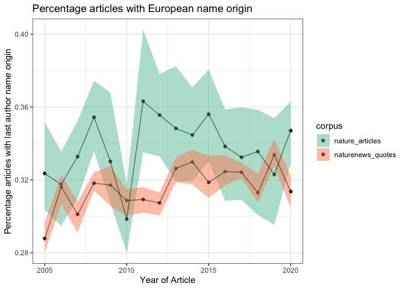

name\_origin\_quotes\_with\_bg
================
Natalie Davidson
4/28/2021

## Data Description

This document compares one "foreground" datasets (estimated name origin of authors quoted in nature news articles) and compares it to two possible "background" datasets (random sampling of 36K Springer articles, and all nature articles)

The quote data file is: `./data/author_data/all_speaker_fullname_pred.tsv` The bg data file is: `./data/author_data/all_author_fullname_pred.tsv`

The three corpi are indexed by the `corpus` column:

1.  `news_quotes`: **foreground** est. name origin of Nature News quoted speaker

2.  `nature_articles`: **background** est. name origin of last author of Nature articles.

3.  `springer_articles`: **background** est. name origin of last author of a random subset of Springer articles.

## Foreground Location Breakdown

Read in the name data.

``` r
# get the project directory, everything is set relative to this
proj_dir = here()

#' public method that reads in the name origine prediction 
#' files and formats it into a dataframe
#' 
#' @param name_pred_file, prediction results from Wiki2019-LSTM
#' @param name_info_file, file used as input to Wiki2019-LSTM
#' @return dataframe of name origin predictions with annotation info
read_name_origin <- function(name_pred_file, name_info_file){
        
    # read in the name data
    name_pred_df = data.frame(fread(name_pred_file))
    name_info_df = data.frame(fread(name_info_file))
    
    # format the prediction table
    colnames(name_pred_df)[1] = "author"
    name_origin_vec = colnames(name_pred_df)[2:ncol(name_pred_df)]
    name_origin = apply(name_pred_df[,2:ncol(name_pred_df)], 1, 
                        function(x) name_origin_vec[which(x == max(x))])
    name_pred_df$name_origin = name_origin
    
    name_df = merge(name_info_df, name_pred_df[,c("author", "name_origin")])
    
    # remove any names that may have got through that are not real names
    name_df = name_df[grep("collab|group", tolower(name_df$author), invert=T), ]
    name_df = unique(name_df)
    
    
    return(name_df)
}

# first read in the quote data
name_pred_file = file.path(proj_dir, 
                             "/data/author_data/all_speaker_fullname_pred.tsv")
name_info_file = file.path(proj_dir, 
                             "/data/author_data/all_speaker_fullname.tsv")

quote_name_df = read_name_origin(name_pred_file, name_info_file)


# now read in the BG data
name_pred_file = file.path(proj_dir, 
                         "/data/author_data/all_author_fullname_pred.tsv")
name_info_file = file.path(proj_dir, 
                         "/data/author_data/all_author_fullname.tsv")
cite_name_df = read_name_origin(name_pred_file, name_info_file)

# we will only use last authors in the citations
cite_name_df = subset(cite_name_df, author_pos == "last")

# now we want to join these two datasets together
# we assume a quote is comparable to a publication
# so we will have a quote set as a doi
quote_name_df$doi = quote_name_df$quote
quote_name_df$corpus = "naturenews_quotes"


col_ids = c("author", "year", "name_origin", "corpus", "doi")
name_df = rbind(cite_name_df[,col_ids], quote_name_df[,col_ids])

head(name_df)
```

    ##                   author year name_origin               corpus
    ## 5           A A Bidokhti 2018   EastAsian    springer_articles
    ## 11            A Banerjee 2006  SouthAsian    springer_articles
    ## 20 A Cecile J W Janssens 2009    European naturenews_citations
    ## 22              A Cuxart 2005    European    springer_articles
    ## 23              A Cuxart 2005    European    springer_articles
    ## 24              A Cuxart 2005    European    springer_articles
    ##                                 doi
    ## 5     doi:10.1007/s12040-018-1013-5
    ## 11       doi:10.1038/sj.onc.1209944
    ## 20 doi:10.1097/GIM.0b013e3181b13a4f
    ## 22   doi:10.1186/1743-8454-2-S1-S51
    ## 23   doi:10.1186/1743-8454-2-S1-S29
    ## 24   doi:10.1186/1743-8454-2-S1-S28

### QC

From each article type, lets compare the total number of articles considered in this analysis.


### Name Origin Comparison

For each corpus, lets compare the number of articles with an estimated name origin for the first and last authors.

    ## [1] "EastAsian"
    ## [1] "SouthAsian"
    ## [1] "European"
    ## [1] "CelticEnglish"
    ## [1] "ArabTurkPers"
    ## [1] "Hispanic"
    ## [1] "Jewish"
    ## [1] "Greek"
    ## [1] "Nordic"
    ## [1] "African"

    ## [1] "EastAsian"
    ## [1] "SouthAsian"
    ## [1] "European"
    ## [1] "CelticEnglish"
    ## [1] "ArabTurkPers"
    ## [1] "Hispanic"
    ## [1] "Jewish"
    ## [1] "Greek"
    ## [1] "Nordic"
    ## [1] "African"

    ## [1] "EastAsian"
    ## [1] "SouthAsian"
    ## [1] "European"
    ## [1] "CelticEnglish"
    ## [1] "ArabTurkPers"
    ## [1] "Hispanic"
    ## [1] "Jewish"
    ## [1] "Greek"
    ## [1] "Nordic"
    ## [1] "African"

    ## [1] "EastAsian"
    ## [1] "SouthAsian"
    ## [1] "European"
    ## [1] "CelticEnglish"
    ## [1] "ArabTurkPers"
    ## [1] "Hispanic"
    ## [1] "Jewish"
    ## [1] "Greek"
    ## [1] "Nordic"
    ## [1] "African"


Lets look at individual name origins


