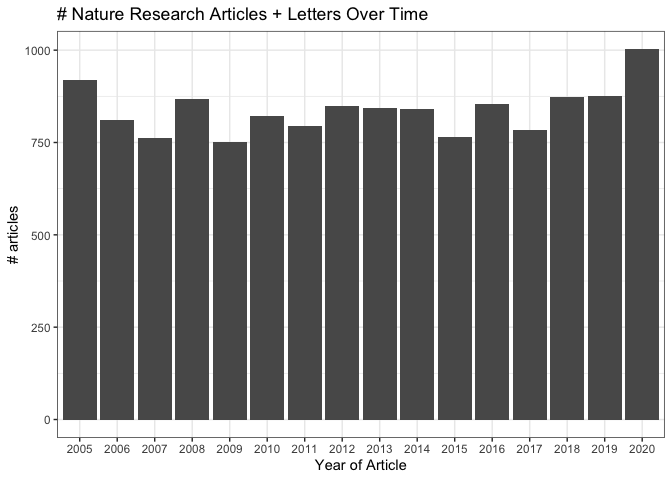
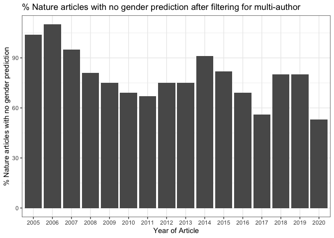

bg\_nature\_qc
================
Natalie Davidson
3/29/2021

## Overview

This notebook will QC the scraped author information from nature research articles + letters. This dataset is a background dataset used to compare gender + country rates in Nature News. This analysis looks at 3 steps of a pipeline

1.  raw scraped data: `/data/author_data/downloads`

2.  gender predictions : `/data/author_data/nature_author_gender.tsv`

3.  location predictions from Springer API response: `/data/author_data/all_author_country.tsv`

## Pipeline Step 1: Author Information Scrapes

### Read in the scraped info

``` r
# read in the scraped citations from nature news articles for each year
pipeline_1_dir = paste(proj_dir,
                    "/data/author_data/downloads/", sep="")
pipeline_1_files = list.files(pipeline_1_dir, full.names = T)

all_authors = NA

for(curr_file in pipeline_1_files){

    file_id = basename(curr_file)
    file_id = substr(file_id, 1, nchar(file_id)-9)
    
    json_res = fromJSON(curr_file)

    # format authors
    authors = unlist(lapply(json_res$authors, function(x) paste(unlist(x$name), collapse="; ")))

    # make df
    authors_df = data.frame(file_id=json_res$file_id,
                            year=json_res$year,
                            authors=authors)
    
    all_authors = rbind(all_authors, authors_df)

}

all_authors = all_authors[-1,]

# format file_id into a doi
all_authors$doi = paste("doi:10.1038/", all_authors$file_id, sep="")

# plot number of articles scraped
ggplot(unique(all_authors[,c("file_id", "year")]), aes(x=as.factor(year))) +
    geom_bar() + theme_bw() +
    xlab("Year of Article") + ylab("# articles") +
        ggtitle("# Nature Research Articles + Letters Over Time")
```



## Pipeline Step 2: Gender Predictions

### Check if gender predictions were done on all scraped data

``` r
# read in the scraped nature data
pipeline_2_file = file.path(proj_dir,
                    "/data/author_data/nature_author_gender.tsv")
gender_res = fread(pipeline_2_file)

authored_df = all_authors

# files scraped but have no gender prediction
gender_missing = setdiff(unique(all_authors$doi), unique(gender_res$doi))
authored_df$no_gender = FALSE
authored_df$no_gender[which(authored_df$doi %in% gender_missing)] = TRUE
print(paste("% of DOIs with no gender prediction:", 
            length(gender_missing)/length(unique(authored_df$doi))))
```

    ## [1] "% of DOIs with no gender prediction: 0.165275085731325"

``` r
# plot number of springer articles with no gender prediction
ggplot(unique(authored_df[,c("doi", "year", "no_gender")]), 
       aes(x=as.factor(year), fill=no_gender)) +
        geom_bar(position="fill") + theme_bw() +
        xlab("Year of Article") + ylab("% nature articles with no gender prediction") +
            ggtitle("% nature articles with no gender prediction")
```


``` r
# single author publications are ignored, so remove them
authored_df = unique(authored_df)
no_gender_authored_df = subset(authored_df, no_gender == TRUE)
num_author = lapply(no_gender_authored_df$authors, function(x) length(grep(";", x))+1)
no_gender_authored_df = no_gender_authored_df[which(num_author > 1),]
print(paste("% of DOIs with no gender prediction after filtering single author pubs:", 
            nrow(no_gender_authored_df)/length(unique(authored_df$doi))))
```

    ## [1] "% of DOIs with no gender prediction after filtering single author pubs: 0.094080811092888"

``` r
# plot number of Nature articles with no gender prediction
ggplot(unique(no_gender_authored_df[,c("doi", "year")]), 
       aes(x=as.factor(year))) +
        geom_bar() + theme_bw() +
        xlab("Year of Article") + ylab("% Nature articles with no gender prediction") +
            ggtitle("% Nature articles with no gender prediction after filtering for multi-author")
```



``` r
# now the remaining should all be abreviated first names
first_authors = unlist(lapply(no_gender_authored_df$authors, function(x) unlist(str_split(x, "; "))[1]))
print(head(first_authors))
```

    ## [1] "A. Kashlinsky"     "F. Poulet"         "D. B. Fox"        
    ## [4] "W. H. Bakun"       "M. Ozima"          "P. R. Christensen"

``` r
first_authors = format_author_names(first_authors)
first_authors = first_authors[which(first_authors != "")]

last_authors = unlist(lapply(no_gender_authored_df$authors, function(x) rev(unlist(str_split(x, "; ")))[1]))
print(head(last_authors))
```

    ## [1] "J. Mather"     "B. Gondet"     "A. MacFadyen"  "R. W. Simpson"
    ## [5] "F. A. Podosek" "M. C. Malin"

``` r
last_authors = format_author_names(last_authors)
last_authors = last_authors[which(last_authors != "")]

print(paste("% of DOIs with no first author gender prediction after filtering
            single author pubs + no filtering to full name pubs:", 
            length(first_authors)/length(unique(authored_df$doi))))
```

    ## [1] "% of DOIs with no first author gender prediction after filtering\n            single author pubs + no filtering to full name pubs: 0"

``` r
print(paste("% of DOIs with no last author gender prediction after filtering
            single author pubs + no filtering to full name pubs:", 
            length(last_authors)/length(unique(authored_df$doi))))
```

    ## [1] "% of DOIs with no last author gender prediction after filtering\n            single author pubs + no filtering to full name pubs: 0"

## Pipeline Step 4: Country Predictions

### Check country predictions on springer API results on scraped data

``` r
# read in the Nature country predictions
pipeline_3_file = file.path(proj_dir,
                    "/data/author_data/all_author_country.tsv")
country_res = fread(pipeline_3_file)
country_res = subset(country_res, corpus == "nature_articles")

# check if all files were analyzed
# files authored but have no country prediction
file_missing = setdiff(unique(authored_df$file_id), unique(country_res$file_id))
authored_df$no_country = FALSE
authored_df$no_country[which(authored_df$file_id %in% file_missing)] = TRUE
print(paste("% of DOIs with no country prediction:", 
            length(file_missing)/length(unique(authored_df$file_id))))
```

    ## [1] "% of DOIs with no country prediction: 0.018860891605785"

``` r
# single author publications are ignored, so remove them
no_country_authored_df = subset(authored_df, no_country == TRUE)
num_author = lapply(no_country_authored_df$authors, function(x) length(grep(";", x))+1)
no_country_authored_df = no_country_authored_df[which(num_author > 1),]
print(paste("% of DOIs with no country prediction after filtering single author pubs:", 
            nrow(no_country_authored_df)/length(unique(authored_df$file_id))))
```

    ## [1] "% of DOIs with no country prediction after filtering single author pubs: 0.00253466527508573"

``` r
# plot number of Nature articles with no country prediction
ggplot(unique(no_country_authored_df[,c("file_id", "year")]), 
       aes(x=as.factor(year))) +
        geom_bar() + theme_bw() +
        xlab("Year of Article") + ylab("% Nature articles with no country prediction") +
            ggtitle("% Nature articles with no country prediction after filtering for multi-author")
```


``` r
# this can come from strange affiliations from scraping
# so lets read in the country information from the scraped data
json_res_files = list.files(pipeline_1_dir, pattern=".json", full.names = TRUE)
all_authors = NA
for(curr_file in json_res_files){

    file_id = basename(curr_file)
    file_id = substr(file_id, 1, nchar(file_id)-9)
    
    json_res = fromJSON(curr_file)

    # format authors
    # get the affiliation for each author, and put the country first
    # affiliation info is assumed to be split by commas, with country
    # as the last element
    country_affil = lapply(json_res$authors, function(x) lapply(str_split(unlist(x$affiliation), ", "), function(x) rev(x)[[1]]))
    country_affil = unlist(lapply(country_affil, function(x) paste(unique(unlist(x)), collapse="; ")))

    # make df
    authors_df = data.frame(file_id=json_res$file_id,
                            year=json_res$year,
                            country_affil=country_affil)
    
    all_authors = rbind(all_authors, authors_df)

}

all_authors = all_authors[-1,]

# format file_id into a doi
all_authors$doi = paste("doi:10.1038/", all_authors$file_id, sep="")

# split the countries into multiple rows
all_authors = separate_rows(all_authors, country_affil, sep="; ")

# now only get the countries where OSM failed
all_authors$country_affil[which(all_authors$file_id %in% 
                              no_country_authored_df$file_id)]
```

    ##  [1] " Israel Institute für Mineralogie und Petrographie,"    
    ##  [2] "Institute für Mineralogie und Petrographie,"            
    ##  [3] " Memorial Sloan-Kettering Cancer Center,"               
    ##  [4] " Harvard Stem Cell Institute,"                          
    ##  [5] " Australia Health Technologies"                         
    ##  [6] " Iran Research Center for Brain and Cognitive Sciences,"
    ##  [7] "Department of Chemistry and Chemical Biology,"          
    ##  [8] "Departments of Biological Chemistry,"                   
    ##  [9] ","                                                      
    ## [10] " Spain (R.R.G.).,"                                      
    ## [11] " USA (K.S.V.).,"                                        
    ## [12] " Cellular and Developmental Biology;,"                  
    ## [13] " and,"                                                  
    ## [14] ","                                                      
    ## [15] " and,"                                                  
    ## [16] ","                                                      
    ## [17] " Duke University School of Medicine,"                   
    ## [18] ","                                                      
    ## [19] " and,"                                                  
    ## [20] " USA (D.L.B).,"                                         
    ## [21] ","                                                      
    ## [22] " Joseph Henry Laboratories of Physics,"                 
    ## [23] ","                                                      
    ## [24] ","                                                      
    ## [25] ","                                                      
    ## [26] ","                                                      
    ## [27] ","                                                      
    ## [28] ","                                                      
    ## [29] ","                                                      
    ## [30] " Cellular and Developmental Biology,"                   
    ## [31] " and,"                                                  
    ## [32] ","                                                      
    ## [33] ","                                                      
    ## [34] ","                                                      
    ## [35] ","                                                      
    ## [36] " B3H 4J1,"                                              
    ## [37] ","                                                      
    ## [38] ","

``` r
# these are not countries and special conditions where the scraper fails
# since they are only very few places it fails, we will allow this amount of error
```
