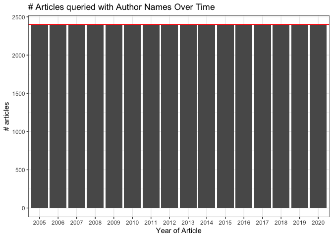
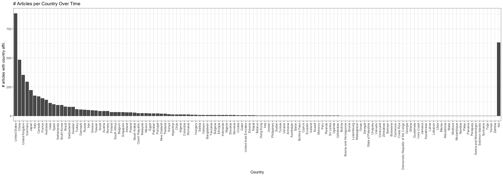
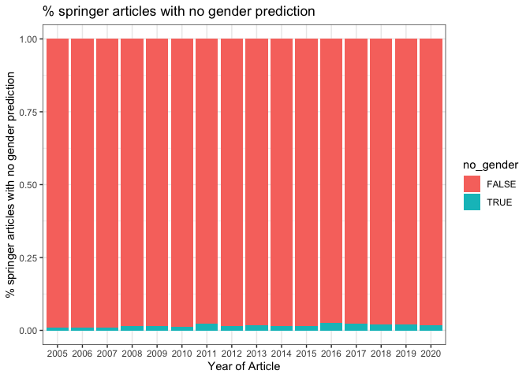
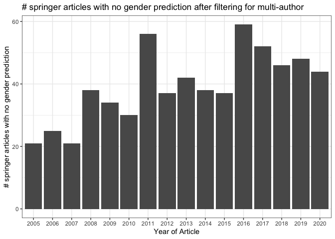

bg\_springer\_qc
================
Natalie Davidson
3/29/2021

## Overview

This notebook will QC the background Springer articles. The method of getting the Springer articles are to: **1)** get author names from a random selection of articles. 200 articles per month, from 2005-2020. **2)** From these random articles, take a subset in order to get the author affiliation information. The query for author affiliation is only a per country sum over the articles, so unlike the author names were we can get the information of 50 articles per API call, to get country affiliations we can only do 1 API call per article. This forces us to have less articles with country affiliations. **3)** From the author names in step 1 we predict gender. **4)** From the countries in step 2, we standardize the country names.

The specific files for each step of the pipeline:

1.  author information from the randomly chosen Springer articles: `/data/reference_data/springer_bg_author_cache.tsv`

2.  author countries from a random subset of articles from step 1: `/data/reference_data/springer_random_country_cache.tsv`

3.  gender predictions: `/data/author_data/springer_author_gender.tsv`

4.  location predictions: `data/author_data/all_author_country.tsv`

## Pipeline Step 1: Author Names from API

``` r
# read in the API responses from springer
pipeline_1_file = file.path(proj_dir,
                    "/data/reference_data/springer_bg_author_cache.tsv")
author_name_df = fread(pipeline_1_file)


# plot number of articles selected
ggplot(unique(author_name_df[,c("doi", "year", "month")]), aes(x=as.factor(year))) +
    geom_bar() + theme_bw() + geom_hline(yintercept = 2400, color="red") +
    xlab("Year of Article") + ylab("# articles") +
        ggtitle("# Articles queried with Author Names Over Time")
```



``` r
# get duplicated articles if they exist
dup_dois = author_name_df$doi[duplicated(author_name_df$doi)]
print(paste("#duplicated DOIs:", length(dup_dois)))
```

    ## [1] "#duplicated DOIs: 0"

## Pipeline Step 2: Country affiliation from API

``` r
# read in the country API responses from springer
pipeline_2_file = file.path(proj_dir,
                    "/data/reference_data/springer_random_country_cache.tsv")
country_df = fread(pipeline_2_file)

# plot number of articles selected
ggplot(unique(country_df[,c("doi", "year")]), aes(x=as.factor(year))) +
    geom_bar() + theme_bw() + geom_hline(yintercept = 250, color="red") +
    xlab("Year of Article") + ylab("# articles") +
        ggtitle("# Articles queried with Country Info Over Time")
```


``` r
# get duplicated articles if they exist
dup_dois = country_df$doi[duplicated(author_name_df$doi)]
print(paste("#duplicated DOIs:", length(dup_dois)))
```

    ## [1] "#duplicated DOIs: 0"

``` r
# plot citations by country
country_order = names(sort(table(country_df$country), decreasing = T))
country_df$country = factor(country_df$country, levels=country_order)
plot_country_df = unique(subset(country_df, select=c("doi", "country")))
ggplot(plot_country_df, aes(x=country)) +
    geom_bar() + theme_bw() +
    xlab("Country") + ylab("# articles with country affil.") +
    theme(axis.text.x = element_text(angle = 90, vjust = 0.5, hjust=1)) +
        ggtitle("# Articles per Country Over Time")
```



## Pipeline Step 3: Gender Predictions

### Analyze springer API results on scraped data

``` r
# read in the gender predictions
pipeline_3_file = file.path(proj_dir,
                    "/data/author_data/springer_author_gender.tsv")
gender_res = fread(pipeline_3_file)


# check if all files were analyzed
authored_df = author_name_df

# files authored but have no gender prediction
gender_missing = gender_res$doi[which(is.na(gender_res$gender))]
gender_present = gender_res$doi[which(!is.na(gender_res$gender))]
gender_missing = setdiff(gender_missing, gender_present)
authored_df$no_gender = FALSE
authored_df$no_gender[which(authored_df$doi %in% gender_missing)] = TRUE
print(paste("% of DOIs with no gender prediction:", 
            sum(authored_df$no_gender)/length(unique(authored_df$doi))))
```

    ## [1] "% of DOIs with no gender prediction: 0.0163541666666667"

``` r
# plot number of springer articles with no gender prediction
ggplot(unique(authored_df[,c("doi", "year", "no_gender")]), 
       aes(x=as.factor(year), fill=no_gender)) +
        geom_bar(position="fill") + theme_bw() +
        xlab("Year of Article") + ylab("% springer articles with no gender prediction") +
            ggtitle("% springer articles with no gender prediction")
```



``` r
# single author publications are ignored, so remove them
authored_df = unique(authored_df)
no_gender_authored_df = subset(authored_df, no_gender == TRUE)
num_author = lapply(no_gender_authored_df$authors, function(x) length(grep(";", x))+1)
no_gender_authored_df = no_gender_authored_df[which(num_author > 1),]
print(paste("% of DOIs with no gender prediction after filtering single author pubs:", 
            nrow(no_gender_authored_df)/length(unique(authored_df$doi))))
```

    ## [1] "% of DOIs with no gender prediction after filtering single author pubs: 0.0163541666666667"

``` r
# plot number of springer articles with no gender prediction
ggplot(unique(no_gender_authored_df[,c("doi", "year")]), 
       aes(x=as.factor(year))) +
        geom_bar() + theme_bw() +
        xlab("Year of Article") + ylab("# springer articles with no gender prediction") +
            ggtitle("# springer articles with no gender prediction after filtering for multi-author")
```



``` r
# now the remaining should all be abreviated first names
first_authors = unlist(lapply(no_gender_authored_df$authors, function(x) unlist(str_split(x, "; "))[1]))
first_authors = format_author_names(first_authors)
first_authors = first_authors[which(first_authors != "")]

last_authors = unlist(lapply(no_gender_authored_df$authors, function(x) rev(unlist(str_split(x, "; ")))[1]))
last_authors = format_author_names(last_authors)
last_authors = last_authors[which(last_authors != "")]

print(paste("% of DOIs with no first author gender prediction after filtering",
            "single author pubs + no filtering to full name pubs:", 
            length(first_authors)/length(unique(authored_df$doi))))
```

    ## [1] "% of DOIs with no first author gender prediction after filtering single author pubs + no filtering to full name pubs: 0.0144270833333333"

``` r
print(paste("These are some of the first author names that could not be identified:"))
```

    ## [1] "These are some of the first author names that could not be identified:"

``` r
print(first_authors[1:10])
```

    ##  [1] "Ji-Yan"   "Yoël"     "Te-Jen"   "Ubolthip" "Chen-Ou"  "Husheng" 
    ##  [7] "Wing-Sum" "Da-Long"  "Rômulo"   "Sen-Yung"

``` r
print(paste("% of DOIs with no last author gender prediction after filtering",
            "single author pubs + no filtering to full name pubs:", 
            length(last_authors)/length(unique(authored_df$doi))))
```

    ## [1] "% of DOIs with no last author gender prediction after filtering single author pubs + no filtering to full name pubs: 0.0146614583333333"

``` r
print(paste("These are some of the last author names that could not be identified:"))
```

    ## [1] "These are some of the last author names that could not be identified:"

``` r
print(last_authors[1:10])
```

    ##  [1] "HeHeGI"     "Yi-Xin"     "kConFab"    "Chui-Ze"    "Amitinder" 
    ##  [6] "Dhanjoo"    "Qing-Hua"   "Zheng-Rong" "Ierecê"     "Shiu-Feng"

## Pipeline Step 4: Country Predictions

### Check country predictions on springer API results on scraped data

``` r
# read in the Nature country predictions
pipeline_4_file = file.path(proj_dir,
                    "/data/author_data/all_author_country.tsv")
country_res = fread(pipeline_4_file)
country_res = subset(country_res, corpus == "springer_articles")

# check if all files were analyzed
# files authored but have no country prediction
# first subset to only countries that are not blank or NA
country_df = subset(country_df, country != "" & !is.na(country))
file_missing = setdiff(unique(country_df$doi), unique(country_res$file_id))
country_df$no_country = FALSE
country_df$no_country[which(country_df$doi %in% file_missing)] = TRUE
print(paste("% of DOIs with no country prediction:", 
            length(file_missing)/length(unique(country_df$doi))))
```

    ## [1] "% of DOIs with no country prediction: 0"
