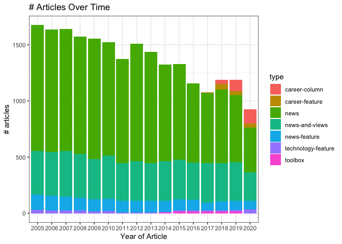
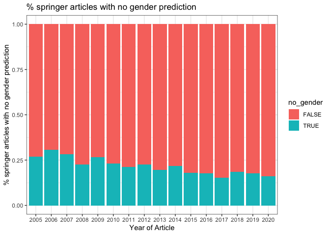

citation\_qc
================
Natalie Davidson
3/26/2021

## Overview

This notebook will QC the citations scraped from Nature News articles. This analysis looks at 3 steps of a pipeline 1. raw scraped data: `/data/doi_data/downloads/` 2. springer API calls on scraped data: `/data/reference_data/springer_cited_author_cache.tsv` 3. gender predictions from Springer API response: `/data/author_data/cited_author_gender.tsv` 4. location predictions from Springer API response: `data/author_data/cited_author_country.tsv`

## Pipeline Step 1: Citation Scrapes

### Read in the scraped DOIs

``` r
# read in the scraped citations from nature news articles for each year
pipeline_1_dir = paste(proj_dir,
                    "/data/doi_data/downloads/", sep="")
pipeline_1_files = list.files(pipeline_1_dir, full.names = T)

all_doi = NA
for(curr_file in pipeline_1_files){
    
    curr_df = read_json(curr_file)
    
    # if the json file was empty, skip
    if(all(is.na(curr_df))){
        next
    }
    
    # split the dois into multiple rows
    curr_df = separate_rows(curr_df, dois, sep=", ")
    
    # get the file info
    file_name_year = substring(basename(curr_file), 
                            15, 18)
    file_name_type = substring(basename(curr_file), 
                            20, nchar(basename(curr_file))-5)
    curr_df$year = file_name_year
    curr_df$type = file_name_type

    all_doi = rbind(all_doi, curr_df)
    
}
all_doi = all_doi[-1,]
colnames(all_doi)[which(colnames(all_doi) == "dois")] = "doi"

# plot number of articles scraped
ggplot(unique(all_doi[,c("file_id", "year", "type")]), aes(x=as.factor(year), fill=type)) +
    geom_bar(position="stack") + theme_bw() +
    xlab("Year of Article") + ylab("# articles") +
        ggtitle("# Articles Over Time")
```



### Plot statistics of articles with DOIs

``` r
# make a version of DOI tracking with just a marker saying if it does or does not have citations
doi_exists_df = subset(all_doi, select=c("file_id", "year", "type"))
doi_exists_df$has_citation = TRUE
doi_exists_df$has_citation[all_doi$doi == ""] = FALSE
doi_exists_df = unique(doi_exists_df)

# for each type, plot the breakdown of articles with and without citations
for(curr_type in unique(all_doi$type)){
    
    print(curr_type)
    
    curr_type_df = subset(doi_exists_df, type == curr_type)
    gg = ggplot(curr_type_df, aes(x=as.factor(year), fill=has_citation)) +
                geom_bar(position="stack") + theme_bw() +
                xlab("Year of Article") + 
                ylab("# of Articles with Citation") +
                ggtitle(paste(curr_type, "# of Articles with Citation"))
    print(gg)
    
    gg = ggplot(curr_type_df, aes(x=as.factor(year), fill=has_citation)) +
                geom_bar(position="fill") + theme_bw() +
                xlab("Year of Article") + 
                ylab("Prop. of Articles with Citation") +
                ggtitle(paste(curr_type, "Prop. of Articles with Citation"))
    print(gg)

    
}
```

    ## [1] "news-and-views"


    ## [1] "news-feature"


    ## [1] "news"


    ## [1] "technology-feature"


    ## [1] "toolbox"


    ## [1] "career-column"


    ## [1] "career-feature"


## Pipeline Step 2: Citation Scrapes

### Analyze springer API results on scraped data

``` r
# read in the springer API results
pipeline_2_file = file.path(proj_dir,
                    "/data/reference_data/springer_cited_author_cache.tsv")
springer_res = fread(pipeline_2_file)

# format the doi's so they match what is queried into Springer
all_doi$doi = unlist(lapply(all_doi$doi, process_dois))
springer_full_res = merge(all_doi, springer_res[,c("doi", "publisher")], all.x=T, by="doi")


# plot number of cited articles with springer API response
springer_article_df = na.omit(springer_full_res[,c("doi", "file_id", "year", "type")])
springer_article_df  = subset(springer_article_df, doi != "")
ggplot(unique(springer_article_df[,c("file_id", "year", "type")]), 
       aes(x=as.factor(year), fill=type)) +
        geom_bar(position="stack") + theme_bw() +
        xlab("Year of Article") + ylab("# articles with at least 1 citation in Springer") +
            ggtitle("# Articles with Springer Citation Over Time")
```


### Plot statistics of articles with **Springer** DOIs

``` r
# make a version of DOI tracking with a marker if it has a citation and if it is a springer citation
doi_springer_df = subset(springer_full_res, select=c("file_id", "year", "type", "doi", "publisher"))
doi_springer_df$citation_status = "non_springer_citation"
doi_springer_df$citation_status[doi_springer_df$doi != ""] = "has_citation"
doi_springer_df$citation_status[!is.na(doi_springer_df$publisher)] = "springer"
doi_springer_df = unique(doi_springer_df)

# for each type, plot the breakdown of articles with and without citations
for(curr_type in unique(doi_springer_df$type)){
    
    print(curr_type)
    
    curr_type_df = subset(doi_springer_df, type == curr_type)
    gg = ggplot(curr_type_df, aes(x=as.factor(year), fill=citation_status)) +
                geom_bar(position="stack") + theme_bw() +
                xlab("Year of Article") + 
                ylab("# of Articles with Citation") +
                ggtitle(paste(curr_type, "# of Articles with Citation"))
    print(gg)
    
    gg = ggplot(curr_type_df, aes(x=as.factor(year), fill=citation_status)) +
                geom_bar(position="fill") + theme_bw() +
                xlab("Year of Article") + 
                ylab("Prop. of Articles with Citation") +
                ggtitle(paste(curr_type, "Prop. of Articles with Citation"))
    print(gg)

    
}
```

    ## [1] "news-and-views"


    ## [1] "news-feature"


    ## [1] "news"


    ## [1] "technology-feature"


    ## [1] "career-column"


    ## [1] "toolbox"


    ## [1] "career-feature"


## Pipeline Step 3: Gender Predictions

### Check gender predictions on springer API results on scraped data

``` r
# read in the springer API results
pipeline_3_file = file.path(proj_dir,
                    "/data/author_data/cited_author_gender.tsv")
gender_res = fread(pipeline_3_file)


# check if all files were analyzed
authored_df = subset(springer_full_res, !is.na(publisher) & doi != "")

# files authored but have no gender prediction
gender_missing = setdiff(unique(authored_df$doi), unique(gender_res$doi))
authored_df$no_gender = FALSE
authored_df$no_gender[which(authored_df$doi %in% gender_missing)] = TRUE
print(paste("% of DOIs with no gender prediction:", 
            length(gender_missing)/length(unique(authored_df$doi))))
```

    ## [1] "% of DOIs with no gender prediction: 0.209729873232893"

``` r
# plot number of springer articles with no gender prediction
ggplot(unique(authored_df[,c("doi", "year", "no_gender")]), 
       aes(x=as.factor(year), fill=no_gender)) +
        geom_bar(position="fill") + theme_bw() +
        xlab("Year of Article") + ylab("% springer articles with no gender prediction") +
            ggtitle("% springer articles with no gender prediction")
```



``` r
# single author publications are ignored, so remove them
authored_df = merge(authored_df, springer_res[,c("doi", "authors")])
authored_df = unique(authored_df)
no_gender_authored_df = subset(authored_df, no_gender == TRUE)
num_author = lapply(no_gender_authored_df$authors, function(x) length(grep(";", x))+1)
no_gender_authored_df = no_gender_authored_df[which(num_author > 1),]
print(paste("% of DOIs with no gender prediction after filtering single author pubs:", 
            nrow(no_gender_authored_df)/length(unique(authored_df$doi))))
```

    ## [1] "% of DOIs with no gender prediction after filtering single author pubs: 0.171567000730072"

``` r
# plot number of springer articles with no gender prediction
ggplot(unique(no_gender_authored_df[,c("doi", "year")]), 
       aes(x=as.factor(year))) +
        geom_bar() + theme_bw() +
        xlab("Year of Article") + ylab("% springer articles with no gender prediction") +
            ggtitle("% springer articles with no gender prediction after filtering for multi-author")
```


``` r
# now the remaining should all be abreviated first names
first_authors = unlist(lapply(no_gender_authored_df$authors, function(x) unlist(str_split(x, "; "))[1]))
first_authors = format_author_firstnames(first_authors)
first_authors = first_authors[which(first_authors != "")]

last_authors = unlist(lapply(no_gender_authored_df$authors, function(x) rev(unlist(str_split(x, "; ")))[1]))
last_authors = format_author_firstnames(last_authors)
last_authors = last_authors[which(last_authors != "")]

print(paste("% of DOIs with no first author gender prediction after filtering
            single author pubs + no filtering to full name pubs:", 
            length(first_authors)/length(unique(authored_df$doi))))
```

    ## [1] "% of DOIs with no first author gender prediction after filtering\n            single author pubs + no filtering to full name pubs: 0"

``` r
print(paste("% of DOIs with no last author gender prediction after filtering
            single author pubs + no filtering to full name pubs:", 
            length(last_authors)/length(unique(authored_df$doi))))
```

    ## [1] "% of DOIs with no last author gender prediction after filtering\n            single author pubs + no filtering to full name pubs: 0"

## Pipeline Step 4: Country Predictions

### Check country predictions on springer API results on scraped data

``` r
# read in the springer API results
pipeline_4_file = file.path(proj_dir,
                    "/data/author_data/cited_author_country.tsv")
country_res = fread(pipeline_4_file)


# check if all files were analyzed
authored_df = subset(springer_full_res, !is.na(publisher) & doi != "")

# files authored but have no country prediction
file_missing = setdiff(unique(authored_df$file_id), unique(country_res$file_id))
authored_df$no_country = FALSE
authored_df$no_country[which(authored_df$file_id %in% file_missing)] = TRUE
print(paste("% of DOIs with no country prediction:", 
            length(file_missing)/length(unique(authored_df$file_id))))
```

    ## [1] "% of DOIs with no country prediction: 0"
