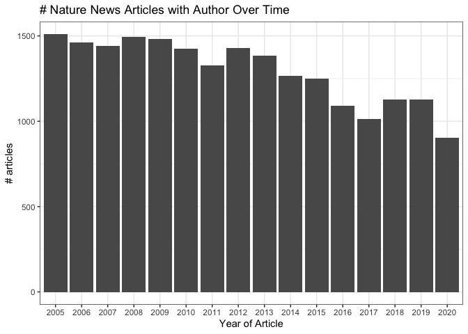
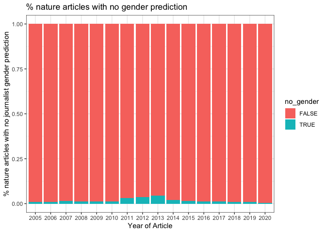
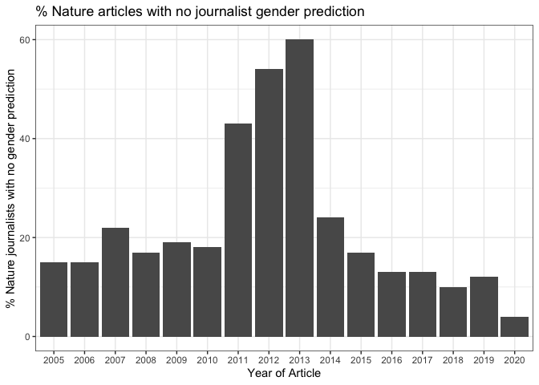
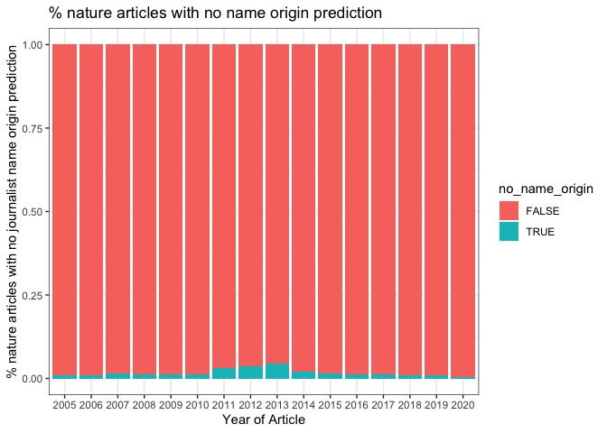
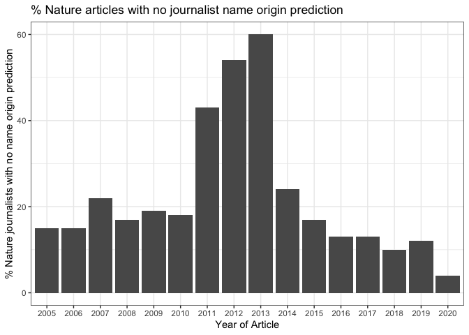

bg\_nature\_qc
================
Natalie Davidson
3/29/2021

## Overview

This notebook will QC the scraped journalisr information from nature news articles

1.  raw scraped data: `/data/journalist_data/downloads`

2.  gender predictions : `/data/author_data/nature_journo_gender.tsv`

3.  name origin: `/data/author_data/all_author_fullname_pred.tsv`

## Pipeline Step 1: Author Information Scrapes

### Read in the scraped info

``` r
# read in the scraped citations from nature news articles for each year
pipeline_1_dir = file.path(proj_dir, "/data/journalist_data//")
pipeline_1_files = list.files(pipeline_1_dir, full.names = T)

# read in the scraped journalists info from nature news articles for each year
pipeline_1_dir = file.path(proj_dir, "/data/journalist_data/")
pipeline_1_files = list.files(pipeline_1_dir, pattern=".tsv", full.names = TRUE)

all_authors = NA
for(curr_file in pipeline_1_files){

    print(curr_file)
    
    curr_type = substr(basename(curr_file), 19, nchar(basename(curr_file))-4)

    # skip empty files
    if(file.info(curr_file)$size == 0){
        next
    }
    
    res_df = data.frame(fread(curr_file))
    res_df = subset(res_df, authors != "")
    res_df$type = curr_type

    # make df
    authors_df = res_df[,c("file_id", "year", "authors", "type")]
    all_authors = rbind(all_authors, authors_df)

}
```

    ## [1] "/Users/natalie/Documents/projects/greenelab/checkouts/nature_news_disparities//data/journalist_data//journo_table_2005_news-and-views.tsv"
    ## [1] "/Users/natalie/Documents/projects/greenelab/checkouts/nature_news_disparities//data/journalist_data//journo_table_2005_news-feature.tsv"
    ## [1] "/Users/natalie/Documents/projects/greenelab/checkouts/nature_news_disparities//data/journalist_data//journo_table_2005_news.tsv"
    ## [1] "/Users/natalie/Documents/projects/greenelab/checkouts/nature_news_disparities//data/journalist_data//journo_table_2005_technology-feature.tsv"
    ## [1] "/Users/natalie/Documents/projects/greenelab/checkouts/nature_news_disparities//data/journalist_data//journo_table_2006_news-and-views.tsv"
    ## [1] "/Users/natalie/Documents/projects/greenelab/checkouts/nature_news_disparities//data/journalist_data//journo_table_2006_news-feature.tsv"
    ## [1] "/Users/natalie/Documents/projects/greenelab/checkouts/nature_news_disparities//data/journalist_data//journo_table_2006_news.tsv"
    ## [1] "/Users/natalie/Documents/projects/greenelab/checkouts/nature_news_disparities//data/journalist_data//journo_table_2006_technology-feature.tsv"
    ## [1] "/Users/natalie/Documents/projects/greenelab/checkouts/nature_news_disparities//data/journalist_data//journo_table_2007_news-and-views.tsv"
    ## [1] "/Users/natalie/Documents/projects/greenelab/checkouts/nature_news_disparities//data/journalist_data//journo_table_2007_news-feature.tsv"
    ## [1] "/Users/natalie/Documents/projects/greenelab/checkouts/nature_news_disparities//data/journalist_data//journo_table_2007_news.tsv"
    ## [1] "/Users/natalie/Documents/projects/greenelab/checkouts/nature_news_disparities//data/journalist_data//journo_table_2007_technology-feature.tsv"
    ## [1] "/Users/natalie/Documents/projects/greenelab/checkouts/nature_news_disparities//data/journalist_data//journo_table_2008_news-and-views.tsv"
    ## [1] "/Users/natalie/Documents/projects/greenelab/checkouts/nature_news_disparities//data/journalist_data//journo_table_2008_news-feature.tsv"
    ## [1] "/Users/natalie/Documents/projects/greenelab/checkouts/nature_news_disparities//data/journalist_data//journo_table_2008_news.tsv"
    ## [1] "/Users/natalie/Documents/projects/greenelab/checkouts/nature_news_disparities//data/journalist_data//journo_table_2008_technology-feature.tsv"
    ## [1] "/Users/natalie/Documents/projects/greenelab/checkouts/nature_news_disparities//data/journalist_data//journo_table_2009_news-and-views.tsv"
    ## [1] "/Users/natalie/Documents/projects/greenelab/checkouts/nature_news_disparities//data/journalist_data//journo_table_2009_news-feature.tsv"
    ## [1] "/Users/natalie/Documents/projects/greenelab/checkouts/nature_news_disparities//data/journalist_data//journo_table_2009_news.tsv"
    ## [1] "/Users/natalie/Documents/projects/greenelab/checkouts/nature_news_disparities//data/journalist_data//journo_table_2009_technology-feature.tsv"
    ## [1] "/Users/natalie/Documents/projects/greenelab/checkouts/nature_news_disparities//data/journalist_data//journo_table_2010_news-and-views.tsv"
    ## [1] "/Users/natalie/Documents/projects/greenelab/checkouts/nature_news_disparities//data/journalist_data//journo_table_2010_news-feature.tsv"
    ## [1] "/Users/natalie/Documents/projects/greenelab/checkouts/nature_news_disparities//data/journalist_data//journo_table_2010_news.tsv"
    ## [1] "/Users/natalie/Documents/projects/greenelab/checkouts/nature_news_disparities//data/journalist_data//journo_table_2010_technology-feature.tsv"
    ## [1] "/Users/natalie/Documents/projects/greenelab/checkouts/nature_news_disparities//data/journalist_data//journo_table_2011_news-and-views.tsv"
    ## [1] "/Users/natalie/Documents/projects/greenelab/checkouts/nature_news_disparities//data/journalist_data//journo_table_2011_news-feature.tsv"
    ## [1] "/Users/natalie/Documents/projects/greenelab/checkouts/nature_news_disparities//data/journalist_data//journo_table_2011_news.tsv"
    ## [1] "/Users/natalie/Documents/projects/greenelab/checkouts/nature_news_disparities//data/journalist_data//journo_table_2011_technology-feature.tsv"
    ## [1] "/Users/natalie/Documents/projects/greenelab/checkouts/nature_news_disparities//data/journalist_data//journo_table_2012_news-and-views.tsv"
    ## [1] "/Users/natalie/Documents/projects/greenelab/checkouts/nature_news_disparities//data/journalist_data//journo_table_2012_news-feature.tsv"
    ## [1] "/Users/natalie/Documents/projects/greenelab/checkouts/nature_news_disparities//data/journalist_data//journo_table_2012_news.tsv"
    ## [1] "/Users/natalie/Documents/projects/greenelab/checkouts/nature_news_disparities//data/journalist_data//journo_table_2012_technology-feature.tsv"
    ## [1] "/Users/natalie/Documents/projects/greenelab/checkouts/nature_news_disparities//data/journalist_data//journo_table_2013_news-and-views.tsv"
    ## [1] "/Users/natalie/Documents/projects/greenelab/checkouts/nature_news_disparities//data/journalist_data//journo_table_2013_news-feature.tsv"
    ## [1] "/Users/natalie/Documents/projects/greenelab/checkouts/nature_news_disparities//data/journalist_data//journo_table_2013_news.tsv"
    ## [1] "/Users/natalie/Documents/projects/greenelab/checkouts/nature_news_disparities//data/journalist_data//journo_table_2013_technology-feature.tsv"
    ## [1] "/Users/natalie/Documents/projects/greenelab/checkouts/nature_news_disparities//data/journalist_data//journo_table_2014_news-and-views.tsv"
    ## [1] "/Users/natalie/Documents/projects/greenelab/checkouts/nature_news_disparities//data/journalist_data//journo_table_2014_news-feature.tsv"
    ## [1] "/Users/natalie/Documents/projects/greenelab/checkouts/nature_news_disparities//data/journalist_data//journo_table_2014_news.tsv"
    ## [1] "/Users/natalie/Documents/projects/greenelab/checkouts/nature_news_disparities//data/journalist_data//journo_table_2014_technology-feature.tsv"
    ## [1] "/Users/natalie/Documents/projects/greenelab/checkouts/nature_news_disparities//data/journalist_data//journo_table_2014_toolbox.tsv"
    ## [1] "/Users/natalie/Documents/projects/greenelab/checkouts/nature_news_disparities//data/journalist_data//journo_table_2015_news-and-views.tsv"
    ## [1] "/Users/natalie/Documents/projects/greenelab/checkouts/nature_news_disparities//data/journalist_data//journo_table_2015_news-feature.tsv"
    ## [1] "/Users/natalie/Documents/projects/greenelab/checkouts/nature_news_disparities//data/journalist_data//journo_table_2015_news.tsv"
    ## [1] "/Users/natalie/Documents/projects/greenelab/checkouts/nature_news_disparities//data/journalist_data//journo_table_2015_technology-feature.tsv"
    ## [1] "/Users/natalie/Documents/projects/greenelab/checkouts/nature_news_disparities//data/journalist_data//journo_table_2015_toolbox.tsv"
    ## [1] "/Users/natalie/Documents/projects/greenelab/checkouts/nature_news_disparities//data/journalist_data//journo_table_2016_news-and-views.tsv"
    ## [1] "/Users/natalie/Documents/projects/greenelab/checkouts/nature_news_disparities//data/journalist_data//journo_table_2016_news-feature.tsv"
    ## [1] "/Users/natalie/Documents/projects/greenelab/checkouts/nature_news_disparities//data/journalist_data//journo_table_2016_news.tsv"
    ## [1] "/Users/natalie/Documents/projects/greenelab/checkouts/nature_news_disparities//data/journalist_data//journo_table_2016_technology-feature.tsv"
    ## [1] "/Users/natalie/Documents/projects/greenelab/checkouts/nature_news_disparities//data/journalist_data//journo_table_2016_toolbox.tsv"
    ## [1] "/Users/natalie/Documents/projects/greenelab/checkouts/nature_news_disparities//data/journalist_data//journo_table_2017_career-column.tsv"
    ## [1] "/Users/natalie/Documents/projects/greenelab/checkouts/nature_news_disparities//data/journalist_data//journo_table_2017_career-feature.tsv"
    ## [1] "/Users/natalie/Documents/projects/greenelab/checkouts/nature_news_disparities//data/journalist_data//journo_table_2017_news-and-views.tsv"
    ## [1] "/Users/natalie/Documents/projects/greenelab/checkouts/nature_news_disparities//data/journalist_data//journo_table_2017_news-feature.tsv"
    ## [1] "/Users/natalie/Documents/projects/greenelab/checkouts/nature_news_disparities//data/journalist_data//journo_table_2017_news.tsv"
    ## [1] "/Users/natalie/Documents/projects/greenelab/checkouts/nature_news_disparities//data/journalist_data//journo_table_2017_technology-feature.tsv"
    ## [1] "/Users/natalie/Documents/projects/greenelab/checkouts/nature_news_disparities//data/journalist_data//journo_table_2017_toolbox.tsv"
    ## [1] "/Users/natalie/Documents/projects/greenelab/checkouts/nature_news_disparities//data/journalist_data//journo_table_2018_career-column.tsv"
    ## [1] "/Users/natalie/Documents/projects/greenelab/checkouts/nature_news_disparities//data/journalist_data//journo_table_2018_career-feature.tsv"
    ## [1] "/Users/natalie/Documents/projects/greenelab/checkouts/nature_news_disparities//data/journalist_data//journo_table_2018_news-and-views.tsv"
    ## [1] "/Users/natalie/Documents/projects/greenelab/checkouts/nature_news_disparities//data/journalist_data//journo_table_2018_news-feature.tsv"
    ## [1] "/Users/natalie/Documents/projects/greenelab/checkouts/nature_news_disparities//data/journalist_data//journo_table_2018_news.tsv"
    ## [1] "/Users/natalie/Documents/projects/greenelab/checkouts/nature_news_disparities//data/journalist_data//journo_table_2018_technology-feature.tsv"
    ## [1] "/Users/natalie/Documents/projects/greenelab/checkouts/nature_news_disparities//data/journalist_data//journo_table_2018_toolbox.tsv"
    ## [1] "/Users/natalie/Documents/projects/greenelab/checkouts/nature_news_disparities//data/journalist_data//journo_table_2019_career-column.tsv"
    ## [1] "/Users/natalie/Documents/projects/greenelab/checkouts/nature_news_disparities//data/journalist_data//journo_table_2019_career-feature.tsv"
    ## [1] "/Users/natalie/Documents/projects/greenelab/checkouts/nature_news_disparities//data/journalist_data//journo_table_2019_news-and-views.tsv"
    ## [1] "/Users/natalie/Documents/projects/greenelab/checkouts/nature_news_disparities//data/journalist_data//journo_table_2019_news-feature.tsv"
    ## [1] "/Users/natalie/Documents/projects/greenelab/checkouts/nature_news_disparities//data/journalist_data//journo_table_2019_news.tsv"
    ## [1] "/Users/natalie/Documents/projects/greenelab/checkouts/nature_news_disparities//data/journalist_data//journo_table_2019_technology-feature.tsv"
    ## [1] "/Users/natalie/Documents/projects/greenelab/checkouts/nature_news_disparities//data/journalist_data//journo_table_2019_toolbox.tsv"
    ## [1] "/Users/natalie/Documents/projects/greenelab/checkouts/nature_news_disparities//data/journalist_data//journo_table_2020_career-column.tsv"
    ## [1] "/Users/natalie/Documents/projects/greenelab/checkouts/nature_news_disparities//data/journalist_data//journo_table_2020_career-feature.tsv"
    ## [1] "/Users/natalie/Documents/projects/greenelab/checkouts/nature_news_disparities//data/journalist_data//journo_table_2020_news-and-views.tsv"
    ## [1] "/Users/natalie/Documents/projects/greenelab/checkouts/nature_news_disparities//data/journalist_data//journo_table_2020_news-feature.tsv"
    ## [1] "/Users/natalie/Documents/projects/greenelab/checkouts/nature_news_disparities//data/journalist_data//journo_table_2020_news.tsv"
    ## [1] "/Users/natalie/Documents/projects/greenelab/checkouts/nature_news_disparities//data/journalist_data//journo_table_2020_technology-feature.tsv"

``` r
all_authors = all_authors[-1,]

# split up all the journalist names
author_df_split = separate_rows(all_authors, "authors",sep = "; ")
author_df_split = subset(author_df_split, authors != "")


# format file_id into a doi
all_authors$doi = paste("doi:10.1038/", all_authors$file_id, sep="")

# plot number of articles scraped
ggplot(unique(all_authors[,c("file_id", "year")]), aes(x=as.factor(year))) +
    geom_bar() + theme_bw() +
    xlab("Year of Article") + ylab("# articles") +
        ggtitle("# Nature News Articles with Author Over Time")
```



## Pipeline Step 2: Gender Predictions

### Check if gender predictions were done on all scraped data

``` r
# read in the scraped nature data
pipeline_2_file = file.path(proj_dir,
                    "/data/author_data/nature_journo_gender.tsv")
gender_res = fread(pipeline_2_file)

authored_df = all_authors

# files scraped but have no gender prediction
gender_missing = setdiff(unique(all_authors$doi), unique(gender_res$doi))
authored_df$no_gender = FALSE
authored_df$no_gender[which(authored_df$doi %in% gender_missing)] = TRUE
print(paste("% of DOIs with no gender prediction:", 
            length(gender_missing)/length(unique(authored_df$doi))))
```

    ## [1] "% of DOIs with no gender prediction: 0.0171764932934478"

``` r
# plot number of nature articles with no gender prediction
ggplot(unique(authored_df[,c("doi", "year", "no_gender")]), 
       aes(x=as.factor(year), fill=no_gender)) +
        geom_bar(position="fill") + theme_bw() +
        xlab("Year of Article") + ylab("% nature articles with no journalist gender prediction") +
            ggtitle("% nature articles with no gender prediction")
```



``` r
authored_df = unique(authored_df)
no_gender_authored_df = subset(authored_df, no_gender == TRUE)
print(paste("% of articles with no gender prediction:", 
            nrow(no_gender_authored_df)/length(unique(authored_df$doi))))
```

    ## [1] "% of articles with no gender prediction: 0.0171764932934478"

``` r
# plot number of Nature articles with no gender prediction
ggplot(unique(no_gender_authored_df[,c("doi", "year")]), 
       aes(x=as.factor(year))) +
        geom_bar() + theme_bw() +
        xlab("Year of Article") + ylab("% Nature journalists with no gender prediction") +
            ggtitle("% Nature articles with no journalist gender prediction")
```



## Pipeline Step 3: Name Origin Predictions

### Check if name origin predictions were done on all scraped data

``` r
# read in the author name data
name_pred_file = file.path(proj_dir, 
                         "/data/author_data/all_author_fullname_pred.tsv")
name_info_file = file.path(proj_dir, 
                         "/data/author_data/all_author_fullname.tsv")
bg_name_df = read_name_origin(name_pred_file, name_info_file)
bg_name_df$name_origin[bg_name_df$name_origin == "Jewish"] = "Hebrew"
journo_name_df = subset(bg_name_df, corpus == "nature_journo")

authored_df = all_authors

# files scraped but have no name origin prediction
origin_missing = setdiff(unique(all_authors$doi), unique(journo_name_df$doi))
authored_df$no_name_origin = FALSE
authored_df$no_name_origin[which(authored_df$doi %in% origin_missing)] = TRUE
print(paste("% of DOIs with no name origin prediction:", 
            length(origin_missing)/length(unique(authored_df$doi))))
```

    ## [1] "% of DOIs with no name origin prediction: 0.0171764932934478"

``` r
# plot number of nature articles with no name origin prediction
ggplot(unique(authored_df[,c("doi", "year", "no_name_origin")]), 
       aes(x=as.factor(year), fill=no_name_origin)) +
        geom_bar(position="fill") + theme_bw() +
        xlab("Year of Article") + ylab("% nature articles with no journalist name origin prediction") +
            ggtitle("% nature articles with no name origin prediction")
```



``` r
authored_df = unique(authored_df)
no_name_origin_authored_df = subset(authored_df, no_name_origin == TRUE)
print(paste("% of articles with no name origin prediction:", 
            nrow(no_name_origin_authored_df)/length(unique(authored_df$doi))))
```

    ## [1] "% of articles with no name origin prediction: 0.0171764932934478"

``` r
# plot number of Nature articles with no name origin prediction
ggplot(unique(no_name_origin_authored_df[,c("doi", "year")]), 
       aes(x=as.factor(year))) +
        geom_bar() + theme_bw() +
        xlab("Year of Article") + ylab("% Nature journalists with no name origin prediction") +
            ggtitle("% Nature articles with no journalist name origin prediction")
```


