pipeline\_qc
================
Natalie Davidson
1/20/2021

## Nature News Pipeline QC

This document is for QC checking for each step of the pipeline. Here, we like to visualize and check statistics that should be stable across each article across all years. The data we will be working with are the following:

1.  Pipeline step 1, download data: `./data/scraped_data/downloads/links_crawled_YEAR.json`
2.  Pipeline step 2, process data into coreNLP readable: `./data/scraped_data/coreNLP_input_YEAR/*`
3.  Pipeline step 3, coreNLP output: `./data/scraped_data/coreNLP_output_YEAR/*`
4.  Pipeline step 4, processed coreNLP output: `./data/quote_table_raw_*.tsv` and `./data/location_table_raw_*.tsv`

**All analysis shown below depends on the functions described in `/analysis_scripts/analysis_utils.R`**

## QC pipeline step 1: Check scrapy output

Make sure there are no empty files. Count the number of files to make sure this is constant across all steps. Count the number of words in each article to compare down the entire pipeline.

#### plotting year level stats

Here we want to plot year level statistics to identify if there was a problem processing any of the years, or to identify trends in the data 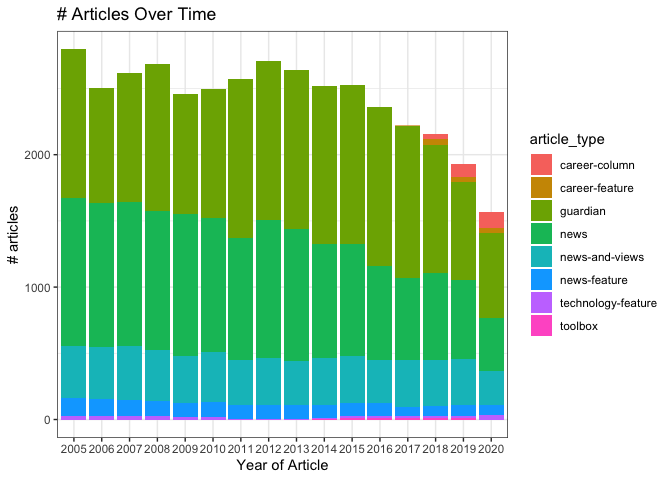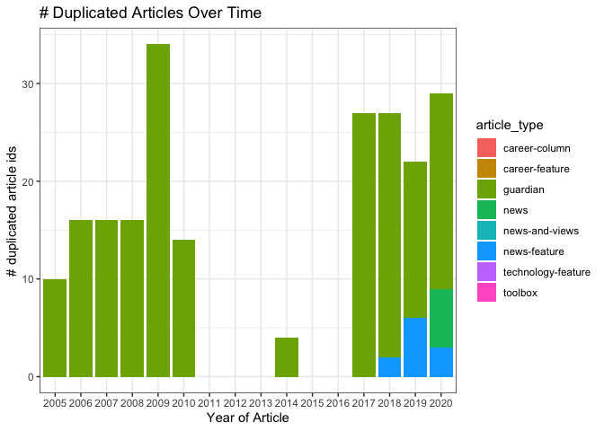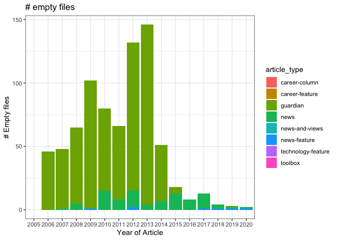

#### plotting article level stats

Now lets do a quick plot of article specific stats. So far in the pipeline, we only have the body of the text, so lets just plot that and make sure that it is consistent over time and there are no outliers.

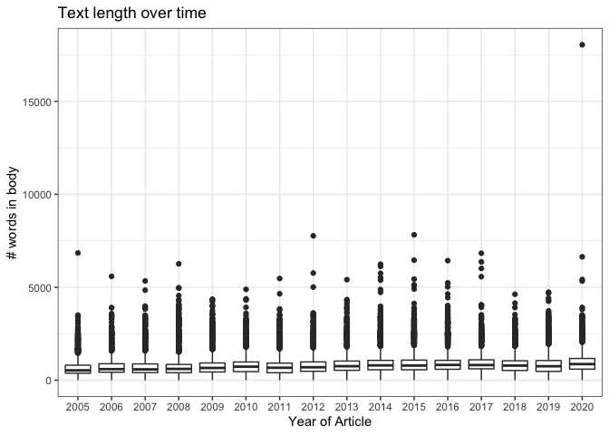

## QC pipeline step 2: Check processed scrapy output

    ## ### 2005 has a consistent number of articles
    ## ### 2005 has a consistent number of articles
    ## ### 2005 has a consistent number of articles
    ## ### 2005 has a consistent number of articles
    ## ### 2006 has a consistent number of articles
    ## ### 2006 has a consistent number of articles
    ## ### 2006 has a consistent number of articles
    ## ### 2006 has a consistent number of articles
    ## ### 2007 has a consistent number of articles
    ## ### 2007 has a consistent number of articles
    ## ### 2007 has a consistent number of articles
    ## ### 2007 has a consistent number of articles
    ## ### 2008 has a consistent number of articles
    ## ### 2008 has a consistent number of articles
    ## ### 2008 has a consistent number of articles
    ## ### 2008 has a consistent number of articles
    ## ### 2009 has a consistent number of articles
    ## ### 2009 has a consistent number of articles
    ## ### 2009 has a consistent number of articles
    ## ### 2009 has a consistent number of articles
    ## ### 2010 has a consistent number of articles
    ## ### 2010 has a consistent number of articles
    ## ### 2010 has a consistent number of articles
    ## ### 2010 has a consistent number of articles
    ## ### 2011 has a consistent number of articles
    ## ### 2011 has a consistent number of articles
    ## ### 2011 has a consistent number of articles
    ## ### 2011 has a consistent number of articles
    ## ### 2012 has a consistent number of articles
    ## ### 2012 has a consistent number of articles
    ## ### 2012 has a consistent number of articles
    ## ### 2012 has a consistent number of articles
    ## ### 2013 has a consistent number of articles
    ## ### 2013 has a consistent number of articles
    ## ### 2013 has a consistent number of articles
    ## ### 2013 has a consistent number of articles
    ## ### 2014 has a consistent number of articles
    ## ### 2014 has a consistent number of articles
    ## ### 2014 has a consistent number of articles
    ## ### 2014 has a consistent number of articles
    ## ### 2014 has a consistent number of articles
    ## ### 2015 has a consistent number of articles
    ## ### 2015 has a consistent number of articles
    ## ### 2015 has a consistent number of articles
    ## ### 2015 has a consistent number of articles
    ## ### 2015 has a consistent number of articles
    ## ### 2016 has a consistent number of articles
    ## ### 2016 has a consistent number of articles
    ## ### 2016 has a consistent number of articles
    ## ### 2016 has a consistent number of articles
    ## ### 2016 has a consistent number of articles
    ## ### 2017 has a consistent number of articles
    ## ### 2017 has a consistent number of articles
    ## ### 2017 has a consistent number of articles
    ## ### 2017 has a consistent number of articles
    ## ### 2017 has a consistent number of articles
    ## ### 2017 has a consistent number of articles
    ## ### 2017 has a consistent number of articles
    ## ### 2018 has a consistent number of articles
    ## ### 2018 has a consistent number of articles
    ## ### 2018 has a consistent number of articles
    ## ### 2018 has a consistent number of articles
    ## ### 2018 has a consistent number of articles
    ## ### 2018 has a consistent number of articles
    ## ### 2018 has a consistent number of articles
    ## ### 2019 has a consistent number of articles
    ## ### 2019 has a consistent number of articles
    ## ### 2019 has a consistent number of articles
    ## ### 2019 has a consistent number of articles
    ## ### 2019 has a consistent number of articles
    ## ### 2019 has a consistent number of articles
    ## ### 2019 has a consistent number of articles
    ## ### 2020 has a consistent number of articles
    ## ### 2020 has a consistent number of articles
    ## ### 2020 has a consistent number of articles
    ## ### 2020 has a consistent number of articles
    ## ### 2020 has a consistent number of articles
    ## ### 2020 has a consistent number of articles

#### plotting article level stats

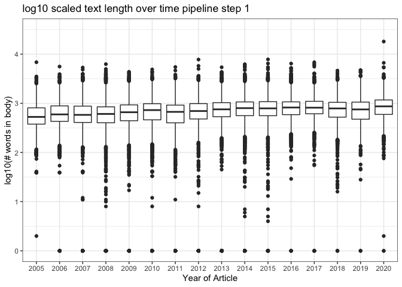

## QC pipeline step 3: Check coreNLP output

    ## [1] "2005"
    ## [1] "2005"
    ## [1] "2005"
    ## ### 2005 has a consistent number of articles
    ## [1] "2005"
    ## ### 2005 has a consistent number of articles
    ## [1] "2005"
    ## ### 2005 has a consistent number of articles
    ## [1] "2005"
    ## ### 2005 has a consistent number of articles
    ## [1] "2005"
    ## [1] "2006"
    ## [1] "2006"
    ## [1] "2006"
    ## ### 2006 has a consistent number of articles
    ## [1] "2006"
    ## ### 2006 has a consistent number of articles
    ## [1] "2006"
    ## ### 2006 has a consistent number of articles
    ## [1] "2006"
    ## ### 2006 has a consistent number of articles
    ## [1] "2006"
    ## [1] "2007"
    ## [1] "2007"
    ## [1] "2007"
    ## ### 2007 has a consistent number of articles
    ## [1] "2007"
    ## ### 2007 has a consistent number of articles
    ## [1] "2007"
    ## ### 2007 has a consistent number of articles
    ## [1] "2007"
    ## ### 2007 has a consistent number of articles
    ## [1] "2007"
    ## [1] "2008"
    ## [1] "2008"
    ## [1] "2008"
    ## ### 2008 has a consistent number of articles
    ## [1] "2008"
    ## ### 2008 has a consistent number of articles
    ## [1] "2008"
    ## ### 2008 has a consistent number of articles
    ## [1] "2008"
    ## ### 2008 has a consistent number of articles
    ## [1] "2008"
    ## [1] "2009"
    ## [1] "2009"
    ## [1] "2009"
    ## ### 2009 has a consistent number of articles
    ## [1] "2009"
    ## ### 2009 has a consistent number of articles
    ## [1] "2009"
    ## ### 2009 has a consistent number of articles
    ## [1] "2009"
    ## ### 2009 has a consistent number of articles
    ## [1] "2009"
    ## [1] "2010"
    ## [1] "2010"
    ## [1] "2010"
    ## ### 2010 has a consistent number of articles
    ## [1] "2010"
    ## ### 2010 has a consistent number of articles
    ## [1] "2010"
    ## ### 2010 has a consistent number of articles
    ## [1] "2010"
    ## ### 2010 has a consistent number of articles
    ## [1] "2010"
    ## [1] "2011"
    ## [1] "2011"
    ## [1] "2011"
    ## ### 2011 has a consistent number of articles
    ## [1] "2011"
    ## ### 2011 has a consistent number of articles
    ## [1] "2011"
    ## ### 2011 has a consistent number of articles
    ## [1] "2011"
    ## ### 2011 has a consistent number of articles
    ## [1] "2011"
    ## [1] "2012"
    ## [1] "2012"
    ## [1] "2012"
    ## ### 2012 has a consistent number of articles
    ## [1] "2012"
    ## ### 2012 has a consistent number of articles
    ## [1] "2012"
    ## ### 2012 has a consistent number of articles
    ## [1] "2012"
    ## ### 2012 has a consistent number of articles
    ## [1] "2012"
    ## [1] "2013"
    ## [1] "2013"
    ## [1] "2013"
    ## ### 2013 has a consistent number of articles
    ## [1] "2013"
    ## ### 2013 has a consistent number of articles
    ## [1] "2013"
    ## ### 2013 has a consistent number of articles
    ## [1] "2013"
    ## ### 2013 has a consistent number of articles
    ## [1] "2013"
    ## [1] "2014"
    ## [1] "2014"
    ## [1] "2014"
    ## ### 2014 has a consistent number of articles
    ## [1] "2014"
    ## ### 2014 has a consistent number of articles
    ## [1] "2014"
    ## ### 2014 has a consistent number of articles
    ## [1] "2014"
    ## ### 2014 has a consistent number of articles
    ## [1] "2014"
    ## ### 2014 has a consistent number of articles
    ## [1] "2015"
    ## [1] "2015"
    ## [1] "2015"
    ## ### 2015 has a consistent number of articles
    ## [1] "2015"
    ## ### 2015 has a consistent number of articles
    ## [1] "2015"
    ## ### 2015 has a consistent number of articles
    ## [1] "2015"
    ## ### 2015 has a consistent number of articles
    ## [1] "2015"
    ## ### 2015 has a consistent number of articles
    ## [1] "2016"
    ## [1] "2016"
    ## [1] "2016"
    ## ### 2016 has a consistent number of articles
    ## [1] "2016"
    ## ### 2016 has a consistent number of articles
    ## [1] "2016"
    ## ### 2016 has a consistent number of articles
    ## [1] "2016"
    ## ### 2016 has a consistent number of articles
    ## [1] "2016"
    ## ### 2016 has a consistent number of articles
    ## [1] "2017"
    ## ### 2017 has a consistent number of articles
    ## [1] "2017"
    ## ### 2017 has a consistent number of articles
    ## [1] "2017"
    ## ### 2017 has a consistent number of articles
    ## [1] "2017"
    ## ### 2017 has a consistent number of articles
    ## [1] "2017"
    ## ### 2017 has a consistent number of articles
    ## [1] "2017"
    ## ### 2017 has a consistent number of articles
    ## [1] "2017"
    ## ### 2017 has a consistent number of articles
    ## [1] "2018"
    ## ### 2018 has a consistent number of articles
    ## [1] "2018"
    ## ### 2018 has a consistent number of articles
    ## [1] "2018"
    ## ### 2018 has a consistent number of articles
    ## [1] "2018"
    ## ### 2018 has a consistent number of articles
    ## [1] "2018"
    ## ### 2018 has a consistent number of articles
    ## [1] "2018"
    ## ### 2018 has a consistent number of articles
    ## [1] "2018"
    ## ### 2018 has a consistent number of articles
    ## [1] "2019"
    ## ### 2019 has a consistent number of articles
    ## [1] "2019"
    ## ### 2019 has a consistent number of articles
    ## [1] "2019"
    ## ### 2019 has a consistent number of articles
    ## [1] "2019"
    ## ### 2019 has a consistent number of articles
    ## [1] "2019"
    ## ### 2019 has a consistent number of articles
    ## [1] "2019"
    ## ### 2019 has a consistent number of articles
    ## [1] "2019"
    ## ### 2019 has a consistent number of articles
    ## [1] "2020"
    ## ### 2020 has a consistent number of articles
    ## [1] "2020"
    ## ### 2020 has a consistent number of articles
    ## [1] "2020"
    ## ### 2020 has a consistent number of articles
    ## [1] "2020"
    ## ### 2020 has a consistent number of articles
    ## [1] "2020"
    ## ### 2020 has a consistent number of articles
    ## [1] "2020"
    ## ### 2020 has a consistent number of articles
    ## [1] "2020"

#### plotting article level stats

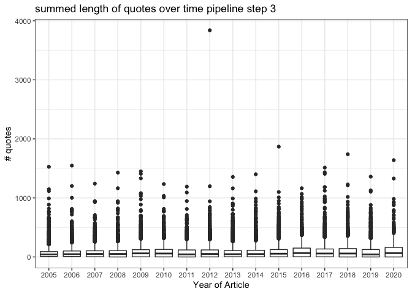 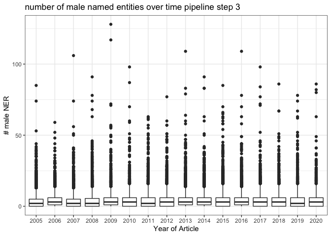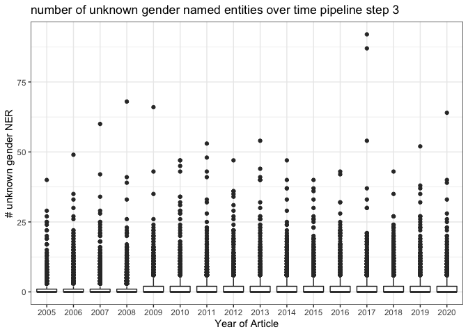 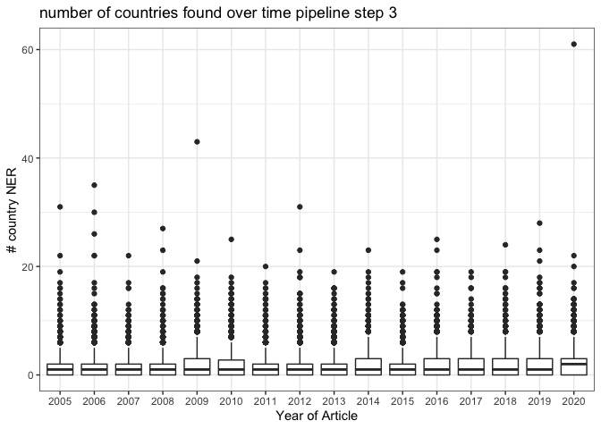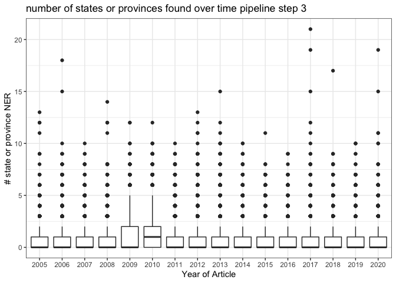

## QC pipeline step 4: Check coreNLP processed output

#### plotting quote stats

Between pipeline step 3 and 4 we are predicting the genders of speakers using genderize.io. So we expect exactly the same number of quotes and almost exactly the same length of quotes (unicode characters + whitespace editing happens in step 4). We also expect that the number of UNKNOWN gendered speakers typically decrease, and the number of MALE/FEMALE speakers may increase. This is not a completely 1:1 measurement. Pipeline level 3 only identifies the number of male/female/unknown named entities, there is no gender based quote attribution checked at this stage. Quote attribution is in step 4.

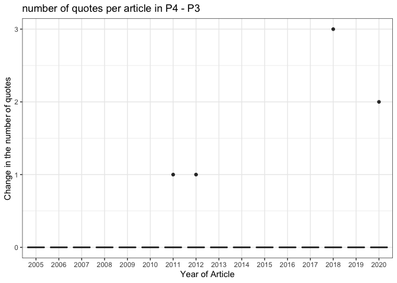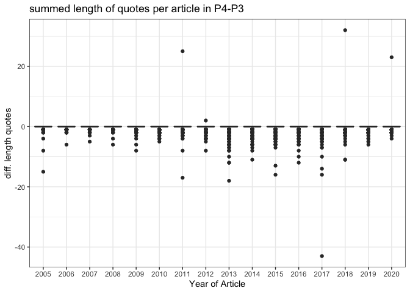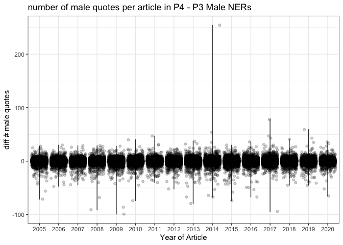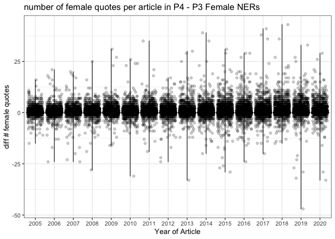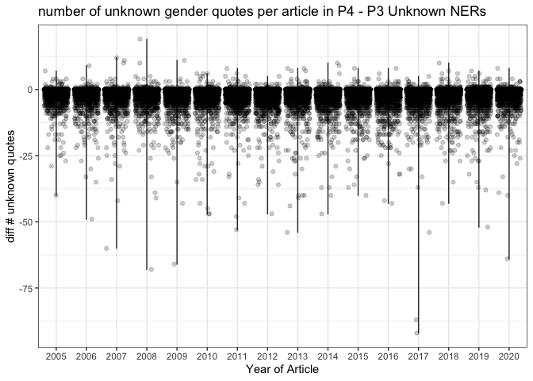

#### plotting location stats

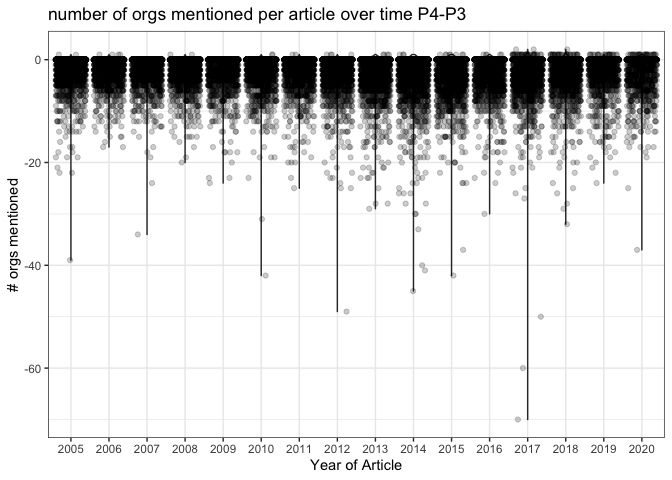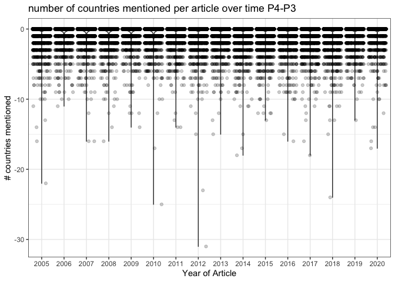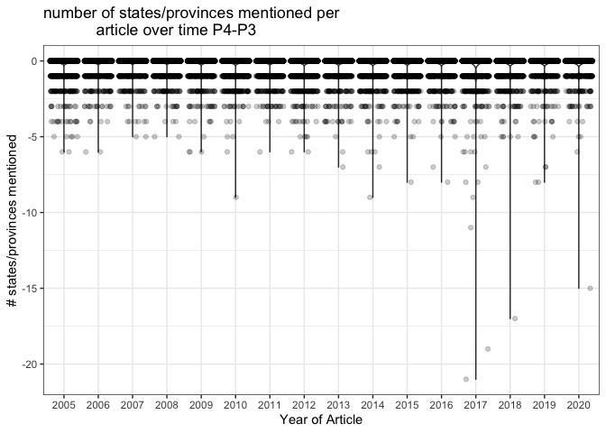
