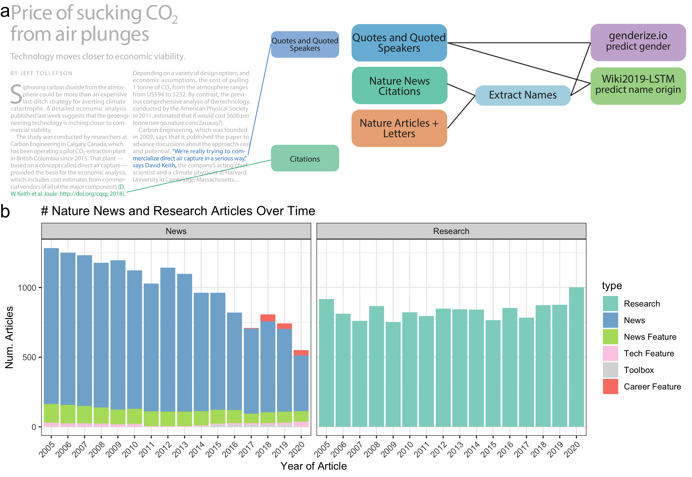

overview\_fig
================
Natalie Davidson
4/30/2021

## Overview

This notebook generates figure 1 and supplemental figure 1.

The **data** it uses to build the plots are here:

1.  nature news scraped data: `/data/scraped_data/downloads/`

2.  nature research articles and letters author data: `/data/author_data/downloads/`

The **pdfs** included in the plots are here:

1.  `/figure_notebooks/illustrator_pdfs/`

The **setting + helper functions** to generate the plots are here:

1.  plotting related functions: `/utils/plotting_utils.R`

2.  reading + data processing related functions: `/utils/scraper_processing_utils.R`

3.  nautre research article and springer specific data processing functions: `/process_doi_data/springer_scripts/springer_scrape_utils.R`

## Read in the data

### Read in the scraped DOIs

``` r
# read in the scraped news articles for each year
news_scraped_dir = file.path(proj_dir,
                    "/data/scraped_data/")
news_scraped_dir_files = list.dirs(news_scraped_dir, full.names = T)
news_scraped_dir_files = grep("coreNLP_output", news_scraped_dir_files, value=T)

news_df = NA
for(curr_dir in news_scraped_dir_files){
    
    curr_files = list.files(curr_dir, full.names = T)

    
    # if the json file was empty, skip
    if(length(curr_files) == 0 ){
        next
    }
    
    # get the year form the file name
    file_name_year = substring(basename(curr_dir), 
                            16, 19)
    
    # get the news article type from the file name
    file_name_type = substring(basename(curr_dir), 
                            21, nchar(basename(curr_dir)))
    
    # format the output
    article_ids = gsub(".txt.json", "", basename(curr_files))
    num_articles = length(article_ids)
    curr_info_df = data.frame(year=file_name_year, 
                                type=file_name_type, 
                                file_id=article_ids)
    news_df = rbind(news_df, curr_info_df)
    
}
news_df = news_df[-1,]
print("Total Articles")
```

    ## [1] "Total Articles"

``` r
print(dim(news_df))
```

    ## [1] 37748     3

``` r
# filter out career column and news-and-views
news_df = subset(news_df, !type %in% c("career-column", "news-and-views"))
print("Total Articles, journalist")
```

    ## [1] "Total Articles, journalist"

``` r
print(dim(news_df))
```

    ## [1] 31827     3

``` r
head(news_df)
```

    ##   year     type                                               file_id
    ## 2 2005 guardian                          missed_generize_io_names.tsv
    ## 3 2005 guardian news.2005.apr.28.thisweekssciencequestions.psychology
    ## 4 2005 guardian                 news.2005.dec.06.topstories3.genetics
    ## 5 2005 guardian                       news.2005.dec.21.food.christmas
    ## 6 2005 guardian        news.2005.feb.05.guardianobituaries.obituaries
    ## 7 2005 guardian            news.2005.feb.10.thisweekssciencequestions

### Read in the nature + springer research author information

``` r
# now read all the nature the research + letters articles
nature_author_dir = file.path(proj_dir,
                    "/data/author_data/downloads/")
nature_author_df = read_nature_author_json_files(nature_author_dir)
```

    ## [1] "/Users/natalie/Documents/projects/greenelab/checkouts/nature_news_disparities//data/author_data/downloads//links_crawled_2005_article.json"
    ## [1] "/Users/natalie/Documents/projects/greenelab/checkouts/nature_news_disparities//data/author_data/downloads//links_crawled_2005_letter.json"
    ## [1] "/Users/natalie/Documents/projects/greenelab/checkouts/nature_news_disparities//data/author_data/downloads//links_crawled_2006_article.json"
    ## [1] "/Users/natalie/Documents/projects/greenelab/checkouts/nature_news_disparities//data/author_data/downloads//links_crawled_2006_letter.json"
    ## [1] "/Users/natalie/Documents/projects/greenelab/checkouts/nature_news_disparities//data/author_data/downloads//links_crawled_2007_article.json"
    ## [1] "/Users/natalie/Documents/projects/greenelab/checkouts/nature_news_disparities//data/author_data/downloads//links_crawled_2007_letter.json"
    ## [1] "/Users/natalie/Documents/projects/greenelab/checkouts/nature_news_disparities//data/author_data/downloads//links_crawled_2008_article.json"
    ## [1] "/Users/natalie/Documents/projects/greenelab/checkouts/nature_news_disparities//data/author_data/downloads//links_crawled_2008_letter.json"
    ## [1] "/Users/natalie/Documents/projects/greenelab/checkouts/nature_news_disparities//data/author_data/downloads//links_crawled_2009_article.json"
    ## [1] "/Users/natalie/Documents/projects/greenelab/checkouts/nature_news_disparities//data/author_data/downloads//links_crawled_2009_letter.json"
    ## [1] "/Users/natalie/Documents/projects/greenelab/checkouts/nature_news_disparities//data/author_data/downloads//links_crawled_2010_article.json"
    ## [1] "/Users/natalie/Documents/projects/greenelab/checkouts/nature_news_disparities//data/author_data/downloads//links_crawled_2010_letter.json"
    ## [1] "/Users/natalie/Documents/projects/greenelab/checkouts/nature_news_disparities//data/author_data/downloads//links_crawled_2011_article.json"
    ## [1] "/Users/natalie/Documents/projects/greenelab/checkouts/nature_news_disparities//data/author_data/downloads//links_crawled_2011_letter.json"
    ## [1] "/Users/natalie/Documents/projects/greenelab/checkouts/nature_news_disparities//data/author_data/downloads//links_crawled_2012_article.json"
    ## [1] "/Users/natalie/Documents/projects/greenelab/checkouts/nature_news_disparities//data/author_data/downloads//links_crawled_2012_letter.json"
    ## [1] "/Users/natalie/Documents/projects/greenelab/checkouts/nature_news_disparities//data/author_data/downloads//links_crawled_2013_article.json"
    ## [1] "/Users/natalie/Documents/projects/greenelab/checkouts/nature_news_disparities//data/author_data/downloads//links_crawled_2013_letter.json"
    ## [1] "/Users/natalie/Documents/projects/greenelab/checkouts/nature_news_disparities//data/author_data/downloads//links_crawled_2014_article.json"
    ## [1] "/Users/natalie/Documents/projects/greenelab/checkouts/nature_news_disparities//data/author_data/downloads//links_crawled_2014_letter.json"
    ## [1] "/Users/natalie/Documents/projects/greenelab/checkouts/nature_news_disparities//data/author_data/downloads//links_crawled_2015_article.json"
    ## [1] "/Users/natalie/Documents/projects/greenelab/checkouts/nature_news_disparities//data/author_data/downloads//links_crawled_2015_letter.json"
    ## [1] "/Users/natalie/Documents/projects/greenelab/checkouts/nature_news_disparities//data/author_data/downloads//links_crawled_2016_article.json"
    ## [1] "/Users/natalie/Documents/projects/greenelab/checkouts/nature_news_disparities//data/author_data/downloads//links_crawled_2016_letter.json"
    ## [1] "/Users/natalie/Documents/projects/greenelab/checkouts/nature_news_disparities//data/author_data/downloads//links_crawled_2017_article.json"
    ## [1] "/Users/natalie/Documents/projects/greenelab/checkouts/nature_news_disparities//data/author_data/downloads//links_crawled_2017_letter.json"
    ## [1] "/Users/natalie/Documents/projects/greenelab/checkouts/nature_news_disparities//data/author_data/downloads//links_crawled_2018_article.json"
    ## [1] "/Users/natalie/Documents/projects/greenelab/checkouts/nature_news_disparities//data/author_data/downloads//links_crawled_2018_letter.json"
    ## [1] "/Users/natalie/Documents/projects/greenelab/checkouts/nature_news_disparities//data/author_data/downloads//links_crawled_2019_article.json"
    ## [1] "/Users/natalie/Documents/projects/greenelab/checkouts/nature_news_disparities//data/author_data/downloads//links_crawled_2019_letter.json"
    ## [1] "/Users/natalie/Documents/projects/greenelab/checkouts/nature_news_disparities//data/author_data/downloads//links_crawled_2020_article.json"

``` r
head(nature_author_df)
```

    ##       file_id year
    ## 2 nature04444 2005
    ## 3 nature04143 2005
    ## 4 nature04133 2005
    ## 5 nature04216 2005
    ## 6 nature04268 2005
    ## 7 nature04089 2005
    ##                                                                                                                authors
    ## 2 Daniel L. Barber; E. John Wherry; David Masopust; Baogong Zhu; James P. Allison; Arlene H. Sharpe; Gordon J. Freeman
    ## 3                                                                               A. Kashlinsky; R. G. Arendt; J. Mather
    ## 4        Kakoli Mitra; Christiane Schaffitzel; Tanvir Shaikh; Florence Tama; Simon Jenni; Charles L. Brooks; Nenad Ban
    ## 5                                                                                                   Yun Zhang; Hang Lu
    ## 6                                      Elio A. Abbondanzieri; William J. Greenleaf; Joshua W. Shaevitz; Robert Landick
    ## 7                                                                 Hiroyasu Furukawa; Satinder K Singh; Romina Mancusso
    ##                       doi
    ## 2 doi:10.1038/nature04444
    ## 3 doi:10.1038/nature04143
    ## 4 doi:10.1038/nature04133
    ## 5 doi:10.1038/nature04216
    ## 6 doi:10.1038/nature04268
    ## 7 doi:10.1038/nature04089

``` r
# now read the randomly sampled Springer research articles
springer_author_file = file.path(proj_dir, 
                                "/data/reference_data/springer_bg_author_cache.tsv")
springer_author_df = data.frame(fread(springer_author_file))

head(springer_author_df)
```

    ##   month year page                         doi content_type
    ## 1     1 2005    1          doi:10.1186/cc3063      Article
    ## 2     1 2005    1 doi:10.1186/gb-2005-6-2-207      Article
    ## 3     1 2005    1 doi:10.1186/gb-2005-6-2-104      Article
    ## 4     1 2005    1   doi:10.1186/1471-2334-5-5      Article
    ## 5     1 2005    1   doi:10.1186/1471-244X-5-6      Article
    ## 6     1 2005    1  doi:10.1038/sj.bjc.6602352      Article
    ##                      article_type
    ## 1                Erratum; Erratum
    ## 2         ReviewPaper; Minireview
    ## 3                 Letter; Comment
    ## 4 OriginalPaper; Research article
    ## 5 OriginalPaper; Research article
    ## 6                      BookReview
    ##                                                                                                         authors
    ## 1                  Morgenthaler, Nils G; Struck, Joachim; Christ-Crain, Mirjam; Bergmann, Andreas; Müller, Beat
    ## 2                                                                                            Furlong, Rebecca F
    ## 3                                                                                             Petsko, Gregory A
    ## 4 Inan, Dilara; Saba, Rabin; Gunseren, Filiz; Ongut, Gozde; Turhan, Ozge; Yalcin, Ata Nevzat; Mamikoglu, Latife
    ## 5               Hashimoto, Kenji; Engberg, Göran; Shimizu, Eiji; Nordin, Conny; Lindström, Leif H; Iyo, Masaomi
    ## 6                                                                                                 Ellenson, L H
    ##   query_date
    ## 1 2021-03-30
    ## 2 2021-03-30
    ## 3 2021-03-30
    ## 4 2021-03-30
    ## 5 2021-03-30
    ## 6 2021-03-30

### append the three data sources together

``` r
nature_author_df$type = "research"
springer_author_df$type = "springer"
springer_author_df$file_id = springer_author_df$doi

col_ids = c("year", "type", "file_id")
full_df = Reduce(rbind, list(nature_author_df[,col_ids], 
                             springer_author_df[,col_ids],
                             news_df[,col_ids]))
```

## Make the Figures

### generate the plots

``` r
# plot number of articles scraped
full_df$type = factor(full_df$type, levels = ARTICLE_TYPE_FACTOR_ORDER)
news_nature_gg = ggplot(subset(full_df, type != "springer"), 
                        aes(x=as.factor(year), fill=type)) +
                geom_bar() + theme_bw() +
                scale_fill_manual(values=ARTICLE_TYPE_COLOR) +
                xlab("Year of Article") + ylab("Num. Articles") +
                    ggtitle("# Nature News and Research Articles Over Time")

all_gg = ggplot(full_df, aes(x=as.factor(year), fill=type)) +
                geom_bar() + theme_bw() +
                scale_fill_manual(values=ARTICLE_TYPE_COLOR) +
                xlab("Year of Article") + ylab("# articles") +
                    ggtitle("# Springer + Nature News and Research Articles Over Time")
ggsave(file.path(proj_dir, "/figure_notebooks/manuscript_figs/fig1_tmp/news_nature_gg.png"),
       news_nature_gg, width = 10, height = 4, units = "in")
ggsave(file.path(proj_dir, "/figure_notebooks/manuscript_figs/fig1_tmp/all_gg.png"),
       all_gg)
```

### format figure 1

``` r
plot_overview = image_read_pdf(file.path(proj_dir,
                                  "/figure_notebooks/illustrator_pdfs/nature_news_ex_fig1a.pdf"))
plot_overview = image_extent(plot_overview, '2130x1236', 
                                            color = 'white', gravity = "northeast")
plot_data_diagram = image_read_pdf(file.path(proj_dir,
                                  "/figure_notebooks/illustrator_pdfs/nature_news_ex_fig1b.pdf"))
news_nature_gg = image_read(file.path(proj_dir,
                                  "/figure_notebooks/manuscript_figs/fig1_tmp/news_nature_gg.png"))


bottom_panel <- image_append(image_scale(c(plot_overview, plot_data_diagram), 3000), stack = FALSE)
bottom_panel = image_annotate(bottom_panel, "a", size = 160)
news_nature_gg = image_annotate(image_scale(news_nature_gg, 3000), "b", size = 80)


full_image <- image_append(image_scale(c(bottom_panel, news_nature_gg),3000), 
                           stack = TRUE)

print(full_image)
```

    ## # A tibble: 1 x 7
    ##   format width height colorspace matte filesize density
    ##   <chr>  <int>  <int> <chr>      <lgl>    <int> <chr>  
    ## 1 PNG     3000   2071 sRGB       TRUE         0 300x300



``` r
outfile = file.path(proj_dir,"/figure_notebooks/manuscript_figs/fig1_tmp/fig1_main.pdf")
image_write(full_image, format = "pdf", outfile)

outfile = file.path(proj_dir,"/figure_notebooks/manuscript_figs/fig1_tmp/fig1_main.png")
image_write(full_image, format = "png", outfile)
```
