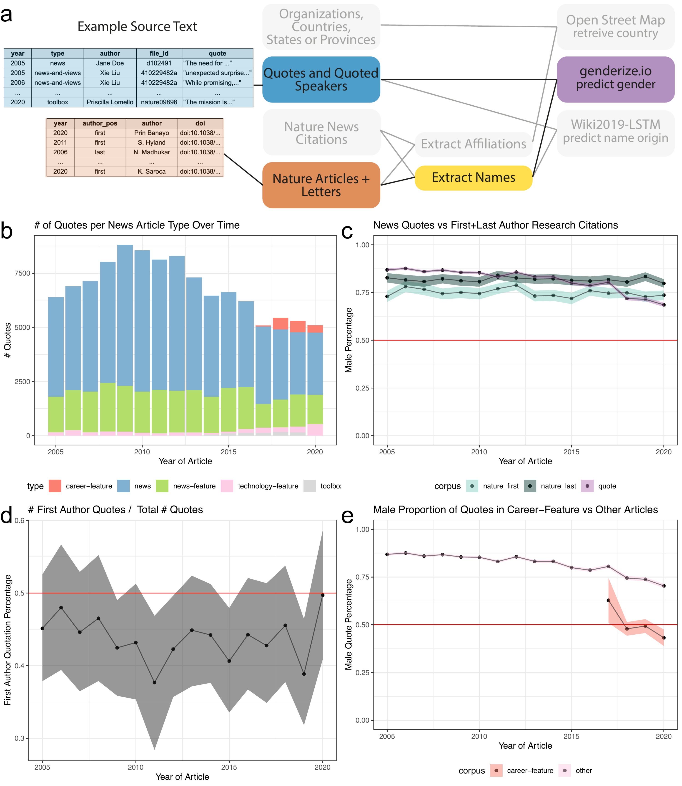
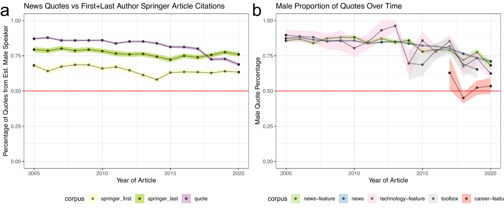

Fig2\_gender\_quote
================
Natalie Davidson
5/3/2021

## Overview

This notebook generates figure 2 and additional supplemental figures.

The **data** it uses to build the plots are here:

This document compares a "foreground" dataset (gender of quoted authors) and compares it to two possible "background" datasets (random sampling of 2.4K Springer articles, and all nature research articles) Additionally, it uses the first+last author names of cited articles to look see if there is a difference in quote rate by author position.

Foreground file:

1.  `./data/scraped_data/quote_table_raw_20*.tsv` has all quotes with estimated gender for the speaker. It is generated after scraping all articles from a year between 2005-2020 (`./nature_news_scraper/run_scrape_benchmark.sh`) then running it through coreNLP with additional processing (`./process_scraped_data/run_process_target_year.sh`)

Background files:

1.  `./data/author_data/springer_author_gender.tsv` has the gender of first and last authors from a randomly selected 36K Springer articles from 2005-2020. This file is created by running `./process_doi_data/run_background_scrapes.sh`.

2.  `./data/author_data/nature_author_gender.tsv` has the gender of first and last authors from all Nature articles from 2005-2020. This file is created by running `./process_doi_data/run_background_scrapes.sh`.

Cited Author file:

1.  `./data/author_data/all_author_fullname.tsv` is the output after scraping and processing the citations from nature news articles for the first and last author information. This file is created by running `./process_doi_data/run_background_scrapes.sh`.

The **pdfs** included in the plots are here:

1.  `/figure_notebooks/illustrator_pdfs/`

The **setting + helper functions** to generate the plots are here:

1.  plotting related functions: `/utils/plotting_utils.R`

2.  reading + data processing related functions: `/utils/scraper_processing_utils.R` and `/analysis_scripts/analysis_utils.R`

3.  nautre research article and springer specific data processing functions: `/process_doi_data/springer_scripts/springer_scrape_utils.R`

## Read in the data

### Read in the quote data with estimated gender

``` r
# read in the all quotes for all news articles and all years 
full_quote_df = NA
quote_files = list.files(file.path(proj_dir,"/data/scraped_data/", sep=""), full.names = T)
quote_files = grep("quote_table_raw_", quote_files, value=T)
for(quote_file in quote_files){
    
    quote_df = read_corenlp_quote_files(quote_file)
    quote_df$year = str_extract(quote_file, "[1-9][0-9]+") # curr_year
    quote_df$type = substring(basename(quote_file), 
                            22, nchar(basename(quote_file))-4)
    
    full_quote_df = rbind(full_quote_df, quote_df)
}
full_quote_df = full_quote_df[-1,]
full_quote_df = full_quote_df[full_quote_df$est_gender %in% c("FEMALE", "MALE"), ]

head(full_quote_df)
```

    ##   file_id       est_speaker est_gender canonical_speaker     partial_name
    ## 2 434970a Arnold Sommerfeld       MALE     Edward Teller       Sommerfeld
    ## 3 438567a      Arthur Smith       MALE   Arthur E. Smith  Arthur E. Smith
    ## 4 437634a  Bertrand Russell       MALE  Bertrand Russell Bertrand Russell
    ## 5 434029a             Boxma       MALE           Unknown            Boxma
    ## 6 438031a           Bradley       MALE     F. H. Bradley    F. H. Bradley
    ## 7 435748a            Brooks       MALE   C. E. P. Brooks  C. E. P. Brooks
    ##                                                                                          quote
    ## 2     as if I was born in Germany only by mistake, and only came to my true homeland at age 28
    ## 3                                                                                       tongue
    ## 4 If ever these evils are eradicated, his name should stand very high indeed among the heroes.
    ## 5                                                                            true missing link
    ## 6                                          Finding bad reasons for what we believe on instinct
    ## 7                                                                                 Fog and Soot
    ##   year           type
    ## 2 2005 news-and-views
    ## 3 2005 news-and-views
    ## 4 2005 news-and-views
    ## 5 2005 news-and-views
    ## 6 2005 news-and-views
    ## 7 2005 news-and-views

``` r
# remove quotes where no gender could be estimated
full_quote_df = subset(full_quote_df, !is.na(est_gender))
```

### Read in the nature + springer research author information

``` r
# read in the springer author data
springer_file = file.path(proj_dir, "/data/author_data/springer_author_gender.tsv")
springer_author_df = read_gender_files(springer_file)
head(springer_author_df)
```

    ##            author                                doi year author_pos est_gender
    ## 1          (aegis      doi:10.1007/s10751-019-1553-3 2019       last       <NA>
    ## 2 [authorinst]the doi:10.1140/epjc/s10052-016-4346-8 2016       last       <NA>
    ## 3            a-mf         doi:10.1038/sj.onc.1210387 2007      first       <NA>
    ## 4          aaltje        doi:10.1186/1471-2318-12-19 2012       last     FEMALE
    ## 5           aalya     doi:10.1186/1753-6561-6-S5-O16 2012      first     FEMALE
    ## 6             aam          doi:10.1186/1479-0556-4-1 2006      first       MALE
    ##   gender
    ## 1   <NA>
    ## 2   <NA>
    ## 3   <NA>
    ## 4 FEMALE
    ## 5 FEMALE
    ## 6   MALE

``` r
# read in the nature author data
nature_file = file.path(proj_dir, "/data/author_data/nature_author_gender.tsv")
nature_author_df = read_gender_files(nature_file)
head(nature_author_df)
```

    ##       author                            doi year author_pos            file_id
    ## 1     aakash doi:10.1038/s41586-020-03052-3 2020      first s41586-020-03052-3
    ## 2 aanindeeta        doi:10.1038/nature17185 2016      first        nature17185
    ## 3      aaron  doi:10.1038/s41586-020-3009-y 2020      first  s41586-020-3009-y
    ## 4      aaron        doi:10.1038/nature07885 2009       last        nature07885
    ## 5      aaron        doi:10.1038/nature03831 2005       last        nature03831
    ## 6      aaron        doi:10.1038/nature04790 2006       last        nature04790
    ##   est_gender gender
    ## 1       MALE   MALE
    ## 2       <NA>   <NA>
    ## 3       MALE   MALE
    ## 4       MALE   MALE
    ## 5       MALE   MALE
    ## 6       MALE   MALE

``` r
# remove citations where no gender could be estimated
springer_author_df = subset(springer_author_df, !is.na(est_gender))
nature_author_df = subset(nature_author_df, !is.na(est_gender))
```

### reading in the first and last author data

``` r
name_info_file = file.path(proj_dir, 
                         "/data/author_data/all_author_fullname.tsv")
name_info_df = data.frame(fread(name_info_file))

# we are only interested in the nature news citations
name_info_df = subset(name_info_df, corpus == "naturenews_citations")

head(name_info_df)
```

    ##   year author_pos           author            file_id
    ## 1 2010      first Michael Heinrich            463436a
    ## 2 2012      first     Kai K. Ewert            489372b
    ## 3 2019      first     Grace E. Kim d41586-019-00245-3
    ## 4 2011      first    M. R. Elphick            473161a
    ## 5 2006      first  Nicole Dubilier        nature05208
    ## 6 2010      first Martin Moskovits            464357a
    ##                            doi               corpus
    ## 1 doi:10.1007/0-306-46826-3_33 naturenews_citations
    ## 2      doi:10.1007/128_2010_70 naturenews_citations
    ## 3      doi:10.1007/164_2016_82 naturenews_citations
    ## 4  doi:10.1007/3-540-26573-2_9 naturenews_citations
    ## 5 doi:10.1007/3-540-28221-1_12 naturenews_citations
    ## 6 doi:10.1007/3-540-44948-5_10 naturenews_citations

## Process Data

### match quotes to authors

``` r
# first we only care about files that both have 
# at least one quote and springer indexed citation
file_id_intersect = intersect(full_quote_df$file_id, 
                                name_info_df$file_id)

# go through the files that meet the above criteria
# and match citations to quoted speakers
quote_author_df = NA
for(curr_id in file_id_intersect){
    
    curr_quote = subset(full_quote_df, file_id == curr_id)
    curr_author = subset(name_info_df, file_id == curr_id)
    
    # we must make approx. name matches
    # so we go through each quoted speaker, 
    # looking for the best cited author match, IF it exists
    names_df = subset(curr_quote, select=c("est_speaker"))
    names_df$author = NA
    for(idx in 1:nrow(names_df)){
        curr_text = names_df$est_speaker[idx]
        
        # remove punctuations just in case
        curr_text = gsub('[[:punct:] ]+', '', curr_text)
        
        # get_matched_string tries to find the name with the 
        # closest substring with no penalty for deletions.
        # Maximum number of mismatches is 3
        names_df$author[idx] = get_matched_string(curr_text, 
                                                  curr_author$author, 
                                                  max_cost = 3)

    }
    # only keep the names we were able to find
    curr_missed_names = subset(names_df, is.na(author))
    names_df = na.omit(names_df)
    
    curr_quote = merge(curr_quote, names_df)
    merged_df = merge(curr_quote[,c("author", "year", "est_speaker", "type", "file_id", "quote")], 
                      curr_author[,c("author", "doi", "author_pos")],
                      by = "author")
    quote_author_df = rbind(quote_author_df, merged_df)

    
}
quote_author_df = quote_author_df[-1,]
quote_author_df = unique(quote_author_df)
```

### Get bootstrap estimates

``` r
#### Quote data
quote_prop_df = compute_bootstrap_gender(full_quote_df, 
                                           year_col_id = "year", 
                                           article_col_id = "quote",
                                           conf_int=0.95)
quote_prop_df$corpus = "quote"

#### Quote data broken down by article type
get_subboot <- function(type_id, type_names, in_df){
    bootstrap_res = compute_bootstrap_gender(subset(in_df, type %in% type_id), 
                                           year_col_id = "year", 
                                           article_col_id = "quote",
                                           conf_int=0.95)
    bootstrap_res$corpus = type_names
    return(bootstrap_res)

}

type_df = NA
for(curr_type in unique(full_quote_df$type)){
    res = get_subboot(curr_type, curr_type, full_quote_df)
    type_df = rbind(type_df, res)
}
type_df = type_df[-1,]

#### Quote data broken down by article type career vs non-career
career_df = NA
non_career = setdiff(unique(full_quote_df$type), c("career-column", "career-feature"))
career_type = list("career-column", "career-feature", non_career)
career_name = c("career-column", "career-feature", "non_career")
for(curr_type_idx in 1:length(career_type)){
    curr_type = unlist(career_type[curr_type_idx])
    curr_name = career_name[curr_type_idx]
    res = get_subboot(curr_type, 
                      curr_name,
                      full_quote_df)
    career_df = rbind(career_df, res)
}
career_df = career_df[-1,]


#### Background data
springer_first_prop_df = compute_bootstrap_gender(subset(springer_author_df, author_pos == "first"), 
                                           year_col_id = "year", 
                                           article_col_id = "doi",
                                           conf_int=0.95)
springer_last_prop_df = compute_bootstrap_gender(subset(springer_author_df, author_pos == "last"), 
                                           year_col_id = "year", 
                                           article_col_id = "doi",
                                           conf_int=0.95)
nature_first_prop_df = compute_bootstrap_gender(subset(nature_author_df, author_pos == "first"), 
                                           year_col_id = "year", 
                                           article_col_id = "doi",
                                           conf_int=0.95)
nature_last_prop_df = compute_bootstrap_gender(subset(nature_author_df, author_pos == "last"), 
                                           year_col_id = "year", 
                                           article_col_id = "doi",
                                           conf_int=0.95)
springer_first_prop_df$corpus = "springer_first"
springer_last_prop_df$corpus = "springer_last"
nature_first_prop_df$corpus = "nature_first"
nature_last_prop_df$corpus = "nature_last"


#### first v last author quotes
first_cited_prop_df = compute_bootstrap_first_author(quote_author_df, 
                                               year_col_id = "year", 
                                               article_col_id = "file_id",
                                               conf_int=0.95)
```

    ## [1] 2

## Make the Figures

### generate the plots

``` r
#### Overview plot of the number of quotes by article type
full_quote_df$type = factor(full_quote_df$type, levels = ARTICLE_TYPE_FACTOR_ORDER)
tot_quotes_gg = ggplot(full_quote_df, aes(x=as.numeric(year), fill=type)) +
    geom_bar() +
    theme_bw() +
    xlab("Year of Article") + ylab("# Quotes") +
    ggtitle("# of Quotes per News Article Type Over Time") + 
    scale_fill_manual(values=ARTICLE_TYPE_COLOR) +
    theme(legend.position="bottom")

ggsave(file.path(proj_dir, "/figure_notebooks/tmp_files/fig2_tmp/tot_quotes_gg.pdf"),
       tot_quotes_gg, width = 6, height = 5, units = "in", device = "pdf")


#### compare foreground and background quotes + authorship rate
compare_df = rbind(springer_first_prop_df,
                   springer_last_prop_df,
                   nature_first_prop_df,
                   nature_last_prop_df,
                   quote_prop_df[,colnames(springer_last_prop_df)])
compare_df$corpus = factor(compare_df$corpus, levels = QUOTE_ANALYSIS_ORDER)

quotes_nature_gg = 
    ggplot(subset(compare_df, corpus %in% c("nature_last", "nature_first", "quote")), 
      aes(x=as.numeric(year), y=mean,
                          ymin=bottom_CI, ymax=top_CI,
                          fill=corpus)) +
    geom_point() + geom_ribbon(alpha=0.5) + geom_line(alpha=0.5) + theme_bw() + 
    xlab("Year of Article") + ylab("Male Percentage") +
    ggtitle("Comparison of News Quotes vs First+Last Author Research Citations") + 
    ylim(c(0, 1)) +
    geom_hline(yintercept=0.5, color="red") +
    scale_fill_manual(values=QUOTE_ANALYSIS_COLOR) +
    theme(legend.position="bottom")

ggsave(file.path(proj_dir, "/figure_notebooks/tmp_files/fig2_tmp/quotes_nature_gg.pdf"),
       quotes_nature_gg, width = 6, height = 5, units = "in", device = "pdf")


quotes_springer_gg = 
    ggplot(subset(compare_df, corpus %in% c("springer_last", "springer_first", "quote")), 
      aes(x=as.numeric(year), y=mean,
                          ymin=bottom_CI, ymax=top_CI,
                          fill=corpus)) +
    geom_point() + geom_ribbon(alpha=0.5) + geom_line(alpha=0.5) + theme_bw() + 
    xlab("Year of Article") + ylab("Percentage of Quotes from Est. Male Speaker") +
    ggtitle("Comparison of News Quotes vs First+Last Author Springer Article Citations") + 
    ylim(c(0, 1)) +
    geom_hline(yintercept=0.5, color="red") +
    scale_fill_manual(values=QUOTE_ANALYSIS_COLOR) +
    theme(legend.position="bottom")

ggsave(file.path(proj_dir, "/figure_notebooks/tmp_files/fig2_tmp/quotes_springer_gg.pdf"),
       quotes_springer_gg, width = 6, height = 5, units = "in", device = "pdf")


#### breakdown MALE bias by article type
type_df$corpus = factor(type_df$corpus, levels = ARTICLE_TYPE_FACTOR_ORDER)
all_type_gg = ggplot(type_df, aes(x=as.numeric(year), y=mean,
                          ymin=bottom_CI, ymax=top_CI,
                          fill=corpus)) +
    geom_point() + geom_ribbon(alpha=0.5) + geom_line(alpha=0.5) +
    theme_bw() + 
    xlab("Year of Article") + ylab("Male Quote Percentage") +
    ggtitle("Male Proportion of Quotes Over Time") + 
    ylim(c(0, 1)) +
    geom_hline(yintercept=0.5, color="red") +
    scale_fill_manual(values=ARTICLE_TYPE_COLOR) +
    theme(legend.position="bottom")

ggsave(file.path(proj_dir, "/figure_notebooks/tmp_files/fig2_tmp/all_type_gg.pdf"),
       all_type_gg, width = 6, height = 5, units = "in", device = "pdf")


#### breakdown MALE bias by career vs non-career article type
career_df$corpus = factor(career_df$corpus, levels = QUOTE_ANALYSIS_ORDER)
career_gg = ggplot(career_df, aes(x=as.numeric(year), y=mean,
                          ymin=bottom_CI, ymax=top_CI,
                          fill=corpus)) +
    geom_point() + geom_ribbon(alpha=0.5) + geom_line(alpha=0.5) +
    theme_bw() + ylim(c(0,1)) +
    xlab("Year of Article") + ylab("Male Quote Percentage") + 
    ylim(c(0, 1)) +
    ggtitle("Male Proportion of Quotes in Career vs Non-Career related Articles") + 
    geom_hline(yintercept=0.5, color="red") +
    scale_fill_manual(values=QUOTE_ANALYSIS_COLOR) +
    theme(legend.position="bottom")

ggsave(file.path(proj_dir, "/figure_notebooks/tmp_files/fig2_tmp/career_gg.pdf"),
       career_gg, width = 6, height = 5, units = "in", device = "pdf")


#### compare first v last author
first_v_last_gg = ggplot(first_cited_prop_df, aes(x=as.numeric(year), y=mean,
                          ymin=bottom_CI, ymax=top_CI)) +
    geom_point() + geom_ribbon(alpha=0.5) + geom_line(alpha=0.5) + 
    theme_bw() + 
    xlab("Year of Article") + ylab("First Author Quotation Percentage") +
    ggtitle("# First Author Quotes /  Total # Quotes") + 
    geom_hline(yintercept=0.5, color="red") +
    theme(legend.position="bottom")

ggsave(file.path(proj_dir, "/figure_notebooks/tmp_files/fig2_tmp/first_v_last_gg.pdf"),
       first_v_last_gg, width = 6, height = 5, units = "in", device = "pdf")
```

### format main figure

``` r
plot_overview = image_read_pdf(file.path(proj_dir,
                                  "/figure_notebooks/illustrator_pdfs/nature_news_quote_gender_schematic.pdf"))
quotes_nature_gg = image_read_pdf(file.path(proj_dir,
                                  "/figure_notebooks/tmp_files/fig2_tmp/quotes_nature_gg.pdf"))
tot_quotes_gg = image_read_pdf(file.path(proj_dir,
                                  "/figure_notebooks/tmp_files/fig2_tmp/tot_quotes_gg.pdf"))
first_v_last_gg = image_read_pdf(file.path(proj_dir,
                                  "/figure_notebooks/tmp_files/fig2_tmp/first_v_last_gg.pdf"))
career_gg = image_read_pdf(file.path(proj_dir,
                                  "/figure_notebooks/tmp_files/fig2_tmp/career_gg.pdf"))

middle_image <- image_append(image_scale(c(tot_quotes_gg, quotes_nature_gg),1000), stack = FALSE)
bottom_image <- image_append(image_scale(c(first_v_last_gg, career_gg),1000), stack = FALSE)
full_image <- image_append(image_scale(c(plot_overview, middle_image, bottom_image), 1000), stack = TRUE)

print(full_image)
```

    ## # A tibble: 1 x 7
    ##   format width height colorspace matte filesize density
    ##   <chr>  <int>  <int> <chr>      <lgl>    <int> <chr>  
    ## 1 PNG     1000   1152 sRGB       TRUE         0 300x300



``` r
outfile = file.path(proj_dir,"/figure_notebooks/tmp_files/fig2_tmp/fig2_main.pdf")
image_write(full_image, format = "pdf", outfile)

outfile = file.path(proj_dir,"/figure_notebooks/tmp_files/fig2_tmp/fig2_main.png")
image_write(full_image, format = "png", outfile)
```

### format supp. figure

``` r
all_type_gg = image_read_pdf(file.path(proj_dir,
                                  "/figure_notebooks/tmp_files/fig2_tmp/all_type_gg.pdf"))
quotes_springer_gg = image_read_pdf(file.path(proj_dir,
                                  "/figure_notebooks/tmp_files/fig2_tmp/quotes_springer_gg.pdf"))

full_image <- image_append(image_scale(c(quotes_springer_gg, all_type_gg), 500), stack = FALSE)
print(full_image)
```

    ## # A tibble: 1 x 7
    ##   format width height colorspace matte filesize density
    ##   <chr>  <int>  <int> <chr>      <lgl>    <int> <chr>  
    ## 1 PNG     1000    417 sRGB       TRUE         0 300x300



``` r
outfile = file.path(proj_dir,"/figure_notebooks/tmp_files/fig2_tmp/fig2_supp.pdf")
image_write(full_image, format = "pdf", outfile)
outfile = file.path(proj_dir,"/figure_notebooks/tmp_files/fig2_tmp/fig2_supp.png")
image_write(full_image, format = "png", outfile)
```
