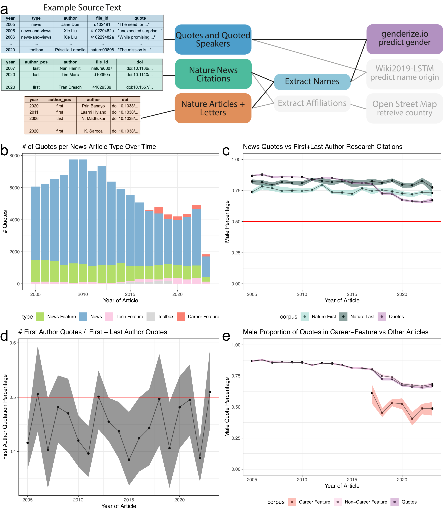
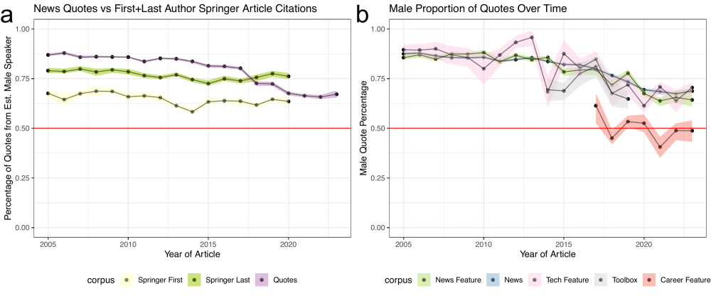

Fig2\_gender\_quote
================
Natalie Davidson
5/3/2021

## Overview

This notebook generates figure 2 and additional supplemental figures.

The **data** it uses to build the plots are here:

This document compares a "foreground" dataset (gender of quoted authors) and compares it to two possible "background" datasets (random sampling of 2.4K Springer articles, and all nature research articles) Additionally, it uses the first+last author names of cited articles to look see if there is a difference in quote rate by author position.

Foreground file:

1.  `./data/scraped_data/quote_table_raw_20*.tsv` has all quotes with estimated gender for the speaker. It is generated after scraping all articles from a year between 2005-2020 (`./nature_news_scraper/run_scrape_benchmark.sh`) then running it through coreNLP with additional processing (`./process_scraped_data/run_process_target_year.sh`)

Background files:

1.  `./data/author_data/springer_author_gender.tsv` has the gender of first and last authors from a randomly selected 36K Springer articles from 2005-2020. This file is created by running `./process_doi_data/run_background_scrapes.sh`.

2.  `./data/author_data/nature_author_gender.tsv` has the gender of first and last authors from all Nature articles from 2005-2020. This file is created by running `./process_doi_data/run_background_scrapes.sh`.

Cited Author file:

1.  `./data/author_data/all_author_fullname.tsv` is the output after scraping and processing the citations from nature news articles for the first and last author information. This file is created by running `./process_doi_data/run_background_scrapes.sh`.

The **pdfs** included in the plots are here:

1.  `/figure_notebooks/illustrator_pdfs/`

The **setting + helper functions** to generate the plots are here:

1.  plotting related functions: `/utils/plotting_utils.R`

2.  reading + data processing related functions: `/utils/scraper_processing_utils.R` and `/analysis_scripts/analysis_utils.R`

3.  nautre research article and springer specific data processing functions: `/process_doi_data/springer_scripts/springer_scrape_utils.R`

## Read in the data

### Read in the quote data with estimated gender

``` r
# read in the all quotes for all news articles and all years 
full_quote_df = NA
quote_files = list.files(file.path(proj_dir,"/data/scraped_data/", sep=""), full.names = T)
quote_files = grep("quote_table_raw_", quote_files, value=T)
for(quote_file in quote_files){
    
    quote_df = read_corenlp_quote_files(quote_file)
    quote_df$year = str_extract(quote_file, "[1-9][0-9]+") # curr_year
    quote_df$type = substring(basename(quote_file), 
                            22, nchar(basename(quote_file))-4)
    
    full_quote_df = rbind(full_quote_df, quote_df)
}
full_quote_df = full_quote_df[-1,]

# filter out career column and news-and-views
full_quote_df = subset(full_quote_df, !type %in% c("career-column", "news-and-views", "guardian"))
full_quote_df = unique(full_quote_df)

# filter out articles with more than 25 quotes
num_quotes = table(full_quote_df$file_id)
too_many_quotes_idx = which(num_quotes > 25)
too_many_quotes_file_id = names(num_quotes)[too_many_quotes_idx]
full_quote_df = subset(full_quote_df, !file_id %in% too_many_quotes_file_id)

print("Num Removed Articles")
```

    ## [1] "Num Removed Articles"

``` r
print(length(too_many_quotes_file_id))
```

    ## [1] 433

``` r
print("Num Total Articles")
```

    ## [1] "Num Total Articles"

``` r
print(length(num_quotes))
```

    ## [1] 15302

``` r
print("Total Quotes")
```

    ## [1] "Total Quotes"

``` r
print(dim(full_quote_df))
```

    ## [1] 105457      8

``` r
full_quote_df = full_quote_df[full_quote_df$est_gender %in% c("FEMALE", "MALE"), ]

# remove quotes where no gender could be estimated
full_quote_df = subset(full_quote_df, !is.na(est_gender))


# remove names with single name, that do not have a pronoun
space_idx = grep(" ", full_quote_df$est_speaker)
gendered_pronouns = c("he", "him", "his", "himself",
                    "she", "her", "hers", "herself")
pronoun_idx_canonical = which(full_quote_df$canonical_speaker %in% gendered_pronouns)
pronoun_idx_partial = which(full_quote_df$partial_name %in% gendered_pronouns)
allowed_idx = unique(c(space_idx, pronoun_idx_canonical, pronoun_idx_partial))
length(allowed_idx)
```

    ## [1] 96390

``` r
full_quote_df = full_quote_df[allowed_idx,]

full_quote_df = unique(full_quote_df)

head(full_quote_df)
```

    ##      file_id     est_speaker est_gender canonical_speaker    partial_name
    ## 5020 434954a    Aaron Rundus       MALE            Rundus          Rundus
    ## 5021 433798a Achim Schneider       MALE           Unknown Achim Schneider
    ## 5022 437610a      Adam Riess       MALE        Adam Riess      Adam Riess
    ## 5023 435014a Adrian Almquist       MALE          Almquist        Almquist
    ## 5024 434816a Adrian Chappell       MALE           Unknown        Chappell
    ## 5025 434816a Adrian Chappell       MALE          Chappell        Chappell
    ##                                                              quote year
    ## 5020                  This is long overdue in behavioural biology, 2005
    ## 5021                                               flexible eaters 2005
    ## 5022     would leave us without any observatory to fill this niche 2005
    ## 5023  The problem is that devices are getting smaller and smaller, 2005
    ## 5024 Things start getting going at around 12–15 metres per second, 2005
    ## 5025                      It's like flying a plane on instruments, 2005
    ##              type
    ## 5020 news-feature
    ## 5021 news-feature
    ## 5022 news-feature
    ## 5023 news-feature
    ## 5024 news-feature
    ## 5025 news-feature

``` r
print("Total with Gender Prediction")
```

    ## [1] "Total with Gender Prediction"

``` r
print(dim(full_quote_df))
```

    ## [1] 96390     8

``` r
print("Male Quote Ratio Nature:")
```

    ## [1] "Male Quote Ratio Nature:"

``` r
table(subset(full_quote_df, year == 2005 & type != "guardian")$est_gender)
```

    ## 
    ## FEMALE   MALE 
    ##    784   5291

``` r
table(subset(full_quote_df, year == 2020 & type != "guardian")$est_gender)
```

    ## 
    ## FEMALE   MALE 
    ##   1298   2870

``` r
#print("Male Quote Ratio Guardian:")
#table(subset(full_quote_df, year == 2005 & type == "guardian")$est_gender)
#table(subset(full_quote_df, year == 2020 & type == "guardian")$est_gender)


print("Career-feature info:")
```

    ## [1] "Career-feature info:"

``` r
dim(subset(full_quote_df, type == "career-feature"))
```

    ## [1] 898   8

``` r
table(subset(full_quote_df, type == "career-feature")$est_gender)
```

    ## 
    ## FEMALE   MALE 
    ##    449    449

### Read in the nature + springer research author information

``` r
# read in the springer author data
springer_file = file.path(proj_dir, "/data/author_data/springer_author_gender.tsv")
springer_author_df = read_gender_files(springer_file)
head(springer_author_df)
```

    ##            author                                doi year author_pos est_gender
    ## 1          (aegis      doi:10.1007/s10751-019-1553-3 2019       last       <NA>
    ## 2 [authorinst]the doi:10.1140/epjc/s10052-016-4346-8 2016       last       <NA>
    ## 3              37            doi:10.1038/nature11858 2013       last       <NA>
    ## 4            a-mf         doi:10.1038/sj.onc.1210387 2007      first       <NA>
    ## 5              aa      doi:10.1186/2047-783X-15-2-59 2010      first       MALE
    ## 6          aaltje        doi:10.1186/1471-2318-12-19 2012       last     FEMALE
    ##   gender
    ## 1   <NA>
    ## 2   <NA>
    ## 3   <NA>
    ## 4   <NA>
    ## 5   MALE
    ## 6 FEMALE

``` r
# read in the nature author data
nature_file = file.path(proj_dir, "/data/author_data/nature_author_gender.tsv")
nature_author_df = read_gender_files(nature_file)
head(nature_author_df)
```

    ##       author                            doi year author_pos            file_id
    ## 1     aakash doi:10.1038/s41586-020-03052-3 2020      first s41586-020-03052-3
    ## 2 aanindeeta        doi:10.1038/nature17185 2016      first        nature17185
    ## 3      aaron  doi:10.1038/s41586-019-1598-0 2019       last  s41586-019-1598-0
    ## 4      aaron  doi:10.1038/s41586-020-2864-x 2020       last  s41586-020-2864-x
    ## 5      aaron        doi:10.1038/nature23912 2017      first        nature23912
    ## 6      aaron        doi:10.1038/nature20781 2016       last        nature20781
    ##   est_gender gender
    ## 1       MALE   MALE
    ## 2       <NA>   <NA>
    ## 3       MALE   MALE
    ## 4       MALE   MALE
    ## 5       MALE   MALE
    ## 6       MALE   MALE

``` r
# remove citations where no gender could be estimated
springer_author_df = subset(springer_author_df, !is.na(est_gender))
nature_author_df = subset(nature_author_df, !is.na(est_gender))

nature_author_df = unique(nature_author_df)
print("Number of Nature Authors")
```

    ## [1] "Number of Nature Authors"

``` r
print(table(nature_author_df$author_pos))
```

    ## 
    ## first  last 
    ## 10601 10572

### reading in the first and last author data

``` r
name_info_file = file.path(proj_dir, 
                         "/data/author_data/all_author_fullname.tsv")
name_info_df = data.frame(fread(name_info_file))

# we are only interested in the nature news citations
name_info_df = subset(name_info_df, corpus == "naturenews_citations")

head(name_info_df)
```

    ##       year author_pos           author            file_id
    ## 22845 2010      first Michael Heinrich            463436a
    ## 22846 2012      first        Kai Ewert            489372b
    ## 22847 2019      first        Grace Kim d41586-019-00245-3
    ## 22848 2006      first  Nicole Dubilier        nature05208
    ## 22849 2010      first Martin Moskovits            464357a
    ## 22850 2011      first    Ivano Bertini            470469a
    ##                                doi               corpus
    ## 22845 doi:10.1007/0-306-46826-3_33 naturenews_citations
    ## 22846      doi:10.1007/128_2010_70 naturenews_citations
    ## 22847      doi:10.1007/164_2016_82 naturenews_citations
    ## 22848 doi:10.1007/3-540-28221-1_12 naturenews_citations
    ## 22849 doi:10.1007/3-540-44948-5_10 naturenews_citations
    ## 22850  doi:10.1007/3-540-59105-2_1 naturenews_citations

## Process Data

### match quotes to authors

``` r
# first we only care about files that both have 
# at least one quote and springer indexed citation
file_id_intersect = intersect(full_quote_df$file_id, 
                                name_info_df$file_id)

# go through the files that meet the above criteria
# and match citations to quoted speakers
quote_author_df = NA
for(curr_id in file_id_intersect){
    
    curr_quote = subset(full_quote_df, file_id == curr_id)
    curr_author = subset(name_info_df, file_id == curr_id)
    
    # we must make approx. name matches
    # so we go through each quoted speaker, 
    # looking for the best cited author match, IF it exists
    names_df = subset(curr_quote, select=c("est_speaker"))
    names_df$author = NA
    for(idx in 1:nrow(names_df)){
        curr_text = names_df$est_speaker[idx]
        
        # remove punctuations just in case, except for space
        curr_text = gsub('(?![ ])[[:punct:] ]+', '', curr_text, perl=T)
        
        # get_matched_string tries to find the name with the 
        # closest substring with no penalty for deletions.
        # Maximum number of mismatches is 3
        names_df$author[idx] = get_matched_string(curr_text, 
                                                  curr_author$author, 
                                                  max_cost = 3)

    }
    # only keep the names we were able to find
    curr_missed_names = subset(names_df, is.na(author))
    names_df = na.omit(names_df)
    
    curr_quote = merge(curr_quote, names_df)
    merged_df = merge(curr_quote[,c("author", "year", "est_speaker", "type", "file_id", "quote")], 
                      curr_author[,c("author", "doi", "author_pos")],
                      by = "author")
    
    if(nrow(merged_df) > 0){
        quote_author_df = rbind(quote_author_df, merged_df)
    }

}
quote_author_df = quote_author_df[-1,]
quote_author_df = unique(quote_author_df)

print("Quote Stats")
```

    ## [1] "Quote Stats"

``` r
dim(quote_author_df)
```

    ## [1] 6545    8

``` r
table(quote_author_df$author_pos)
```

    ## 
    ## first  last 
    ##  2871  3674

### Get bootstrap estimates

``` r
if(RERUN_BOOTSTRAP){
        
    
    #### Quote data
    quote_prop_df = compute_bootstrap_gender(subset(full_quote_df, type != "guardian"), 
                                               year_col_id = "year", 
                                               article_col_id = "quote",
                                               conf_int=0.95)
    quote_prop_df$corpus = "quote"
    
    #### Guardian Quote data
    #guardian_quote_prop_df = compute_bootstrap_gender(subset(full_quote_df, type == "guardian"), 
    #                                           year_col_id = "year", 
    #                                           article_col_id = "quote",
    #                                           conf_int=0.95)
    #guardian_quote_prop_df$corpus = "guardian"
    
    #### Quote data broken down by article type
    get_subboot <- function(type_id, type_names, in_df){
        bootstrap_res = compute_bootstrap_gender(subset(in_df, type %in% type_id), 
                                               year_col_id = "year", 
                                               article_col_id = "quote",
                                               conf_int=0.95)
        bootstrap_res$corpus = type_names
        return(bootstrap_res)
    
    }
    
    type_df = NA
    for(curr_type in unique(full_quote_df$type)){
        res = get_subboot(curr_type, curr_type, full_quote_df)
        type_df = rbind(type_df, res)
    }
    type_df = type_df[-1,]
    
    #### Quote data broken down by article type career vs non-career
    career_df = NA
    non_career = setdiff(unique(full_quote_df$type), c("career-feature"))
    career_type = list("career-feature", non_career)
    career_name = c("career-feature", "other")
    for(curr_type_idx in 1:length(career_type)){
        curr_type = unlist(career_type[curr_type_idx])
        curr_name = career_name[curr_type_idx]
        res = get_subboot(curr_type, 
                          curr_name,
                          full_quote_df)
        career_df = rbind(career_df, res)
    }
    career_df = career_df[-1,]
    
    
    
    #### Background data
    springer_first_prop_df = compute_bootstrap_gender(
                                subset(springer_author_df, author_pos == "first"), 
                                year_col_id = "year", 
                                article_col_id = "doi",
                                conf_int=0.95)
    springer_last_prop_df = compute_bootstrap_gender(
                                subset(springer_author_df, author_pos == "last"), 
                                year_col_id = "year", 
                                article_col_id = "doi",
                                conf_int=0.95)
    nature_first_prop_df = compute_bootstrap_gender(
                                subset(nature_author_df, author_pos == "first"), 
                                year_col_id = "year", 
                                article_col_id = "doi",
                                conf_int=0.95)
    nature_last_prop_df = compute_bootstrap_gender(
                                subset(nature_author_df, author_pos == "last"), 
                                year_col_id = "year", 
                                article_col_id = "doi",
                                conf_int=0.95)
    springer_first_prop_df$corpus = "springer_first"
    springer_last_prop_df$corpus = "springer_last"
    nature_first_prop_df$corpus = "nature_first"
    nature_last_prop_df$corpus = "nature_last"
    
    
    #### first v last author quotes
    first_cited_prop_df = compute_bootstrap_first_author(quote_author_df, 
                                                   year_col_id = "year", 
                                                   article_col_id = "file_id",
                                                   conf_int=0.95)
    all_bootstrap_file = file.path(proj_dir,
                            "/figure_notebooks/manuscript_figs/fig2_tmp/fig2.RData")
    save(quote_prop_df, type_df, career_df, 
         springer_first_prop_df, springer_last_prop_df, 
         nature_first_prop_df, nature_last_prop_df, 
         first_cited_prop_df, #guardian_quote_prop_df,
         file = all_bootstrap_file)
}else{
    all_bootstrap_file = file.path(proj_dir,
                                "/figure_notebooks/manuscript_figs/fig2_tmp/fig2.RData")
    load(all_bootstrap_file)
}
```

## Make the Figures

### generate the plots

``` r
#### Overview plot of the number of quotes by article type
full_quote_df$type = factor(full_quote_df$type, levels = ARTICLE_TYPE_FACTOR_ORDER)
tot_quotes_gg = ggplot(full_quote_df, aes(x=as.numeric(year), fill=type)) +
    geom_bar() +
    theme_bw() +
    xlab("Year of Article") + ylab("# Quotes") +
    ggtitle("# of Quotes per News Article Type Over Time") + 
    scale_fill_manual(values=ARTICLE_TYPE_COLOR[unique(full_quote_df$type)]) +
    theme(legend.position="bottom")

ggsave(file.path(proj_dir, "/figure_notebooks/manuscript_figs/fig2_tmp/tot_quotes_gg.pdf"),
       tot_quotes_gg, width = 6, height = 5, units = "in", device = "pdf")


#### compare foreground and background quotes + authorship rate
compare_df = rbind(springer_first_prop_df,
                   springer_last_prop_df,
                   nature_first_prop_df,
                   nature_last_prop_df,
                   quote_prop_df[,colnames(springer_last_prop_df)])
                   #guardian_quote_prop_df[,colnames(springer_last_prop_df)])
compare_df$corpus = factor(compare_df$corpus, levels = QUOTE_ANALYSIS_ORDER)

quote_sub = subset(compare_df, corpus %in% c("nature_last", "nature_first", "quote"))
quotes_nature_gg = 
    ggplot(quote_sub, 
      aes(x=as.numeric(year), y=mean,
                          ymin=bottom_CI, ymax=top_CI,
                          fill=corpus)) +
    geom_point() + geom_ribbon(alpha=0.5) + geom_line(alpha=0.5) + theme_bw() + 
    xlab("Year of Article") + ylab("Male Percentage") +
    ggtitle("News Quotes vs First+Last Author Research Citations") + 
    ylim(c(0, 1)) +
    geom_hline(yintercept=0.5, color="red") +
    scale_fill_manual(values=QUOTE_ANALYSIS_COLOR[unique(quote_sub$corpus)]) +
    theme(legend.position="bottom")

ggsave(file.path(proj_dir, "/figure_notebooks/manuscript_figs/fig2_tmp/quotes_nature_gg.pdf"),
       quotes_nature_gg, width = 6, height = 5, units = "in", device = "pdf")

quote_sub = subset(compare_df, corpus %in% c("springer_last", "springer_first", "quote"))
quotes_springer_gg = 
    ggplot(quote_sub, 
      aes(x=as.numeric(year), y=mean,
                          ymin=bottom_CI, ymax=top_CI,
                          fill=corpus)) +
    geom_point() + geom_ribbon(alpha=0.5) + geom_line(alpha=0.5) + theme_bw() + 
    xlab("Year of Article") + ylab("Percentage of Quotes from Est. Male Speaker") +
    ggtitle("News Quotes vs First+Last Author Springer Article Citations") + 
    ylim(c(0, 1)) +
    geom_hline(yintercept=0.5, color="red") +
    scale_fill_manual(values=QUOTE_ANALYSIS_COLOR[unique(quote_sub$corpus)]) +
    theme(legend.position="bottom")

ggsave(file.path(proj_dir, "/figure_notebooks/manuscript_figs/fig2_tmp/quotes_springer_gg.pdf"),
       quotes_springer_gg, width = 6, height = 5, units = "in", device = "pdf")


#### breakdown MALE bias by article type
type_df$corpus = factor(type_df$corpus, levels = ARTICLE_TYPE_FACTOR_ORDER)
all_type_gg = ggplot(type_df, aes(x=as.numeric(year), y=mean,
                          ymin=bottom_CI, ymax=top_CI,
                          fill=corpus)) +
    geom_point() + geom_ribbon(alpha=0.5) + geom_line(alpha=0.5) +
    theme_bw() + 
    xlab("Year of Article") + ylab("Male Quote Percentage") +
    ggtitle("Male Proportion of Quotes Over Time") + 
    ylim(c(0, 1)) +
    geom_hline(yintercept=0.5, color="red") +
    scale_fill_manual(values=ARTICLE_TYPE_COLOR[unique(type_df$corpus)]) +
    theme(legend.position="bottom")

ggsave(file.path(proj_dir, "/figure_notebooks/manuscript_figs/fig2_tmp/all_type_gg.pdf"),
       all_type_gg, width = 6, height = 5, units = "in", device = "pdf")


#### breakdown MALE bias by career vs non-career article type
career_df$corpus = factor(career_df$corpus, levels = QUOTE_ANALYSIS_ORDER)
career_gg = ggplot(career_df, aes(x=as.numeric(year), y=mean,
                          ymin=bottom_CI, ymax=top_CI,
                          fill=corpus)) +
    geom_point() + geom_ribbon(alpha=0.5) + geom_line(alpha=0.5) +
    theme_bw() + ylim(c(0,1)) +
    xlab("Year of Article") + ylab("Male Quote Percentage") + 
    ylim(c(0, 1)) +
    ggtitle("Male Proportion of Quotes in Career-Feature vs Other Articles") + 
    geom_hline(yintercept=0.5, color="red") +
    scale_fill_manual(values=QUOTE_ANALYSIS_COLOR[unique(career_df$corpus)]) +
    theme(legend.position="bottom")

ggsave(file.path(proj_dir, "/figure_notebooks/manuscript_figs/fig2_tmp/career_gg.pdf"),
       career_gg, width = 6, height = 5, units = "in", device = "pdf")


#### compare first v last author
first_v_last_gg = ggplot(first_cited_prop_df, aes(x=as.numeric(year), y=mean,
                          ymin=bottom_CI, ymax=top_CI)) +
    geom_point() + geom_ribbon(alpha=0.5) + geom_line(alpha=0.5) + 
    theme_bw() + 
    xlab("Year of Article") + ylab("First Author Quotation Percentage") +
    ggtitle("# First Author Quotes /  Total # Quotes") + 
    geom_hline(yintercept=0.5, color="red") +
    theme(legend.position="bottom")

ggsave(file.path(proj_dir, "/figure_notebooks/manuscript_figs/fig2_tmp/first_v_last_gg.pdf"),
       first_v_last_gg, width = 6, height = 5, units = "in", device = "pdf")
```

### format main figure

``` r
plot_overview = image_read_pdf(file.path(proj_dir,
                                  "/figure_notebooks/illustrator_pdfs/nature_news_quote_gender_schematic.pdf"))
plot_overview = image_annotate(plot_overview, "a", size = 20)

quotes_nature_gg = image_read_pdf(file.path(proj_dir,
                                  "/figure_notebooks/manuscript_figs/fig2_tmp/quotes_nature_gg.pdf"))
quotes_nature_gg = image_annotate(quotes_nature_gg, "c", size = 30)

tot_quotes_gg = image_read_pdf(file.path(proj_dir,
                                  "/figure_notebooks/manuscript_figs/fig2_tmp/tot_quotes_gg.pdf"))
tot_quotes_gg = image_annotate(tot_quotes_gg, "b", size = 30)

first_v_last_gg = image_read_pdf(file.path(proj_dir,
                                  "/figure_notebooks/manuscript_figs/fig2_tmp/first_v_last_gg.pdf"))
first_v_last_gg = image_annotate(first_v_last_gg, "d", size = 30)

career_gg = image_read_pdf(file.path(proj_dir,
                                  "/figure_notebooks/manuscript_figs/fig2_tmp/career_gg.pdf"))
career_gg = image_annotate(career_gg, "e", size = 30)

middle_image <- image_append(image_scale(c(tot_quotes_gg, quotes_nature_gg),3000), stack = FALSE)
bottom_image <- image_append(image_scale(c(first_v_last_gg, career_gg),3000), stack = FALSE)
full_image <- image_append(image_scale(c(plot_overview, middle_image, bottom_image), 3000), stack = TRUE)

print(full_image)
```

    ## # A tibble: 1 × 7
    ##   format width height colorspace matte filesize density
    ##   <chr>  <int>  <int> <chr>      <lgl>    <int> <chr>  
    ## 1 PNG     3000   3453 sRGB       TRUE         0 300x300



``` r
outfile = file.path(proj_dir,"/figure_notebooks/manuscript_figs/fig2_tmp/fig2_main.pdf")
image_write(full_image, format = "pdf", outfile)

outfile = file.path(proj_dir,"/figure_notebooks/manuscript_figs/fig2_tmp/fig2_main.png")
image_write(full_image, format = "png", outfile)
```

### format supp. figure

``` r
all_type_gg = image_read_pdf(file.path(proj_dir,
                                  "/figure_notebooks/manuscript_figs/fig2_tmp/all_type_gg.pdf"))
all_type_gg = image_annotate(all_type_gg, "b", size = 30)

quotes_springer_gg = image_read_pdf(file.path(proj_dir,
                                  "/figure_notebooks/manuscript_figs/fig2_tmp/quotes_springer_gg.pdf"))
quotes_springer_gg = image_annotate(quotes_springer_gg, "a", size = 30)

full_image <- image_append(image_scale(c(quotes_springer_gg, all_type_gg), 500), stack = FALSE)
print(full_image)
```

    ## # A tibble: 1 × 7
    ##   format width height colorspace matte filesize density
    ##   <chr>  <int>  <int> <chr>      <lgl>    <int> <chr>  
    ## 1 PNG     1000    417 sRGB       TRUE         0 300x300



``` r
outfile = file.path(proj_dir,"/figure_notebooks/manuscript_figs/fig2_tmp/fig2_supp.pdf")
image_write(full_image, format = "pdf", outfile)
outfile = file.path(proj_dir,"/figure_notebooks/manuscript_figs/fig2_tmp/fig2_supp.png")
image_write(full_image, format = "png", outfile)
```
