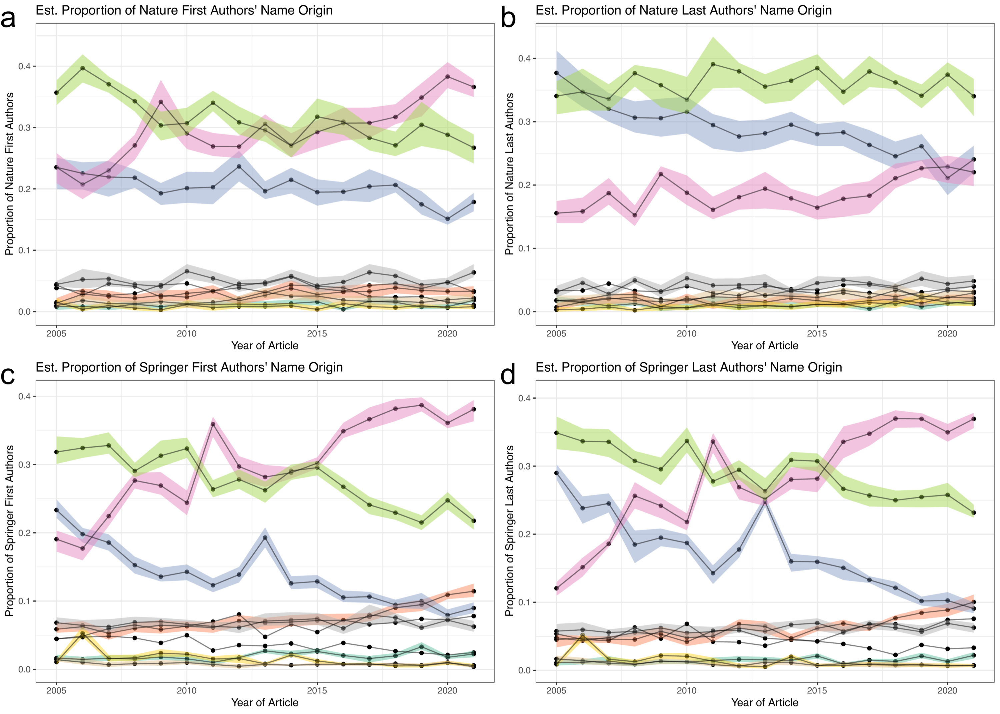

Fig3\_name\_origin
================
Natalie Davidson
5/3/2021

## Overview

This notebook generates figure 3 and additional supplemental figures.

The **data** it uses to build the plots are here:

This document compares two "foreground" datasets (estimated name origin of authors quoted + cited in nature news articles) and compares it to two possible "background" datasets (random sampling of 2.4K Springer articles, and all nature articles)

The quote data file is: `./data/author_data/all_speaker_fullname_pred.tsv` The names mentioned data file is: `./data/author_data/all_mentioned_fullname_pred.tsv` The bg data file is: `./data/author_data/all_author_fullname_pred.tsv`

The three corpi are indexed by the `corpus` column:

1.  `news_quotes`: **foreground** est. name origin of Nature News quoted speaker

2.  `nature_last`: **background** est. name origin of last author of Nature articles.

3.  `springer_last`: **background** est. name origin of last author of a random subset of Springer articles.

The **pdfs** included in the plots are here:

1.  `/figure_notebooks/illustrator_pdfs/`

The **setting + helper functions** to generate the plots are here:

1.  plotting related functions: `/utils/plotting_utils.R`

2.  reading + data processing related functions: `/utils/scraper_processing_utils.R` and `/analysis_scripts/analysis_utils.R`

3.  nautre research article and springer specific data processing functions: `/process_doi_data/springer_scripts/springer_scrape_utils.R`

## Read in the data

``` r
# read in the scraped news articles for each year
# we will need this later for filtering out articles in columns
# we would like to ignore
news_scraped_dir = file.path(proj_dir,
                    "/data/scraped_data/")
news_scraped_dir_files = list.dirs(news_scraped_dir, full.names = T)
news_scraped_dir_files = grep("coreNLP_output", news_scraped_dir_files, value=T)

news_df = NA
for(curr_dir in news_scraped_dir_files){
    
    curr_files = list.files(curr_dir, full.names = T)

    
    # if the json file was empty, skip
    if(length(curr_files) == 0 ){
        next
    }
    
    # get the year form the file name
    file_name_year = substring(basename(curr_dir), 
                            16, 19)
    
    # get the news article type from the file name
    file_name_type = substring(basename(curr_dir), 
                            21, nchar(basename(curr_dir)))
    
    # format the output
    article_ids = gsub(".txt.json", "", basename(curr_files))
    num_articles = length(article_ids)
    curr_info_df = data.frame(year=file_name_year, 
                                type=file_name_type, 
                                file_id=article_ids)
    news_df = rbind(news_df, curr_info_df)
    
}
news_df = news_df[-1,]

# filter out career column and news-and-views
news_df = subset(news_df, !type %in% c("career-column", "news-and-views", "guardian"))
head(news_df)
```

    ##      year type        file_id
    ## 1123 2005 news  041220-1.html
    ## 1124 2005 news  050103-1.html
    ## 1125 2005 news 050103-10.html
    ## 1126 2005 news 050103-11.html
    ## 1127 2005 news 050103-12.html
    ## 1128 2005 news  050103-2.html

``` r
# read in raw quotes data for filtering
full_quote_df = NA
quote_files = list.files(file.path(proj_dir,"/data/scraped_data/", sep=""), full.names = T)
quote_files = grep("quote_table_raw_", quote_files, value=T)
for(quote_file in quote_files){
    
    quote_df = read_corenlp_quote_files(quote_file)
    quote_df$year = str_extract(quote_file, "[1-9][0-9]+") # curr_year
    quote_df$type = substring(basename(quote_file), 
                            22, nchar(basename(quote_file))-4)
    
    full_quote_df = rbind(full_quote_df, quote_df)
}
full_quote_df = full_quote_df[-1,]

# filter out articles with more than 25 quotes
num_quotes = table(full_quote_df$file_id)
too_many_quotes_idx = which(num_quotes > 25)
too_many_quotes_file_id = names(num_quotes)[too_many_quotes_idx]


# first read in the quote data
name_pred_file = file.path(proj_dir, 
                             "/data/author_data/all_speaker_fullname_pred.tsv")
name_info_file = file.path(proj_dir, 
                             "/data/author_data/all_speaker_fullname.tsv")

quote_name_df = read_name_origin(name_pred_file, name_info_file)
quote_name_df$name_origin[quote_name_df$name_origin == "Jewish"] = "Hebrew"
quote_name_df = subset(quote_name_df, !file_id %in% too_many_quotes_file_id)

# second read in the names mentioned data
name_pred_file = file.path(proj_dir, 
                             "/data/author_data/all_mentioned_fullname_pred.tsv")
name_info_file = file.path(proj_dir, 
                             "/data/author_data/all_mentioned_fullname.tsv")

mentioned_name_df = read_name_origin(name_pred_file, name_info_file)
mentioned_name_df$name_origin[mentioned_name_df$name_origin == "Jewish"] = "Hebrew"
mentioned_name_df = subset(mentioned_name_df, !file_id %in% too_many_quotes_file_id)


# now read in the BG data
name_pred_file = file.path(proj_dir, 
                         "/data/author_data/all_author_fullname_pred.tsv")
name_info_file = file.path(proj_dir, 
                         "/data/author_data/all_author_fullname.tsv")
cite_name_df = read_name_origin(name_pred_file, name_info_file)
cite_name_df$name_origin[cite_name_df$name_origin == "Jewish"] = "Hebrew"


# get first authors in the citations
cite_name_df_first = subset(cite_name_df, author_pos == "first")

# format the corpus for consistent naming across figures
cite_name_df_first$corpus[cite_name_df_first$corpus == "springer_articles"] = "springer_first"
cite_name_df_first$corpus[cite_name_df_first$corpus == "nature_articles"] = "nature_first"
cite_name_df_first$corpus[cite_name_df_first$corpus == "naturenews_citations"] = "news_first"


# get last authors in the citations
cite_name_df_last = subset(cite_name_df, author_pos == "last")

# format the corpus for consistent naming across figures
cite_name_df_last$corpus[cite_name_df_last$corpus == "springer_articles"] = "springer_last"
cite_name_df_last$corpus[cite_name_df_last$corpus == "nature_articles"] = "nature_last"
cite_name_df_last$corpus[cite_name_df_last$corpus == "naturenews_citations"] = "news_last"

# join together
cite_name_df = rbind(cite_name_df_first, cite_name_df_last)

# seperate out citations from columns by journalists vs scientists
journalist_idx = which(cite_name_df$corpus == "news_first" &
                         cite_name_df$file_id %in% news_df$file_id)
scientist_idx = which(cite_name_df$corpus == "news_first" &
                         !cite_name_df$file_id %in% news_df$file_id)
cite_name_df$corpus[journalist_idx] = "citation_journalist_first"
cite_name_df$corpus[scientist_idx] = "citation_scientist_first"

journalist_idx = which(cite_name_df$corpus == "news_last" &
                         cite_name_df$file_id %in% news_df$file_id)
scientist_idx = which(cite_name_df$corpus == "news_last" &
                         !cite_name_df$file_id %in% news_df$file_id)
cite_name_df$corpus[journalist_idx] = "citation_journalist_last"
cite_name_df$corpus[scientist_idx] = "citation_scientist_last"


# now we want to join these two datasets together
# we assume a quote is comparable to a publication
# so we will have a quote set as a doi
quote_name_df$doi = quote_name_df$quote
quote_name_df$corpus = "quote"
#quote_name_df$corpus[which(quote_name_df$type == "guardian")] = "guardian_quote"

# we assume a name mentioned is comparable to a publication
# so we will have a name + file_id as a doi
mentioned_name_df$doi = paste(mentioned_name_df$author, 
                              mentioned_name_df$file_id, 
                              sep="_")
mentioned_name_df$corpus = "mention"
#mentioned_name_df$corpus[which(mentioned_name_df$type == "guardian")] = "guardian_mention"

# filter the article types we don't want to use
quote_name_df = subset(quote_name_df, !type %in% c("career-column", "news-and-views", "guardian"))
mentioned_name_df = subset(mentioned_name_df, !type %in% c("career-column", "news-and-views", "guardian"))


col_ids = c("author", "year", "name_origin", "corpus", "doi")
name_df = rbind(cite_name_df[,col_ids], 
                quote_name_df[,col_ids], 
                mentioned_name_df[,col_ids])
head(name_df)
```

    ##                author year  name_origin         corpus
    ## 5         A-Mf Jacobs 2007     European springer_first
    ## 6            AA Hanke 2010    EastAsian springer_first
    ## 7         Aakash Basu 2020   SouthAsian   nature_first
    ## 9          Aalya Amin 2012 ArabTurkPers springer_first
    ## 10 AAM Coelho-Castelo 2006     European springer_first
    ## 11      Aamir Alamgir 2019 ArabTurkPers springer_first
    ##                               doi
    ## 5      doi:10.1038/sj.onc.1210387
    ## 6   doi:10.1186/2047-783X-15-2-59
    ## 7  doi:10.1038/s41586-020-03052-3
    ## 9  doi:10.1186/1753-6561-6-S5-O16
    ## 10      doi:10.1186/1479-0556-4-1
    ## 11  doi:10.1007/s13201-019-1049-y

``` r
name_df = unique(name_df)
```

## Process Data

### summarize the number of articles/quotes/citations considered in each corpus

``` r
citation_j_total1 = unique(subset(name_df, corpus == "citation_journalist_first", select=c(doi, year)) )
tot_prop_citation_j1 = citation_j_total1 %>% 
                group_by(year) %>% 
                summarise(n()) 
tot_prop_citation_j1$corpus = "citation_journalist_first"

citation_s_total1 = unique(subset(name_df, corpus == "citation_scientist_first", select=c(doi, year)) )
tot_prop_citation_s1 = citation_s_total1 %>% 
                group_by(year) %>% 
                summarise(n()) 
tot_prop_citation_s1$corpus = "citation_scientist_first"

citation_j_total2 = unique(subset(name_df, corpus == "citation_journalist_last", select=c(doi, year)) )
tot_prop_citation_j2 = citation_j_total2 %>% 
                group_by(year) %>% 
                summarise(n()) 
tot_prop_citation_j2$corpus = "citation_journalist_last"

citation_s_total2 = unique(subset(name_df, corpus == "citation_scientist_last", select=c(doi, year)) )
tot_prop_citation_s2 = citation_s_total2 %>% 
                group_by(year) %>% 
                summarise(n()) 
tot_prop_citation_s2$corpus = "citation_scientist_last"

quote_total = unique(subset(name_df, corpus == "quote", select=c(doi, year)) )
tot_prop_quote = quote_total %>% 
                group_by(year) %>% 
                summarise(n()) 
tot_prop_quote$corpus = "quote"

#quote_total = unique(subset(name_df, corpus == "guardian_quote", select=c(doi, year)) )
#tot_prop_g_quote = quote_total %>% 
#                group_by(year) %>% 
#                summarise(n()) 
#tot_prop_g_quote$corpus = "guardian_quote"

springer_total = unique(subset(name_df, corpus == "springer_last", select=c(doi, year)) )
tot_prop_springer_last = springer_total %>% 
                group_by(year) %>% 
                summarise(n()) 
tot_prop_springer_last$corpus = "springer_last"

nature_total = unique(subset(name_df, corpus == "nature_last", select=c(doi, year)) )
tot_prop_nature_last = nature_total %>% 
                group_by(year) %>% 
                summarise(n()) 
tot_prop_nature_last$corpus = "nature_last"


springer_total = unique(subset(name_df, corpus == "springer_first", select=c(doi, year)) )
tot_prop_springer_first = springer_total %>% 
                group_by(year) %>% 
                summarise(n()) 
tot_prop_springer_first$corpus = "springer_first"

nature_total = unique(subset(name_df, corpus == "nature_first", select=c(doi, year)) )
tot_prop_nature_first = nature_total %>% 
                group_by(year) %>% 
                summarise(n()) 
tot_prop_nature_first$corpus = "nature_first"


mention_total = unique(subset(name_df, corpus == "mention", select=c(doi, year)) )
tot_prop_mention = mention_total %>% 
                group_by(year) %>% 
                summarise(n()) 
tot_prop_mention$corpus = "mention"

#mention_total = unique(subset(name_df, corpus == "guardian_mention", select=c(doi, year)) )
#tot_prop_g_mention = mention_total %>% 
#                group_by(year) %>% 
#                summarise(n()) 
#tot_prop_g_mention$corpus = "guardian_mention"

num_art_tot = Reduce(rbind, list(tot_prop_citation_j1, 
                                 tot_prop_citation_s1,
                                 tot_prop_citation_j2, 
                                 tot_prop_citation_s2,
                                 tot_prop_quote,
                                 tot_prop_springer_first, 
                                 tot_prop_nature_first,
                                 tot_prop_springer_last, 
                                 tot_prop_nature_last,
                                 tot_prop_mention))
num_art_tot = data.frame(num_art_tot)
colnames(num_art_tot)[2] = "tot_articles"

print("total of observations")
```

    ## [1] "total of observations"

``` r
num_art_tot %>% 
    group_by(corpus) %>% 
    summarise(n()) 
```

    ## # A tibble: 10 × 2
    ##    corpus                    `n()`
    ##    <chr>                     <int>
    ##  1 citation_journalist_first    16
    ##  2 citation_journalist_last     16
    ##  3 citation_scientist_first     16
    ##  4 citation_scientist_last      16
    ##  5 mention                      16
    ##  6 nature_first                 16
    ##  7 nature_last                  16
    ##  8 quote                        16
    ##  9 springer_first               16
    ## 10 springer_last                16

``` r
print("median of observations")
```

    ## [1] "median of observations"

``` r
num_art_tot %>% 
    group_by(corpus) %>% 
    summarise(median(tot_articles)) 
```

    ## # A tibble: 10 × 2
    ##    corpus                    `median(tot_articles)`
    ##    <chr>                                      <dbl>
    ##  1 citation_journalist_first                   269 
    ##  2 citation_journalist_last                    268 
    ##  3 citation_scientist_first                    676.
    ##  4 citation_scientist_last                     664 
    ##  5 mention                                    4752 
    ##  6 nature_first                                694.
    ##  7 nature_last                                 684.
    ##  8 quote                                      5696.
    ##  9 springer_first                             1727 
    ## 10 springer_last                              1710

``` r
print("min of observations")
```

    ## [1] "min of observations"

``` r
num_art_tot %>% 
    group_by(corpus) %>% 
    summarise(min(tot_articles)) 
```

    ## # A tibble: 10 × 2
    ##    corpus                    `min(tot_articles)`
    ##    <chr>                                   <int>
    ##  1 citation_journalist_first                 144
    ##  2 citation_journalist_last                  142
    ##  3 citation_scientist_first                  518
    ##  4 citation_scientist_last                   512
    ##  5 mention                                  3225
    ##  6 nature_first                              573
    ##  7 nature_last                               568
    ##  8 quote                                    3788
    ##  9 springer_first                           1341
    ## 10 springer_last                            1332

### Get bootstrap estimates

``` r
# helper method for calling the bootstrap
get_subboot <- function(origin_id, curr_corpus, in_df, bootstrap_col_id="doi"){
    bootstrap_res = compute_bootstrap_location(subset(in_df, 
                                                      corpus==curr_corpus), 
                                              year_col_id = "year", 
                                              article_col_id = bootstrap_col_id, 
                                              country_col_id = "name_origin",
                                              country_agg = origin_id, 
                                              conf_int = 0.95)
    bootstrap_df = bootstrap_res$quantile_res
    bootstrap_raw = bootstrap_res$boot_res
    
    bootstrap_df$name_origin = origin_id
    bootstrap_raw$name_origin = origin_id
    
    # add a label for plotting later
    bootstrap_df$label[bootstrap_df$year == 2020] = 
        bootstrap_df$name_origin[bootstrap_df$year == 2020]
        

    return(list(bootstrap_df=bootstrap_df, bootstrap_raw=bootstrap_raw))

}

call_get_subboot <- function(name_df, curr_corpus){
    
    # get the bootstrapped CI for each source data type
    origin_df = NA
    origin_raw = NA
    for(curr_origin in unique(name_df$name_origin)){
        print(curr_origin)
        res = get_subboot(curr_origin, 
                          curr_corpus=curr_corpus,
                          name_df)
        origin_df = rbind(origin_df, res[[1]])
        origin_raw = rbind(origin_raw, res[[2]])
    }
    origin_df = origin_df[-1,]
    origin_raw = origin_raw[-1,]
    
    origin_df$corpus = curr_corpus
    origin_raw$corpus = curr_corpus
    
    return(list(quant_df=origin_df, raw_df=origin_raw))

}

if(RERUN_BOOTSTRAP){
    
    # get the bootstrapped CI for each source data type
    res = call_get_subboot(name_df, "citation_journalist_first")
    citation_j_origin_df1 = res$quant_df
    citation_j_origin_raw1 = res$raw_df
      
    res = call_get_subboot(name_df, "citation_scientist_first")
    citation_s_origin_df1 = res$quant_df
    citation_s_origin_raw1 = res$raw_df

    res = call_get_subboot(name_df, "citation_journalist_last")
    citation_j_origin_df2 = res$quant_df
    citation_j_origin_raw2 = res$raw_df
    
    res = call_get_subboot(name_df, "citation_scientist_last")
    citation_s_origin_df2 = res$quant_df
    citation_s_origin_raw2 = res$raw_df
       
    res = call_get_subboot(name_df, "quote")
    quote_origin_df = res$quant_df
    quote_origin_raw = res$raw_df

    res = call_get_subboot(name_df, "springer_last")
    springer_origin_df_last = res$quant_df
    springer_origin_df_last_raw = res$raw_df

    res = call_get_subboot(name_df, "nature_last")
    nature_origin_df_last = res$quant_df
    nature_origin_df_last_raw = res$raw_df
    
    
    res = call_get_subboot(name_df, "springer_first")
    springer_origin_df_first = res$quant_df
    springer_origin_df_first_raw = res$raw_df
    
    
    res = call_get_subboot(name_df, "nature_first")
    nature_origin_df_first = res$quant_df
    nature_origin_df_first_raw = res$raw_df
    
    
    res = call_get_subboot(name_df, "mention")
    mention_origin_df = res$quant_df
    mention_origin_raw = res$raw_df
    
    
    all_bootstrap_df = Reduce(rbind, list(quote_origin_df,
                                       citation_j_origin_df1,
                                       citation_s_origin_df1,
                                       citation_j_origin_df2,
                                       citation_s_origin_df2,
                                       nature_origin_df_first,
                                       springer_origin_df_first,
                                       nature_origin_df_last,
                                       springer_origin_df_last,
                                       mention_origin_df))
    all_bootstrap_df$corpus = factor(all_bootstrap_df$corpus, levels = QUOTE_ANALYSIS_ORDER)
    
    outfile = file.path(proj_dir,"/figure_notebooks/manuscript_figs/fig3_tmp/all_bootstrap_df.tsv")
    write.table(all_bootstrap_df, outfile, sep="\t", quote=F, row.names=F)
    
    raw_bootstrap_df = Reduce(rbind, list(quote_origin_raw,
                                       citation_j_origin_raw1,
                                       citation_s_origin_raw1,
                                       citation_j_origin_raw2,
                                       citation_s_origin_raw2,
                                       nature_origin_df_first_raw,
                                       springer_origin_df_first_raw,
                                       nature_origin_df_last_raw,
                                       springer_origin_df_last_raw,
                                       mention_origin_raw))
    raw_bootstrap_df$corpus = factor(raw_bootstrap_df$corpus, levels = QUOTE_ANALYSIS_ORDER)
    
    outfile = file.path(proj_dir,"/figure_notebooks/manuscript_figs/fig3_tmp/raw_bootstrap_df.tsv")
    write.table(raw_bootstrap_df, outfile, sep="\t", quote=F, row.names=F)

}else{
    
    raw_bootstrap_file = file.path(proj_dir,
                                      "/figure_notebooks/manuscript_figs/fig3_tmp/raw_bootstrap_df.tsv")
    raw_bootstrap_df = data.frame(fread(raw_bootstrap_file))

    all_bootstrap_file = file.path(proj_dir,
                                      "/figure_notebooks/manuscript_figs/fig3_tmp/all_bootstrap_df.tsv")
    all_bootstrap_df = data.frame(fread(all_bootstrap_file))
    
    citation_j_origin_df1 = subset(all_bootstrap_df, corpus == "citation_journalist_first")
    citation_s_origin_df1 = subset(all_bootstrap_df, corpus == "citation_scientist_first")
    citation_j_origin_df2 = subset(all_bootstrap_df, corpus == "citation_journalist_last")
    citation_s_origin_df2 = subset(all_bootstrap_df, corpus == "citation_scientist_last")

    quote_origin_df = subset(all_bootstrap_df, corpus == "quote")
    #g_quote_origin_df = subset(all_bootstrap_df, corpus == "guardian_quote")
    
    springer_origin_df_first = subset(all_bootstrap_df, corpus == "springer_first")
    nature_origin_df_first = subset(all_bootstrap_df, corpus == "nature_first")
    springer_origin_df_last = subset(all_bootstrap_df, corpus == "springer_last")
    nature_origin_df_last = subset(all_bootstrap_df, corpus == "nature_last")
    
    mention_origin_df = subset(all_bootstrap_df, corpus == "mention")
    #g_mention_origin_df = subset(all_bootstrap_df, corpus == "guardian_mention")
    
}

print("citation range of European and CelticEnglish names First author")
```

    ## [1] "citation range of European and CelticEnglish names First author"

``` r
summary(subset(citation_j_origin_df1, 
               name_origin %in% c("European", "CelticEnglish"))$mean)
```

    ##    Min. 1st Qu.  Median    Mean 3rd Qu.    Max. 
    ##  0.1927  0.2802  0.3027  0.2987  0.3279  0.3961

``` r
summary(subset(citation_s_origin_df1, 
               name_origin %in% c("European", "CelticEnglish"))$mean)
```

    ##    Min. 1st Qu.  Median    Mean 3rd Qu.    Max. 
    ##  0.2179  0.2579  0.2911  0.2966  0.3280  0.3707

``` r
print("citation range of European and CelticEnglish names Last author")
```

    ## [1] "citation range of European and CelticEnglish names Last author"

``` r
summary(subset(citation_j_origin_df2, 
               name_origin %in% c("European", "CelticEnglish"))$mean)
```

    ##    Min. 1st Qu.  Median    Mean 3rd Qu.    Max. 
    ##  0.2493  0.3160  0.3326  0.3361  0.3592  0.4223

``` r
summary(subset(citation_s_origin_df2, 
               name_origin %in% c("European", "CelticEnglish"))$mean)
```

    ##    Min. 1st Qu.  Median    Mean 3rd Qu.    Max. 
    ##  0.2628  0.3153  0.3663  0.3532  0.3971  0.4279

``` r
print("citation range of East names first")
```

    ## [1] "citation range of East names first"

``` r
summary(subset(citation_j_origin_df1, 
               name_origin == "EastAsian")$mean)
```

    ##    Min. 1st Qu.  Median    Mean 3rd Qu.    Max. 
    ##  0.1112  0.1645  0.2069  0.1999  0.2327  0.2884

``` r
summary(subset(citation_s_origin_df1, 
               name_origin == "EastAsian")$mean)
```

    ##    Min. 1st Qu.  Median    Mean 3rd Qu.    Max. 
    ##  0.1897  0.2083  0.2255  0.2280  0.2452  0.2711

``` r
print("citation range of East names last")
```

    ## [1] "citation range of East names last"

``` r
summary(subset(citation_j_origin_df2, 
               name_origin == "EastAsian")$mean)
```

    ##    Min. 1st Qu.  Median    Mean 3rd Qu.    Max. 
    ## 0.06431 0.10919 0.14843 0.15028 0.17786 0.24674

``` r
summary(subset(citation_s_origin_df2, 
               name_origin == "EastAsian")$mean)
```

    ##    Min. 1st Qu.  Median    Mean 3rd Qu.    Max. 
    ##  0.1073  0.1208  0.1360  0.1385  0.1579  0.1719

``` r
print("quote range of East names first")
```

    ## [1] "quote range of East names first"

``` r
summary(subset(quote_origin_df, 
               name_origin == "EastAsian")$mean)
```

    ##    Min. 1st Qu.  Median    Mean 3rd Qu.    Max. 
    ## 0.05049 0.05851 0.06664 0.06532 0.07185 0.07683

``` r
#summary(subset(g_quote_origin_df, 
#               name_origin == "EastAsian")$mean)

print("citation range of non European or non CelticEnglish or non EastAsian names first")
```

    ## [1] "citation range of non European or non CelticEnglish or non EastAsian names first"

``` r
summary(subset(citation_j_origin_df1, 
               !name_origin %in% c("European", "CelticEnglish", "EastAsian"))$mean)
```

    ##    Min. 1st Qu.  Median    Mean 3rd Qu.    Max. 
    ## 0.00000 0.01453 0.02822 0.02897 0.04308 0.08077

``` r
summary(subset(citation_s_origin_df1, 
               !name_origin %in% c("European", "CelticEnglish", "EastAsian"))$mean)
```

    ##     Min.  1st Qu.   Median     Mean  3rd Qu.     Max. 
    ## 0.001981 0.013038 0.024678 0.025540 0.036225 0.059169

``` r
print("citation range of non European or non CelticEnglish or non EastAsian names last")
```

    ## [1] "citation range of non European or non CelticEnglish or non EastAsian names last"

``` r
summary(subset(citation_j_origin_df2, 
               !name_origin %in% c("European", "CelticEnglish", "EastAsian"))$mean)
```

    ##    Min. 1st Qu.  Median    Mean 3rd Qu.    Max. 
    ## 0.00000 0.01160 0.02122 0.02536 0.03652 0.07935

``` r
summary(subset(citation_s_origin_df2, 
               !name_origin %in% c("European", "CelticEnglish", "EastAsian"))$mean)
```

    ##     Min.  1st Qu.   Median     Mean  3rd Qu.     Max. 
    ## 0.003282 0.011732 0.021176 0.022147 0.030897 0.051859

## Make the Reference table

``` r
conf_int = 0.95

get_FC_summary <- function(raw_bootstrap_df, curr_corpus_fg, curr_corpus_bg,
                           name_origins, conf_int){
    
    all_res = NA
    for(curr_name_origin in name_origins){
        
        curr_fg_df = subset(raw_bootstrap_df, corpus == curr_corpus_fg &
                                   name_origin == curr_name_origin)
        curr_fg_df = curr_fg_df[,c("year", "boot")]
        colnames(curr_fg_df)[2] = "boot_fg"
        curr_fg_df = curr_fg_df[order(curr_fg_df$year), ]
        
        curr_bg_df = subset(raw_bootstrap_df, corpus == curr_corpus_bg &
                                           name_origin == curr_name_origin)
        curr_bg_df = curr_bg_df[,c("year", "boot")]
        colnames(curr_bg_df)[2] = "boot_bg"
        curr_bg_df = curr_bg_df[order(curr_bg_df$year), ]
        
        # these are random samples, so we just need to align them by year
        # to get the boot strap estimation of thee FC
        curr_df = cbind(curr_fg_df, curr_bg_df$boot_bg)
        colnames(curr_df)[3] = "boot_bg"
        curr_df$FC = curr_df$boot_fg / curr_df$boot_bg
        
        # summarize -- we are year agnostic in the summary because 
        # the FC is already calculated on a per year basis
        curr_df = curr_df %>%
                        summarize(bot_quant = quantile(FC, 1-conf_int),
                                  top_quant = quantile(FC, conf_int),
                                  mean(FC))
        
        res_str = paste0(round(curr_df$`mean(FC)`, 2),
                         " (", 
                         round(curr_df$bot_quant, 2),
                         ", ",
                         round(curr_df$top_quant, 2),
                         ")")
        curr_df$res_str = res_str
        all_res = rbind(all_res, curr_df)
    }
    
    all_res = all_res[-1,]
    
    
    all_res$name_origin = name_origins
    
    str_tab = t(all_res$res_str)
    colnames(str_tab) = name_origins
    rownames(str_tab) = paste(curr_corpus_fg, "vs.", curr_corpus_bg)

    return(str_tab)

}


name_origins = c("CelticEnglish", "EastAsian", "European")

cite_1_j = get_FC_summary(raw_bootstrap_df, 
                             curr_corpus_fg = "citation_journalist_first", 
                             curr_corpus_bg = "nature_first", 
                             name_origins, conf_int)

cite_2_j = get_FC_summary(raw_bootstrap_df, 
                             curr_corpus_fg = "citation_journalist_last", 
                             curr_corpus_bg = "nature_last", 
                             name_origins, conf_int)

cite_1_s = get_FC_summary(raw_bootstrap_df, 
                             curr_corpus_fg = "citation_scientist_first", 
                             curr_corpus_bg = "nature_first", 
                             name_origins, conf_int)

cite_2_s = get_FC_summary(raw_bootstrap_df, 
                             curr_corpus_fg = "citation_scientist_last", 
                             curr_corpus_bg = "nature_last", 
                             name_origins, conf_int)


quote_1 = get_FC_summary(raw_bootstrap_df, 
                             curr_corpus_fg = "quote", 
                             curr_corpus_bg = "nature_first", 
                             name_origins, conf_int)

quote_2 = get_FC_summary(raw_bootstrap_df, 
                             curr_corpus_fg = "quote", 
                             curr_corpus_bg = "nature_last", 
                             name_origins, conf_int)


mention_1 = get_FC_summary(raw_bootstrap_df, 
                             curr_corpus_fg = "mention", 
                             curr_corpus_bg = "nature_first", 
                             name_origins, conf_int)

mention_2 = get_FC_summary(raw_bootstrap_df, 
                             curr_corpus_fg = "mention", 
                             curr_corpus_bg = "nature_last", 
                             name_origins, conf_int)

full_list = list(cite_1_j, cite_2_j,
                 cite_1_s, cite_2_s,
                 quote_1, quote_2,
                 mention_1, mention_2)


final_table = Reduce(rbind, full_list)


knitr::kable(data.frame(final_table), format = "pipe", 
             caption = "Mean fold change comparison with Nature from bootstrap samples with 95% CI")
```

<table style="width:100%;">
<caption>Mean fold change comparison with Nature from bootstrap samples with 95% CI</caption>
<colgroup>
<col width="43%" />
<col width="18%" />
<col width="18%" />
<col width="18%" />
</colgroup>
<thead>
<tr class="header">
<th align="left"></th>
<th align="left">CelticEnglish</th>
<th align="left">EastAsian</th>
<th align="left">European</th>
</tr>
</thead>
<tbody>
<tr class="odd">
<td align="left">citation_journalist_first vs. nature_first</td>
<td align="left">1.37 (0.93, 1.82)</td>
<td align="left">0.68 (0.44, 0.91)</td>
<td align="left">1.01 (0.77, 1.28)</td>
</tr>
<tr class="even">
<td align="left">citation_journalist_last vs. nature_last</td>
<td align="left">1.18 (0.91, 1.58)</td>
<td align="left">0.81 (0.4, 1.27)</td>
<td align="left">0.92 (0.68, 1.17)</td>
</tr>
<tr class="odd">
<td align="left">citation_scientist_first vs. nature_first</td>
<td align="left">1.28 (1.04, 1.56)</td>
<td align="left">0.8 (0.64, 1.02)</td>
<td align="left">1.06 (0.88, 1.25)</td>
</tr>
<tr class="even">
<td align="left">citation_scientist_last vs. nature_last</td>
<td align="left">1.11 (0.93, 1.34)</td>
<td align="left">0.76 (0.56, 1)</td>
<td align="left">1.07 (0.91, 1.22)</td>
</tr>
<tr class="odd">
<td align="left">quote vs. nature_first</td>
<td align="left">2.2 (1.8, 2.64)</td>
<td align="left">0.23 (0.18, 0.29)</td>
<td align="left">1.02 (0.79, 1.23)</td>
</tr>
<tr class="even">
<td align="left">quote vs. nature_last</td>
<td align="left">1.54 (1.33, 1.85)</td>
<td align="left">0.36 (0.28, 0.47)</td>
<td align="left">0.89 (0.78, 1.01)</td>
</tr>
<tr class="odd">
<td align="left">mention vs. nature_first</td>
<td align="left">2.1 (1.69, 2.53)</td>
<td align="left">0.27 (0.21, 0.33)</td>
<td align="left">1.02 (0.8, 1.24)</td>
</tr>
<tr class="even">
<td align="left">mention vs. nature_last</td>
<td align="left">1.47 (1.26, 1.76)</td>
<td align="left">0.42 (0.32, 0.52)</td>
<td align="left">0.89 (0.78, 1)</td>
</tr>
</tbody>
</table>

``` r
##### Same for Springer

cite_1_j = get_FC_summary(raw_bootstrap_df, 
                             curr_corpus_fg = "citation_journalist_first", 
                             curr_corpus_bg = "springer_first", 
                             name_origins, conf_int)

cite_2_j = get_FC_summary(raw_bootstrap_df, 
                             curr_corpus_fg = "citation_journalist_last", 
                             curr_corpus_bg = "springer_last", 
                             name_origins, conf_int)

cite_1_s = get_FC_summary(raw_bootstrap_df, 
                             curr_corpus_fg = "citation_scientist_first", 
                             curr_corpus_bg = "springer_last", 
                             name_origins, conf_int)

cite_2_s = get_FC_summary(raw_bootstrap_df, 
                             curr_corpus_fg = "citation_scientist_last", 
                             curr_corpus_bg = "nature_last", 
                             name_origins, conf_int)


quote_1 = get_FC_summary(raw_bootstrap_df, 
                             curr_corpus_fg = "quote", 
                             curr_corpus_bg = "springer_last", 
                             name_origins, conf_int)

quote_2 = get_FC_summary(raw_bootstrap_df, 
                             curr_corpus_fg = "quote", 
                             curr_corpus_bg = "nature_last", 
                             name_origins, conf_int)


mention_1 = get_FC_summary(raw_bootstrap_df, 
                             curr_corpus_fg = "mention", 
                             curr_corpus_bg = "springer_last", 
                             name_origins, conf_int)

mention_2 = get_FC_summary(raw_bootstrap_df, 
                             curr_corpus_fg = "mention", 
                             curr_corpus_bg = "nature_last", 
                             name_origins, conf_int)

full_list = list(cite_1_j, cite_2_j,
                 cite_1_s, cite_2_s,
                 quote_1, quote_2,
                 mention_1, mention_2)


final_table = Reduce(rbind, full_list)


knitr::kable(data.frame(final_table), format = "pipe", 
             caption = "Mean fold change comparison with Springer Nature from bootstrap samples with 95% CI")
```

<table>
<caption>Mean fold change comparison with Springer Nature from bootstrap samples with 95% CI</caption>
<colgroup>
<col width="44%" />
<col width="18%" />
<col width="18%" />
<col width="18%" />
</colgroup>
<thead>
<tr class="header">
<th align="left"></th>
<th align="left">CelticEnglish</th>
<th align="left">EastAsian</th>
<th align="left">European</th>
</tr>
</thead>
<tbody>
<tr class="odd">
<td align="left">citation_journalist_first vs. springer_first</td>
<td align="left">2.08 (1.42, 2.9)</td>
<td align="left">0.68 (0.45, 0.94)</td>
<td align="left">1.15 (0.87, 1.53)</td>
</tr>
<tr class="even">
<td align="left">citation_journalist_last vs. springer_last</td>
<td align="left">2.08 (1.31, 3.26)</td>
<td align="left">0.56 (0.28, 0.81)</td>
<td align="left">1.13 (0.87, 1.43)</td>
</tr>
<tr class="odd">
<td align="left">citation_scientist_first vs. springer_last</td>
<td align="left">1.59 (0.95, 2.29)</td>
<td align="left">0.9 (0.61, 1.67)</td>
<td align="left">1.15 (0.91, 1.37)</td>
</tr>
<tr class="even">
<td align="left">citation_scientist_last vs. nature_last</td>
<td align="left">1.11 (0.93, 1.34)</td>
<td align="left">0.76 (0.56, 1)</td>
<td align="left">1.07 (0.91, 1.22)</td>
</tr>
<tr class="odd">
<td align="left">quote vs. springer_last</td>
<td align="left">2.71 (1.78, 3.91)</td>
<td align="left">0.26 (0.18, 0.5)</td>
<td align="left">1.1 (0.84, 1.37)</td>
</tr>
<tr class="even">
<td align="left">quote vs. nature_last</td>
<td align="left">1.54 (1.33, 1.85)</td>
<td align="left">0.36 (0.28, 0.47)</td>
<td align="left">0.89 (0.78, 1.01)</td>
</tr>
<tr class="odd">
<td align="left">mention vs. springer_last</td>
<td align="left">2.59 (1.68, 3.75)</td>
<td align="left">0.3 (0.21, 0.56)</td>
<td align="left">1.1 (0.86, 1.34)</td>
</tr>
<tr class="even">
<td align="left">mention vs. nature_last</td>
<td align="left">1.47 (1.26, 1.76)</td>
<td align="left">0.42 (0.32, 0.52)</td>
<td align="left">0.89 (0.78, 1)</td>
</tr>
</tbody>
</table>

## Make the Figures

### generate the overview plot

``` r
#### Overview plot of the number of considered "articles" by type
num_art_tot$corpus = factor(num_art_tot$corpus, levels = intersect(QUOTE_ANALYSIS_ORDER, unique(num_art_tot$corpus)))
tot_art_gg = ggplot(num_art_tot, aes(x=as.numeric(year), y=tot_articles,
                              color=corpus)) +
    geom_point() + geom_line(show.legend = F) + theme_bw() + 
    xlab("Year of Article") + ylab("Number of Total Articles/Quotes/Citations/Mentions") +
    ggtitle("Total number of Articles/Quotes/Citations/Mentions per Corpus") + 
    scale_color_manual(values=QUOTE_ANALYSIS_COLOR[unique(num_art_tot$corpus)],
                      labels=QUOTE_ANALYSIS_LABELS[unique(num_art_tot$corpus)]) +
    theme(legend.position="bottom")

ggsave(file.path(proj_dir, "/figure_notebooks/manuscript_figs/fig3_tmp/tot_art_gg.pdf"),
       tot_art_gg, width = 10, height = 5, units = "in", device = "pdf")
```

### generate the citation plots

``` r
#### plot the overview of name origin by citation
citation_j_overview_gg1 = ggplot(citation_j_origin_df1, aes(x=as.numeric(year), y=mean,
                          ymin=bottom_CI, ymax=top_CI,
                          fill=name_origin, label=label)) +
    geom_point() + geom_ribbon(alpha=0.5) + geom_line(alpha=0.5) +
    theme_bw() + geom_text_repel() + xlim(c(2005,2021))  +
    xlab("Year of Article") + ylab("Proportion of Journalist Citations") +
    ggtitle("Est. Proportion of the Cited First Author Name Origin (journalist written)") + 
    scale_fill_brewer(palette="Set2") +
    theme(legend.position = "none")
ggsave(file.path(proj_dir, "/figure_notebooks/manuscript_figs/fig3_tmp/citation_j_overview_gg1.pdf"),
       citation_j_overview_gg1, width = 7, height = 5, units = "in", device = "pdf")

citation_j_overview_gg2 = ggplot(citation_j_origin_df2, aes(x=as.numeric(year), y=mean,
                          ymin=bottom_CI, ymax=top_CI,
                          fill=name_origin, label=label)) +
    geom_point() + geom_ribbon(alpha=0.5) + geom_line(alpha=0.5) +
    theme_bw() + geom_text_repel() + xlim(c(2005,2021))  +
    xlab("Year of Article") + ylab("Proportion of Journalist Citations") +
    ggtitle("Est. Proportion of the Cited Last Author Name Origin (journalist written)") + 
    scale_fill_brewer(palette="Set2") +
    theme(legend.position = "none")

ggsave(file.path(proj_dir, "/figure_notebooks/manuscript_figs/fig3_tmp/citation_j_overview_gg2.pdf"),
       citation_j_overview_gg2, width = 7, height = 5, units = "in", device = "pdf")

citation_s_overview_gg1 = ggplot(citation_s_origin_df1, aes(x=as.numeric(year), y=mean,
                          ymin=bottom_CI, ymax=top_CI,
                          fill=name_origin, label=label)) +
    geom_point() + geom_ribbon(alpha=0.5) + geom_line(alpha=0.5) +
    theme_bw() + geom_text_repel() + xlim(c(2005,2021))  +
    xlab("Year of Article") + ylab("Proportion of Scientist Citations") +
    ggtitle("Est. Proportion of the Cited First Author Name Origin (scientist written)") + 
    scale_fill_brewer(palette="Set2") +
    theme(legend.position = "none")

ggsave(file.path(proj_dir, "/figure_notebooks/manuscript_figs/fig3_tmp/citation_s_overview_gg1.pdf"),
       citation_s_overview_gg1, width = 7, height = 5, units = "in", device = "pdf")

citation_s_overview_gg2 = ggplot(citation_s_origin_df2, aes(x=as.numeric(year), y=mean,
                          ymin=bottom_CI, ymax=top_CI,
                          fill=name_origin, label=label)) +
    geom_point() + geom_ribbon(alpha=0.5) + geom_line(alpha=0.5) +
    theme_bw() + geom_text_repel() + xlim(c(2005,2021))  +
    xlab("Year of Article") + ylab("Proportion of Scientist Citations") +
    ggtitle("Est. Proportion of the Cited Last Author Name Origin (scientist written)") + 
    scale_fill_brewer(palette="Set2") +
    theme(legend.position = "none")

ggsave(file.path(proj_dir, "/figure_notebooks/manuscript_figs/fig3_tmp/citation_s_overview_gg2.pdf"),
       citation_s_overview_gg2, width = 7, height = 5, units = "in", device = "pdf")


# plot by each name origin individually
cite_sub = subset(all_bootstrap_df, 
                     corpus %in% c("nature_first", 
                                   "nature_last", 
                                   "citation_journalist_first",
                                   "citation_scientist_first",
                                   "citation_journalist_last",
                                   "citation_scientist_last"))
citation_nature_indiv_full_gg = ggplot(cite_sub, 
                                aes(x=as.numeric(year), y=mean,
                                      ymin=bottom_CI, ymax=top_CI,
                                      fill=corpus)) +
    geom_point() + geom_ribbon(alpha=0.5) + geom_line(alpha=0.5) +
    theme_bw() + 
    xlab("Year of Article") + ylab("Percentage Citations or Articles") +
    ggtitle(paste("Percentage Citations vs Authorship by Name Origin")) + 
    scale_fill_manual(values=QUOTE_ANALYSIS_COLOR[unique(cite_sub$corpus)],
                      labels=QUOTE_ANALYSIS_LABELS[unique(cite_sub$corpus)]) +
    facet_wrap(~ name_origin, scales = "free_y") +
    theme(legend.position="bottom")

ggsave(file.path(proj_dir, "/figure_notebooks/manuscript_figs/fig3_tmp/citation_nature_indiv_full_gg.pdf"),
       citation_nature_indiv_full_gg, width = 7, height = 5, units = "in", device = "pdf")


# plot by each name origin individually

cite_sub = subset(all_bootstrap_df, corpus %in% c("springer_last", 
                                                   "springer_first", 
                                                   "citation_journalist_first",
                                                   "citation_scientist_first",
                                                   "citation_journalist_last",
                                                   "citation_scientist_last"))
citation_springer_indiv_full_gg = ggplot(cite_sub, 
                                aes(x=as.numeric(year), y=mean,
                                      ymin=bottom_CI, ymax=top_CI,
                                      fill=corpus)) +
    geom_point() + geom_ribbon(alpha=0.5) + geom_line(alpha=0.5) +
    theme_bw() + 
    xlab("Year of Article") + ylab("Percentage Citations or Articles") +
    ggtitle(paste("Percentage Citations vs Authorship by Name Origin")) + 
    scale_fill_manual(values=QUOTE_ANALYSIS_COLOR[unique(cite_sub$corpus)],
                      labels=QUOTE_ANALYSIS_LABELS[unique(cite_sub$corpus)]) +
    facet_wrap(~ name_origin, scales = "free_y") +
    theme(legend.position="bottom")

ggsave(file.path(proj_dir, "/figure_notebooks/manuscript_figs/fig3_tmp/citation_springer_indiv_full_gg.pdf"),
       citation_springer_indiv_full_gg, width = 7, height = 5, units = "in", device = "pdf")


cite_sub = subset(all_bootstrap_df, corpus %in% c("nature_first", "nature_last", 
                                                   "citation_journalist_first",
                                                   "citation_journalist_last") &
                                     name_origin %in% c("CelticEnglish", "EastAsian", "European"))
citation_j_nature_indiv_sub_gg = ggplot(cite_sub, 
                                aes(x=as.numeric(year), y=mean,
                                      ymin=bottom_CI, ymax=top_CI,
                                      fill=corpus)) +
    geom_point() + geom_ribbon(alpha=0.5) + geom_line(alpha=0.5) +
    theme_bw() + 
    xlab("Year of Article") + ylab("Percentage Citations or Articles") +
    ggtitle(paste("Prop. Citations vs Authorship by Name Origin in Journalist Written Articles")) + 
    scale_fill_manual(values=QUOTE_ANALYSIS_COLOR[unique(cite_sub$corpus)],
                      labels=QUOTE_ANALYSIS_LABELS[unique(cite_sub$corpus)]) +
    facet_wrap(~ name_origin, dir="h", scales="free") +
    theme(legend.position="bottom")

ggsave(file.path(proj_dir, "/figure_notebooks/manuscript_figs/fig3_tmp/citation_j_nature_indiv_sub_gg.pdf"),
       citation_j_nature_indiv_sub_gg, width = 7, height = 5, units = "in", device = "pdf")

cite_sub = subset(all_bootstrap_df, corpus %in% c("nature_first", "nature_last", 
                                                   "citation_scientist_first",
                                                   "citation_scientist_last") &
                                     name_origin %in% c("CelticEnglish", "EastAsian", "European"))
citation_s_nature_indiv_sub_gg = ggplot(cite_sub, 
                                aes(x=as.numeric(year), y=mean,
                                      ymin=bottom_CI, ymax=top_CI,
                                      fill=corpus)) +
    geom_point() + geom_ribbon(alpha=0.5) + geom_line(alpha=0.5) +
    theme_bw() + 
    xlab("Year of Article") + ylab("Percentage Citations or Articles") +
    ggtitle(paste("Prop. Citations vs Authorship by Name Origin in Scientist Written Articles")) + 
    scale_fill_manual(values=QUOTE_ANALYSIS_COLOR[cite_sub$corpus],
                      labels=QUOTE_ANALYSIS_LABELS[cite_sub$corpus]) +
    facet_wrap(~ name_origin, dir="h", scales="free") +
    theme(legend.position="bottom")

ggsave(file.path(proj_dir, "/figure_notebooks/manuscript_figs/fig3_tmp/citation_s_nature_indiv_sub_gg.pdf"),
       citation_s_nature_indiv_sub_gg, width = 7, height = 5, units = "in", device = "pdf")
```

### generate the quote plots

``` r
#### plot the overview of name origin by quoted speaker
quote_overview_gg = ggplot(quote_origin_df, aes(x=as.numeric(year), y=mean,
                          ymin=bottom_CI, ymax=top_CI,
                          fill=name_origin, label=label)) +
    geom_point() + geom_ribbon(alpha=0.5) + geom_line(alpha=0.5) +
    theme_bw() + geom_text_repel() + xlim(c(2005,2021))  +
    xlab("Year of Article") + ylab("Proportion of Quotes") +
    ggtitle("Est. Proportion of Quoted Speakers' Name Origin") + 
    scale_fill_brewer(palette="Set2") +
    theme(legend.position = "none")

ggsave(file.path(proj_dir, "/figure_notebooks/manuscript_figs/fig3_tmp/quote_overview_gg.pdf"),
       quote_overview_gg, width = 7, height = 5, units = "in", device = "pdf")


# plot by each name origin individually
quote_sub = subset(all_bootstrap_df, corpus %in% 
                                        c("nature_first", "nature_last", "quote"))
quote_nature_indiv_full_gg = ggplot(quote_sub, 
                                aes(x=as.numeric(year), y=mean,
                                      ymin=bottom_CI, ymax=top_CI,
                                      fill=corpus)) +
    geom_point() + geom_ribbon(alpha=0.5) + geom_line(alpha=0.5) +
    theme_bw() + 
    xlab("Year of Article") + ylab("Percentage Quotes or Articles") +
    ggtitle(paste("Percentage Quotes vs Authorship by Name Origin")) + 
    scale_fill_manual(values=QUOTE_ANALYSIS_COLOR[unique(quote_sub$corpus)],
                      labels=QUOTE_ANALYSIS_LABELS[unique(quote_sub$corpus)]) +
    facet_wrap( ~ name_origin, scales = "free_y") +
    theme(legend.position="bottom")

ggsave(file.path(proj_dir, "/figure_notebooks/manuscript_figs/fig3_tmp/quote_nature_indiv_full_gg.pdf"),
       quote_nature_indiv_full_gg, width = 7, height = 5, units = "in", device = "pdf")

quote_sub = subset(all_bootstrap_df, corpus %in% 
                                     c("springer_first", "springer_last", "quote"))
quote_springer_indiv_full_gg = ggplot(quote_sub, 
                                aes(x=as.numeric(year), y=mean,
                                      ymin=bottom_CI, ymax=top_CI,
                                      fill=corpus)) +
    geom_point() + geom_ribbon(alpha=0.5) + geom_line(alpha=0.5) +
    theme_bw() + 
    xlab("Year of Article") + ylab("Percentage Quotes or Articles") +
    ggtitle(paste("Percentage Quotes vs Authorship by Name Origin")) + 
    scale_fill_manual(values=QUOTE_ANALYSIS_COLOR[unique(quote_sub$corpus)],
                      labels=QUOTE_ANALYSIS_LABELS[unique(quote_sub$corpus)]) +
    facet_wrap( ~ name_origin, scales = "free_y") +
    theme(legend.position="bottom")

ggsave(file.path(proj_dir, "/figure_notebooks/manuscript_figs/fig3_tmp/quote_springer_indiv_full_gg.pdf"),
       quote_springer_indiv_full_gg, width = 7, height = 5, units = "in", device = "pdf")

quote_sub = subset(all_bootstrap_df, 
                     corpus %in% 
                         c("nature_first", "nature_last", "quote") &
                     name_origin %in% c("CelticEnglish", "EastAsian", "European"))
quote_nature_indiv_sub_gg = ggplot(quote_sub, 
                                aes(x=as.numeric(year), y=mean,
                                      ymin=bottom_CI, ymax=top_CI,
                                      fill=corpus)) +
    geom_point() + geom_ribbon(alpha=0.5) + geom_line(alpha=0.5) +
    theme_bw() + 
    xlab("Year of Article") + ylab("Percentage Quotes or Articles") +
    ggtitle(paste("Percentage Quotes vs Authorship by Name Origin")) + 
    scale_fill_manual(values=QUOTE_ANALYSIS_COLOR[unique(quote_sub$corpus)],
                      labels=QUOTE_ANALYSIS_LABELS[unique(quote_sub$corpus)]) +
    facet_wrap(~ name_origin) +
    theme(legend.position="bottom")

ggsave(file.path(proj_dir, "/figure_notebooks/manuscript_figs/fig3_tmp/quote_nature_indiv_sub_gg.pdf"),
       quote_nature_indiv_sub_gg, width = 7, height = 5, units = "in", device = "pdf")
```

### generate the mention plots

``` r
#### plot the overview of name origin by mentioned person
mention_overview_gg = ggplot(mention_origin_df, aes(x=as.numeric(year), y=mean,
                          ymin=bottom_CI, ymax=top_CI,
                          fill=name_origin, label=label)) +
    geom_point() + geom_ribbon(alpha=0.5) + geom_line(alpha=0.5) +
    theme_bw() + geom_text_repel() + xlim(c(2005,2021))  +
    xlab("Year of Article") + ylab("Proportion of Mentioned Names") +
    ggtitle("Est. Proportion of Mentioned Speakers' Name Origin") + 
    scale_fill_brewer(palette="Set2") +
    theme(legend.position = "none")

ggsave(file.path(proj_dir, "/figure_notebooks/manuscript_figs/fig3_tmp/mention_overview_gg.pdf"),
       mention_overview_gg, width = 7, height = 5, units = "in", device = "pdf")


# plot by each name origin individually
mention_sub = subset(all_bootstrap_df, 
                         corpus %in% 
                             c("nature_first", "nature_last", "mention"))
mention_nature_indiv_full_gg = ggplot(mention_sub, 
                                aes(x=as.numeric(year), y=mean,
                                      ymin=bottom_CI, ymax=top_CI,
                                      fill=corpus)) +
    geom_point() + geom_ribbon(alpha=0.5) + geom_line(alpha=0.5) +
    theme_bw() + 
    xlab("Year of Article") + ylab("Percentage Mentions or Articles") +
    ggtitle(paste("Percentage Mentions vs Authorship by Name Origin")) + 
    scale_fill_manual(values=QUOTE_ANALYSIS_COLOR[unique(mention_sub$corpus)],
                      labels=QUOTE_ANALYSIS_LABELS[unique(mention_sub$corpus)]) +
    facet_wrap( ~ name_origin, scales = "free_y") +
    theme(legend.position="bottom")

ggsave(file.path(proj_dir, "/figure_notebooks/manuscript_figs/fig3_tmp/mention_nature_indiv_full_gg.pdf"),
       mention_nature_indiv_full_gg, width = 7, height = 5, units = "in", device = "pdf")

mention_sub = subset(all_bootstrap_df, 
                         corpus %in% 
                             c("springer_first", "springer_last", "mention"))
mention_springer_indiv_full_gg = ggplot(mention_sub, 
                                aes(x=as.numeric(year), y=mean,
                                      ymin=bottom_CI, ymax=top_CI,
                                      fill=corpus)) +
    geom_point() + geom_ribbon(alpha=0.5) + geom_line(alpha=0.5) +
    theme_bw() + 
    xlab("Year of Article") + ylab("Percentage Mentions or Articles") +
    ggtitle(paste("Percentage Mentions vs Authorship by Name Origin")) + 
    scale_fill_manual(values=QUOTE_ANALYSIS_COLOR[unique(mention_sub$corpus)],
                      labels=QUOTE_ANALYSIS_LABELS[unique(mention_sub$corpus)]) +
    facet_wrap( ~ name_origin, scales = "free_y") +
    theme(legend.position="bottom")

ggsave(file.path(proj_dir, "/figure_notebooks/manuscript_figs/fig3_tmp/mention_springer_indiv_full_gg.pdf"),
       mention_springer_indiv_full_gg, width = 7, height = 5, units = "in", device = "pdf")


mention_sub = subset(all_bootstrap_df, 
                         corpus %in%
                             c("nature_first", "nature_last", "mention") &
                         name_origin %in% c("CelticEnglish", "EastAsian", "European"))
mention_nature_indiv_sub_gg = ggplot(mention_sub, 
                                aes(x=as.numeric(year), y=mean,
                                      ymin=bottom_CI, ymax=top_CI,
                                      fill=corpus)) +
    geom_point() + geom_ribbon(alpha=0.5) + geom_line(alpha=0.5) +
    theme_bw() + 
    xlab("Year of Article") + ylab("Percentage Mentions or Articles") +
    ggtitle(paste("Percentage Mentions vs Authorship by Name Origin")) + 
    scale_fill_manual(values=QUOTE_ANALYSIS_COLOR[unique(mention_sub$corpus)],
                      labels=QUOTE_ANALYSIS_LABELS[unique(mention_sub$corpus)]) +
    facet_wrap(~ name_origin) +
    theme(legend.position="bottom")

ggsave(file.path(proj_dir, "/figure_notebooks/manuscript_figs/fig3_tmp/mention_nature_indiv_sub_gg.pdf"),
       mention_nature_indiv_sub_gg, width = 7, height = 5, units = "in", device = "pdf")
```

``` r
#### plot the overview of name origin by our background cohorts
nature_first_overview_gg = ggplot(nature_origin_df_first, aes(x=as.numeric(year), y=mean,
                          ymin=bottom_CI, ymax=top_CI,
                          fill=name_origin, label=label)) +
    geom_point() + geom_ribbon(alpha=0.5) + geom_line(alpha=0.5) +
    theme_bw() + geom_text_repel() + xlim(c(2005,2021))  +
    xlab("Year of Article") + ylab("Proportion of Nature First Authors") +
    ggtitle("Est. Proportion of Nature First Authors' Name Origin") + 
    scale_fill_brewer(palette="Set2") +
    theme(legend.position = "none")

ggsave(file.path(proj_dir, "/figure_notebooks/manuscript_figs/fig3_tmp/nature_first_overview_gg.pdf"),
       nature_first_overview_gg, width = 7, height = 5, units = "in", device = "pdf")

nature_last_overview_gg = ggplot(nature_origin_df_last, aes(x=as.numeric(year), y=mean,
                          ymin=bottom_CI, ymax=top_CI,
                          fill=name_origin, label=label)) +
    geom_point() + geom_ribbon(alpha=0.5) + geom_line(alpha=0.5) +
    theme_bw() + geom_text_repel() + xlim(c(2005,2021))  +
    xlab("Year of Article") + ylab("Proportion of Nature Last Authors") +
    ggtitle("Est. Proportion of Nature Last Authors' Name Origin") + 
    scale_fill_brewer(palette="Set2") +
    theme(legend.position = "none")

ggsave(file.path(proj_dir, "/figure_notebooks/manuscript_figs/fig3_tmp/nature_last_overview_gg.pdf"),
       nature_last_overview_gg, width = 7, height = 5, units = "in", device = "pdf")

### springer
springer_first_overview_gg = ggplot(springer_origin_df_first, aes(x=as.numeric(year), y=mean,
                          ymin=bottom_CI, ymax=top_CI,
                          fill=name_origin, label=label)) +
    geom_point() + geom_ribbon(alpha=0.5) + geom_line(alpha=0.5) +
    theme_bw() + geom_text_repel() + xlim(c(2005,2021))  +
    xlab("Year of Article") + ylab("Proportion of Springer First Authors") +
    ggtitle("Est. Proportion of Springer First Authors' Name Origin") + 
    scale_fill_brewer(palette="Set2") +
    theme(legend.position = "none")

ggsave(file.path(proj_dir, "/figure_notebooks/manuscript_figs/fig3_tmp/springer_first_overview_gg.pdf"),
       springer_first_overview_gg, width = 7, height = 5, units = "in", device = "pdf")

springer_last_overview_gg = ggplot(springer_origin_df_last, aes(x=as.numeric(year), y=mean,
                          ymin=bottom_CI, ymax=top_CI,
                          fill=name_origin, label=label)) +
    geom_point() + geom_ribbon(alpha=0.5) + geom_line(alpha=0.5) +
    theme_bw() + geom_text_repel() + xlim(c(2005,2021))  +
    xlab("Year of Article") + ylab("Proportion of Springer Last Authors") +
    ggtitle("Est. Proportion of Springer Last Authors' Name Origin") + 
    scale_fill_brewer(palette="Set2") +
    theme(legend.position = "none")

ggsave(file.path(proj_dir, "/figure_notebooks/manuscript_figs/fig3_tmp/springer_last_overview_gg.pdf"),
       springer_last_overview_gg, width = 7, height = 5, units = "in", device = "pdf")
```

### format main figure

``` r
plot_overview = image_read_pdf(file.path(proj_dir,
                                  "/figure_notebooks/illustrator_pdfs/nature_news_name_origin_schematic.pdf"))
plot_overview = image_annotate(plot_overview, "a", size = 20)


citation_j_nature_indiv_sub_gg = image_read_pdf(file.path(proj_dir,
                                  "/figure_notebooks/manuscript_figs/fig3_tmp/citation_j_nature_indiv_sub_gg.pdf"))
citation_j_nature_indiv_sub_gg = image_annotate(citation_j_nature_indiv_sub_gg, "b", size = 30)


citation_s_nature_indiv_sub_gg = image_read_pdf(file.path(proj_dir,
                                  "/figure_notebooks/manuscript_figs/fig3_tmp/citation_s_nature_indiv_sub_gg.pdf"))
citation_s_nature_indiv_sub_gg = image_annotate(citation_s_nature_indiv_sub_gg, "c", size = 30)


quote_nature_indiv_sub_gg = image_read_pdf(file.path(proj_dir,
                                  "/figure_notebooks/manuscript_figs/fig3_tmp/quote_nature_indiv_sub_gg.pdf"))
quote_nature_indiv_sub_gg = image_annotate(quote_nature_indiv_sub_gg, "d", size = 30)


mention_nature_indiv_sub_gg = image_read_pdf(file.path(proj_dir,
                                  "/figure_notebooks/manuscript_figs/fig3_tmp/mention_nature_indiv_sub_gg.pdf"))
mention_nature_indiv_sub_gg = image_annotate(mention_nature_indiv_sub_gg, "e", size = 30)


bottom_image <- image_append(image_scale(c(quote_nature_indiv_sub_gg, 
                                           mention_nature_indiv_sub_gg),3000), stack = FALSE)
middle_image <- image_append(image_scale(c(citation_j_nature_indiv_sub_gg,
                                           citation_s_nature_indiv_sub_gg),3000), stack = FALSE)
full_image <- image_append(image_scale(c(plot_overview, middle_image, bottom_image), 3000), stack = TRUE)


print(full_image)
```

    ## # A tibble: 1 × 7
    ##   format width height colorspace matte filesize density
    ##   <chr>  <int>  <int> <chr>      <lgl>    <int> <chr>  
    ## 1 PNG     3000   3044 sRGB       TRUE         0 300x300


``` r
outfile = file.path(proj_dir,"/figure_notebooks/manuscript_figs/fig3_tmp/fig3_main.pdf")
image_write(full_image, format = "pdf", outfile)

outfile = file.path(proj_dir,"/figure_notebooks/manuscript_figs/fig3_tmp/fig3_main.png")
image_write(full_image, format = "png", outfile)
```

### format supp. figure 3

``` r
tot_art_gg = image_read_pdf(file.path(proj_dir,
                                  "/figure_notebooks/manuscript_figs/fig3_tmp/tot_art_gg.pdf"))
tot_art_gg = image_annotate(tot_art_gg, "a", size = 20)

citation_j_overview_gg1 = image_read_pdf(file.path(proj_dir,
                                  "/figure_notebooks/manuscript_figs/fig3_tmp/citation_j_overview_gg1.pdf"))
citation_j_overview_gg1 = image_annotate(citation_j_overview_gg1, "b", size = 30)


citation_s_overview_gg1 = image_read_pdf(file.path(proj_dir,
                                  "/figure_notebooks/manuscript_figs/fig3_tmp/citation_s_overview_gg1.pdf"))
citation_s_overview_gg1 = image_annotate(citation_s_overview_gg1, "c", size = 30)


citation_j_overview_gg2 = image_read_pdf(file.path(proj_dir,
                                  "/figure_notebooks/manuscript_figs/fig3_tmp/citation_j_overview_gg2.pdf"))
citation_j_overview_gg2 = image_annotate(citation_j_overview_gg2, "d", size = 30)


citation_s_overview_gg2 = image_read_pdf(file.path(proj_dir,
                                  "/figure_notebooks/manuscript_figs/fig3_tmp/citation_s_overview_gg2.pdf"))
citation_s_overview_gg2 = image_annotate(citation_s_overview_gg2, "e", size = 30)


quote_overview_gg = image_read_pdf(file.path(proj_dir,
                                  "/figure_notebooks/manuscript_figs/fig3_tmp/quote_overview_gg.pdf"))
quote_overview_gg = image_annotate(quote_overview_gg, "f", size = 30)


mention_overview_gg = image_read_pdf(file.path(proj_dir,
                                  "/figure_notebooks/manuscript_figs/fig3_tmp/mention_overview_gg.pdf"))
mention_overview_gg = image_annotate(mention_overview_gg, "g", size = 30)


bottom_image <- image_append(image_scale(c(quote_overview_gg, 
                                           mention_overview_gg),3000), stack = FALSE)
middle_image1 <- image_append(image_scale(c(citation_j_overview_gg1,
                                           citation_s_overview_gg1),3000), stack = FALSE)
middle_image2 <- image_append(image_scale(c(citation_j_overview_gg2,
                                           citation_s_overview_gg2),3000), stack = FALSE)
full_image <- image_append(c(image_scale(tot_art_gg, 3000), 
                             image_scale(c(middle_image1, middle_image2, 
                                           bottom_image), 3000)), stack = TRUE)
                           

print(full_image)
```

    ## # A tibble: 1 × 7
    ##   format width height colorspace matte filesize density
    ##   <chr>  <int>  <int> <chr>      <lgl>    <int> <chr>  
    ## 1 PNG     3000   4716 sRGB       TRUE         0 300x300


``` r
outfile = file.path(proj_dir,"/figure_notebooks/manuscript_figs/fig3_tmp/fig3_supp.pdf")
image_write(full_image, format = "pdf", outfile)
outfile = file.path(proj_dir,"/figure_notebooks/manuscript_figs/fig3_tmp/fig3_supp.png")
image_write(full_image, format = "png", outfile)
```

### format supp. figure 4

``` r
citation_nature_indiv_full_gg = image_read_pdf(file.path(proj_dir,
                                  "/figure_notebooks/manuscript_figs/fig3_tmp/citation_nature_indiv_full_gg.pdf"))
citation_nature_indiv_full_gg = image_annotate(citation_nature_indiv_full_gg, "a", size = 30)


citation_springer_indiv_full_gg = image_read_pdf(file.path(proj_dir,
                                  "/figure_notebooks/manuscript_figs/fig3_tmp/citation_springer_indiv_full_gg.pdf"))
citation_springer_indiv_full_gg = image_annotate(citation_springer_indiv_full_gg, "b", size = 30)


quote_nature_indiv_full_gg = image_read_pdf(file.path(proj_dir,
                                  "/figure_notebooks/manuscript_figs/fig3_tmp/quote_nature_indiv_full_gg.pdf"))
quote_nature_indiv_full_gg = image_annotate(quote_nature_indiv_full_gg, "c", size = 30)


quote_springer_indiv_full_gg = image_read_pdf(file.path(proj_dir,
                                  "/figure_notebooks/manuscript_figs/fig3_tmp/quote_springer_indiv_full_gg.pdf"))
quote_springer_indiv_full_gg = image_annotate(quote_springer_indiv_full_gg, "d", size = 30)


mention_nature_indiv_full_gg = image_read_pdf(file.path(proj_dir,
                                  "/figure_notebooks/manuscript_figs/fig3_tmp/mention_nature_indiv_full_gg.pdf"))
mention_nature_indiv_full_gg = image_annotate(mention_nature_indiv_full_gg, "e", size = 30)


mention_springer_indiv_full_gg = image_read_pdf(file.path(proj_dir,
                                  "/figure_notebooks/manuscript_figs/fig3_tmp/mention_springer_indiv_full_gg.pdf"))
mention_springer_indiv_full_gg = image_annotate(mention_springer_indiv_full_gg, "f", size = 30)


top_image <- image_append(image_scale(c(citation_nature_indiv_full_gg,
                                           citation_springer_indiv_full_gg),3000), stack = FALSE)
middle_image <- image_append(image_scale(c(quote_nature_indiv_full_gg,
                                           quote_springer_indiv_full_gg),3000), stack = FALSE)
bottom_image <- image_append(image_scale(c(mention_nature_indiv_full_gg, 
                                           mention_springer_indiv_full_gg),3000), stack = FALSE)
full_image <- image_append(image_scale(c(top_image, middle_image, bottom_image), 3000), stack = TRUE)

print(full_image)
```

    ## # A tibble: 1 × 7
    ##   format width height colorspace matte filesize density
    ##   <chr>  <int>  <int> <chr>      <lgl>    <int> <chr>  
    ## 1 PNG     3000   3216 sRGB       TRUE         0 300x300


``` r
outfile = file.path(proj_dir,"/figure_notebooks/manuscript_figs/fig3_tmp/fig3_supp2.pdf")
image_write(full_image, format = "pdf", outfile)
outfile = file.path(proj_dir,"/figure_notebooks/manuscript_figs/fig3_tmp/fig3_supp2.png")
image_write(full_image, format = "png", outfile)
```

### format supp. figure 5

``` r
nature_first_overview_gg = image_read_pdf(file.path(proj_dir,
                                  "/figure_notebooks/manuscript_figs/fig3_tmp/nature_first_overview_gg.pdf"))
nature_first_overview_gg = image_annotate(nature_first_overview_gg, "a", size = 30)


nature_last_overview_gg = image_read_pdf(file.path(proj_dir,
                                  "/figure_notebooks/manuscript_figs/fig3_tmp/nature_last_overview_gg.pdf"))
nature_last_overview_gg = image_annotate(nature_last_overview_gg, "b", size = 30)


springer_first_overview_gg = image_read_pdf(file.path(proj_dir,
                                  "/figure_notebooks/manuscript_figs/fig3_tmp/springer_first_overview_gg.pdf"))
springer_first_overview_gg = image_annotate(springer_first_overview_gg, "c", size = 30)


springer_last_overview_gg = image_read_pdf(file.path(proj_dir,
                                  "/figure_notebooks/manuscript_figs/fig3_tmp/springer_last_overview_gg.pdf"))
springer_last_overview_gg = image_annotate(springer_last_overview_gg, "d", size = 30)


top_image <- image_append(image_scale(c(nature_first_overview_gg,
                                           nature_last_overview_gg),3000), stack = FALSE)
bottom_image <- image_append(image_scale(c(springer_first_overview_gg, 
                                           springer_last_overview_gg),3000), stack = FALSE)
full_image <- image_append(image_scale(c(top_image, bottom_image), 3000), stack = TRUE)

print(full_image)
```

    ## # A tibble: 1 × 7
    ##   format width height colorspace matte filesize density
    ##   <chr>  <int>  <int> <chr>      <lgl>    <int> <chr>  
    ## 1 PNG     3000   2144 sRGB       TRUE         0 300x300



``` r
outfile = file.path(proj_dir,"/figure_notebooks/manuscript_figs/fig3_tmp/fig3_supp3.pdf")
image_write(full_image, format = "pdf", outfile)
outfile = file.path(proj_dir,"/figure_notebooks/manuscript_figs/fig3_tmp/fig3_supp3.png")
image_write(full_image, format = "png", outfile)
```
