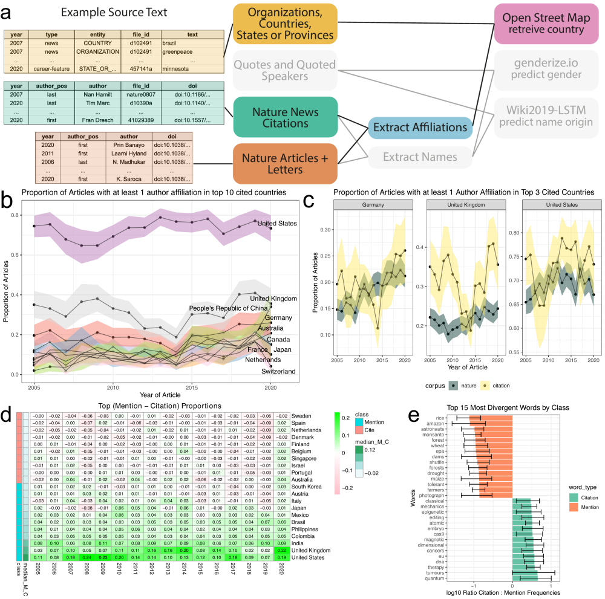

Figure4\_citation\_v\_mention
================
Natalie Davidson
5/4/2021

## Overview

This notebook generates figure 4 and additional supplemental figures.

This analysis performs 3 main analyses

1.  looking at the citation rates of authors by country

2.  analyzing if the country citation rate is significantly different than the rate at which it is talked about

3.  for countries that have a very different citation vs mention rate, are there tokens that differentiate these countries?

For analysis 3, its main point is to identify how countries are talked about differently. To do this, we seperate countries into two groups: countries that are talked about vs cited. Specifically, we first identify which countries are cited more than mentioned and which countries are mentioned more than cited. After this, we will take the most exemplary of the 2 country classes (top mentions &gt; cited: Class M & top mentions &lt; cited: Class C). We will compare the token frequencies between a mention of Class C v M.

The **data** it uses to build the plots are here:

For analysis 1 the source data file is: `./data/author_data/all_author_country.tsv`

The four corpi are indexed by the `corpus` column:

1.  `nature_news`: **foreground** country of a location mentioned in any Nature News article

2.  `news_citation`: **foreground** country of Nature News cited authors affiliation.

3.  `nature_articles`: **background** country of author affiliation from Nature articles.

4.  `springer`: **background** country of author affiliation from random subset of Springer articles.

The `num_entries` column denotes the number of articles with at least ONE author from a particular country The `address.country_code` column denotes the UN 2-digit country code

For analysis 2+3 the source data files are:

1.  Bootstrap estimate of country mentions and citations: `/data/author_data/all_author_country_95CI.tsv`

2.  Source text for token analysis is here: `/data/scraped_data/downloads/*.json`

3.  Country mention to source articles id map here: `/data/scraped_data/location_table_raw_YEAR_ARTICLE-TYPE.tsv`

The **pdfs** included in the plots are here:

1.  `/figure_notebooks/illustrator_pdfs/`

The **setting + helper functions** to generate the plots are here:

1.  plotting related functions: `/utils/plotting_utils.R`

2.  reading + data processing related functions: `/utils/scraper_processing_utils.R` and `/analysis_scripts/analysis_utils.R`

3.  nautre research article and springer specific data processing functions: `/process_doi_data/springer_scripts/springer_scrape_utils.R`

## Read in the data

``` r
# read in the scraped news articles for each year
# we will need this later for filtering out articles in columns
# we would like to ignore
news_scraped_dir = file.path(proj_dir,
                    "/data/scraped_data/")
news_scraped_dir_files = list.dirs(news_scraped_dir, full.names = T)
news_scraped_dir_files = grep("coreNLP_output", news_scraped_dir_files, value=T)

news_df = NA
for(curr_dir in news_scraped_dir_files){
    
    curr_files = list.files(curr_dir, full.names = T)

    
    # if the json file was empty, skip
    if(length(curr_files) == 0 ){
        next
    }
    
    # get the year form the file name
    file_name_year = substring(basename(curr_dir), 
                            16, 19)
    
    # get the news article type from the file name
    file_name_type = substring(basename(curr_dir), 
                            21, nchar(basename(curr_dir)))
    
    # format the output
    article_ids = gsub(".txt.json", "", basename(curr_files))
    num_articles = length(article_ids)
    curr_info_df = data.frame(year=file_name_year, 
                                type=file_name_type, 
                                file_id=article_ids)
    news_df = rbind(news_df, curr_info_df)
    
}
news_df = news_df[-1,]

# filter out career column and news-and-views
news_df = subset(news_df, !type %in% c("career-column", "news-and-views"))
head(news_df)
```

    ##   year type        file_id
    ## 2 2005 news  041220-1.html
    ## 3 2005 news  050103-1.html
    ## 4 2005 news 050103-10.html
    ## 5 2005 news 050103-11.html
    ## 6 2005 news 050103-12.html
    ## 7 2005 news  050103-2.html

``` r
#### read in the cited author data
country_file = file.path(proj_dir, "/data/author_data/all_author_country.tsv")
country_df = data.frame(fread(country_file))

# filter to only the articles we care about
file_id_keep = news_df$file_id
bg_df = subset(country_df, corpus %in% c("nature_articles", "springer_articles"))
to_filter_df = subset(country_df, corpus %in% c("naturenews_citations", "naturenews_mentions"))
to_filter_df = subset(to_filter_df, file_id %in% file_id_keep)
country_df = rbind(bg_df, to_filter_df)

# get UN info
un_info = get_country_info()
country_df = merge(country_df, un_info)
head(country_df)
```

    ##   address.country_code     file_id                           doi year
    ## 1                   ad     446937a           doi:10.1038/446937a 2007
    ## 2                   ae        <NA> doi:10.1186/s12887-017-0865-1 2017
    ## 3                   ae        <NA> doi:10.1186/s12935-014-0118-4 2014
    ## 4                   ae        <NA>            doi:10.1186/gb4177 2014
    ## 5                   ae nature22053       doi:10.1038/nature22053 2017
    ## 6                   ae        <NA> doi:10.1007/s10577-007-1154-x 2007
    ##                corpus              country un_region    un_subregion
    ## 1 naturenews_mentions              Andorra    Europe Southern Europe
    ## 2   springer_articles United Arab Emirates      Asia    Western Asia
    ## 3   springer_articles United Arab Emirates      Asia    Western Asia
    ## 4   springer_articles United Arab Emirates      Asia    Western Asia
    ## 5     nature_articles United Arab Emirates      Asia    Western Asia
    ## 6   springer_articles United Arab Emirates      Asia    Western Asia

``` r
#### read in the bootstrapped author data
ci_file = file.path(proj_dir, "/data/author_data/all_author_country_95CI.tsv")
ci_df = fread(ci_file)
ci_df = subset(ci_df, country != "" & !is.na(country))
ci_df = merge(un_info, ci_df)
head(ci_df)
```

    ##       country address.country_code un_region  un_subregion year bottom_CI
    ## 1 Afghanistan                   af      Asia Southern Asia 2009         0
    ## 2 Afghanistan                   af      Asia Southern Asia 2015         0
    ## 3 Afghanistan                   af      Asia Southern Asia 2016         0
    ## 4 Afghanistan                   af      Asia Southern Asia 2017         0
    ## 5 Afghanistan                   af      Asia Southern Asia 2019         0
    ## 6 Afghanistan                   af      Asia Southern Asia 2012         0
    ##   top_CI mean               corpus
    ## 1      0    0 naturenews_citations
    ## 2      0    0 naturenews_citations
    ## 3      0    0 naturenews_citations
    ## 4      0    0 naturenews_citations
    ## 5      0    0 naturenews_citations
    ## 6      0    0 naturenews_citations

``` r
#### read in the location - to - article information
all_loc_files = list.files(file.path(proj_dir, "/data/scraped_data/"), 
                            pattern="location_table_raw",
                            recursive=F,
                            full.names=T)
full_loc_df = NA
for(loc_file in all_loc_files){

    loc_df = read_corenlp_location_files(loc_file)
    loc_df$year = str_extract(loc_file, "[1-9][0-9]+") # curr_year
    loc_df$type = substring(basename(loc_file), 
                            25, nchar(basename(loc_file))-4)
    full_loc_df = rbind(full_loc_df, loc_df)
}
full_loc_df = full_loc_df[-1,]
full_loc_df = subset(full_loc_df, est_un_region != "" & 
                                        est_un_subregion != "" &
                                        est_un_region != "NO_EST" & 
                                        est_un_subregion != "NO_EST")
colnames(full_loc_df)[1] = c("address.country_code")
head(full_loc_df)
```

    ##   address.country_code  file_id   text          ner          est_country
    ## 2                   ae  437043a    ias ORGANIZATION United Arab Emirates
    ## 3                   ae  433471a    dgc ORGANIZATION United Arab Emirates
    ## 4                   af  433208a    pka ORGANIZATION          Afghanistan
    ## 5                   ao 4351173a    mpi ORGANIZATION               Angola
    ## 6                   ar  433114a subaru ORGANIZATION            Argentina
    ## 7                   ar  433369a müller ORGANIZATION            Argentina
    ##   est_un_region est_un_subregion year           type
    ## 2          Asia     Western Asia 2005 news-and-views
    ## 3          Asia     Western Asia 2005 news-and-views
    ## 4          Asia    Southern Asia 2005 news-and-views
    ## 5        Africa    Middle Africa 2005 news-and-views
    ## 6      Americas    South America 2005 news-and-views
    ## 7      Americas    South America 2005 news-and-views

``` r
full_loc_df = subset(full_loc_df, file_id %in% file_id_keep)

#### read in all the cited articles
cited_country_file = file.path(proj_dir, 
                                "/data/author_data/cited_author_country.tsv")
cited_country_df = data.frame(fread(cited_country_file))
cited_country_df = subset(cited_country_df, country != "")
cited_country_df$country = format_country_names(cited_country_df$country)
cited_country_df = subset(cited_country_df, file_id %in% file_id_keep)

# format the countries
cited_country_df_formatted = get_author_country(cited_country_df)
cited_country_df_formatted = unique(cited_country_df_formatted)

# we only care about if a country was cited in an article, 
# not how many times it was cited
cited_country_df_formatted$num_entries = 1
```

## Process Data

### summarize the number of mentions/citations considered

``` r
# get num or articles with a country mention
mention_total = unique(subset(country_df, corpus == "naturenews_mentions", select=c(file_id, year)) )
tot_prop_mention = mention_total %>% 
                group_by(year) %>% 
                summarise(n()) 
tot_prop_mention$corpus = "naturenews_mentions"

# get num or articles with a country citation
citation_total = unique(subset(country_df, corpus == "naturenews_citations", select=c(file_id, year)) )
tot_prop_citation = citation_total %>% 
                group_by(year) %>% 
                summarise(n()) 
tot_prop_citation$corpus = "naturenews_citations"
print("num articles with citation")
```

    ## [1] "num articles with citation"

``` r
length(unique(citation_total$file_id))
```

    ## [1] 1989

``` r
length(unique(subset(country_df, corpus == "naturenews_citations")))
```

    ## [1] 8

``` r
# get num or articles with a country citation
tot_prop_df = rbind(tot_prop_mention, tot_prop_citation)
tot_prop_df = data.frame(tot_prop_df)
colnames(tot_prop_df)[2] = "tot_articles"
```

### Analysis 1: Get top bootstrap estimates for later plotting

``` r
top_countries_citation = unique(subset(ci_df, corpus == "naturenews_citations", 
                                      select=c(country, mean)) ) %>% 
                        group_by(country) %>% 
                        summarise(overall_mean=mean(mean))
top_countries_citation = top_countries_citation[
                            order(top_countries_citation$overall_mean, 
                                  decreasing=T),]
head(top_countries_citation)
```

    ## # A tibble: 6 x 2
    ##   country        overall_mean
    ##   <chr>                 <dbl>
    ## 1 United States         0.798
    ## 2 United Kingdom        0.347
    ## 3 Germany               0.252
    ## 4 France                0.158
    ## 5 Canada                0.139
    ## 6 Japan                 0.132

``` r
# make the df into proportions for eachcountry
get_subboot <- function(country_id, curr_corpus, in_df, bootstrap_col_id="file_id"){
    bootstrap_res = compute_bootstrap_location(subset(in_df, corpus==curr_corpus), 
                                              year_col_id = "year", 
                                              article_col_id = bootstrap_col_id, 
                                              country_col_id = "country",
                                              country_agg = country_id, 
                                              conf_int = 0.95)
    bootstrap_res$country = country_id
    return(bootstrap_res)

}

# we only run the bootstraps if we want to update them
# this is an expensive process > 1hr
if(RERUN_BOOTSTRAP){
    
    BOOTSTRAP_SIZE=1000

        
    citation_country_df = NA
    for(curr_country in top_countries_citation$country[1:NUM_COUNTRIES_PLOT]){
        print(curr_country)
        res = get_subboot(curr_country, 
                          curr_corpus="naturenews_citations", 
                          country_df)
        citation_country_df = rbind(citation_country_df, res)
    }
    citation_country_df = citation_country_df[-1,]
    citation_country_df$label = ""
    citation_country_df$label[citation_country_df$year == 2020] = 
        citation_country_df$country[citation_country_df$year == 2020]
    citation_country_df$corpus = "citation"
    outfile = file.path(proj_dir,"/figure_notebooks/tmp_files/fig4_tmp/citation_country_df.tsv")
    write.table(citation_country_df, outfile, sep="\t", quote=F, row.names=F)
    
    
    springer_country_df = NA
    for(curr_country in top_countries_citation$country[1:NUM_COUNTRIES_PLOT]){
        print(curr_country)
        res = get_subboot(curr_country, 
                          curr_corpus="springer_articles", 
                          country_df,
                          bootstrap_col_id = "doi")
        springer_country_df = rbind(springer_country_df, res)
    }
    springer_country_df = springer_country_df[-1,]
    springer_country_df$label = ""
    springer_country_df$label[springer_country_df$year == 2020] = 
        springer_country_df$country[springer_country_df$year == 2020]
    springer_country_df$corpus = "springer_last"
    outfile = file.path(proj_dir,"/figure_notebooks/tmp_files/fig4_tmp/springer_country_df.tsv")
    write.table(springer_country_df, outfile, sep="\t", quote=F, row.names=F)
    
    
    nature_country_df = NA
    for(curr_country in top_countries_citation$country[1:NUM_COUNTRIES_PLOT]){
        print(curr_country)
        res = get_subboot(curr_country, 
                          curr_corpus="nature_articles", 
                          country_df)
        nature_country_df = rbind(nature_country_df, res)
    }
    nature_country_df = nature_country_df[-1,]
    nature_country_df$label = ""
    nature_country_df$label[nature_country_df$year == 2020] = 
        nature_country_df$country[nature_country_df$year == 2020]
    nature_country_df$corpus = "nature_last"
    outfile = file.path(proj_dir,"/figure_notebooks/tmp_files/fig4_tmp/nature_country_df.tsv")
    write.table(nature_country_df, outfile, sep="\t", quote=F, row.names=F)
}else{
    
    citation_country_file = file.path(proj_dir,
                                      "/figure_notebooks/tmp_files/fig4_tmp/citation_country_df.tsv")
    citation_country_df = data.frame(fread(citation_country_file))

    springer_country_file = file.path(proj_dir,
                                      "/figure_notebooks/tmp_files/fig4_tmp/springer_country_df.tsv")
    springer_country_df = data.frame(fread(springer_country_file))
    
    nature_country_file = file.path(proj_dir,
                                      "/figure_notebooks/tmp_files/fig4_tmp/nature_country_df.tsv")
    nature_country_df = data.frame(fread(nature_country_file))

}
```

### Analysis 2: Identify Countries with significantly different citation and mention rates

``` r
### get the total number of mentions and citations
### for each country per year
### we will use this later as a filter, because we will only consider countries with enough observations

# for best accuracy, we only consider an article to be truely country related
# if there exists at least 2 country associated nouns in the article
loc_dups = data.frame(table(full_loc_df$file_id, full_loc_df$address.country_code))
loc_keep = subset(loc_dups, Freq > 1)
full_loc_df$freq_idx = paste(full_loc_df$file_id, full_loc_df$address.country_code, sep="_")
freq_pass = paste(loc_keep$Var1, loc_keep$Var2, sep="_")


# count the mentions by country
country_mention_total = unique(subset(country_df, 
                              corpus == "naturenews_mentions", 
                              select=c(file_id, year, address.country_code)) )
country_df_idx = paste(country_mention_total$file_id, 
                       country_mention_total$address.country_code, 
                       sep="_")
country_mention_total = country_mention_total[which(country_df_idx %in% freq_pass),]

tot_country_mention = country_mention_total %>% 
                group_by(year, address.country_code) %>% 
                summarise(n()) 
tot_country_mention$corpus = "naturenews_mentions"
colnames(tot_country_mention)[3] = "total"


# count the citations by country
country_citation_total = unique(subset(country_df, 
                               corpus == "naturenews_citations", 
                               select=c(file_id, year, address.country_code)) )
tot_country_citation = country_citation_total %>% 
                group_by(year, address.country_code) %>% 
                summarise(n()) 
tot_country_citation$corpus = "naturenews_citations"
colnames(tot_country_citation)[3] = "total"

# put them together and format
raw_sum_df = rbind(tot_country_citation, tot_country_mention)
raw_sum_df = reshape2::dcast(raw_sum_df, year+address.country_code ~ corpus, value.var="total")
raw_sum_df[is.na(raw_sum_df)] = 0
colnames(raw_sum_df)[3:4] = c("tot_citations", "tot_mentions")


###  now add in the CI estimates for each country
ci_raw_df = merge(raw_sum_df, ci_df)

# dcast the folder so we can compare mentions to citations
ci_raw_df_cast = reshape2::dcast(ci_raw_df, 
                             year+country+address.country_code+tot_citations+tot_mentions ~ corpus, 
                             value.var="mean")

###  calculate the difference between mentions + citations
ci_raw_df_cast$M_C = ci_raw_df_cast$naturenews_mentions - ci_raw_df_cast$naturenews_citations


###  now filter for the very top and bottom of citation v mention
top_diff_MC = subset(ci_raw_df_cast, tot_citations > 0 | tot_mentions > 0)
top_diff_MC_filt = NA
for(curr_year in unique(top_diff_MC$year)){
    curr_MC = subset(top_diff_MC, year == curr_year)
    top_limit = quantile(curr_MC$M_C, 0.95)
    bottom_limit = quantile(curr_MC$M_C, 0.05)
    
    print(top_limit)
    print(bottom_limit)
    
    curr_MC = subset(curr_MC, M_C > top_limit | M_C < bottom_limit)
    top_diff_MC_filt = rbind(top_diff_MC_filt, curr_MC)
}
```

    ##        95% 
    ## 0.04229125 
    ##          5% 
    ## -0.04156287 
    ##        95% 
    ## 0.05152213 
    ##          5% 
    ## -0.03191058 
    ##        95% 
    ## 0.05434049 
    ##          5% 
    ## -0.01425049 
    ##        95% 
    ## 0.06791174 
    ##          5% 
    ## -0.01193596 
    ##        95% 
    ## 0.09193692 
    ##          5% 
    ## -0.00642026 
    ##        95% 
    ## 0.08552343 
    ##           5% 
    ## -0.002113657 
    ##        95% 
    ## 0.08677525 
    ##           5% 
    ## -0.005936301 
    ##        95% 
    ## 0.03308685 
    ##          5% 
    ## -0.04526807 
    ##        95% 
    ## 0.03250907 
    ##          5% 
    ## -0.05063106 
    ##        95% 
    ## 0.03892006 
    ##         5% 
    ## -0.0467101 
    ##        95% 
    ## 0.01903477 
    ##         5% 
    ## -0.1051345 
    ##        95% 
    ## 0.02853643 
    ##          5% 
    ## -0.06482855 
    ##        95% 
    ## 0.03194377 
    ##          5% 
    ## -0.07188929 
    ##        95% 
    ## 0.04759033 
    ##          5% 
    ## -0.04114857 
    ##        95% 
    ## 0.03771047 
    ##          5% 
    ## -0.08006611 
    ##       95% 
    ## 0.1261979 
    ##          5% 
    ## -0.02044634

``` r
top_diff_MC_filt = top_diff_MC_filt[-1,]
head(top_diff_MC_filt)
```

    ##    year                    country address.country_code tot_citations
    ## 13 2005 People's Republic of China                   cn             4
    ## 18 2005                    Germany                   de            23
    ## 33 2005                  Indonesia                   id             0
    ## 36 2005                      India                   in             0
    ## 41 2005                      Japan                   jp            16
    ## 50 2005                Netherlands                   nl            18
    ##    tot_mentions naturenews_citations naturenews_mentions         M_C
    ## 13           24           0.03673394          0.08749842  0.05076448
    ## 18           59           0.21064220          0.14738644 -0.06325577
    ## 33            5           0.00000000          0.04508991  0.04508991
    ## 36           20           0.00000000          0.08763170  0.08763170
    ## 41           46           0.14702752          0.10202050 -0.04500702
    ## 50           16           0.16437615          0.04110883 -0.12326731

``` r
# make sure there are enough articles
top_diff_MC_filt = subset(top_diff_MC_filt, tot_citations > MIN_ART | tot_mentions > MIN_ART)


###  now make the 2 tables of countries that are cited more vs mentioned more
# class C vs Class M
class_c_counts = subset(top_diff_MC_filt, M_C < 0, select=c("address.country_code", "year") )
class_c_counts$class = "class_c" 
class_c_counts$idx = paste(class_c_counts$address.country_code,
                          class_c_counts$year, sep="_")
class_c_counts$idx = class_c_counts$address.country_code

class_m_counts = subset(top_diff_MC_filt, M_C > 0, select=c("address.country_code", "year") )
class_m_counts$class = "class_m" 
class_m_counts$idx = paste(class_m_counts$address.country_code,
                          class_m_counts$year, sep="_")
class_m_counts$idx = class_m_counts$address.country_code
```

### Analysis 3 part1: Identify which news articles are associated with C vs M

``` r
# for best accuracy, we only consider an article to be truely country related
# if there exists at least 2 country associated nouns in the article
loc_dups = data.frame(table(full_loc_df$file_id, full_loc_df$address.country_code))
loc_keep = subset(loc_dups, Freq > 1)
full_loc_df$freq_idx = paste(full_loc_df$file_id, full_loc_df$address.country_code, sep="_")
freq_pass = paste(loc_keep$Var1, loc_keep$Var2, sep="_")
full_mention_df = subset(full_loc_df, freq_idx %in% freq_pass)
full_mention_df$file_idx = paste(full_mention_df$address.country_code,
                      full_mention_df$year,
                      full_mention_df$file_id, sep="_")
full_mention_df$idx = paste(full_mention_df$address.country_code,
                      full_mention_df$year, sep="_")
full_mention_df$idx = full_mention_df$address.country_code


# now get the mention articles from each class
class_c_mentions = subset(full_mention_df, idx %in% 
                               class_c_counts$idx)
class_m_mentions = subset(full_mention_df, idx %in% 
                               class_m_counts$idx)

# get all the cited articles
cited_loc = merge(unique(full_mention_df[,c("file_id", "year", "type")]),
                  cited_country_df_formatted)
cited_loc$idx = paste(cited_loc$address.country_code,
                      cited_loc$year, sep="_")
cited_loc$idx = cited_loc$address.country_code
cited_loc$file_idx = paste(cited_loc$address.country_code,
                      cited_loc$year,
                      cited_loc$file_id, sep="_")

# get the cited articles from each class
class_c_citations = subset(cited_loc, idx %in% 
                               class_c_counts$idx)
class_m_citations = subset(cited_loc, idx %in% 
                               class_m_counts$idx)

# filter the mentions by the citations
class_c_mentions = subset(class_c_mentions, 
                          !file_idx %in% class_c_citations$file_idx )
class_m_mentions = subset(class_m_mentions, 
                          !file_idx %in% class_m_citations$file_idx )


# filter out 2020 for this analysis to avoid covid terms
class_c_mentions = subset(class_c_mentions, year != 2020)
class_m_mentions = subset(class_m_mentions, year != 2020)
full_mention_df = subset(full_mention_df, year != 2020)

# filter out countries that may be in both class_c and class_m
# this can be caused by mentions and citations being significantly
# different across years (sometimes M >> C, sometimes C << M)
country_overlap = intersect(class_c_mentions$address.country_code,
                            class_m_mentions$address.country_code)
class_c_mentions = subset(class_c_mentions, 
                          !address.country_code %in% country_overlap )
class_m_mentions = subset(class_m_mentions, 
                          !address.country_code %in% country_overlap )
print(country_overlap)
```

    ## [1] "au" "ca" "cn" "fr" "gb" "jp"

### Analysis 3 part2: Get the tokens associated with C vs M

``` r
#### get the word frequencies for all articles considered
class_all_word_freq = get_word_freq_per_class(full_mention_df, class_str = "class_all")


#### get the word frequencies for all articles associated with class C countries
all_country_word_freq_c = get_word_freq_per_country(class_c_mentions, 
                                                    class_str="class_c", 
                                                    class_all_word_freq,
                                                    min_freq=MIN_WORD_FREQ)
citations_freq = Reduce(function(x, y) merge(x, y, by = "word", all = T), 
                       all_country_word_freq_c)
citations_freq[is.na(citations_freq)] = 0
citations_freq$median_count = apply(citations_freq[,2:ncol(citations_freq)], 
                                   1, median)
citations_freq = citations_freq[order(citations_freq$median_count, decreasing = T),]
citations_freq = subset(citations_freq, median_count > 0)
print(knitr::kable(head(citations_freq,15), 
                       caption = "Overall Class Citation, top terms, count is per country frequency"))
```

    ## 
    ## 
    ## Table: Overall Class Citation, top terms, count is per country frequency
    ## 
    ## |word        | count_at| count_be| count_ch| count_de| count_es| count_il| count_nl| count_se| count_dk| median_count|
    ## |:-----------|--------:|--------:|--------:|--------:|--------:|--------:|--------:|--------:|--------:|------------:|
    ## |university  |      308|      323|     1362|     3450|      389|      658|     1505|      953|      397|          658|
    ## |cells       |       72|       80|      834|     1665|       53|      899|      613|      722|       48|          613|
    ## |researchers |      147|      273|     1183|     2852|      358|      545|     1250|      770|      245|          545|
    ## |research    |      214|      310|     1360|     3837|      480|      529|     1347|      768|      220|          529|
    ## |time        |      122|      136|      762|     1861|      208|      433|      816|      568|      186|          433|
    ## |cell        |       63|       84|      421|     1293|       35|      497|      423|      420|       25|          420|
    ## |scientists  |      134|      169|      785|     2268|      260|      404|      815|      466|      145|          404|
    ## |human       |       51|       68|      440|     1451|       85|      376|      419|      404|      102|          376|
    ## |institute   |      141|       81|      568|     1736|      133|      332|      409|      370|       90|          332|
    ## |team        |      110|      129|      721|     1691|      215|      320|      650|      451|      171|          320|
    ## |science     |      169|      190|      636|     2032|      314|      336|      731|      307|      161|          314|
    ## |found       |       60|      136|      458|     1301|      129|      308|      513|      431|      138|          308|
    ## |study       |       97|      131|      548|     1155|      106|      293|      563|      388|      135|          293|
    ## |data        |      151|      142|     1010|     2088|      254|      271|     1236|      487|      212|          271|
    ## |people      |      106|      162|      903|     1448|      141|      264|      716|      424|      119|          264|

``` r
#### get the word frequencies for all articles associated with class M countries
all_country_word_freq_m = get_word_freq_per_country(class_m_mentions, 
                                                    class_str="class_m", 
                                                    class_all_word_freq,
                                                    min_freq=MIN_WORD_FREQ)
mentions_freq = Reduce(function(x, y) merge(x, y, by = "word", all = T), 
                       all_country_word_freq_m)
mentions_freq[is.na(mentions_freq)] = 0
mentions_freq$median_count = apply(mentions_freq[,2:ncol(mentions_freq)], 
                                   1, median)
mentions_freq = mentions_freq[order(mentions_freq$median_count, decreasing = T),]
mentions_freq = subset(mentions_freq, median_count > 0)
print(knitr::kable(head(mentions_freq,15), 
                       caption = "Overall Class Mention, top terms, count is per country frequency"))
```

    ## 
    ## 
    ## Table: Overall Class Mention, top terms, count is per country frequency
    ## 
    ## |word          | count_br| count_in| count_us| count_co| count_ru| median_count|
    ## |:-------------|--------:|--------:|--------:|--------:|--------:|------------:|
    ## |research      |      542|     1359|    24315|      186|      544|          544|
    ## |science       |      506|     1005|    15333|      102|      513|          513|
    ## |university    |      473|      796|    23739|      215|      323|          473|
    ## |scientists    |      376|      682|    14131|       97|      404|          404|
    ## |researchers   |      379|      629|    19423|      188|      265|          379|
    ## |data          |      325|      483|    14716|      101|      226|          325|
    ## |nuclear       |       16|      295|     3335|       17|      345|          295|
    ## |carbon        |      253|      154|     3956|      336|       47|          253|
    ## |million       |      248|      444|     9539|      104|      167|          248|
    ## |government    |      239|      546|     5605|       62|      233|          239|
    ## |institute     |      153|      503|     8422|       80|      237|          237|
    ## |climate       |      233|      323|     7034|      227|       78|          233|
    ## |time          |      225|      517|    12396|      219|      228|          228|
    ## |international |      120|      366|     4705|       57|      217|          217|
    ## |national      |      210|      436|     8553|       76|      132|          210|

### Analysis 3 part3: Find tokens that differentiate articles related to class C / M countries

``` r
# rename the columns for merging
colnames(citations_freq)[which(colnames(citations_freq) == "median_count")] = "median_count_citations"
colnames(mentions_freq)[which(colnames(mentions_freq) == "median_count")] = "median_count_mentions"

# merge and calculate the relative counts
compare_freq = merge(subset(citations_freq, 
                            select=c("word", "median_count_citations")),
                     subset(mentions_freq, 
                            select=c("word", "median_count_mentions")))
compare_freq$compare_ratio =  compare_freq$median_count_citations /
                                compare_freq$median_count_mentions

# get the raw counts for each word, unscaled by country
class_c_word_freq = get_word_freq_per_class(
                        class_c_mentions, 
                        class_str = "class_c")
class_m_word_freq = get_word_freq_per_class(
                        class_m_mentions, 
                        class_str = "class_m")
compare_freq = merge(compare_freq, class_c_word_freq)
compare_freq = merge(compare_freq, class_m_word_freq)


# write out the tables
compare_freq = compare_freq[order(compare_freq$compare_ratio, decreasing=T),]
print(knitr::kable(head(compare_freq, 15), 
                       caption = "Overall Class Citation, top terms"))
```

    ## 
    ## 
    ## Table: Overall Class Citation, top terms
    ## 
    ## |word           | median_count_citations| median_count_mentions| compare_ratio| class_c_count| class_m_count|
    ## |:--------------|----------------------:|---------------------:|-------------:|-------------:|-------------:|
    ## |classical      |                     27|                     1|      27.00000|           195|           249|
    ## |yeast          |                     23|                     1|      23.00000|           224|           456|
    ## |antibiotics    |                     16|                     1|      16.00000|           118|           516|
    ## |archaeologists |                     16|                     1|      16.00000|           144|           238|
    ## |cas9           |                     16|                     1|      16.00000|           182|           337|
    ## |metabolic      |                     15|                     1|      15.00000|            92|           252|
    ## |entangled      |                     14|                     1|      14.00000|           113|            56|
    ## |geneticists    |                     14|                     1|      14.00000|           123|           232|
    ## |gut            |                     14|                     1|      14.00000|           145|           423|
    ## |tumour         |                     28|                     2|      14.00000|           314|           784|
    ## |neurons        |                     40|                     3|      13.33333|           473|          1004|
    ## |sex            |                     13|                     1|      13.00000|           140|           553|
    ## |organs         |                     12|                     1|      12.00000|           146|           366|
    ## |variants       |                     12|                     1|      12.00000|           145|           455|
    ## |consent        |                     11|                     1|      11.00000|           103|           354|

``` r
compare_freq = compare_freq[order(compare_freq$compare_ratio, decreasing=F),]
print(knitr::kable(head(compare_freq, 15), 
                       caption = "Overall Class Mention, top terms"))
```

    ## 
    ## 
    ## Table: Overall Class Mention, top terms
    ## 
    ## |word             | median_count_citations| median_count_mentions| compare_ratio| class_c_count| class_m_count|
    ## |:----------------|----------------------:|---------------------:|-------------:|-------------:|-------------:|
    ## |dams             |                      1|                    26|     0.0384615|            32|           230|
    ## |rio              |                      1|                    20|     0.0500000|            33|           195|
    ## |civilian         |                      1|                    17|     0.0588235|            20|           158|
    ## |gigawatts        |                      1|                    17|     0.0588235|            40|            98|
    ## |colombia         |                      1|                    16|     0.0625000|            20|            89|
    ## |usa              |                      1|                    16|     0.0625000|            19|           132|
    ## |turbines         |                      1|                    15|     0.0666667|            70|           187|
    ## |eruptions        |                      1|                    13|     0.0769231|            42|           213|
    ## |shuttle          |                      1|                    13|     0.0769231|            58|           561|
    ## |conservationists |                      1|                    12|     0.0833333|            24|           218|
    ## |hydropower       |                      1|                    12|     0.0833333|            25|            80|
    ## |suppliers        |                      1|                    11|     0.0909091|            23|           109|
    ## |weapons          |                      6|                    65|     0.0923077|           175|           873|
    ## |astronauts       |                      2|                    21|     0.0952381|            34|           476|
    ## |bush             |                      1|                    10|     0.1000000|            38|           644|

``` r
# now take the top and bottom
compare_freq = compare_freq[order(compare_freq$compare_ratio, decreasing=T),]
compare_freq_extreme = compare_freq
compare_freq_extreme$word_type = c(rep("Citation", sum(compare_freq$compare_ratio > 1)), 
                                   rep("Mention", sum(compare_freq$compare_ratio <= 1)))

# now lets take bootstrap estimates
word_vec = compare_freq_extreme$word

if(RERUN_BOOTSTRAP){
    BOOTSTRAP_SIZE = 1000
    start_time <- Sys.time()
    res = get_bootstrap_word_ratio(class_c_mentions, 
                                               class_m_mentions, 
                                               word_vec,
                                               conf_int = 0.95)
    bootstrap_ratio = res[[1]]
    full_boot = res[[2]]
    end_time <- Sys.time()
    elapsed_time = end_time - start_time
    print(elapsed_time)
    bootstrap_file = file.path(proj_dir,
                        "/figure_notebooks/tmp_files/fig4_tmp/fig4_bootstrap_ratio.RData")
    save(bootstrap_ratio, file = bootstrap_file)
}else{
    bootstrap_file = file.path(proj_dir,
                        "/figure_notebooks/tmp_files/fig4_tmp/fig4_bootstrap_ratio.RData")
    load(bootstrap_file)
}
# format the enrichment
bootstrap_ratio = bootstrap_ratio[order(bootstrap_ratio$mean, decreasing=T),]
compare_freq_extreme = compare_freq_extreme[order(bootstrap_ratio$mean, decreasing=T),]

bootstrap_ratio$word = factor(bootstrap_ratio$word, 
                                      levels = bootstrap_ratio$word)
compare_freq_extreme$word = factor(compare_freq_extreme$word, 
                                      levels = compare_freq_extreme$word)
bootstrap_ratio = 
    bootstrap_ratio[c(1:NUM_WORDS_REPORT,
                    (nrow(bootstrap_ratio)-NUM_WORDS_REPORT+1):nrow(bootstrap_ratio)),]
bootstrap_ratio$word_type = c(rep("Citation", NUM_WORDS_REPORT), 
                              rep("Mention", NUM_WORDS_REPORT))
compare_freq_extreme = 
    compare_freq_extreme[c(1:NUM_WORDS_REPORT,
                    (nrow(compare_freq_extreme)-NUM_WORDS_REPORT+1):nrow(compare_freq_extreme)),]
```

## Make the Figures

### make the citation plot

``` r
### full plot of citations
citation_full_gg = ggplot(citation_country_df, aes(x=as.numeric(year), y=mean,
                                                ymin=bottom_CI, ymax=top_CI,
                        fill=country, label=label)) +
    geom_point() + geom_ribbon(alpha=0.5) + geom_line(alpha=0.5) +
    theme_bw() + geom_text_repel()  + xlim(c(2005,2021)) + 
    xlab("Year of Article") + ylab("Proportion of Articles") +
    ggtitle("Proportion of Articles with at least 1 author affiliation in top 10 cited countries") + 
    scale_fill_brewer(palette="Set3") +
    theme(legend.position = "none")

ggsave(file.path(proj_dir, "/figure_notebooks/tmp_files/fig4_tmp/citation_full_gg.pdf"),
       citation_full_gg, width = 7, height = 5, units = "in", device = "pdf")

### full plot of citations with bg
cite_plot_df = Reduce(rbind, list(citation_country_df, 
                                  springer_country_df, 
                                  nature_country_df))
cite_plot_df$corpus = factor(cite_plot_df$corpus, levels = QUOTE_ANALYSIS_ORDER)
citation_indiv_10_springer_gg = ggplot(cite_plot_df, 
       aes(x=as.numeric(year), y=mean,
          ymin=bottom_CI, ymax=top_CI,
          fill=corpus, color=corpus)) +
    geom_point() + geom_ribbon(alpha=0.5) + geom_line(alpha=0.5) +
    theme_bw()  + xlim(c(2005,2021)) + 
    xlab("Year of Article") + ylab("Proportion of Articles") +
    ggtitle("Proportion of Articles with at least 1 Author Affiliation in Top 10 Cited Countries") + 
    scale_fill_manual(values=QUOTE_ANALYSIS_COLOR, labels = c("nature", "springer", "citation")) +
    scale_color_manual(values=QUOTE_ANALYSIS_COLOR, labels = c("nature", "springer", "citation")) +
    theme(legend.position = "bottom") +
    facet_wrap(~ country, scales = "free")

ggsave(file.path(proj_dir, "/figure_notebooks/tmp_files/fig4_tmp/citation_indiv_10_springer_gg.pdf"),
       citation_indiv_10_springer_gg, width = 7, height = 5, units = "in", device = "pdf")


### full plot of citations with bg top 3, no springer
cite_plot_df = Reduce(rbind, list(citation_country_df, 
                                  nature_country_df))
cite_plot_df = subset(cite_plot_df, country %in% top_countries_citation$country[1:3])
cite_plot_df$corpus = factor(cite_plot_df$corpus, levels = QUOTE_ANALYSIS_ORDER)
citation_indiv_3_gg = ggplot(cite_plot_df, 
       aes(x=as.numeric(year), y=mean,
          ymin=bottom_CI, ymax=top_CI,
          fill=corpus)) +
    geom_point() + geom_ribbon(alpha=0.5) + geom_line(alpha=0.5) +
    theme_bw()  + xlim(c(2005,2021)) + 
    xlab("Year of Article") + ylab("Proportion of Articles") +
    ggtitle("Proportion of Articles with at least 1 Author Affiliation in Top 3 Cited Countries") + 
    scale_fill_manual(values=QUOTE_ANALYSIS_COLOR, labels = c("nature", "citation")) +
    theme(legend.position = "bottom") +
    facet_wrap(~ country, scales = "free")

ggsave(file.path(proj_dir, "/figure_notebooks/tmp_files/fig4_tmp/citation_indiv_3_gg.pdf"),
       citation_indiv_3_gg, width = 7, height = 5, units = "in", device = "pdf")
```

### generate the mention v citation heatmap

``` r
## first make the plot with the adaptive filter results
plot_df = subset(top_diff_MC, tot_citations > MIN_ART | tot_mentions > MIN_ART)
plot_df$idx = paste(plot_df$year, plot_df$country)
plot_df$filtered = "filter"
keep_idx = paste(top_diff_MC_filt$year, top_diff_MC_filt$country)
plot_df$filtered[plot_df$idx %in% keep_idx] = "keep"

# show the spread of the difference mentions and citations
c_vs_m_filter_gg = ggplot(plot_df, aes(x=as.numeric(year), 
                        y=as.numeric(M_C),
                        color = filtered)) +
    geom_point() + theme_bw() + 
    xlab("Corpus") + ylab("Mention % - Citation % for each country+year") +
    ggtitle("Diff. btw mentions and citations for each country+year (1 point is a country)") + 
    scale_fill_brewer(palette="Set2")
ggsave(file.path(proj_dir, "/figure_notebooks/tmp_files/fig4_tmp/c_vs_m_filter_gg.pdf"),
       c_vs_m_filter_gg, width = 10, height = 5, units = "in", device = "pdf")


## make the overall heatmap
make_heatmap_res <- function(in_df, value_col){
    plot_matr_MC = reshape2::dcast(in_df, 
                             country ~ year, 
                             value.var=value_col)
    row.names(plot_matr_MC) = plot_matr_MC$country
    plot_matr_MC = plot_matr_MC[,-1]
    plot_matr_MC[is.na(plot_matr_MC)] = 0
    
    max_val = max(abs(plot_matr_MC), na.rm = T)
    breaks = c(seq(-1*max_val, max_val, by = 0.01))
    color_pmap <- colorRampPalette(c("pink", "white", "green"))(length(breaks))

    if(max_val > 1){
        breaks = c(seq(1, max_val, by = 1))
        color_pmap <- colorRampPalette(c("white", "green"))(length(breaks))

    }

    res = list(plot_matr = plot_matr_MC,
               color_pmap = color_pmap,
               breaks = breaks)
    return(res)
}

# plot the Top proportion differences
countries_considered = union(class_m_mentions$est_country,
                             class_c_mentions$est_country)
heatmap_df = subset(top_diff_MC, country %in% countries_considered)
res_MC = make_heatmap_res(heatmap_df, value_col="M_C")

# make annotation of the median difference
heatmap_median_df = heatmap_df %>% 
                group_by(country) %>% 
                summarise(median_M_C = median(M_C)) 
annot_df = data.frame(median_M_C = heatmap_median_df$median_M_C)
row.names(annot_df) = heatmap_median_df$country
annot_df$class = "Cite"
annot_df$class[annot_df$median_M_C > 0] = "Mention"
annot_df$class = factor(annot_df$class, levels = c("Mention", "Cite"))

annot_df = annot_df[order(annot_df$median_M_C),]


# now make the heatmap
res_MC$plot_matr = res_MC$plot_matr[row.names(annot_df),]
full_heatmap = pheatmap(res_MC$plot_matr, cluster_rows = F, 
         cluster_cols = F, display_numbers = T, 
         main = "Top (Mention - Citation) Proportions",
         color = res_MC$color_pmap, breaks = res_MC$breaks,
         number_color = "black", annotation_row = annot_df)
```


``` r
ggsave(file.path(proj_dir, "/figure_notebooks/tmp_files/fig4_tmp/full_heatmap.pdf"),
       full_heatmap, width = 10, height = 5, units = "in", device = "pdf")
```

### generate the mention v citation word plots

``` r
word_ratio_gg = ggplot(bootstrap_ratio, aes(x=log10(bootstrap_ratio$mean), 
                                 y=as.factor(bootstrap_ratio$word),
                                 fill=word_type)) +
    geom_bar(stat="identity") + 
    geom_errorbar(aes(xmin=log10(bottom_CI), xmax=log10(top_ci)), color="black") +
    theme_bw() + 
    ylab("Words") + xlab("log10 Ratio Citation : Mention Frequencies") + 
    ggtitle("Top 15 Most Divergent Words by Class") + 
    scale_fill_brewer(palette="Set2")

ggsave(file.path(proj_dir, "/figure_notebooks/tmp_files/fig4_tmp/word_ratio_gg.pdf"),
       word_ratio_gg, width = 5, height = 5, units = "in", device = "pdf")


word_count_class_c_gg = ggplot(compare_freq_extreme, aes(x=compare_freq_extreme$class_c_count, 
                                 y=as.factor(compare_freq_extreme$word),
                                 fill=word_type)) +
    geom_bar(stat="identity") + theme_bw() + 
    ylab("Words") + xlab("Word Frequencies") + 
    ggtitle("Top 15 Frequencies for Class C") + 
    scale_fill_brewer(palette="Set2")


ggsave(file.path(proj_dir, "/figure_notebooks/tmp_files/fig4_tmp/word_count_class_c_gg.pdf"),
       word_count_class_c_gg, width = 5, height = 5, units = "in", device = "pdf")


word_count_class_m_gg = ggplot(compare_freq_extreme, aes(x=compare_freq_extreme$class_m_count, 
                                 y=as.factor(compare_freq_extreme$word),
                                 fill=word_type)) +
    geom_bar(stat="identity") + theme_bw() + 
    ylab("Words") + xlab("Word Frequencies") + 
    ggtitle("Top 15 Frequencies for Class M") + 
    scale_fill_brewer(palette="Set2")

ggsave(file.path(proj_dir, "/figure_notebooks/tmp_files/fig4_tmp/word_count_class_m_gg.pdf"),
       word_count_class_m_gg, width = 5, height = 5, units = "in", device = "pdf")
```

### format main figure

``` r
plot_overview = image_read_pdf(file.path(proj_dir,
                                  "/figure_notebooks/illustrator_pdfs/nature_news_mention_citation_schematic.pdf"))
plot_overview = image_annotate(plot_overview, "a", size = 20)


citation_overview_gg = image_read_pdf(file.path(proj_dir,
                                  "/figure_notebooks/tmp_files/fig4_tmp/citation_full_gg.pdf"))
citation_overview_gg = image_annotate(citation_overview_gg, "b", size = 40)


citation_nature_indiv_sub_gg = image_read_pdf(file.path(proj_dir,
                                  "/figure_notebooks/tmp_files/fig4_tmp/citation_indiv_3_gg.pdf"))
citation_nature_indiv_sub_gg = image_extent(citation_nature_indiv_sub_gg, '2150x1500', 
                                            color = 'white', gravity = "northeast")
citation_nature_indiv_sub_gg = image_annotate(citation_nature_indiv_sub_gg, "c", size = 40)


heatmap_gg = image_read_pdf(file.path(proj_dir,
                                  "/figure_notebooks/tmp_files/fig4_tmp/full_heatmap.pdf"))
heatmap_gg = image_extent(heatmap_gg, '3100x1500', color = 'white', gravity = "northeast")
heatmap_gg = image_annotate(heatmap_gg, "d", size = 40)


word_ratio_gg = image_read_pdf(file.path(proj_dir,
                                  "/figure_notebooks/tmp_files/fig4_tmp/word_ratio_gg.pdf"))
word_ratio_gg = image_annotate(word_ratio_gg, "e", size = 40)

#heatmap_gg = image_scale(heatmap_gg, 750)
#word_ratio_gg = image_scale(word_ratio_gg, 250)

middle_image <- image_append(image_scale(c(citation_overview_gg, citation_nature_indiv_sub_gg),1000), stack = FALSE)
bottom_image <- image_append(image_scale(c(heatmap_gg, word_ratio_gg), "x1000"), stack = FALSE)
full_image <- image_append(image_scale(c(plot_overview, middle_image, bottom_image), 1000), stack = TRUE)

print(full_image)
```

    ## # A tibble: 1 x 7
    ##   format width height colorspace matte filesize density
    ##   <chr>  <int>  <int> <chr>      <lgl>    <int> <chr>  
    ## 1 PNG     1000    991 sRGB       TRUE         0 300x300



``` r
outfile = file.path(proj_dir,"/figure_notebooks/tmp_files/fig4_tmp/fig4_main.pdf")
image_write(full_image, format = "pdf", outfile)
outfile = file.path(proj_dir,"/figure_notebooks/tmp_files/fig4_tmp/fig4_main.png")
image_write(full_image, format = "png", outfile)
```

### format supp. figure

``` r
citation_indiv_10_springer_gg = image_read_pdf(file.path(proj_dir,
                                  "/figure_notebooks/tmp_files/fig4_tmp/citation_indiv_10_springer_gg.pdf"))
citation_indiv_10_springer_gg = image_annotate(citation_indiv_10_springer_gg, "a", size = 20)

c_vs_m_filter_gg = image_read_pdf(file.path(proj_dir,
                                  "/figure_notebooks/tmp_files/fig4_tmp/c_vs_m_filter_gg.pdf"))
c_vs_m_filter_gg = image_annotate(c_vs_m_filter_gg, "b", size = 30)

word_count_class_c_gg = image_read_pdf(file.path(proj_dir,
                                  "/figure_notebooks/tmp_files/fig4_tmp/word_count_class_c_gg.pdf"))
word_count_class_c_gg = image_annotate(word_count_class_c_gg, "c", size = 30)

word_count_class_m_gg = image_read_pdf(file.path(proj_dir,
                                  "/figure_notebooks/tmp_files/fig4_tmp/word_count_class_m_gg.pdf"))
word_count_class_m_gg = image_annotate(word_count_class_m_gg, "d", size = 30)


bottom_image <- image_append(image_scale(c(word_count_class_c_gg, word_count_class_m_gg), "x1500"), stack = FALSE)
full_image <- image_append(image_scale(c(citation_indiv_10_springer_gg, 
                                         c_vs_m_filter_gg, 
                                         bottom_image), 3000), stack = TRUE)

print(full_image)
```

    ## # A tibble: 1 x 7
    ##   format width height colorspace matte filesize density
    ##   <chr>  <int>  <int> <chr>      <lgl>    <int> <chr>  
    ## 1 PNG     3000   5143 sRGB       TRUE         0 300x300


``` r
outfile = file.path(proj_dir,"/figure_notebooks/tmp_files/fig4_tmp/fig4_supp.pdf")
image_write(full_image, format = "pdf", outfile)


outfile = file.path(proj_dir,"/figure_notebooks/tmp_files/fig4_tmp/fig4_supp.png")
image_write(full_image, format = "png", outfile)
```
