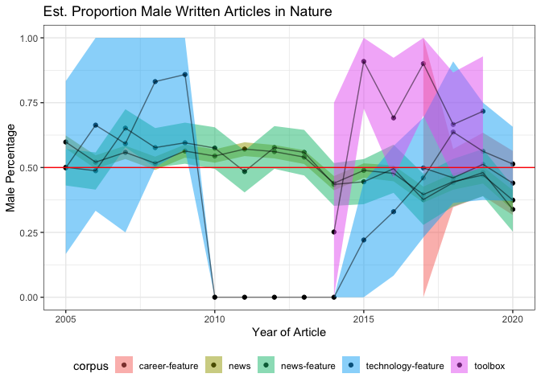
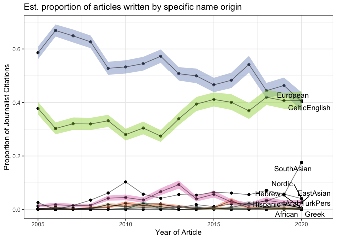

journalist\_diversity
================
Natalie Davidson
10/19/2021

## Nature News comparison of journalists

This document is an analysis of the extracted journalists names and their gender and name origin predictions. It calculates boostrap estimations over all Nature news articles and by article type.

The **setting + helper functions** to generate the plots are here:

1.  plotting related functions: `/utils/plotting_utils.R`

2.  reading + data processing related functions: `/utils/scraper_processing_utils.R` and `/analysis_scripts/analysis_utils.R`

3.  nature research article and springer specific data processing functions: `/process_doi_data/springer_scripts/springer_scrape_utils.R`

## Read in data

### reading in the quote data

``` r
# read in the scraped citations from nature news articles for each year
journo_dir = file.path(proj_dir, "/data/journalist_data/")
all_authors = NA


tab_res_files = list.files(journo_dir, pattern=".tsv", full.names = TRUE)

all_authors = NA
for(curr_file in tab_res_files){

    print(curr_file)
    
    curr_type = substr(basename(curr_file), 19, nchar(basename(curr_file))-4)

    # skip empty files
    if(file.info(curr_file)$size == 0){
        next
    }
    
    res_df = data.frame(fread(curr_file))
    res_df = subset(res_df, authors != "")
    res_df$type = curr_type

    # make df
    authors_df = res_df[,c("file_id", "year", "authors", "type")]
    all_authors = rbind(all_authors, authors_df)

}
```

    ## [1] "/Users/natalie/Documents/projects/greenelab/checkouts/nature_news_disparities//data/journalist_data//journo_table_2005_news-and-views.tsv"
    ## [1] "/Users/natalie/Documents/projects/greenelab/checkouts/nature_news_disparities//data/journalist_data//journo_table_2005_news-feature.tsv"
    ## [1] "/Users/natalie/Documents/projects/greenelab/checkouts/nature_news_disparities//data/journalist_data//journo_table_2005_news.tsv"
    ## [1] "/Users/natalie/Documents/projects/greenelab/checkouts/nature_news_disparities//data/journalist_data//journo_table_2005_technology-feature.tsv"
    ## [1] "/Users/natalie/Documents/projects/greenelab/checkouts/nature_news_disparities//data/journalist_data//journo_table_2006_news-and-views.tsv"
    ## [1] "/Users/natalie/Documents/projects/greenelab/checkouts/nature_news_disparities//data/journalist_data//journo_table_2006_news-feature.tsv"
    ## [1] "/Users/natalie/Documents/projects/greenelab/checkouts/nature_news_disparities//data/journalist_data//journo_table_2006_news.tsv"
    ## [1] "/Users/natalie/Documents/projects/greenelab/checkouts/nature_news_disparities//data/journalist_data//journo_table_2006_technology-feature.tsv"
    ## [1] "/Users/natalie/Documents/projects/greenelab/checkouts/nature_news_disparities//data/journalist_data//journo_table_2007_news-and-views.tsv"
    ## [1] "/Users/natalie/Documents/projects/greenelab/checkouts/nature_news_disparities//data/journalist_data//journo_table_2007_news-feature.tsv"
    ## [1] "/Users/natalie/Documents/projects/greenelab/checkouts/nature_news_disparities//data/journalist_data//journo_table_2007_news.tsv"
    ## [1] "/Users/natalie/Documents/projects/greenelab/checkouts/nature_news_disparities//data/journalist_data//journo_table_2007_technology-feature.tsv"
    ## [1] "/Users/natalie/Documents/projects/greenelab/checkouts/nature_news_disparities//data/journalist_data//journo_table_2008_news-and-views.tsv"
    ## [1] "/Users/natalie/Documents/projects/greenelab/checkouts/nature_news_disparities//data/journalist_data//journo_table_2008_news-feature.tsv"
    ## [1] "/Users/natalie/Documents/projects/greenelab/checkouts/nature_news_disparities//data/journalist_data//journo_table_2008_news.tsv"
    ## [1] "/Users/natalie/Documents/projects/greenelab/checkouts/nature_news_disparities//data/journalist_data//journo_table_2008_technology-feature.tsv"
    ## [1] "/Users/natalie/Documents/projects/greenelab/checkouts/nature_news_disparities//data/journalist_data//journo_table_2009_news-and-views.tsv"
    ## [1] "/Users/natalie/Documents/projects/greenelab/checkouts/nature_news_disparities//data/journalist_data//journo_table_2009_news-feature.tsv"
    ## [1] "/Users/natalie/Documents/projects/greenelab/checkouts/nature_news_disparities//data/journalist_data//journo_table_2009_news.tsv"
    ## [1] "/Users/natalie/Documents/projects/greenelab/checkouts/nature_news_disparities//data/journalist_data//journo_table_2009_technology-feature.tsv"
    ## [1] "/Users/natalie/Documents/projects/greenelab/checkouts/nature_news_disparities//data/journalist_data//journo_table_2010_news-and-views.tsv"
    ## [1] "/Users/natalie/Documents/projects/greenelab/checkouts/nature_news_disparities//data/journalist_data//journo_table_2010_news-feature.tsv"
    ## [1] "/Users/natalie/Documents/projects/greenelab/checkouts/nature_news_disparities//data/journalist_data//journo_table_2010_news.tsv"
    ## [1] "/Users/natalie/Documents/projects/greenelab/checkouts/nature_news_disparities//data/journalist_data//journo_table_2010_technology-feature.tsv"
    ## [1] "/Users/natalie/Documents/projects/greenelab/checkouts/nature_news_disparities//data/journalist_data//journo_table_2011_news-and-views.tsv"
    ## [1] "/Users/natalie/Documents/projects/greenelab/checkouts/nature_news_disparities//data/journalist_data//journo_table_2011_news-feature.tsv"
    ## [1] "/Users/natalie/Documents/projects/greenelab/checkouts/nature_news_disparities//data/journalist_data//journo_table_2011_news.tsv"
    ## [1] "/Users/natalie/Documents/projects/greenelab/checkouts/nature_news_disparities//data/journalist_data//journo_table_2011_technology-feature.tsv"
    ## [1] "/Users/natalie/Documents/projects/greenelab/checkouts/nature_news_disparities//data/journalist_data//journo_table_2012_news-and-views.tsv"
    ## [1] "/Users/natalie/Documents/projects/greenelab/checkouts/nature_news_disparities//data/journalist_data//journo_table_2012_news-feature.tsv"
    ## [1] "/Users/natalie/Documents/projects/greenelab/checkouts/nature_news_disparities//data/journalist_data//journo_table_2012_news.tsv"
    ## [1] "/Users/natalie/Documents/projects/greenelab/checkouts/nature_news_disparities//data/journalist_data//journo_table_2012_technology-feature.tsv"
    ## [1] "/Users/natalie/Documents/projects/greenelab/checkouts/nature_news_disparities//data/journalist_data//journo_table_2013_news-and-views.tsv"
    ## [1] "/Users/natalie/Documents/projects/greenelab/checkouts/nature_news_disparities//data/journalist_data//journo_table_2013_news-feature.tsv"
    ## [1] "/Users/natalie/Documents/projects/greenelab/checkouts/nature_news_disparities//data/journalist_data//journo_table_2013_news.tsv"
    ## [1] "/Users/natalie/Documents/projects/greenelab/checkouts/nature_news_disparities//data/journalist_data//journo_table_2013_technology-feature.tsv"
    ## [1] "/Users/natalie/Documents/projects/greenelab/checkouts/nature_news_disparities//data/journalist_data//journo_table_2014_news-and-views.tsv"
    ## [1] "/Users/natalie/Documents/projects/greenelab/checkouts/nature_news_disparities//data/journalist_data//journo_table_2014_news-feature.tsv"
    ## [1] "/Users/natalie/Documents/projects/greenelab/checkouts/nature_news_disparities//data/journalist_data//journo_table_2014_news.tsv"
    ## [1] "/Users/natalie/Documents/projects/greenelab/checkouts/nature_news_disparities//data/journalist_data//journo_table_2014_technology-feature.tsv"
    ## [1] "/Users/natalie/Documents/projects/greenelab/checkouts/nature_news_disparities//data/journalist_data//journo_table_2014_toolbox.tsv"
    ## [1] "/Users/natalie/Documents/projects/greenelab/checkouts/nature_news_disparities//data/journalist_data//journo_table_2015_news-and-views.tsv"
    ## [1] "/Users/natalie/Documents/projects/greenelab/checkouts/nature_news_disparities//data/journalist_data//journo_table_2015_news-feature.tsv"
    ## [1] "/Users/natalie/Documents/projects/greenelab/checkouts/nature_news_disparities//data/journalist_data//journo_table_2015_news.tsv"
    ## [1] "/Users/natalie/Documents/projects/greenelab/checkouts/nature_news_disparities//data/journalist_data//journo_table_2015_technology-feature.tsv"
    ## [1] "/Users/natalie/Documents/projects/greenelab/checkouts/nature_news_disparities//data/journalist_data//journo_table_2015_toolbox.tsv"
    ## [1] "/Users/natalie/Documents/projects/greenelab/checkouts/nature_news_disparities//data/journalist_data//journo_table_2016_news-and-views.tsv"
    ## [1] "/Users/natalie/Documents/projects/greenelab/checkouts/nature_news_disparities//data/journalist_data//journo_table_2016_news-feature.tsv"
    ## [1] "/Users/natalie/Documents/projects/greenelab/checkouts/nature_news_disparities//data/journalist_data//journo_table_2016_news.tsv"
    ## [1] "/Users/natalie/Documents/projects/greenelab/checkouts/nature_news_disparities//data/journalist_data//journo_table_2016_technology-feature.tsv"
    ## [1] "/Users/natalie/Documents/projects/greenelab/checkouts/nature_news_disparities//data/journalist_data//journo_table_2016_toolbox.tsv"
    ## [1] "/Users/natalie/Documents/projects/greenelab/checkouts/nature_news_disparities//data/journalist_data//journo_table_2017_career-column.tsv"
    ## [1] "/Users/natalie/Documents/projects/greenelab/checkouts/nature_news_disparities//data/journalist_data//journo_table_2017_career-feature.tsv"
    ## [1] "/Users/natalie/Documents/projects/greenelab/checkouts/nature_news_disparities//data/journalist_data//journo_table_2017_news-and-views.tsv"
    ## [1] "/Users/natalie/Documents/projects/greenelab/checkouts/nature_news_disparities//data/journalist_data//journo_table_2017_news-feature.tsv"
    ## [1] "/Users/natalie/Documents/projects/greenelab/checkouts/nature_news_disparities//data/journalist_data//journo_table_2017_news.tsv"
    ## [1] "/Users/natalie/Documents/projects/greenelab/checkouts/nature_news_disparities//data/journalist_data//journo_table_2017_technology-feature.tsv"
    ## [1] "/Users/natalie/Documents/projects/greenelab/checkouts/nature_news_disparities//data/journalist_data//journo_table_2017_toolbox.tsv"
    ## [1] "/Users/natalie/Documents/projects/greenelab/checkouts/nature_news_disparities//data/journalist_data//journo_table_2018_career-column.tsv"
    ## [1] "/Users/natalie/Documents/projects/greenelab/checkouts/nature_news_disparities//data/journalist_data//journo_table_2018_career-feature.tsv"
    ## [1] "/Users/natalie/Documents/projects/greenelab/checkouts/nature_news_disparities//data/journalist_data//journo_table_2018_news-and-views.tsv"
    ## [1] "/Users/natalie/Documents/projects/greenelab/checkouts/nature_news_disparities//data/journalist_data//journo_table_2018_news-feature.tsv"
    ## [1] "/Users/natalie/Documents/projects/greenelab/checkouts/nature_news_disparities//data/journalist_data//journo_table_2018_news.tsv"
    ## [1] "/Users/natalie/Documents/projects/greenelab/checkouts/nature_news_disparities//data/journalist_data//journo_table_2018_technology-feature.tsv"
    ## [1] "/Users/natalie/Documents/projects/greenelab/checkouts/nature_news_disparities//data/journalist_data//journo_table_2018_toolbox.tsv"
    ## [1] "/Users/natalie/Documents/projects/greenelab/checkouts/nature_news_disparities//data/journalist_data//journo_table_2019_career-column.tsv"
    ## [1] "/Users/natalie/Documents/projects/greenelab/checkouts/nature_news_disparities//data/journalist_data//journo_table_2019_career-feature.tsv"
    ## [1] "/Users/natalie/Documents/projects/greenelab/checkouts/nature_news_disparities//data/journalist_data//journo_table_2019_news-and-views.tsv"
    ## [1] "/Users/natalie/Documents/projects/greenelab/checkouts/nature_news_disparities//data/journalist_data//journo_table_2019_news-feature.tsv"
    ## [1] "/Users/natalie/Documents/projects/greenelab/checkouts/nature_news_disparities//data/journalist_data//journo_table_2019_news.tsv"
    ## [1] "/Users/natalie/Documents/projects/greenelab/checkouts/nature_news_disparities//data/journalist_data//journo_table_2019_technology-feature.tsv"
    ## [1] "/Users/natalie/Documents/projects/greenelab/checkouts/nature_news_disparities//data/journalist_data//journo_table_2019_toolbox.tsv"
    ## [1] "/Users/natalie/Documents/projects/greenelab/checkouts/nature_news_disparities//data/journalist_data//journo_table_2020_career-column.tsv"
    ## [1] "/Users/natalie/Documents/projects/greenelab/checkouts/nature_news_disparities//data/journalist_data//journo_table_2020_career-feature.tsv"
    ## [1] "/Users/natalie/Documents/projects/greenelab/checkouts/nature_news_disparities//data/journalist_data//journo_table_2020_news-and-views.tsv"
    ## [1] "/Users/natalie/Documents/projects/greenelab/checkouts/nature_news_disparities//data/journalist_data//journo_table_2020_news-feature.tsv"
    ## [1] "/Users/natalie/Documents/projects/greenelab/checkouts/nature_news_disparities//data/journalist_data//journo_table_2020_news.tsv"
    ## [1] "/Users/natalie/Documents/projects/greenelab/checkouts/nature_news_disparities//data/journalist_data//journo_table_2020_technology-feature.tsv"

``` r
all_authors = all_authors[-1,]

# format file_id into a doi
all_authors$doi = paste("doi:10.1038/", all_authors$file_id, sep="")


# split up all the journalist names
author_df_split = separate_rows(all_authors, "authors",sep = "; ")
author_df_split = subset(author_df_split, authors != "")


# remove the article types we are not interested in
all_authors = subset(all_authors, !type %in% c("career-column", "news-and-views"))

# plot number of articles scraped
ggplot(unique(all_authors[,c("file_id", "year")]), aes(x=as.factor(year))) +
    geom_bar() + theme_bw() +
    xlab("Year of Article") + ylab("# articles") +
        ggtitle("# Nature News Articles with Author Over Time")
```


### reading in the first and last author data

First, read in gender data

``` r
# read in the scraped nature data
journo_gender = file.path(proj_dir,
                    "/data/author_data/nature_journo_gender.tsv")
gender_res = data.frame(fread(journo_gender))
gender_res$est_gender = gender_res$gender
gender_res = merge(gender_res, all_authors[,c("type", "file_id", "year", "doi")])

# remove the article types we are not interested in
gender_res = subset(gender_res, !type %in% c("career-column", "news-and-views"))

# remove quotes where no gender could be estimated
gender_res = gender_res[gender_res$est_gender %in% c("FEMALE", "MALE"), ]
gender_res = subset(gender_res, !is.na(est_gender))
```

Now, read in name-origin data

``` r
# now read in the BG data
name_pred_file = file.path(proj_dir, 
                         "/data/author_data/all_author_fullname_pred.tsv")
name_info_file = file.path(proj_dir, 
                         "/data/author_data/all_author_fullname.tsv")
journo_name_df = read_name_origin(name_pred_file, name_info_file)
journo_name_df$name_origin[journo_name_df$name_origin == "Jewish"] = "Hebrew"
journo_name_df = merge(journo_name_df, all_authors[,c("type", "file_id", "year", "doi")])

# remove the article types we are not interested in
journo_name_df = subset(journo_name_df, !type %in% c("career-column", "news-and-views"))
```

## Calculate bootstrap estimates

### gender

``` r
if(RERUN_BOOTSTRAP){
        
    
    #### journo data
    journo_male_prop_df = compute_bootstrap_gender(gender_res, 
                                               year_col_id = "year", 
                                               article_col_id = "file_id",
                                               conf_int=0.95)
    journo_male_prop_df$corpus = "journo_m"

    journo_female_prop_df = compute_bootstrap_gender(gender_res, 
                                               year_col_id = "year", 
                                               article_col_id = "file_id",
                                               conf_int=0.95,
                                               gender_search_str="FEMALE")
    journo_female_prop_df$corpus = "journo_f"
        
    
    #### journo data broken down by article type
    get_subboot_gender <- function(type_id, type_names, in_df, gender_search_str){
        bootstrap_res = compute_bootstrap_gender(subset(in_df, type %in% type_id), 
                                               year_col_id = "year", 
                                               article_col_id = "file_id",
                                               conf_int=0.95,
                                               gender_search_str)
        bootstrap_res$corpus = type_names
        return(bootstrap_res)
    
    }
    
    type_df_m = NA
    for(curr_type in unique(gender_res$type)){
        res = get_subboot_gender(curr_type, curr_type, gender_res, gender_search_str="MALE")
        type_df_m = rbind(type_df_m, res)
    }
    type_df_m = type_df_m[-1,]
    
    type_df_f = NA
    for(curr_type in unique(gender_res$type)){
        res = get_subboot_gender(curr_type, curr_type, gender_res, gender_search_str="FEMALE")
        type_df_f = rbind(type_df_f, res)
    }
    type_df_f = type_df_f[-1,]
        
    all_bootstrap_file = file.path(proj_dir,
                            "/figure_notebooks/supp_analyze_journalist_data/tmp_files/journo_gender.RData")
    save(journo_male_prop_df, journo_female_prop_df, type_df_m, type_df_f, file = all_bootstrap_file)
    
    
}else{
    all_bootstrap_file = file.path(proj_dir,
                            "/figure_notebooks/supp_analyze_journalist_data/tmp_files/journo_gender.RData")
    load(all_bootstrap_file)
}
journo_male_prop_df$corpus = "male_journalist"
journo_female_prop_df$corpus = "female_journalist"

journo_gender_prop_df = rbind(journo_male_prop_df, journo_female_prop_df)
```

### name origin

``` r
get_subboot_name_origin <- function(origin_id, curr_corpus, in_df, bootstrap_col_id="doi"){
    bootstrap_res = compute_bootstrap_location(subset(in_df, 
                                                      corpus==curr_corpus), 
                                              year_col_id = "year", 
                                              article_col_id = bootstrap_col_id, 
                                              country_col_id = "name_origin",
                                              country_agg = origin_id, 
                                              conf_int = 0.95)
    bootstrap_res$name_origin = origin_id
    
    # add a label for plotting later
    bootstrap_res$label[bootstrap_res$year == 2020] = 
        bootstrap_res$name_origin[bootstrap_res$year == 2020]
        
    return(bootstrap_res)

}
if(RERUN_BOOTSTRAP){
        
    journo_origin_df = NA
    for(curr_origin in unique(journo_name_df$name_origin)){
        print(curr_origin)
        res = get_subboot_name_origin(curr_origin, 
                          curr_corpus="nature_journo",
                          journo_name_df)
        journo_origin_df = rbind(journo_origin_df, res)
    }
    journo_origin_df = journo_origin_df[-1,]
    
    all_bootstrap_file = file.path(proj_dir,
                            "/figure_notebooks/supp_analyze_journalist_data/tmp_files/journo_name_origin.RData")
    save(journo_origin_df, file = all_bootstrap_file)
    
    
}else{
    all_bootstrap_file = file.path(proj_dir,
                            "/figure_notebooks/supp_analyze_journalist_data/tmp_files/journo_name_origin.RData")
    load(all_bootstrap_file)
}
```

## Make Plots

``` r
#### write out tables to show the raw frequencies
journo_f_df = subset(gender_res, est_gender=="FEMALE")
journo_f_tab = table(journo_f_df$type, journo_f_df$year)

journo_m_df = subset(gender_res, est_gender=="MALE")
journo_m_tab = table(journo_m_df$type, journo_m_df$year)


#### plot the overview of gender
journo_gender_gg = 
    ggplot(journo_gender_prop_df, 
      aes(x=as.numeric(year), y=mean,
                          ymin=bottom_CI, ymax=top_CI,
                          fill=corpus)) +
    geom_point() + geom_ribbon(alpha=0.5) + geom_line(alpha=0.5) + theme_bw() + 
    xlab("Year of Article") + ylab("Male Percentage") +
    ggtitle("Est. Proportion Written Articles by Gender in Nature") + 
    ylim(c(0, 1)) +
    geom_hline(yintercept=0.5, color="red") +
    scale_fill_manual(values=c("#E69F00", "#56B4E9")) +
    theme(legend.position="bottom")

ggsave(file.path(proj_dir,  "/figure_notebooks/supp_analyze_journalist_data/tmp_files/journo_gender_gg.pdf"),
       journo_gender_gg, width = 6, height = 5, units = "in", device = "pdf")

journo_gender_type_m_gg = 
    ggplot(type_df_m, 
      aes(x=as.numeric(year), y=mean,
                          ymin=bottom_CI, ymax=top_CI,
                          fill=corpus)) +
    geom_point() + geom_ribbon(alpha=0.5) + geom_line(alpha=0.5) + theme_bw() + 
    xlab("Year of Article") + ylab("Male Percentage") +
    ggtitle("Est. Proportion Male Written Articles in Nature") + 
    ylim(c(0, 1)) +
    geom_hline(yintercept=0.5, color="red") +
    theme(legend.position="bottom")

ggsave(file.path(proj_dir,  "/figure_notebooks/supp_analyze_journalist_data/tmp_files/journo_gender_type_m_gg.pdf"),
       journo_gender_type_m_gg, width = 6, height = 5, units = "in", device = "pdf")


journo_gender_type_f_gg = 
    ggplot(type_df_f, 
      aes(x=as.numeric(year), y=mean,
                          ymin=bottom_CI, ymax=top_CI,
                          fill=corpus)) +
    geom_point() + geom_ribbon(alpha=0.5) + geom_line(alpha=0.5) + theme_bw() + 
    xlab("Year of Article") + ylab("Male Percentage") +
    ggtitle("Est. Proportion Female Written Articles in Nature") + 
    ylim(c(0, 1)) +
    geom_hline(yintercept=0.5, color="red") +
    theme(legend.position="bottom")

ggsave(file.path(proj_dir,  "/figure_notebooks/supp_analyze_journalist_data/tmp_files/journo_gender_type_f_gg.pdf"),
       journo_gender_type_f_gg, width = 6, height = 5, units = "in", device = "pdf")


#### plot the overview of name origin
journo_name_origin_gg = ggplot(journo_origin_df, aes(x=as.numeric(year), y=mean,
                          ymin=bottom_CI, ymax=top_CI,
                          fill=name_origin, label=label)) +
    geom_point() + geom_ribbon(alpha=0.5) + geom_line(alpha=0.5) +
    theme_bw() + geom_text_repel() + xlim(c(2005,2021))  +
    xlab("Year of Article") + ylab("Proportion of Journalist Citations") +
    ggtitle("Est. proportion of articles written by specific name origin ") + 
    scale_fill_brewer(palette="Set2") +
    theme(legend.position = "none")

ggsave(file.path(proj_dir,  "/figure_notebooks/supp_analyze_journalist_data/tmp_files/journo_name_origin_gg.pdf"),
       journo_name_origin_gg, width = 7, height = 5, units = "in", device = "pdf")

journo_gender_gg
```


``` r
knitr::kable(journo_f_tab, format = "pipe", 
             caption = "Number of Articles written by predicted female journalist")
```

|                    |  2005|  2006|  2007|  2008|  2009|  2010|  2011|  2012|  2013|  2014|  2015|  2016|  2017|  2018|  2019|  2020|
|:-------------------|-----:|-----:|-----:|-----:|-----:|-----:|-----:|-----:|-----:|-----:|-----:|-----:|-----:|-----:|-----:|-----:|
| career-feature     |     0|     0|     0|     0|     0|     0|     0|     0|     0|     0|     0|     0|     2|    27|    20|    23|
| news               |   420|   476|   448|   504|   461|   446|   391|   659|   553|   540|   470|   479|   494|   375|   330|   266|
| news-feature       |    66|    66|   110|    49|    42|    45|    57|    50|    42|    52|    54|    42|    38|    43|    41|    53|
| technology-feature |     3|     2|     3|     1|     1|     6|     6|     6|     6|     6|     7|     8|     7|     4|     7|    17|
| toolbox            |     0|     0|     0|     0|     0|     0|     0|     0|     0|    13|     1|     4|     1|     5|     4|     0|

``` r
knitr::kable(journo_m_tab, format = "pipe", 
             caption = "Number of Articles written by predicted male journalist")
```

|                    |  2005|  2006|  2007|  2008|  2009|  2010|  2011|  2012|  2013|  2014|  2015|  2016|  2017|  2018|  2019|  2020|
|:-------------------|-----:|-----:|-----:|-----:|-----:|-----:|-----:|-----:|-----:|-----:|-----:|-----:|-----:|-----:|-----:|-----:|
| career-feature     |     0|     0|     0|     0|     0|     0|     0|     0|     0|     0|     0|     0|     2|    23|    21|    18|
| news               |   624|   512|   564|   537|   596|   533|   501|   697|   593|   440|   487|   464|   356|   302|   294|   157|
| news-feature       |    66|    62|   153|    67|    61|    60|    51|    60|    50|    39|    46|    41|    23|    33|    38|    27|
| technology-feature |     3|     4|     4|     5|     6|     0|     0|     0|     0|     0|     2|     4|     6|     7|     9|    18|
| toolbox            |     0|     0|     0|     0|     0|     0|     0|     0|     0|    13|    10|     9|     9|    10|    10|     0|

``` r
journo_gender_type_m_gg
```



``` r
journo_gender_type_f_gg
```


``` r
journo_name_tab = table(journo_name_df$name_origin, journo_name_df$year)
knitr::kable(journo_name_tab, format = "pipe", 
             caption = "Number of Articles written by a journalist with predicted name-origin ")
```

|               |  2005|  2006|  2007|  2008|  2009|  2010|  2011|  2012|  2013|  2014|  2015|  2016|  2017|  2018|  2019|  2020|
|:--------------|-----:|-----:|-----:|-----:|-----:|-----:|-----:|-----:|-----:|-----:|-----:|-----:|-----:|-----:|-----:|-----:|
| African       |     0|     3|     1|     0|     1|     2|    23|     4|     0|     4|     6|     2|     1|     5|     3|     0|
| ArabTurkPers  |     2|     5|     2|     8|    10|    25|    15|    45|    12|     3|     6|    27|     4|     5|     4|     2|
| CelticEnglish |   685|   744|   809|   721|   613|   577|   545|   853|   648|   527|   487|   487|   507|   360|   345|   220|
| EastAsian     |    15|    20|    16|    17|    49|    48|    27|    76|    63|    42|    51|    41|    11|    28|    18|    14|
| European      |   445|   337|   417|   368|   385|   310|   321|   433|   453|   455|   456|   404|   335|   348|   319|   225|
| Greek         |     0|     0|     0|     0|     0|     0|     0|     0|     0|     0|     2|     0|     0|     0|     1|     0|
| Hebrew        |     4|     6|     1|     5|    21|    13|    14|    12|     0|     1|     4|     4|     3|     4|     2|     3|
| Hispanic      |     0|     0|     1|     3|     1|     4|     7|     5|    10|     8|     1|     6|    15|     5|    13|     3|
| Nordic        |    30|     0|    30|    40|    71|   111|    58|    71|    59|    50|    59|    67|    55|    56|    42|    22|
| SouthAsian    |     3|     9|     6|     2|    21|    10|    22|    23|     7|    17|    10|    16|    15|    25|    40|    95|

``` r
journo_name_origin_gg
```


