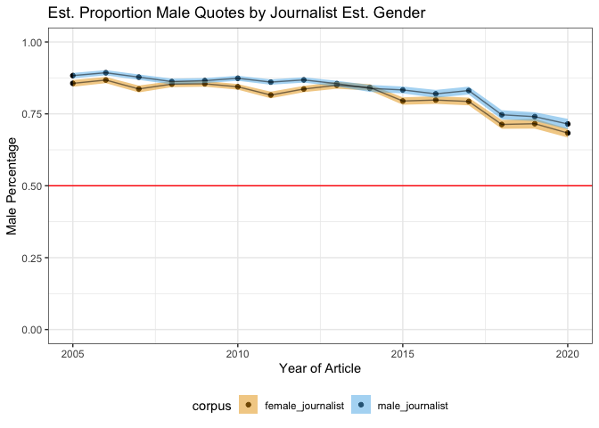
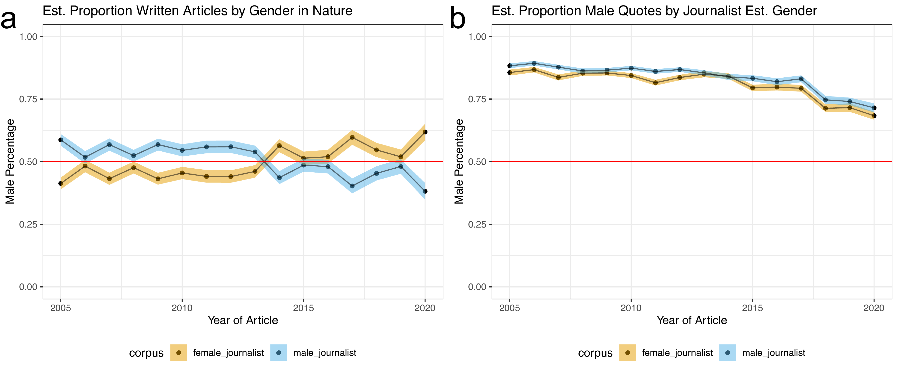

journalist\_contingency\_tables
================
Natalie Davidson
10/22/2021

## Dependencies

This script assumes that `journallist_analysis.Rmd` has been run successfully/

## Nature News comparison of journalists with quotes+mentions

This document is a working analysis of the extracted journalists names and their gender and name origin predictions:

1.  Compare if predicted male/female journalists have different gendered quote/mention biases

2.  Compare if different predicted name origin journalists have different name origin quote/mention biases

The data used to do the journalist specific analysis is here: `/data/journalist_data/*.tsv`

The **setting + helper functions** to generate the plots are here:

1.  plotting related functions: `/utils/plotting_utils.R`

2.  reading + data processing related functions: `/utils/scraper_processing_utils.R` and `/analysis_scripts/analysis_utils.R`

3.  nature research article and springer specific data processing functions: `/process_doi_data/springer_scripts/springer_scrape_utils.R`

## Read in data

### reading in the journalist data

``` r
# read in the scraped journalists info from nature news articles for each year
journo_dir = file.path(proj_dir, "/data/journalist_data/")
journo_files = list.files(journo_dir, full.names = T)

all_authors = NA

tab_res_files = list.files(journo_dir, pattern=".tsv", full.names = TRUE)

all_authors = NA
for(curr_file in tab_res_files){

    print(curr_file)
    
    curr_type = substr(basename(curr_file), 19, nchar(basename(curr_file))-4)

    # skip empty files
    if(file.info(curr_file)$size == 0){
        next
    }
    
    res_df = data.frame(fread(curr_file))
    res_df = subset(res_df, authors != "")
    res_df$type = curr_type

    # make df
    authors_df = res_df[,c("file_id", "year", "authors", "type")]
    all_authors = rbind(all_authors, authors_df)

}
```

    ## [1] "/Users/natalie/Documents/projects/greenelab/checkouts/nature_news_disparities//data/journalist_data//journo_table_2005_news-and-views.tsv"
    ## [1] "/Users/natalie/Documents/projects/greenelab/checkouts/nature_news_disparities//data/journalist_data//journo_table_2005_news-feature.tsv"
    ## [1] "/Users/natalie/Documents/projects/greenelab/checkouts/nature_news_disparities//data/journalist_data//journo_table_2005_news.tsv"
    ## [1] "/Users/natalie/Documents/projects/greenelab/checkouts/nature_news_disparities//data/journalist_data//journo_table_2005_technology-feature.tsv"
    ## [1] "/Users/natalie/Documents/projects/greenelab/checkouts/nature_news_disparities//data/journalist_data//journo_table_2006_news-and-views.tsv"
    ## [1] "/Users/natalie/Documents/projects/greenelab/checkouts/nature_news_disparities//data/journalist_data//journo_table_2006_news-feature.tsv"
    ## [1] "/Users/natalie/Documents/projects/greenelab/checkouts/nature_news_disparities//data/journalist_data//journo_table_2006_news.tsv"
    ## [1] "/Users/natalie/Documents/projects/greenelab/checkouts/nature_news_disparities//data/journalist_data//journo_table_2006_technology-feature.tsv"
    ## [1] "/Users/natalie/Documents/projects/greenelab/checkouts/nature_news_disparities//data/journalist_data//journo_table_2007_news-and-views.tsv"
    ## [1] "/Users/natalie/Documents/projects/greenelab/checkouts/nature_news_disparities//data/journalist_data//journo_table_2007_news-feature.tsv"
    ## [1] "/Users/natalie/Documents/projects/greenelab/checkouts/nature_news_disparities//data/journalist_data//journo_table_2007_news.tsv"
    ## [1] "/Users/natalie/Documents/projects/greenelab/checkouts/nature_news_disparities//data/journalist_data//journo_table_2007_technology-feature.tsv"
    ## [1] "/Users/natalie/Documents/projects/greenelab/checkouts/nature_news_disparities//data/journalist_data//journo_table_2008_news-and-views.tsv"
    ## [1] "/Users/natalie/Documents/projects/greenelab/checkouts/nature_news_disparities//data/journalist_data//journo_table_2008_news-feature.tsv"
    ## [1] "/Users/natalie/Documents/projects/greenelab/checkouts/nature_news_disparities//data/journalist_data//journo_table_2008_news.tsv"
    ## [1] "/Users/natalie/Documents/projects/greenelab/checkouts/nature_news_disparities//data/journalist_data//journo_table_2008_technology-feature.tsv"
    ## [1] "/Users/natalie/Documents/projects/greenelab/checkouts/nature_news_disparities//data/journalist_data//journo_table_2009_news-and-views.tsv"
    ## [1] "/Users/natalie/Documents/projects/greenelab/checkouts/nature_news_disparities//data/journalist_data//journo_table_2009_news-feature.tsv"
    ## [1] "/Users/natalie/Documents/projects/greenelab/checkouts/nature_news_disparities//data/journalist_data//journo_table_2009_news.tsv"
    ## [1] "/Users/natalie/Documents/projects/greenelab/checkouts/nature_news_disparities//data/journalist_data//journo_table_2009_technology-feature.tsv"
    ## [1] "/Users/natalie/Documents/projects/greenelab/checkouts/nature_news_disparities//data/journalist_data//journo_table_2010_news-and-views.tsv"
    ## [1] "/Users/natalie/Documents/projects/greenelab/checkouts/nature_news_disparities//data/journalist_data//journo_table_2010_news-feature.tsv"
    ## [1] "/Users/natalie/Documents/projects/greenelab/checkouts/nature_news_disparities//data/journalist_data//journo_table_2010_news.tsv"
    ## [1] "/Users/natalie/Documents/projects/greenelab/checkouts/nature_news_disparities//data/journalist_data//journo_table_2010_technology-feature.tsv"
    ## [1] "/Users/natalie/Documents/projects/greenelab/checkouts/nature_news_disparities//data/journalist_data//journo_table_2011_news-and-views.tsv"
    ## [1] "/Users/natalie/Documents/projects/greenelab/checkouts/nature_news_disparities//data/journalist_data//journo_table_2011_news-feature.tsv"
    ## [1] "/Users/natalie/Documents/projects/greenelab/checkouts/nature_news_disparities//data/journalist_data//journo_table_2011_news.tsv"
    ## [1] "/Users/natalie/Documents/projects/greenelab/checkouts/nature_news_disparities//data/journalist_data//journo_table_2011_technology-feature.tsv"
    ## [1] "/Users/natalie/Documents/projects/greenelab/checkouts/nature_news_disparities//data/journalist_data//journo_table_2012_news-and-views.tsv"
    ## [1] "/Users/natalie/Documents/projects/greenelab/checkouts/nature_news_disparities//data/journalist_data//journo_table_2012_news-feature.tsv"
    ## [1] "/Users/natalie/Documents/projects/greenelab/checkouts/nature_news_disparities//data/journalist_data//journo_table_2012_news.tsv"
    ## [1] "/Users/natalie/Documents/projects/greenelab/checkouts/nature_news_disparities//data/journalist_data//journo_table_2012_technology-feature.tsv"
    ## [1] "/Users/natalie/Documents/projects/greenelab/checkouts/nature_news_disparities//data/journalist_data//journo_table_2013_news-and-views.tsv"
    ## [1] "/Users/natalie/Documents/projects/greenelab/checkouts/nature_news_disparities//data/journalist_data//journo_table_2013_news-feature.tsv"
    ## [1] "/Users/natalie/Documents/projects/greenelab/checkouts/nature_news_disparities//data/journalist_data//journo_table_2013_news.tsv"
    ## [1] "/Users/natalie/Documents/projects/greenelab/checkouts/nature_news_disparities//data/journalist_data//journo_table_2013_technology-feature.tsv"
    ## [1] "/Users/natalie/Documents/projects/greenelab/checkouts/nature_news_disparities//data/journalist_data//journo_table_2014_news-and-views.tsv"
    ## [1] "/Users/natalie/Documents/projects/greenelab/checkouts/nature_news_disparities//data/journalist_data//journo_table_2014_news-feature.tsv"
    ## [1] "/Users/natalie/Documents/projects/greenelab/checkouts/nature_news_disparities//data/journalist_data//journo_table_2014_news.tsv"
    ## [1] "/Users/natalie/Documents/projects/greenelab/checkouts/nature_news_disparities//data/journalist_data//journo_table_2014_technology-feature.tsv"
    ## [1] "/Users/natalie/Documents/projects/greenelab/checkouts/nature_news_disparities//data/journalist_data//journo_table_2014_toolbox.tsv"
    ## [1] "/Users/natalie/Documents/projects/greenelab/checkouts/nature_news_disparities//data/journalist_data//journo_table_2015_news-and-views.tsv"
    ## [1] "/Users/natalie/Documents/projects/greenelab/checkouts/nature_news_disparities//data/journalist_data//journo_table_2015_news-feature.tsv"
    ## [1] "/Users/natalie/Documents/projects/greenelab/checkouts/nature_news_disparities//data/journalist_data//journo_table_2015_news.tsv"
    ## [1] "/Users/natalie/Documents/projects/greenelab/checkouts/nature_news_disparities//data/journalist_data//journo_table_2015_technology-feature.tsv"
    ## [1] "/Users/natalie/Documents/projects/greenelab/checkouts/nature_news_disparities//data/journalist_data//journo_table_2015_toolbox.tsv"
    ## [1] "/Users/natalie/Documents/projects/greenelab/checkouts/nature_news_disparities//data/journalist_data//journo_table_2016_news-and-views.tsv"
    ## [1] "/Users/natalie/Documents/projects/greenelab/checkouts/nature_news_disparities//data/journalist_data//journo_table_2016_news-feature.tsv"
    ## [1] "/Users/natalie/Documents/projects/greenelab/checkouts/nature_news_disparities//data/journalist_data//journo_table_2016_news.tsv"
    ## [1] "/Users/natalie/Documents/projects/greenelab/checkouts/nature_news_disparities//data/journalist_data//journo_table_2016_technology-feature.tsv"
    ## [1] "/Users/natalie/Documents/projects/greenelab/checkouts/nature_news_disparities//data/journalist_data//journo_table_2016_toolbox.tsv"
    ## [1] "/Users/natalie/Documents/projects/greenelab/checkouts/nature_news_disparities//data/journalist_data//journo_table_2017_career-column.tsv"
    ## [1] "/Users/natalie/Documents/projects/greenelab/checkouts/nature_news_disparities//data/journalist_data//journo_table_2017_career-feature.tsv"
    ## [1] "/Users/natalie/Documents/projects/greenelab/checkouts/nature_news_disparities//data/journalist_data//journo_table_2017_news-and-views.tsv"
    ## [1] "/Users/natalie/Documents/projects/greenelab/checkouts/nature_news_disparities//data/journalist_data//journo_table_2017_news-feature.tsv"
    ## [1] "/Users/natalie/Documents/projects/greenelab/checkouts/nature_news_disparities//data/journalist_data//journo_table_2017_news.tsv"
    ## [1] "/Users/natalie/Documents/projects/greenelab/checkouts/nature_news_disparities//data/journalist_data//journo_table_2017_technology-feature.tsv"
    ## [1] "/Users/natalie/Documents/projects/greenelab/checkouts/nature_news_disparities//data/journalist_data//journo_table_2017_toolbox.tsv"
    ## [1] "/Users/natalie/Documents/projects/greenelab/checkouts/nature_news_disparities//data/journalist_data//journo_table_2018_career-column.tsv"
    ## [1] "/Users/natalie/Documents/projects/greenelab/checkouts/nature_news_disparities//data/journalist_data//journo_table_2018_career-feature.tsv"
    ## [1] "/Users/natalie/Documents/projects/greenelab/checkouts/nature_news_disparities//data/journalist_data//journo_table_2018_news-and-views.tsv"
    ## [1] "/Users/natalie/Documents/projects/greenelab/checkouts/nature_news_disparities//data/journalist_data//journo_table_2018_news-feature.tsv"
    ## [1] "/Users/natalie/Documents/projects/greenelab/checkouts/nature_news_disparities//data/journalist_data//journo_table_2018_news.tsv"
    ## [1] "/Users/natalie/Documents/projects/greenelab/checkouts/nature_news_disparities//data/journalist_data//journo_table_2018_technology-feature.tsv"
    ## [1] "/Users/natalie/Documents/projects/greenelab/checkouts/nature_news_disparities//data/journalist_data//journo_table_2018_toolbox.tsv"
    ## [1] "/Users/natalie/Documents/projects/greenelab/checkouts/nature_news_disparities//data/journalist_data//journo_table_2019_career-column.tsv"
    ## [1] "/Users/natalie/Documents/projects/greenelab/checkouts/nature_news_disparities//data/journalist_data//journo_table_2019_career-feature.tsv"
    ## [1] "/Users/natalie/Documents/projects/greenelab/checkouts/nature_news_disparities//data/journalist_data//journo_table_2019_news-and-views.tsv"
    ## [1] "/Users/natalie/Documents/projects/greenelab/checkouts/nature_news_disparities//data/journalist_data//journo_table_2019_news-feature.tsv"
    ## [1] "/Users/natalie/Documents/projects/greenelab/checkouts/nature_news_disparities//data/journalist_data//journo_table_2019_news.tsv"
    ## [1] "/Users/natalie/Documents/projects/greenelab/checkouts/nature_news_disparities//data/journalist_data//journo_table_2019_technology-feature.tsv"
    ## [1] "/Users/natalie/Documents/projects/greenelab/checkouts/nature_news_disparities//data/journalist_data//journo_table_2019_toolbox.tsv"
    ## [1] "/Users/natalie/Documents/projects/greenelab/checkouts/nature_news_disparities//data/journalist_data//journo_table_2020_career-column.tsv"
    ## [1] "/Users/natalie/Documents/projects/greenelab/checkouts/nature_news_disparities//data/journalist_data//journo_table_2020_career-feature.tsv"
    ## [1] "/Users/natalie/Documents/projects/greenelab/checkouts/nature_news_disparities//data/journalist_data//journo_table_2020_news-and-views.tsv"
    ## [1] "/Users/natalie/Documents/projects/greenelab/checkouts/nature_news_disparities//data/journalist_data//journo_table_2020_news-feature.tsv"
    ## [1] "/Users/natalie/Documents/projects/greenelab/checkouts/nature_news_disparities//data/journalist_data//journo_table_2020_news.tsv"
    ## [1] "/Users/natalie/Documents/projects/greenelab/checkouts/nature_news_disparities//data/journalist_data//journo_table_2020_technology-feature.tsv"

``` r
all_authors = all_authors[-1,]

# split up all the journalist names
author_df_split = separate_rows(all_authors, "authors",sep = "; ")
author_df_split = subset(author_df_split, authors != "")


# remove the article types we are not interested in
all_authors = subset(all_authors, !type %in% c("career-column", "news-and-views"))

# format file_id into a doi
all_authors$doi = paste("doi:10.1038/", all_authors$file_id, sep="")

# plot number of articles scraped
ggplot(unique(all_authors[,c("file_id", "year")]), aes(x=as.factor(year))) +
    geom_bar() + theme_bw() +
    xlab("Year of Article") + ylab("# articles") +
        ggtitle("# Nature News Articles with Author Over Time")
```


### reading in the name origin + gender predictions for journalists

``` r
# read in the scraped nature data
journo_gender = file.path(proj_dir,
                    "/data/author_data/nature_journo_gender.tsv")
journo_gender_res = data.frame(fread(journo_gender))
journo_gender_res$est_gender = journo_gender_res$gender
journo_gender_res = merge(journo_gender_res, all_authors[,c("type", "file_id", "year", "doi")])

# remove the article types we are not interested in
journo_gender_res = subset(journo_gender_res, !type %in% c("guardian", "career-column", "news-and-views"))

# remove articles where no gender could be estimated
journo_gender_res = journo_gender_res[journo_gender_res$est_gender %in% c("FEMALE", "MALE"), ]
journo_gender_res = subset(journo_gender_res, !is.na(est_gender))
```

``` r
# now read in the BG data
name_pred_file = file.path(proj_dir, 
                         "/data/author_data/all_author_fullname_pred.tsv")
name_info_file = file.path(proj_dir, 
                         "/data/author_data/all_author_fullname.tsv")
journo_name_df = read_name_origin(name_pred_file, name_info_file)
journo_name_df$name_origin[journo_name_df$name_origin == "Jewish"] = "Hebrew"
journo_name_df = merge(journo_name_df, all_authors[,c("type", "file_id", "year", "doi")])

# remove the article types we are not interested in
journo_name_df = subset(journo_name_df, !type %in% c("guardian", "career-column", "news-and-views"))
```

### read in the quotes with name origin and gender predictions

``` r
# read in raw quotes data for filtering
full_quote_df = NA
quote_files = list.files(file.path(proj_dir,"/data/scraped_data/", sep=""), full.names = T)
quote_files = grep("quote_table_raw_", quote_files, value=T)
for(quote_file in quote_files){
    
    quote_df = read_corenlp_quote_files(quote_file)
    quote_df$year = str_extract(quote_file, "[1-9][0-9]+") # curr_year
    quote_df$type = substring(basename(quote_file), 
                            22, nchar(basename(quote_file))-4)
    
    full_quote_df = rbind(full_quote_df, quote_df)
}
full_quote_df = full_quote_df[-1,]

# filter out articles with more than 25 quotes
num_quotes = table(full_quote_df$file_id)
too_many_quotes_idx = which(num_quotes > 25)
too_many_quotes_file_id = names(num_quotes)[too_many_quotes_idx]
full_quote_df = subset(full_quote_df, !file_id %in% too_many_quotes_file_id)


# remove names with single name, that do not have a pronoun
space_idx = grep(" ", full_quote_df$est_speaker)
gendered_pronouns = c("he", "him", "his", "himself",
                    "she", "her", "hers", "herself")
pronoun_idx_canonical = which(full_quote_df$canonical_speaker %in% gendered_pronouns)
pronoun_idx_partial = which(full_quote_df$partial_name %in% gendered_pronouns)
allowed_idx = unique(c(space_idx, pronoun_idx_canonical, pronoun_idx_partial))
length(allowed_idx)
```

    ## [1] 159419

``` r
full_quote_df = full_quote_df[allowed_idx,]
full_quote_df = unique(full_quote_df)

# remove quotes where no gender could be estimated
full_quote_df = full_quote_df[full_quote_df$est_gender %in% c("FEMALE", "MALE"), ]
full_quote_df = subset(full_quote_df, !is.na(est_gender))

# remove the article types we are not interested in
full_quote_df = subset(full_quote_df, !type %in% c("guardian", "career-column", "news-and-views"))

# make sure the file_ids don't have HTML, since journalist file_ids don't
#full_quote_df$file_id = gsub(".html", "", full_quote_df$file_id)

# first read in the quote data
name_pred_file = file.path(proj_dir, 
                             "/data/author_data/all_speaker_fullname_pred.tsv")
name_info_file = file.path(proj_dir, 
                             "/data/author_data/all_speaker_fullname.tsv")

quote_name_df = read_name_origin(name_pred_file, name_info_file)
quote_name_df$name_origin[quote_name_df$name_origin == "Jewish"] = "Hebrew"
quote_name_df = subset(quote_name_df, !file_id %in% too_many_quotes_file_id)

# remove the article types we are not interested in
quote_name_df = subset(quote_name_df, !type %in% c("guardian", "career-column", "news-and-views"))
```

## Read in the country information for cited articles

``` r
# first we need to match the citations from countries to names

# springer cited authorship
cited_author_file = file.path(proj_dir, 
                                "/data/reference_data/springer_cited_author_cache.tsv")
cited_dois_dir = file.path(proj_dir, 
                                "/data/doi_data/downloads/")
cited_country_file = file.path(proj_dir, 
                                "/data/author_data/cited_author_country.tsv")
cited_author_df = data.frame(fread(cited_author_file))
cited_author_df = subset(cited_author_df, !is.na(authors))
cited_author_df = subset(cited_author_df, select=-c(year))

cited_country_df = data.frame(fread(cited_country_file))

cited_doi_df = get_ref_dois(cited_dois_dir)
```

    ## [1] "/Users/natalie/Documents/projects/greenelab/checkouts/nature_news_disparities//data/doi_data/downloads//links_crawled_2005_career-column.json"
    ## [1] "/Users/natalie/Documents/projects/greenelab/checkouts/nature_news_disparities//data/doi_data/downloads//links_crawled_2005_career-feature.json"
    ## [1] "/Users/natalie/Documents/projects/greenelab/checkouts/nature_news_disparities//data/doi_data/downloads//links_crawled_2005_news-and-views.json"
    ## [1] "/Users/natalie/Documents/projects/greenelab/checkouts/nature_news_disparities//data/doi_data/downloads//links_crawled_2005_news-feature.json"
    ## [1] "/Users/natalie/Documents/projects/greenelab/checkouts/nature_news_disparities//data/doi_data/downloads//links_crawled_2005_news.json"
    ## [1] "/Users/natalie/Documents/projects/greenelab/checkouts/nature_news_disparities//data/doi_data/downloads//links_crawled_2005_technology-feature.json"
    ## [1] "/Users/natalie/Documents/projects/greenelab/checkouts/nature_news_disparities//data/doi_data/downloads//links_crawled_2005_toolbox.json"
    ## [1] "/Users/natalie/Documents/projects/greenelab/checkouts/nature_news_disparities//data/doi_data/downloads//links_crawled_2006_career-column.json"
    ## [1] "/Users/natalie/Documents/projects/greenelab/checkouts/nature_news_disparities//data/doi_data/downloads//links_crawled_2006_career-feature.json"
    ## [1] "/Users/natalie/Documents/projects/greenelab/checkouts/nature_news_disparities//data/doi_data/downloads//links_crawled_2006_news-and-views.json"
    ## [1] "/Users/natalie/Documents/projects/greenelab/checkouts/nature_news_disparities//data/doi_data/downloads//links_crawled_2006_news-feature.json"
    ## [1] "/Users/natalie/Documents/projects/greenelab/checkouts/nature_news_disparities//data/doi_data/downloads//links_crawled_2006_news.json"
    ## [1] "/Users/natalie/Documents/projects/greenelab/checkouts/nature_news_disparities//data/doi_data/downloads//links_crawled_2006_technology-feature.json"
    ## [1] "/Users/natalie/Documents/projects/greenelab/checkouts/nature_news_disparities//data/doi_data/downloads//links_crawled_2006_toolbox.json"
    ## [1] "/Users/natalie/Documents/projects/greenelab/checkouts/nature_news_disparities//data/doi_data/downloads//links_crawled_2007_career-column.json"
    ## [1] "/Users/natalie/Documents/projects/greenelab/checkouts/nature_news_disparities//data/doi_data/downloads//links_crawled_2007_career-feature.json"
    ## [1] "/Users/natalie/Documents/projects/greenelab/checkouts/nature_news_disparities//data/doi_data/downloads//links_crawled_2007_news-and-views.json"
    ## [1] "/Users/natalie/Documents/projects/greenelab/checkouts/nature_news_disparities//data/doi_data/downloads//links_crawled_2007_news-feature.json"
    ## [1] "/Users/natalie/Documents/projects/greenelab/checkouts/nature_news_disparities//data/doi_data/downloads//links_crawled_2007_news.json"
    ## [1] "/Users/natalie/Documents/projects/greenelab/checkouts/nature_news_disparities//data/doi_data/downloads//links_crawled_2007_technology-feature.json"
    ## [1] "/Users/natalie/Documents/projects/greenelab/checkouts/nature_news_disparities//data/doi_data/downloads//links_crawled_2007_toolbox.json"
    ## [1] "/Users/natalie/Documents/projects/greenelab/checkouts/nature_news_disparities//data/doi_data/downloads//links_crawled_2008_career-column.json"
    ## [1] "/Users/natalie/Documents/projects/greenelab/checkouts/nature_news_disparities//data/doi_data/downloads//links_crawled_2008_career-feature.json"
    ## [1] "/Users/natalie/Documents/projects/greenelab/checkouts/nature_news_disparities//data/doi_data/downloads//links_crawled_2008_news-and-views.json"
    ## [1] "/Users/natalie/Documents/projects/greenelab/checkouts/nature_news_disparities//data/doi_data/downloads//links_crawled_2008_news-feature.json"
    ## [1] "/Users/natalie/Documents/projects/greenelab/checkouts/nature_news_disparities//data/doi_data/downloads//links_crawled_2008_news.json"
    ## [1] "/Users/natalie/Documents/projects/greenelab/checkouts/nature_news_disparities//data/doi_data/downloads//links_crawled_2008_technology-feature.json"
    ## [1] "/Users/natalie/Documents/projects/greenelab/checkouts/nature_news_disparities//data/doi_data/downloads//links_crawled_2008_toolbox.json"
    ## [1] "/Users/natalie/Documents/projects/greenelab/checkouts/nature_news_disparities//data/doi_data/downloads//links_crawled_2009_career-column.json"
    ## [1] "/Users/natalie/Documents/projects/greenelab/checkouts/nature_news_disparities//data/doi_data/downloads//links_crawled_2009_career-feature.json"
    ## [1] "/Users/natalie/Documents/projects/greenelab/checkouts/nature_news_disparities//data/doi_data/downloads//links_crawled_2009_news-and-views.json"
    ## [1] "/Users/natalie/Documents/projects/greenelab/checkouts/nature_news_disparities//data/doi_data/downloads//links_crawled_2009_news-feature.json"
    ## [1] "/Users/natalie/Documents/projects/greenelab/checkouts/nature_news_disparities//data/doi_data/downloads//links_crawled_2009_news.json"
    ## [1] "/Users/natalie/Documents/projects/greenelab/checkouts/nature_news_disparities//data/doi_data/downloads//links_crawled_2009_technology-feature.json"
    ## [1] "/Users/natalie/Documents/projects/greenelab/checkouts/nature_news_disparities//data/doi_data/downloads//links_crawled_2009_toolbox.json"
    ## [1] "/Users/natalie/Documents/projects/greenelab/checkouts/nature_news_disparities//data/doi_data/downloads//links_crawled_2010_career-column.json"
    ## [1] "/Users/natalie/Documents/projects/greenelab/checkouts/nature_news_disparities//data/doi_data/downloads//links_crawled_2010_career-feature.json"
    ## [1] "/Users/natalie/Documents/projects/greenelab/checkouts/nature_news_disparities//data/doi_data/downloads//links_crawled_2010_news-and-views.json"
    ## [1] "/Users/natalie/Documents/projects/greenelab/checkouts/nature_news_disparities//data/doi_data/downloads//links_crawled_2010_news-feature.json"
    ## [1] "/Users/natalie/Documents/projects/greenelab/checkouts/nature_news_disparities//data/doi_data/downloads//links_crawled_2010_news.json"
    ## [1] "/Users/natalie/Documents/projects/greenelab/checkouts/nature_news_disparities//data/doi_data/downloads//links_crawled_2010_technology-feature.json"
    ## [1] "/Users/natalie/Documents/projects/greenelab/checkouts/nature_news_disparities//data/doi_data/downloads//links_crawled_2010_toolbox.json"
    ## [1] "/Users/natalie/Documents/projects/greenelab/checkouts/nature_news_disparities//data/doi_data/downloads//links_crawled_2011_career-column.json"
    ## [1] "/Users/natalie/Documents/projects/greenelab/checkouts/nature_news_disparities//data/doi_data/downloads//links_crawled_2011_career-feature.json"
    ## [1] "/Users/natalie/Documents/projects/greenelab/checkouts/nature_news_disparities//data/doi_data/downloads//links_crawled_2011_news-and-views.json"
    ## [1] "/Users/natalie/Documents/projects/greenelab/checkouts/nature_news_disparities//data/doi_data/downloads//links_crawled_2011_news-feature.json"
    ## [1] "/Users/natalie/Documents/projects/greenelab/checkouts/nature_news_disparities//data/doi_data/downloads//links_crawled_2011_news.json"
    ## [1] "/Users/natalie/Documents/projects/greenelab/checkouts/nature_news_disparities//data/doi_data/downloads//links_crawled_2011_technology-feature.json"
    ## [1] "/Users/natalie/Documents/projects/greenelab/checkouts/nature_news_disparities//data/doi_data/downloads//links_crawled_2011_toolbox.json"
    ## [1] "/Users/natalie/Documents/projects/greenelab/checkouts/nature_news_disparities//data/doi_data/downloads//links_crawled_2012_career-column.json"
    ## [1] "/Users/natalie/Documents/projects/greenelab/checkouts/nature_news_disparities//data/doi_data/downloads//links_crawled_2012_career-feature.json"
    ## [1] "/Users/natalie/Documents/projects/greenelab/checkouts/nature_news_disparities//data/doi_data/downloads//links_crawled_2012_news-and-views.json"
    ## [1] "/Users/natalie/Documents/projects/greenelab/checkouts/nature_news_disparities//data/doi_data/downloads//links_crawled_2012_news-feature.json"
    ## [1] "/Users/natalie/Documents/projects/greenelab/checkouts/nature_news_disparities//data/doi_data/downloads//links_crawled_2012_news.json"
    ## [1] "/Users/natalie/Documents/projects/greenelab/checkouts/nature_news_disparities//data/doi_data/downloads//links_crawled_2012_technology-feature.json"
    ## [1] "/Users/natalie/Documents/projects/greenelab/checkouts/nature_news_disparities//data/doi_data/downloads//links_crawled_2012_toolbox.json"
    ## [1] "/Users/natalie/Documents/projects/greenelab/checkouts/nature_news_disparities//data/doi_data/downloads//links_crawled_2013_career-column.json"
    ## [1] "/Users/natalie/Documents/projects/greenelab/checkouts/nature_news_disparities//data/doi_data/downloads//links_crawled_2013_career-feature.json"
    ## [1] "/Users/natalie/Documents/projects/greenelab/checkouts/nature_news_disparities//data/doi_data/downloads//links_crawled_2013_news-and-views.json"
    ## [1] "/Users/natalie/Documents/projects/greenelab/checkouts/nature_news_disparities//data/doi_data/downloads//links_crawled_2013_news-feature.json"
    ## [1] "/Users/natalie/Documents/projects/greenelab/checkouts/nature_news_disparities//data/doi_data/downloads//links_crawled_2013_news.json"
    ## [1] "/Users/natalie/Documents/projects/greenelab/checkouts/nature_news_disparities//data/doi_data/downloads//links_crawled_2013_technology-feature.json"
    ## [1] "/Users/natalie/Documents/projects/greenelab/checkouts/nature_news_disparities//data/doi_data/downloads//links_crawled_2013_toolbox.json"
    ## [1] "/Users/natalie/Documents/projects/greenelab/checkouts/nature_news_disparities//data/doi_data/downloads//links_crawled_2014_career-column.json"
    ## [1] "/Users/natalie/Documents/projects/greenelab/checkouts/nature_news_disparities//data/doi_data/downloads//links_crawled_2014_career-feature.json"
    ## [1] "/Users/natalie/Documents/projects/greenelab/checkouts/nature_news_disparities//data/doi_data/downloads//links_crawled_2014_news-and-views.json"
    ## [1] "/Users/natalie/Documents/projects/greenelab/checkouts/nature_news_disparities//data/doi_data/downloads//links_crawled_2014_news-feature.json"
    ## [1] "/Users/natalie/Documents/projects/greenelab/checkouts/nature_news_disparities//data/doi_data/downloads//links_crawled_2014_news.json"
    ## [1] "/Users/natalie/Documents/projects/greenelab/checkouts/nature_news_disparities//data/doi_data/downloads//links_crawled_2014_technology-feature.json"
    ## [1] "/Users/natalie/Documents/projects/greenelab/checkouts/nature_news_disparities//data/doi_data/downloads//links_crawled_2014_toolbox.json"
    ## [1] "/Users/natalie/Documents/projects/greenelab/checkouts/nature_news_disparities//data/doi_data/downloads//links_crawled_2015_career-column.json"
    ## [1] "/Users/natalie/Documents/projects/greenelab/checkouts/nature_news_disparities//data/doi_data/downloads//links_crawled_2015_career-feature.json"
    ## [1] "/Users/natalie/Documents/projects/greenelab/checkouts/nature_news_disparities//data/doi_data/downloads//links_crawled_2015_news-and-views.json"
    ## [1] "/Users/natalie/Documents/projects/greenelab/checkouts/nature_news_disparities//data/doi_data/downloads//links_crawled_2015_news-feature.json"
    ## [1] "/Users/natalie/Documents/projects/greenelab/checkouts/nature_news_disparities//data/doi_data/downloads//links_crawled_2015_news.json"
    ## [1] "/Users/natalie/Documents/projects/greenelab/checkouts/nature_news_disparities//data/doi_data/downloads//links_crawled_2015_technology-feature.json"
    ## [1] "/Users/natalie/Documents/projects/greenelab/checkouts/nature_news_disparities//data/doi_data/downloads//links_crawled_2015_toolbox.json"
    ## [1] "/Users/natalie/Documents/projects/greenelab/checkouts/nature_news_disparities//data/doi_data/downloads//links_crawled_2016_career-column.json"
    ## [1] "/Users/natalie/Documents/projects/greenelab/checkouts/nature_news_disparities//data/doi_data/downloads//links_crawled_2016_career-feature.json"
    ## [1] "/Users/natalie/Documents/projects/greenelab/checkouts/nature_news_disparities//data/doi_data/downloads//links_crawled_2016_news-and-views.json"
    ## [1] "/Users/natalie/Documents/projects/greenelab/checkouts/nature_news_disparities//data/doi_data/downloads//links_crawled_2016_news-feature.json"
    ## [1] "/Users/natalie/Documents/projects/greenelab/checkouts/nature_news_disparities//data/doi_data/downloads//links_crawled_2016_news.json"
    ## [1] "/Users/natalie/Documents/projects/greenelab/checkouts/nature_news_disparities//data/doi_data/downloads//links_crawled_2016_technology-feature.json"
    ## [1] "/Users/natalie/Documents/projects/greenelab/checkouts/nature_news_disparities//data/doi_data/downloads//links_crawled_2016_toolbox.json"
    ## [1] "/Users/natalie/Documents/projects/greenelab/checkouts/nature_news_disparities//data/doi_data/downloads//links_crawled_2017_career-column.json"
    ## [1] "/Users/natalie/Documents/projects/greenelab/checkouts/nature_news_disparities//data/doi_data/downloads//links_crawled_2017_career-feature.json"
    ## [1] "/Users/natalie/Documents/projects/greenelab/checkouts/nature_news_disparities//data/doi_data/downloads//links_crawled_2017_news-and-views.json"
    ## [1] "/Users/natalie/Documents/projects/greenelab/checkouts/nature_news_disparities//data/doi_data/downloads//links_crawled_2017_news-feature.json"
    ## [1] "/Users/natalie/Documents/projects/greenelab/checkouts/nature_news_disparities//data/doi_data/downloads//links_crawled_2017_news.json"
    ## [1] "/Users/natalie/Documents/projects/greenelab/checkouts/nature_news_disparities//data/doi_data/downloads//links_crawled_2017_technology-feature.json"
    ## [1] "/Users/natalie/Documents/projects/greenelab/checkouts/nature_news_disparities//data/doi_data/downloads//links_crawled_2017_toolbox.json"
    ## [1] "/Users/natalie/Documents/projects/greenelab/checkouts/nature_news_disparities//data/doi_data/downloads//links_crawled_2018_career-column.json"
    ## [1] "/Users/natalie/Documents/projects/greenelab/checkouts/nature_news_disparities//data/doi_data/downloads//links_crawled_2018_career-feature.json"
    ## [1] "/Users/natalie/Documents/projects/greenelab/checkouts/nature_news_disparities//data/doi_data/downloads//links_crawled_2018_news-and-views.json"
    ## [1] "/Users/natalie/Documents/projects/greenelab/checkouts/nature_news_disparities//data/doi_data/downloads//links_crawled_2018_news-feature.json"
    ## [1] "/Users/natalie/Documents/projects/greenelab/checkouts/nature_news_disparities//data/doi_data/downloads//links_crawled_2018_news.json"
    ## [1] "/Users/natalie/Documents/projects/greenelab/checkouts/nature_news_disparities//data/doi_data/downloads//links_crawled_2018_technology-feature.json"
    ## [1] "/Users/natalie/Documents/projects/greenelab/checkouts/nature_news_disparities//data/doi_data/downloads//links_crawled_2018_toolbox.json"
    ## [1] "/Users/natalie/Documents/projects/greenelab/checkouts/nature_news_disparities//data/doi_data/downloads//links_crawled_2019_career-column.json"
    ## [1] "/Users/natalie/Documents/projects/greenelab/checkouts/nature_news_disparities//data/doi_data/downloads//links_crawled_2019_career-feature.json"
    ## [1] "/Users/natalie/Documents/projects/greenelab/checkouts/nature_news_disparities//data/doi_data/downloads//links_crawled_2019_news-and-views.json"
    ## [1] "/Users/natalie/Documents/projects/greenelab/checkouts/nature_news_disparities//data/doi_data/downloads//links_crawled_2019_news-feature.json"
    ## [1] "/Users/natalie/Documents/projects/greenelab/checkouts/nature_news_disparities//data/doi_data/downloads//links_crawled_2019_news.json"
    ## [1] "/Users/natalie/Documents/projects/greenelab/checkouts/nature_news_disparities//data/doi_data/downloads//links_crawled_2019_technology-feature.json"
    ## [1] "/Users/natalie/Documents/projects/greenelab/checkouts/nature_news_disparities//data/doi_data/downloads//links_crawled_2019_toolbox.json"
    ## [1] "/Users/natalie/Documents/projects/greenelab/checkouts/nature_news_disparities//data/doi_data/downloads//links_crawled_2020_career-column.json"
    ## [1] "/Users/natalie/Documents/projects/greenelab/checkouts/nature_news_disparities//data/doi_data/downloads//links_crawled_2020_career-feature.json"
    ## [1] "/Users/natalie/Documents/projects/greenelab/checkouts/nature_news_disparities//data/doi_data/downloads//links_crawled_2020_news-and-views.json"
    ## [1] "/Users/natalie/Documents/projects/greenelab/checkouts/nature_news_disparities//data/doi_data/downloads//links_crawled_2020_news-feature.json"
    ## [1] "/Users/natalie/Documents/projects/greenelab/checkouts/nature_news_disparities//data/doi_data/downloads//links_crawled_2020_news.json"
    ## [1] "/Users/natalie/Documents/projects/greenelab/checkouts/nature_news_disparities//data/doi_data/downloads//links_crawled_2020_technology-feature.json"
    ## [1] "/Users/natalie/Documents/projects/greenelab/checkouts/nature_news_disparities//data/doi_data/downloads//links_crawled_2020_toolbox.json"

``` r
cited_author_df = merge(cited_author_df, cited_doi_df[,c("doi", "year", "file_id")], by=c("doi"))
cited_author_df = subset(cited_author_df, authors != "")
cited_author_df = format_authors(cited_author_df, use_fullname=T)
cited_author_df$corpus = "naturenews_citations"
col_ids = c("year", "author_pos", "author", "file_id", "doi", "corpus")
cited_author_df = cited_author_df[,col_ids]

# now merge with the country map
cited_author_country_df = merge(cited_author_df, cited_country_df)
head(cited_author_country_df)
```

    ##         file_id                     doi year author_pos          author
    ## 1 050103-4.html doi:10.1038/nature03086 2005       last Antonio Damasio
    ## 2 050103-4.html doi:10.1038/nature03086 2005       last Antonio Damasio
    ## 3 050103-4.html doi:10.1038/nature03086 2005       last Antonio Damasio
    ## 4 050103-4.html doi:10.1038/nature03086 2005      first   Ralph Adolphs
    ## 5 050103-4.html doi:10.1038/nature03086 2005      first   Ralph Adolphs
    ## 6 050103-4.html doi:10.1038/nature03086 2005      first   Ralph Adolphs
    ##                 corpus        country query_date num_entries
    ## 1 naturenews_citations United Kingdom 2021-04-10           1
    ## 2 naturenews_citations         Canada 2021-04-10           1
    ## 3 naturenews_citations  United States 2021-04-10           1
    ## 4 naturenews_citations United Kingdom 2021-04-10           1
    ## 5 naturenews_citations         Canada 2021-04-10           1
    ## 6 naturenews_citations  United States 2021-04-10           1

``` r
# format the countries
cited_author_country_df$country = format_country_names(cited_author_country_df$country)
```

### join gender predictions for journalists and quotes

``` r
journo_gender_res = journo_gender_res %>% rename(
                                                journalist = author,
                                                journo_gender = est_gender
                                                )
journo_gender_res = journo_gender_res[,c("journalist", "journo_gender", 
                                         "file_id", "year", "type")]

full_quote_df = full_quote_df[,c("est_speaker", "est_gender", 
                                         "file_id", "quote", "year", "type")]

gender_journo_quote = merge(journo_gender_res, full_quote_df)
table(gender_journo_quote$type, gender_journo_quote$year)
```

    ##                     
    ##                      2005 2006 2007 2008 2009 2010 2011 2012 2013 2014 2015
    ##   career-feature        0    0    0    0    0    0    0    0    0    0    0
    ##   news               4484 4450 4750 5652 6490 6423 5946 6006 5343 4664 4567
    ##   news-feature       1349 1344 1220 1097 1224 1120  993 1169 1083 1172  946
    ##   technology-feature   67   54  110   57   41   76  106   43   52   72   85
    ##   toolbox               0    0    0    0    0    0    0    0    0   41   90
    ##                     
    ##                      2016 2017 2018 2019 2020
    ##   career-feature        0   51  412  258  206
    ##   news               4250 3528 3561 3197 3097
    ##   news-feature        750  807  894  868  868
    ##   technology-feature  184  187   92  214  378
    ##   toolbox             113  103  168  153    0

### join name origin predictions for journalists and quotes

``` r
journo_name_df = journo_name_df %>% rename(
                                            journalist = author,
                                            journo_name_origin = name_origin
                                            )
journo_name_df = journo_name_df[,c("journalist", "journo_name_origin", 
                                         "file_id", "doi", "year", "type")]
quote_name_df = quote_name_df %>% rename(
                                        speaker = author
                                        )
quote_name_df = quote_name_df[,c("speaker", "name_origin", 
                                "file_id", "quote", "year", "type")]

name_origin_journo_quote = merge(journo_name_df, quote_name_df)


# now we only get the CelticEnglish / European names 
#since there are n't much other journalist names names
table(name_origin_journo_quote$journo_name_origin, name_origin_journo_quote$year)
```

    ##                
    ##                 2005 2006 2007 2008 2009 2010 2011 2012 2013 2014 2015 2016
    ##   African          0   24    3    0    7    9  163   14    0   15   32   20
    ##   ArabTurkPers    13   11    3   44   92  190   87   98   53   33   76  139
    ##   CelticEnglish 3315 3433 3557 3933 3767 3807 3536 3833 2843 2424 2371 2263
    ##   EastAsian       53  127   92  172  329  375  240  548  621  260  295  187
    ##   European      1939 1753 1778 1847 2324 1852 1951 1792 1963 2249 1979 1823
    ##   Greek            0    0    0    0    0    0    0    0    0    0   11    0
    ##   Hebrew          31   39    6   41   84   72   94   79    0    5   25   47
    ##   Hispanic         0    0    5    9    4   20   40   14   54   51    8   16
    ##   Nordic         108    0   96  245  447  722  439  289  369  283  391  329
    ##   SouthAsian      16   69   57   16  155   86  144  126   25  101   36   67
    ##                
    ##                 2017 2018 2019 2020
    ##   African         16   17   11    0
    ##   ArabTurkPers    29   41   28   19
    ##   CelticEnglish 2222 2096 1905 1698
    ##   EastAsian       64  192  143   84
    ##   European      1619 1852 1639 1493
    ##   Greek            0    0    8    0
    ##   Hebrew           1    2   12   26
    ##   Hispanic        78   24   41   26
    ##   Nordic         231  255  224  196
    ##   SouthAsian      77   89  227  608

``` r
name_origin_journo_quote = subset(name_origin_journo_quote, journo_name_origin %in% c("CelticEnglish", "European", "EastAsian"))
```

### join name origin predictions for journalists and quotes ALSO with citations

``` r
cited_author_country_df = cited_author_country_df[,c("file_id", "year", "author", "country")]
colnames(cited_author_country_df)[3] = "speaker"
cite_quote_df = merge(name_origin_journo_quote, cited_author_country_df)

cite_quote_df_us = subset(cite_quote_df, country %in% c("united states"))
table(cite_quote_df$journo_name_origin, cite_quote_df$year)
```

    ##                
    ##                 2005 2006 2007 2008 2009 2010 2011 2012 2013 2014 2015 2016
    ##   CelticEnglish  378  299  205  231  210  469  330  318  292  206  396  281
    ##   EastAsian        0   18    0    5   12   66   21   44  139   20   21   19
    ##   European       136  174   63   74  154  192  132  159  118  151  169  179
    ##                
    ##                 2017 2018 2019 2020
    ##   CelticEnglish  379  335  365  250
    ##   EastAsian       21   28    0    0
    ##   European       156  157  167  100

## Process Gender and Name Origin

### calculate bootstrap on gender

``` r
if(RERUN_BOOTSTRAP){
        
    
    #### Quote data
    female_j_prop_df = compute_bootstrap_gender(subset(gender_journo_quote, journo_gender == "FEMALE"), 
                                               year_col_id = "year", 
                                               article_col_id = "quote",
                                               conf_int=0.95)
    female_j_prop_df$corpus = "female_journalist"
    
    male_j_prop_df = compute_bootstrap_gender(subset(gender_journo_quote, journo_gender == "MALE"), 
                                               year_col_id = "year", 
                                               article_col_id = "quote",
                                               conf_int=0.95)
    male_j_prop_df$corpus = "male_journalist"
    
    
    all_bootstrap_file = file.path(proj_dir,
                            "/figure_notebooks/supp_analyze_journalist_data/tmp_files/journo_quote_gender.RData")
    save(female_j_prop_df, male_j_prop_df,
         file = all_bootstrap_file)
}else{
    all_bootstrap_file = file.path(proj_dir,
                            "/figure_notebooks/supp_analyze_journalist_data/tmp_files/journo_quote_gender.RData")
    load(all_bootstrap_file)
}
female_j_prop_df$corpus = "female_journalist"
male_j_prop_df$corpus = "male_journalist"
```

### now process name origin, write tables

``` r
# make the table, then scale by row (row sums to 1)
tab_quote = table(name_origin_journo_quote$journo_name_origin, 
                             name_origin_journo_quote$name_origin)
tab_quote_percent = t(apply(tab_quote, 1, function(x) x/(sum(x))))

tab_quote_cite = table(cite_quote_df$journo_name_origin, 
                             cite_quote_df$name_origin)
tab_quote_cite_percent = t(apply(tab_quote_cite, 1, function(x) x/(sum(x))))

tab_quote_us = table(cite_quote_df_us$journo_name_origin, 
                             cite_quote_df_us$name_origin)
tab_quote_us_percent = t(apply(tab_quote_us, 1, function(x) x/(sum(x))))


knitr::kable(tab_quote, format = "pipe", 
             caption = "Quoted speaker name origin, by journalist name origin")
```

<table style="width:100%;">
<caption>Quoted speaker name origin, by journalist name origin</caption>
<colgroup>
<col width="12%" />
<col width="7%" />
<col width="11%" />
<col width="12%" />
<col width="9%" />
<col width="8%" />
<col width="5%" />
<col width="6%" />
<col width="8%" />
<col width="6%" />
<col width="10%" />
</colgroup>
<thead>
<tr class="header">
<th align="left"></th>
<th align="right">African</th>
<th align="right">ArabTurkPers</th>
<th align="right">CelticEnglish</th>
<th align="right">EastAsian</th>
<th align="right">European</th>
<th align="right">Greek</th>
<th align="right">Hebrew</th>
<th align="right">Hispanic</th>
<th align="right">Nordic</th>
<th align="right">SouthAsian</th>
</tr>
</thead>
<tbody>
<tr class="odd">
<td align="left">CelticEnglish</td>
<td align="right">960</td>
<td align="right">1165</td>
<td align="right">22752</td>
<td align="right">1796</td>
<td align="right">14987</td>
<td align="right">308</td>
<td align="right">775</td>
<td align="right">1565</td>
<td align="right">1661</td>
<td align="right">1034</td>
</tr>
<tr class="even">
<td align="left">EastAsian</td>
<td align="right">69</td>
<td align="right">66</td>
<td align="right">1340</td>
<td align="right">919</td>
<td align="right">944</td>
<td align="right">18</td>
<td align="right">60</td>
<td align="right">98</td>
<td align="right">135</td>
<td align="right">133</td>
</tr>
<tr class="odd">
<td align="left">European</td>
<td align="right">650</td>
<td align="right">673</td>
<td align="right">12544</td>
<td align="right">2578</td>
<td align="right">9732</td>
<td align="right">161</td>
<td align="right">480</td>
<td align="right">1272</td>
<td align="right">966</td>
<td align="right">797</td>
</tr>
</tbody>
</table>

``` r
knitr::kable(tab_quote_percent, format = "pipe", 
             caption = "Quoted speaker name origin, by journalist name origin % ")
```

<table style="width:100%;">
<caption>Quoted speaker name origin, by journalist name origin %</caption>
<colgroup>
<col width="11%" />
<col width="8%" />
<col width="10%" />
<col width="11%" />
<col width="8%" />
<col width="8%" />
<col width="8%" />
<col width="8%" />
<col width="8%" />
<col width="8%" />
<col width="9%" />
</colgroup>
<thead>
<tr class="header">
<th align="left"></th>
<th align="right">African</th>
<th align="right">ArabTurkPers</th>
<th align="right">CelticEnglish</th>
<th align="right">EastAsian</th>
<th align="right">European</th>
<th align="right">Greek</th>
<th align="right">Hebrew</th>
<th align="right">Hispanic</th>
<th align="right">Nordic</th>
<th align="right">SouthAsian</th>
</tr>
</thead>
<tbody>
<tr class="odd">
<td align="left">CelticEnglish</td>
<td align="right">0.0204242</td>
<td align="right">0.0247857</td>
<td align="right">0.4840542</td>
<td align="right">0.0382103</td>
<td align="right">0.3188520</td>
<td align="right">0.0065528</td>
<td align="right">0.0164883</td>
<td align="right">0.0332957</td>
<td align="right">0.0353382</td>
<td align="right">0.0219986</td>
</tr>
<tr class="even">
<td align="left">EastAsian</td>
<td align="right">0.0182443</td>
<td align="right">0.0174511</td>
<td align="right">0.3543099</td>
<td align="right">0.2429931</td>
<td align="right">0.2496034</td>
<td align="right">0.0047594</td>
<td align="right">0.0158646</td>
<td align="right">0.0259122</td>
<td align="right">0.0356954</td>
<td align="right">0.0351666</td>
</tr>
<tr class="odd">
<td align="left">European</td>
<td align="right">0.0217734</td>
<td align="right">0.0225438</td>
<td align="right">0.4201923</td>
<td align="right">0.0863565</td>
<td align="right">0.3259974</td>
<td align="right">0.0053931</td>
<td align="right">0.0160788</td>
<td align="right">0.0426088</td>
<td align="right">0.0323586</td>
<td align="right">0.0266975</td>
</tr>
</tbody>
</table>

``` r
knitr::kable(tab_quote_cite, format = "pipe", 
             caption = "Quoted + cited speaker name origin, by journalist name origin")
```

<table style="width:100%;">
<caption>Quoted + cited speaker name origin, by journalist name origin</caption>
<colgroup>
<col width="12%" />
<col width="7%" />
<col width="11%" />
<col width="12%" />
<col width="9%" />
<col width="8%" />
<col width="5%" />
<col width="6%" />
<col width="8%" />
<col width="6%" />
<col width="10%" />
</colgroup>
<thead>
<tr class="header">
<th align="left"></th>
<th align="right">African</th>
<th align="right">ArabTurkPers</th>
<th align="right">CelticEnglish</th>
<th align="right">EastAsian</th>
<th align="right">European</th>
<th align="right">Greek</th>
<th align="right">Hebrew</th>
<th align="right">Hispanic</th>
<th align="right">Nordic</th>
<th align="right">SouthAsian</th>
</tr>
</thead>
<tbody>
<tr class="odd">
<td align="left">CelticEnglish</td>
<td align="right">78</td>
<td align="right">135</td>
<td align="right">1817</td>
<td align="right">347</td>
<td align="right">1797</td>
<td align="right">41</td>
<td align="right">83</td>
<td align="right">113</td>
<td align="right">408</td>
<td align="right">125</td>
</tr>
<tr class="even">
<td align="left">EastAsian</td>
<td align="right">1</td>
<td align="right">32</td>
<td align="right">156</td>
<td align="right">59</td>
<td align="right">65</td>
<td align="right">0</td>
<td align="right">5</td>
<td align="right">55</td>
<td align="right">8</td>
<td align="right">33</td>
</tr>
<tr class="odd">
<td align="left">European</td>
<td align="right">32</td>
<td align="right">63</td>
<td align="right">828</td>
<td align="right">265</td>
<td align="right">803</td>
<td align="right">14</td>
<td align="right">70</td>
<td align="right">59</td>
<td align="right">79</td>
<td align="right">68</td>
</tr>
</tbody>
</table>

``` r
knitr::kable(tab_quote_cite_percent, format = "pipe", 
             caption = "Quoted + cited speaker name origin, by journalist name origin %")
```

<table style="width:100%;">
<caption>Quoted + cited speaker name origin, by journalist name origin %</caption>
<colgroup>
<col width="11%" />
<col width="8%" />
<col width="10%" />
<col width="11%" />
<col width="8%" />
<col width="8%" />
<col width="8%" />
<col width="8%" />
<col width="8%" />
<col width="8%" />
<col width="9%" />
</colgroup>
<thead>
<tr class="header">
<th align="left"></th>
<th align="right">African</th>
<th align="right">ArabTurkPers</th>
<th align="right">CelticEnglish</th>
<th align="right">EastAsian</th>
<th align="right">European</th>
<th align="right">Greek</th>
<th align="right">Hebrew</th>
<th align="right">Hispanic</th>
<th align="right">Nordic</th>
<th align="right">SouthAsian</th>
</tr>
</thead>
<tbody>
<tr class="odd">
<td align="left">CelticEnglish</td>
<td align="right">0.0157767</td>
<td align="right">0.0273058</td>
<td align="right">0.3675162</td>
<td align="right">0.0701861</td>
<td align="right">0.3634709</td>
<td align="right">0.0082929</td>
<td align="right">0.0167880</td>
<td align="right">0.0228560</td>
<td align="right">0.0825243</td>
<td align="right">0.0252832</td>
</tr>
<tr class="even">
<td align="left">EastAsian</td>
<td align="right">0.0024155</td>
<td align="right">0.0772947</td>
<td align="right">0.3768116</td>
<td align="right">0.1425121</td>
<td align="right">0.1570048</td>
<td align="right">0.0000000</td>
<td align="right">0.0120773</td>
<td align="right">0.1328502</td>
<td align="right">0.0193237</td>
<td align="right">0.0797101</td>
</tr>
<tr class="odd">
<td align="left">European</td>
<td align="right">0.0140289</td>
<td align="right">0.0276195</td>
<td align="right">0.3629987</td>
<td align="right">0.1161771</td>
<td align="right">0.3520386</td>
<td align="right">0.0061377</td>
<td align="right">0.0306883</td>
<td align="right">0.0258658</td>
<td align="right">0.0346339</td>
<td align="right">0.0298115</td>
</tr>
</tbody>
</table>

``` r
knitr::kable(tab_quote_us, format = "pipe", 
             caption = "Quoted + cited speaker name origin, by journalist name origin -- US affil")
```

<table style="width:100%;">
<caption>Quoted + cited speaker name origin, by journalist name origin -- US affil</caption>
<colgroup>
<col width="12%" />
<col width="7%" />
<col width="11%" />
<col width="12%" />
<col width="9%" />
<col width="8%" />
<col width="5%" />
<col width="6%" />
<col width="8%" />
<col width="6%" />
<col width="10%" />
</colgroup>
<thead>
<tr class="header">
<th align="left"></th>
<th align="right">African</th>
<th align="right">ArabTurkPers</th>
<th align="right">CelticEnglish</th>
<th align="right">EastAsian</th>
<th align="right">European</th>
<th align="right">Greek</th>
<th align="right">Hebrew</th>
<th align="right">Hispanic</th>
<th align="right">Nordic</th>
<th align="right">SouthAsian</th>
</tr>
</thead>
<tbody>
<tr class="odd">
<td align="left">CelticEnglish</td>
<td align="right">16</td>
<td align="right">35</td>
<td align="right">571</td>
<td align="right">132</td>
<td align="right">545</td>
<td align="right">15</td>
<td align="right">32</td>
<td align="right">44</td>
<td align="right">84</td>
<td align="right">37</td>
</tr>
<tr class="even">
<td align="left">EastAsian</td>
<td align="right">0</td>
<td align="right">12</td>
<td align="right">62</td>
<td align="right">27</td>
<td align="right">38</td>
<td align="right">0</td>
<td align="right">1</td>
<td align="right">27</td>
<td align="right">6</td>
<td align="right">9</td>
</tr>
<tr class="odd">
<td align="left">European</td>
<td align="right">19</td>
<td align="right">27</td>
<td align="right">374</td>
<td align="right">101</td>
<td align="right">273</td>
<td align="right">11</td>
<td align="right">21</td>
<td align="right">17</td>
<td align="right">28</td>
<td align="right">42</td>
</tr>
</tbody>
</table>

``` r
knitr::kable(tab_quote_us_percent, format = "pipe", 
             caption = "Quoted + cited speaker name origin, by journalist name origin % -- US affil")
```

<table style="width:100%;">
<caption>Quoted + cited speaker name origin, by journalist name origin % -- US affil</caption>
<colgroup>
<col width="11%" />
<col width="8%" />
<col width="10%" />
<col width="11%" />
<col width="8%" />
<col width="8%" />
<col width="8%" />
<col width="8%" />
<col width="8%" />
<col width="8%" />
<col width="9%" />
</colgroup>
<thead>
<tr class="header">
<th align="left"></th>
<th align="right">African</th>
<th align="right">ArabTurkPers</th>
<th align="right">CelticEnglish</th>
<th align="right">EastAsian</th>
<th align="right">European</th>
<th align="right">Greek</th>
<th align="right">Hebrew</th>
<th align="right">Hispanic</th>
<th align="right">Nordic</th>
<th align="right">SouthAsian</th>
</tr>
</thead>
<tbody>
<tr class="odd">
<td align="left">CelticEnglish</td>
<td align="right">0.0105890</td>
<td align="right">0.0231635</td>
<td align="right">0.3778954</td>
<td align="right">0.0873594</td>
<td align="right">0.3606883</td>
<td align="right">0.0099272</td>
<td align="right">0.0211780</td>
<td align="right">0.0291198</td>
<td align="right">0.0555923</td>
<td align="right">0.0244871</td>
</tr>
<tr class="even">
<td align="left">EastAsian</td>
<td align="right">0.0000000</td>
<td align="right">0.0659341</td>
<td align="right">0.3406593</td>
<td align="right">0.1483516</td>
<td align="right">0.2087912</td>
<td align="right">0.0000000</td>
<td align="right">0.0054945</td>
<td align="right">0.1483516</td>
<td align="right">0.0329670</td>
<td align="right">0.0494505</td>
</tr>
<tr class="odd">
<td align="left">European</td>
<td align="right">0.0208105</td>
<td align="right">0.0295728</td>
<td align="right">0.4096386</td>
<td align="right">0.1106243</td>
<td align="right">0.2990142</td>
<td align="right">0.0120482</td>
<td align="right">0.0230011</td>
<td align="right">0.0186199</td>
<td align="right">0.0306681</td>
<td align="right">0.0460022</td>
</tr>
</tbody>
</table>

## Make Plots

We would lilke to see if predicted male speakers are overrepresented in news quotes regardless of predicted journalist gender. We depicts two trend lines: Yellow: Proportion of predicted male quotes in an article written by a predicted female journalist; Blue: Proportion of predicted male quotesin an article written by a predicted male journalist. We find that male quote bias is very similar between male and femal journalists since both trend lines closely follow each other.

``` r
#### plot the overview of gender
journo_gender_quote_df = rbind(female_j_prop_df, male_j_prop_df)

journo_gender_quote_gg = 
    ggplot(journo_gender_quote_df, 
      aes(x=as.numeric(year), y=mean,
                          ymin=bottom_CI, ymax=top_CI,
                          fill=corpus)) +
    geom_point() + geom_ribbon(alpha=0.5) + geom_line(alpha=0.5) + theme_bw() + 
    xlab("Year of Article") + ylab("Male Percentage") +
    ggtitle("Est. Proportion Male Quotes by Journalist Est. Gender") + 
    ylim(c(0, 1)) +
    geom_hline(yintercept=0.5, color="red") +
    scale_fill_manual(values=c("#E69F00", "#56B4E9")) +
    theme(legend.position="bottom")

ggsave(file.path(proj_dir,  "/figure_notebooks/supp_analyze_journalist_data/tmp_files/journo_gender_quote_gg.pdf"),
       journo_gender_quote_gg, width = 6, height = 5, units = "in", device = "pdf")


journo_gender_quote_gg
```



## format supp. figure XX

``` r
journo_gender_gg = image_read_pdf(file.path(proj_dir,
                                  "/figure_notebooks/supp_analyze_journalist_data/tmp_files/journo_gender_gg.pdf"))
journo_gender_gg = image_annotate(journo_gender_gg, "a", size = 30)


journo_gender_quote_gg = image_read_pdf(file.path(proj_dir,
                                  "/figure_notebooks/supp_analyze_journalist_data/tmp_files/journo_gender_quote_gg.pdf"))
journo_gender_quote_gg = image_annotate(journo_gender_quote_gg, "b", size = 30)


top_image <- image_append(image_scale(c(journo_gender_gg,
                                           journo_gender_quote_gg),3000), stack = FALSE)

print(top_image)
```

    ## # A tibble: 1 x 7
    ##   format width height colorspace matte filesize density
    ##   <chr>  <int>  <int> <chr>      <lgl>    <int> <chr>  
    ## 1 PNG     6000   2500 sRGB       TRUE         0 300x300



``` r
outfile = file.path(proj_dir,"/figure_notebooks/manuscript_figs/supp_journalist_contingency_tab_tmp/supp_fig.pdf")
image_write(top_image, format = "pdf", outfile)
outfile = file.path(proj_dir,"/figure_notebooks/manuscript_figs/supp_journalist_contingency_tab_tmp/supp_fig.png")
image_write(top_image, format = "png", outfile)
```
