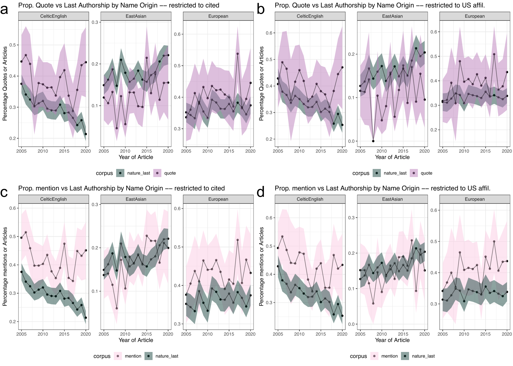

country\_specific\_analysis
================
Natalie Davidson
10/19/2021

## Overview

This notebook generates a supplemental figure that analyses the name-origin of mentioned/quotes people that are also cited. It also looks at the affiliations of the citation.

The **data** it uses to build the plots are here:

This document compares a "foreground" dataset (name origin of quoted/mentioned/cited people) and compares it to two possible "background" datasets (random sampling of 2.4K Springer articles, and all nature research articles)

The quote data file is: `./data/author_data/all_speaker_fullname_pred.tsv` The names mentioned data file is: `./data/author_data/all_mentioned_fullname_pred.tsv` The bg data file is: `./data/author_data/all_author_fullname_pred.tsv`

The three corpi are indexed by the `corpus` column:

1.  `news_quotes`: **foreground** est. name origin of Nature News quoted speaker

2.  `nature_last`: **background** est. name origin of last author of Nature articles.

3.  `springer_last`: **background** est. name origin of last author of a random subset of Springer articles.

The country affiliation data is here: `./data/author_data/all_author_country.tsv`

The four corpi are indexed by the `corpus` column:

1.  `nature_news`: **foreground** country of a location mentioned in any Nature News article

2.  `news_citation`: **foreground** country of Nature News cited authors affiliation.

3.  `nature_articles`: **background** country of author affiliation from Nature articles.

4.  `springer`: **background** country of author affiliation from random subset of Springer articles.

The `num_entries` column denotes the number of articles with at least ONE author from a particular country The `address.country_code` column denotes the UN 2-digit country code

The **setting + helper functions** to generate the plots are here:

1.  plotting related functions: `/utils/plotting_utils.R`

2.  reading + data processing related functions: `/utils/scraper_processing_utils.R` and `/analysis_scripts/analysis_utils.R`

3.  nature research article and springer specific data processing functions: `/process_doi_data/springer_scripts/springer_scrape_utils.R`

## Read in the data

### read in the Nature News article ID's so we can reference them

``` r
# read in the scraped news articles for each year
# we will need this later for filtering out articles in columns
# we would like to ignore
news_scraped_dir = file.path(proj_dir,
                    "/data/scraped_data/")
news_scraped_dir_files = list.dirs(news_scraped_dir, full.names = T)
news_scraped_dir_files = grep("coreNLP_output", news_scraped_dir_files, value=T)

news_df = NA
for(curr_dir in news_scraped_dir_files){
    
    curr_files = list.files(curr_dir, full.names = T)

    
    # if the json file was empty, skip
    if(length(curr_files) == 0 ){
        next
    }
    
    # get the year form the file name
    file_name_year = substring(basename(curr_dir), 
                            16, 19)
    
    # get the news article type from the file name
    file_name_type = substring(basename(curr_dir), 
                            21, nchar(basename(curr_dir)))
    
    # format the output
    article_ids = gsub(".txt.json", "", basename(curr_files))
    num_articles = length(article_ids)
    curr_info_df = data.frame(year=file_name_year, 
                                type=file_name_type, 
                                file_id=article_ids)
    news_df = rbind(news_df, curr_info_df)
    
}
news_df = news_df[-1,]

# filter out career column and news-and-views
news_df = subset(news_df, !type %in% c("career-column", "news-and-views"))
head(news_df)
```

    ##   year     type                                               file_id
    ## 2 2005 guardian                          missed_generize_io_names.tsv
    ## 3 2005 guardian news.2005.apr.28.thisweekssciencequestions.psychology
    ## 4 2005 guardian                 news.2005.dec.06.topstories3.genetics
    ## 5 2005 guardian                       news.2005.dec.21.food.christmas
    ## 6 2005 guardian        news.2005.feb.05.guardianobituaries.obituaries
    ## 7 2005 guardian            news.2005.feb.10.thisweekssciencequestions

### read in the quotes and mentions with name origin predictions

``` r
# read in raw quotes data for filtering
full_quote_df = NA
quote_files = list.files(file.path(proj_dir,"/data/scraped_data/", sep=""), full.names = T)
quote_files = grep("quote_table_raw_", quote_files, value=T)
for(quote_file in quote_files){
    
    quote_df = read_corenlp_quote_files(quote_file)
    quote_df$year = str_extract(quote_file, "[1-9][0-9]+") # curr_year
    quote_df$type = substring(basename(quote_file), 
                            22, nchar(basename(quote_file))-4)
    
    full_quote_df = rbind(full_quote_df, quote_df)
}
full_quote_df = full_quote_df[-1,]

# filter out articles with more than 25 quotes
num_quotes = table(full_quote_df$file_id)
too_many_quotes_idx = which(num_quotes > 25)
too_many_quotes_file_id = names(num_quotes)[too_many_quotes_idx]


# first read in the quote data
name_pred_file = file.path(proj_dir, 
                             "/data/author_data/all_speaker_fullname_pred.tsv")
name_info_file = file.path(proj_dir, 
                             "/data/author_data/all_speaker_fullname.tsv")

quote_name_df = read_name_origin(name_pred_file, name_info_file)
quote_name_df$name_origin[quote_name_df$name_origin == "Jewish"] = "Hebrew"
quote_name_df = subset(quote_name_df, !file_id %in% too_many_quotes_file_id)

# second read in the names mentioned data
name_pred_file = file.path(proj_dir, 
                             "/data/author_data/all_mentioned_fullname_pred.tsv")
name_info_file = file.path(proj_dir, 
                             "/data/author_data/all_mentioned_fullname.tsv")

mentioned_name_df = read_name_origin(name_pred_file, name_info_file)
mentioned_name_df$name_origin[mentioned_name_df$name_origin == "Jewish"] = "Hebrew"
mentioned_name_df = subset(mentioned_name_df, !file_id %in% too_many_quotes_file_id)

# filter the article types we don't want to use
quote_name_df = subset(quote_name_df, !type %in% c("career-column", "news-and-views"))
mentioned_name_df = subset(mentioned_name_df, !type %in% c("career-column", "news-and-views"))
```

### Read in the country information for cited articles

``` r
# first we need to match the citations from countries to names

# springer cited authorship
cited_author_file = file.path(proj_dir, 
                                "/data/reference_data/springer_cited_author_cache.tsv")
cited_dois_dir = file.path(proj_dir, 
                                "/data/doi_data/downloads/")
cited_country_file = file.path(proj_dir, 
                                "/data/author_data/cited_author_country.tsv")
cited_author_df = data.frame(fread(cited_author_file))
cited_author_df = subset(cited_author_df, !is.na(authors))
cited_author_df = subset(cited_author_df, select=-c(year))

cited_country_df = data.frame(fread(cited_country_file))

cited_doi_df = get_ref_dois(cited_dois_dir)
```

    ## [1] "/Users/natalie/Documents/projects/greenelab/checkouts/nature_news_disparities//data/doi_data/downloads//links_crawled_2005_career-column.json"
    ## [1] "/Users/natalie/Documents/projects/greenelab/checkouts/nature_news_disparities//data/doi_data/downloads//links_crawled_2005_career-feature.json"
    ## [1] "/Users/natalie/Documents/projects/greenelab/checkouts/nature_news_disparities//data/doi_data/downloads//links_crawled_2005_news-and-views.json"
    ## [1] "/Users/natalie/Documents/projects/greenelab/checkouts/nature_news_disparities//data/doi_data/downloads//links_crawled_2005_news-feature.json"
    ## [1] "/Users/natalie/Documents/projects/greenelab/checkouts/nature_news_disparities//data/doi_data/downloads//links_crawled_2005_news.json"
    ## [1] "/Users/natalie/Documents/projects/greenelab/checkouts/nature_news_disparities//data/doi_data/downloads//links_crawled_2005_technology-feature.json"
    ## [1] "/Users/natalie/Documents/projects/greenelab/checkouts/nature_news_disparities//data/doi_data/downloads//links_crawled_2005_toolbox.json"
    ## [1] "/Users/natalie/Documents/projects/greenelab/checkouts/nature_news_disparities//data/doi_data/downloads//links_crawled_2006_career-column.json"
    ## [1] "/Users/natalie/Documents/projects/greenelab/checkouts/nature_news_disparities//data/doi_data/downloads//links_crawled_2006_career-feature.json"
    ## [1] "/Users/natalie/Documents/projects/greenelab/checkouts/nature_news_disparities//data/doi_data/downloads//links_crawled_2006_news-and-views.json"
    ## [1] "/Users/natalie/Documents/projects/greenelab/checkouts/nature_news_disparities//data/doi_data/downloads//links_crawled_2006_news-feature.json"
    ## [1] "/Users/natalie/Documents/projects/greenelab/checkouts/nature_news_disparities//data/doi_data/downloads//links_crawled_2006_news.json"
    ## [1] "/Users/natalie/Documents/projects/greenelab/checkouts/nature_news_disparities//data/doi_data/downloads//links_crawled_2006_technology-feature.json"
    ## [1] "/Users/natalie/Documents/projects/greenelab/checkouts/nature_news_disparities//data/doi_data/downloads//links_crawled_2006_toolbox.json"
    ## [1] "/Users/natalie/Documents/projects/greenelab/checkouts/nature_news_disparities//data/doi_data/downloads//links_crawled_2007_career-column.json"
    ## [1] "/Users/natalie/Documents/projects/greenelab/checkouts/nature_news_disparities//data/doi_data/downloads//links_crawled_2007_career-feature.json"
    ## [1] "/Users/natalie/Documents/projects/greenelab/checkouts/nature_news_disparities//data/doi_data/downloads//links_crawled_2007_news-and-views.json"
    ## [1] "/Users/natalie/Documents/projects/greenelab/checkouts/nature_news_disparities//data/doi_data/downloads//links_crawled_2007_news-feature.json"
    ## [1] "/Users/natalie/Documents/projects/greenelab/checkouts/nature_news_disparities//data/doi_data/downloads//links_crawled_2007_news.json"
    ## [1] "/Users/natalie/Documents/projects/greenelab/checkouts/nature_news_disparities//data/doi_data/downloads//links_crawled_2007_technology-feature.json"
    ## [1] "/Users/natalie/Documents/projects/greenelab/checkouts/nature_news_disparities//data/doi_data/downloads//links_crawled_2007_toolbox.json"
    ## [1] "/Users/natalie/Documents/projects/greenelab/checkouts/nature_news_disparities//data/doi_data/downloads//links_crawled_2008_career-column.json"
    ## [1] "/Users/natalie/Documents/projects/greenelab/checkouts/nature_news_disparities//data/doi_data/downloads//links_crawled_2008_career-feature.json"
    ## [1] "/Users/natalie/Documents/projects/greenelab/checkouts/nature_news_disparities//data/doi_data/downloads//links_crawled_2008_news-and-views.json"
    ## [1] "/Users/natalie/Documents/projects/greenelab/checkouts/nature_news_disparities//data/doi_data/downloads//links_crawled_2008_news-feature.json"
    ## [1] "/Users/natalie/Documents/projects/greenelab/checkouts/nature_news_disparities//data/doi_data/downloads//links_crawled_2008_news.json"
    ## [1] "/Users/natalie/Documents/projects/greenelab/checkouts/nature_news_disparities//data/doi_data/downloads//links_crawled_2008_technology-feature.json"
    ## [1] "/Users/natalie/Documents/projects/greenelab/checkouts/nature_news_disparities//data/doi_data/downloads//links_crawled_2008_toolbox.json"
    ## [1] "/Users/natalie/Documents/projects/greenelab/checkouts/nature_news_disparities//data/doi_data/downloads//links_crawled_2009_career-column.json"
    ## [1] "/Users/natalie/Documents/projects/greenelab/checkouts/nature_news_disparities//data/doi_data/downloads//links_crawled_2009_career-feature.json"
    ## [1] "/Users/natalie/Documents/projects/greenelab/checkouts/nature_news_disparities//data/doi_data/downloads//links_crawled_2009_news-and-views.json"
    ## [1] "/Users/natalie/Documents/projects/greenelab/checkouts/nature_news_disparities//data/doi_data/downloads//links_crawled_2009_news-feature.json"
    ## [1] "/Users/natalie/Documents/projects/greenelab/checkouts/nature_news_disparities//data/doi_data/downloads//links_crawled_2009_news.json"
    ## [1] "/Users/natalie/Documents/projects/greenelab/checkouts/nature_news_disparities//data/doi_data/downloads//links_crawled_2009_technology-feature.json"
    ## [1] "/Users/natalie/Documents/projects/greenelab/checkouts/nature_news_disparities//data/doi_data/downloads//links_crawled_2009_toolbox.json"
    ## [1] "/Users/natalie/Documents/projects/greenelab/checkouts/nature_news_disparities//data/doi_data/downloads//links_crawled_2010_career-column.json"
    ## [1] "/Users/natalie/Documents/projects/greenelab/checkouts/nature_news_disparities//data/doi_data/downloads//links_crawled_2010_career-feature.json"
    ## [1] "/Users/natalie/Documents/projects/greenelab/checkouts/nature_news_disparities//data/doi_data/downloads//links_crawled_2010_news-and-views.json"
    ## [1] "/Users/natalie/Documents/projects/greenelab/checkouts/nature_news_disparities//data/doi_data/downloads//links_crawled_2010_news-feature.json"
    ## [1] "/Users/natalie/Documents/projects/greenelab/checkouts/nature_news_disparities//data/doi_data/downloads//links_crawled_2010_news.json"
    ## [1] "/Users/natalie/Documents/projects/greenelab/checkouts/nature_news_disparities//data/doi_data/downloads//links_crawled_2010_technology-feature.json"
    ## [1] "/Users/natalie/Documents/projects/greenelab/checkouts/nature_news_disparities//data/doi_data/downloads//links_crawled_2010_toolbox.json"
    ## [1] "/Users/natalie/Documents/projects/greenelab/checkouts/nature_news_disparities//data/doi_data/downloads//links_crawled_2011_career-column.json"
    ## [1] "/Users/natalie/Documents/projects/greenelab/checkouts/nature_news_disparities//data/doi_data/downloads//links_crawled_2011_career-feature.json"
    ## [1] "/Users/natalie/Documents/projects/greenelab/checkouts/nature_news_disparities//data/doi_data/downloads//links_crawled_2011_news-and-views.json"
    ## [1] "/Users/natalie/Documents/projects/greenelab/checkouts/nature_news_disparities//data/doi_data/downloads//links_crawled_2011_news-feature.json"
    ## [1] "/Users/natalie/Documents/projects/greenelab/checkouts/nature_news_disparities//data/doi_data/downloads//links_crawled_2011_news.json"
    ## [1] "/Users/natalie/Documents/projects/greenelab/checkouts/nature_news_disparities//data/doi_data/downloads//links_crawled_2011_technology-feature.json"
    ## [1] "/Users/natalie/Documents/projects/greenelab/checkouts/nature_news_disparities//data/doi_data/downloads//links_crawled_2011_toolbox.json"
    ## [1] "/Users/natalie/Documents/projects/greenelab/checkouts/nature_news_disparities//data/doi_data/downloads//links_crawled_2012_career-column.json"
    ## [1] "/Users/natalie/Documents/projects/greenelab/checkouts/nature_news_disparities//data/doi_data/downloads//links_crawled_2012_career-feature.json"
    ## [1] "/Users/natalie/Documents/projects/greenelab/checkouts/nature_news_disparities//data/doi_data/downloads//links_crawled_2012_news-and-views.json"
    ## [1] "/Users/natalie/Documents/projects/greenelab/checkouts/nature_news_disparities//data/doi_data/downloads//links_crawled_2012_news-feature.json"
    ## [1] "/Users/natalie/Documents/projects/greenelab/checkouts/nature_news_disparities//data/doi_data/downloads//links_crawled_2012_news.json"
    ## [1] "/Users/natalie/Documents/projects/greenelab/checkouts/nature_news_disparities//data/doi_data/downloads//links_crawled_2012_technology-feature.json"
    ## [1] "/Users/natalie/Documents/projects/greenelab/checkouts/nature_news_disparities//data/doi_data/downloads//links_crawled_2012_toolbox.json"
    ## [1] "/Users/natalie/Documents/projects/greenelab/checkouts/nature_news_disparities//data/doi_data/downloads//links_crawled_2013_career-column.json"
    ## [1] "/Users/natalie/Documents/projects/greenelab/checkouts/nature_news_disparities//data/doi_data/downloads//links_crawled_2013_career-feature.json"
    ## [1] "/Users/natalie/Documents/projects/greenelab/checkouts/nature_news_disparities//data/doi_data/downloads//links_crawled_2013_news-and-views.json"
    ## [1] "/Users/natalie/Documents/projects/greenelab/checkouts/nature_news_disparities//data/doi_data/downloads//links_crawled_2013_news-feature.json"
    ## [1] "/Users/natalie/Documents/projects/greenelab/checkouts/nature_news_disparities//data/doi_data/downloads//links_crawled_2013_news.json"
    ## [1] "/Users/natalie/Documents/projects/greenelab/checkouts/nature_news_disparities//data/doi_data/downloads//links_crawled_2013_technology-feature.json"
    ## [1] "/Users/natalie/Documents/projects/greenelab/checkouts/nature_news_disparities//data/doi_data/downloads//links_crawled_2013_toolbox.json"
    ## [1] "/Users/natalie/Documents/projects/greenelab/checkouts/nature_news_disparities//data/doi_data/downloads//links_crawled_2014_career-column.json"
    ## [1] "/Users/natalie/Documents/projects/greenelab/checkouts/nature_news_disparities//data/doi_data/downloads//links_crawled_2014_career-feature.json"
    ## [1] "/Users/natalie/Documents/projects/greenelab/checkouts/nature_news_disparities//data/doi_data/downloads//links_crawled_2014_news-and-views.json"
    ## [1] "/Users/natalie/Documents/projects/greenelab/checkouts/nature_news_disparities//data/doi_data/downloads//links_crawled_2014_news-feature.json"
    ## [1] "/Users/natalie/Documents/projects/greenelab/checkouts/nature_news_disparities//data/doi_data/downloads//links_crawled_2014_news.json"
    ## [1] "/Users/natalie/Documents/projects/greenelab/checkouts/nature_news_disparities//data/doi_data/downloads//links_crawled_2014_technology-feature.json"
    ## [1] "/Users/natalie/Documents/projects/greenelab/checkouts/nature_news_disparities//data/doi_data/downloads//links_crawled_2014_toolbox.json"
    ## [1] "/Users/natalie/Documents/projects/greenelab/checkouts/nature_news_disparities//data/doi_data/downloads//links_crawled_2015_career-column.json"
    ## [1] "/Users/natalie/Documents/projects/greenelab/checkouts/nature_news_disparities//data/doi_data/downloads//links_crawled_2015_career-feature.json"
    ## [1] "/Users/natalie/Documents/projects/greenelab/checkouts/nature_news_disparities//data/doi_data/downloads//links_crawled_2015_news-and-views.json"
    ## [1] "/Users/natalie/Documents/projects/greenelab/checkouts/nature_news_disparities//data/doi_data/downloads//links_crawled_2015_news-feature.json"
    ## [1] "/Users/natalie/Documents/projects/greenelab/checkouts/nature_news_disparities//data/doi_data/downloads//links_crawled_2015_news.json"
    ## [1] "/Users/natalie/Documents/projects/greenelab/checkouts/nature_news_disparities//data/doi_data/downloads//links_crawled_2015_technology-feature.json"
    ## [1] "/Users/natalie/Documents/projects/greenelab/checkouts/nature_news_disparities//data/doi_data/downloads//links_crawled_2015_toolbox.json"
    ## [1] "/Users/natalie/Documents/projects/greenelab/checkouts/nature_news_disparities//data/doi_data/downloads//links_crawled_2016_career-column.json"
    ## [1] "/Users/natalie/Documents/projects/greenelab/checkouts/nature_news_disparities//data/doi_data/downloads//links_crawled_2016_career-feature.json"
    ## [1] "/Users/natalie/Documents/projects/greenelab/checkouts/nature_news_disparities//data/doi_data/downloads//links_crawled_2016_news-and-views.json"
    ## [1] "/Users/natalie/Documents/projects/greenelab/checkouts/nature_news_disparities//data/doi_data/downloads//links_crawled_2016_news-feature.json"
    ## [1] "/Users/natalie/Documents/projects/greenelab/checkouts/nature_news_disparities//data/doi_data/downloads//links_crawled_2016_news.json"
    ## [1] "/Users/natalie/Documents/projects/greenelab/checkouts/nature_news_disparities//data/doi_data/downloads//links_crawled_2016_technology-feature.json"
    ## [1] "/Users/natalie/Documents/projects/greenelab/checkouts/nature_news_disparities//data/doi_data/downloads//links_crawled_2016_toolbox.json"
    ## [1] "/Users/natalie/Documents/projects/greenelab/checkouts/nature_news_disparities//data/doi_data/downloads//links_crawled_2017_career-column.json"
    ## [1] "/Users/natalie/Documents/projects/greenelab/checkouts/nature_news_disparities//data/doi_data/downloads//links_crawled_2017_career-feature.json"
    ## [1] "/Users/natalie/Documents/projects/greenelab/checkouts/nature_news_disparities//data/doi_data/downloads//links_crawled_2017_news-and-views.json"
    ## [1] "/Users/natalie/Documents/projects/greenelab/checkouts/nature_news_disparities//data/doi_data/downloads//links_crawled_2017_news-feature.json"
    ## [1] "/Users/natalie/Documents/projects/greenelab/checkouts/nature_news_disparities//data/doi_data/downloads//links_crawled_2017_news.json"
    ## [1] "/Users/natalie/Documents/projects/greenelab/checkouts/nature_news_disparities//data/doi_data/downloads//links_crawled_2017_technology-feature.json"
    ## [1] "/Users/natalie/Documents/projects/greenelab/checkouts/nature_news_disparities//data/doi_data/downloads//links_crawled_2017_toolbox.json"
    ## [1] "/Users/natalie/Documents/projects/greenelab/checkouts/nature_news_disparities//data/doi_data/downloads//links_crawled_2018_career-column.json"
    ## [1] "/Users/natalie/Documents/projects/greenelab/checkouts/nature_news_disparities//data/doi_data/downloads//links_crawled_2018_career-feature.json"
    ## [1] "/Users/natalie/Documents/projects/greenelab/checkouts/nature_news_disparities//data/doi_data/downloads//links_crawled_2018_news-and-views.json"
    ## [1] "/Users/natalie/Documents/projects/greenelab/checkouts/nature_news_disparities//data/doi_data/downloads//links_crawled_2018_news-feature.json"
    ## [1] "/Users/natalie/Documents/projects/greenelab/checkouts/nature_news_disparities//data/doi_data/downloads//links_crawled_2018_news.json"
    ## [1] "/Users/natalie/Documents/projects/greenelab/checkouts/nature_news_disparities//data/doi_data/downloads//links_crawled_2018_technology-feature.json"
    ## [1] "/Users/natalie/Documents/projects/greenelab/checkouts/nature_news_disparities//data/doi_data/downloads//links_crawled_2018_toolbox.json"
    ## [1] "/Users/natalie/Documents/projects/greenelab/checkouts/nature_news_disparities//data/doi_data/downloads//links_crawled_2019_career-column.json"
    ## [1] "/Users/natalie/Documents/projects/greenelab/checkouts/nature_news_disparities//data/doi_data/downloads//links_crawled_2019_career-feature.json"
    ## [1] "/Users/natalie/Documents/projects/greenelab/checkouts/nature_news_disparities//data/doi_data/downloads//links_crawled_2019_news-and-views.json"
    ## [1] "/Users/natalie/Documents/projects/greenelab/checkouts/nature_news_disparities//data/doi_data/downloads//links_crawled_2019_news-feature.json"
    ## [1] "/Users/natalie/Documents/projects/greenelab/checkouts/nature_news_disparities//data/doi_data/downloads//links_crawled_2019_news.json"
    ## [1] "/Users/natalie/Documents/projects/greenelab/checkouts/nature_news_disparities//data/doi_data/downloads//links_crawled_2019_technology-feature.json"
    ## [1] "/Users/natalie/Documents/projects/greenelab/checkouts/nature_news_disparities//data/doi_data/downloads//links_crawled_2019_toolbox.json"
    ## [1] "/Users/natalie/Documents/projects/greenelab/checkouts/nature_news_disparities//data/doi_data/downloads//links_crawled_2020_career-column.json"
    ## [1] "/Users/natalie/Documents/projects/greenelab/checkouts/nature_news_disparities//data/doi_data/downloads//links_crawled_2020_career-feature.json"
    ## [1] "/Users/natalie/Documents/projects/greenelab/checkouts/nature_news_disparities//data/doi_data/downloads//links_crawled_2020_news-and-views.json"
    ## [1] "/Users/natalie/Documents/projects/greenelab/checkouts/nature_news_disparities//data/doi_data/downloads//links_crawled_2020_news-feature.json"
    ## [1] "/Users/natalie/Documents/projects/greenelab/checkouts/nature_news_disparities//data/doi_data/downloads//links_crawled_2020_news.json"
    ## [1] "/Users/natalie/Documents/projects/greenelab/checkouts/nature_news_disparities//data/doi_data/downloads//links_crawled_2020_technology-feature.json"
    ## [1] "/Users/natalie/Documents/projects/greenelab/checkouts/nature_news_disparities//data/doi_data/downloads//links_crawled_2020_toolbox.json"

``` r
cited_author_df = merge(cited_author_df, cited_doi_df[,c("doi", "year", "file_id")], by=c("doi"))
cited_author_df = subset(cited_author_df, authors != "")
cited_author_df = format_authors(cited_author_df, use_fullname=T)
cited_author_df$corpus = "naturenews_citations"
col_ids = c("year", "author_pos", "author", "file_id", "doi", "corpus")
cited_author_df = cited_author_df[,col_ids]

# now merge with the country map
cited_author_country_df = merge(cited_author_df, cited_country_df)
head(cited_author_country_df)
```

    ##         file_id                     doi year author_pos          author
    ## 1 050103-4.html doi:10.1038/nature03086 2005       last Antonio Damasio
    ## 2 050103-4.html doi:10.1038/nature03086 2005       last Antonio Damasio
    ## 3 050103-4.html doi:10.1038/nature03086 2005       last Antonio Damasio
    ## 4 050103-4.html doi:10.1038/nature03086 2005      first   Ralph Adolphs
    ## 5 050103-4.html doi:10.1038/nature03086 2005      first   Ralph Adolphs
    ## 6 050103-4.html doi:10.1038/nature03086 2005      first   Ralph Adolphs
    ##                 corpus        country query_date num_entries
    ## 1 naturenews_citations United Kingdom 2021-04-10           1
    ## 2 naturenews_citations         Canada 2021-04-10           1
    ## 3 naturenews_citations  United States 2021-04-10           1
    ## 4 naturenews_citations United Kingdom 2021-04-10           1
    ## 5 naturenews_citations         Canada 2021-04-10           1
    ## 6 naturenews_citations  United States 2021-04-10           1

``` r
# format the countries
file_id_keep = news_df$file_id
cited_author_country_df = subset(cited_author_country_df, file_id %in% file_id_keep)
cited_author_country_df$country = format_country_names(cited_author_country_df$country)
```

### Read in the background informations

``` r
bg_country_file = file.path(proj_dir, 
                                "/data/author_data/all_author_country.tsv")
bg_country_df = data.frame(fread(bg_country_file))

# filter to only the articles we care about
bg_country_df = subset(bg_country_df, corpus %in% c("nature_articles", "springer_articles"))

# get UN info
un_info = get_country_info()
bg_country_df = merge(bg_country_df, un_info)
bg_country_df$country = format_country_names(bg_country_df$country)


# now get the name origins of the authors
name_pred_file = file.path(proj_dir, 
                         "/data/author_data/all_author_fullname_pred.tsv")
name_info_file = file.path(proj_dir, 
                         "/data/author_data/all_author_fullname.tsv")
bg_name_df = read_name_origin(name_pred_file, name_info_file)
bg_name_df$name_origin[bg_name_df$name_origin == "Jewish"] = "Hebrew"

# we will only use last authors in the citations
bg_name_df = subset(bg_name_df, author_pos == "last")

# format the corpus for consistent naming across figures
bg_name_df$corpus[bg_name_df$corpus == "springer_articles"] = "springer_last"
bg_name_df$corpus[bg_name_df$corpus == "nature_articles"] = "nature_last"

bg_name_df = subset(bg_name_df, corpus %in% c("springer_last", "nature_last"))

# joins them together
bg_df = merge(bg_name_df, unique(bg_country_df[,c("doi", "year", "country")]))
```

## Format the data

### merge the mention and quote info with the citation

``` r
# now merge each individual data set
mention_cite_df = merge(mentioned_name_df, cited_author_country_df)
quote_cite_df = merge(quote_name_df, cited_author_country_df)

head(mention_cite_df)
```

    ##               author year            file_id         type  name_origin
    ## 1      Aaron Clauset 2020 d41586-020-00012-9         news     European
    ## 2      Aaswath Raman 2019 d41586-019-03911-8 news-feature   SouthAsian
    ## 3 Abderrahmane Kaidi 2019 d41586-019-00406-4         news ArabTurkPers
    ## 4  Abderrazak Albani 2010 news.2010.323.html         news ArabTurkPers
    ## 5  Abderrazak Albani 2010 news.2010.323.html         news ArabTurkPers
    ## 6  Abderrazak Albani 2010 news.2010.323.html         news ArabTurkPers
    ##                              doi author_pos               corpus        country
    ## 1 doi:10.1038/s41467-019-08746-5       last naturenews_citations  united states
    ## 2        doi:10.1038/nature13883      first naturenews_citations  united states
    ## 3  doi:10.1038/s41586-019-1142-2      first naturenews_citations united kingdom
    ## 4        doi:10.1038/nature09166      first naturenews_citations        denmark
    ## 5        doi:10.1038/nature09166      first naturenews_citations         france
    ## 6        doi:10.1038/nature09166      first naturenews_citations         sweden
    ##   query_date num_entries
    ## 1 2021-04-11           1
    ## 2 2021-04-10           1
    ## 3 2021-04-11           1
    ## 4 2021-04-10           1
    ## 5 2021-04-10           1
    ## 6 2021-04-10           1

``` r
head(quote_cite_df)
```

    ##               author year            file_id type
    ## 1 Abderrahmane Kaidi 2019 d41586-019-00406-4 news
    ## 2 Abderrahmane Kaidi 2019 d41586-019-00406-4 news
    ## 3  Abderrazak Albani 2010 news.2010.323.html news
    ## 4  Abderrazak Albani 2010 news.2010.323.html news
    ## 5  Abderrazak Albani 2010 news.2010.323.html news
    ## 6  Abderrazak Albani 2010 news.2010.323.html news
    ##                                                                               quote
    ## 1                               issues with figure presentation and underlying data
    ## 2                                cannot confirm the results in the affected figures
    ## 3 I now firmly believe that my own so-called first animals were pseudo-fossils too.
    ## 4 I now firmly believe that my own so-called first animals were pseudo-fossils too.
    ## 5 I now firmly believe that my own so-called first animals were pseudo-fossils too.
    ## 6 I now firmly believe that my own so-called first animals were pseudo-fossils too.
    ##    name_origin                           doi author_pos               corpus
    ## 1 ArabTurkPers doi:10.1038/s41586-019-1142-2      first naturenews_citations
    ## 2 ArabTurkPers doi:10.1038/s41586-019-1142-2      first naturenews_citations
    ## 3 ArabTurkPers       doi:10.1038/nature09166      first naturenews_citations
    ## 4 ArabTurkPers       doi:10.1038/nature09166      first naturenews_citations
    ## 5 ArabTurkPers       doi:10.1038/nature09166      first naturenews_citations
    ## 6 ArabTurkPers       doi:10.1038/nature09166      first naturenews_citations
    ##          country query_date num_entries
    ## 1 united kingdom 2021-04-11           1
    ## 2 united kingdom 2021-04-11           1
    ## 3                2021-04-10           1
    ## 4        denmark 2021-04-10           1
    ## 5         france 2021-04-10           1
    ## 6         sweden 2021-04-10           1

### now lets look at only the US

``` r
us_mention_cite_df = subset(mention_cite_df, country %in% c("united states"))
us_mention_cite_df = us_mention_cite_df[,c("author", "year", "type", "name_origin", "country", "corpus", "file_id")]
us_mention_cite_df = unique(us_mention_cite_df)
table(us_mention_cite_df$year)
```

    ## 
    ## 2005 2006 2007 2008 2009 2010 2011 2012 2013 2014 2015 2016 2017 2018 2019 2020 
    ##  105  103   40   45   61  116  121  125  151  136  130  107   94   86   95   66

``` r
us_quote_cite_df = subset(quote_cite_df, country %in% c("united states"))
us_quote_cite_df = us_quote_cite_df[,c("author", "year", "type", "name_origin", "country", "corpus", "file_id", "quote")]
us_quote_cite_df = unique(us_quote_cite_df)
table(us_quote_cite_df$year)
```

    ## 
    ## 2005 2006 2007 2008 2009 2010 2011 2012 2013 2014 2015 2016 2017 2018 2019 2020 
    ##  226  140   80   80  103  233  199  194  239  226  177  205  150  180  146  106

``` r
us_bg_country_df = subset(bg_df, country %in% c("united states"))
table(us_bg_country_df$year)
```

    ## 
    ## 2005 2006 2007 2008 2009 2010 2011 2012 2013 2014 2015 2016 2017 2018 2019 2020 
    ## 1043  825  905  873  801  864  828  899  879  907  835  907  932  961  907  991

## Get bootstrap estimations

``` r
get_subboot_name_origin <- function(origin_id, in_df, bootstrap_col_id="file_id"){
    bootstrap_res = compute_bootstrap_location(in_df, 
                                              year_col_id = "year", 
                                              article_col_id = bootstrap_col_id, 
                                              country_col_id = "name_origin",
                                              country_agg = origin_id, 
                                              conf_int = 0.95)
    bootstrap_res$name_origin = origin_id
    
    # add a label for plotting later
    bootstrap_res$label[bootstrap_res$year == 2020] = 
        bootstrap_res$name_origin[bootstrap_res$year == 2020]
        
    return(bootstrap_res)

}
if(RERUN_BOOTSTRAP){

    mention_cite_origin_df = NA
    for(curr_origin in unique(mention_cite_df$name_origin)){
        print(curr_origin)
        res = get_subboot_name_origin(curr_origin,
                          mention_cite_df,
                          bootstrap_col_id="file_id")
        mention_cite_origin_df = rbind(mention_cite_origin_df, res)
    }
    mention_cite_origin_df = mention_cite_origin_df[-1,]

    all_bootstrap_file = file.path(proj_dir,
                            "/figure_notebooks/supp_country_specific_analysis/tmp/mention_cite_name_origin.RData")
    save(mention_cite_origin_df, file = all_bootstrap_file)

    quote_cite_origin_df = NA
    for(curr_origin in unique(quote_cite_df$name_origin)){
        print(curr_origin)
        res = get_subboot_name_origin(curr_origin,
                          quote_cite_df,
                          bootstrap_col_id="file_id")
        quote_cite_origin_df = rbind(quote_cite_origin_df, res)
    }
    quote_cite_origin_df = quote_cite_origin_df[-1,]

    all_bootstrap_file = file.path(proj_dir,
                            "/figure_notebooks/supp_country_specific_analysis/tmp/quote_cite_name_origin.RData")
    save(quote_cite_origin_df, file = all_bootstrap_file)

    
    
    bg_springer_cite_origin_df = NA
    tmp_df = subset(bg_df, corpus == "springer_last")
    for(curr_origin in unique(tmp_df$name_origin)){
        print(curr_origin)
        res = get_subboot_name_origin(curr_origin, 
                          tmp_df,
                          bootstrap_col_id="doi")
        bg_springer_cite_origin_df = rbind(bg_springer_cite_origin_df, res)
    }
    bg_springer_cite_origin_df = bg_springer_cite_origin_df[-1,]
    
    all_bootstrap_file = file.path(proj_dir,
                            "/figure_notebooks/supp_country_specific_analysis/tmp/bg_springer_cite_name_origin.RData")
    save(bg_springer_cite_origin_df, file = all_bootstrap_file)
    
    
    
    bg_nature_cite_origin_df = NA
    tmp_df = subset(bg_df, corpus == "nature_last")
    for(curr_origin in unique(tmp_df$name_origin)){
        print(curr_origin)
        res = get_subboot_name_origin(curr_origin, 
                          tmp_df,
                          bootstrap_col_id="doi")
        bg_nature_cite_origin_df = rbind(bg_nature_cite_origin_df, res)
    }
    bg_nature_cite_origin_df = bg_nature_cite_origin_df[-1,]
    
    all_bootstrap_file = file.path(proj_dir,
                            "/figure_notebooks/supp_country_specific_analysis/tmp/bg_nature_cite_name_origin.RData")
    save(bg_nature_cite_origin_df, file = all_bootstrap_file)
    
    
}else{
    all_bootstrap_file = file.path(proj_dir,
                            "/figure_notebooks/supp_country_specific_analysis/tmp/quote_cite_name_origin.RData")
    load(all_bootstrap_file)
    all_bootstrap_file = file.path(proj_dir,
                            "/figure_notebooks/supp_country_specific_analysis/tmp/mention_cite_name_origin.RData")
    load(all_bootstrap_file)
    
    all_bootstrap_file = file.path(proj_dir,
                            "/figure_notebooks/supp_country_specific_analysis/tmp/bg_springer_cite_name_origin.RData")
    load(all_bootstrap_file)
    
    all_bootstrap_file = file.path(proj_dir,
                            "/figure_notebooks/supp_country_specific_analysis/tmp/bg_nature_cite_name_origin.RData")
    load(all_bootstrap_file)
}
bg_springer_cite_origin_df$corpus = "springer_last"
bg_nature_cite_origin_df$corpus = "nature_last"
mention_cite_origin_df$corpus = "mention"
quote_cite_origin_df$corpus = "quote"

all_bootstrap_df_all = Reduce(rbind, list(bg_springer_cite_origin_df,
                                      bg_nature_cite_origin_df,
                                      mention_cite_origin_df,
                                      quote_cite_origin_df))
```

``` r
get_subboot_name_origin <- function(origin_id, in_df, bootstrap_col_id="file_id"){
    bootstrap_res = compute_bootstrap_location(in_df, 
                                              year_col_id = "year", 
                                              article_col_id = bootstrap_col_id, 
                                              country_col_id = "name_origin",
                                              country_agg = origin_id, 
                                              conf_int = 0.95)
    bootstrap_res$name_origin = origin_id
    
    # add a label for plotting later
    bootstrap_res$label[bootstrap_res$year == 2020] = 
        bootstrap_res$name_origin[bootstrap_res$year == 2020]
        
    return(bootstrap_res)

}
if(RERUN_BOOTSTRAP){

    mention_cite_us_origin_df = NA
    for(curr_origin in unique(us_mention_cite_df$name_origin)){
        print(curr_origin)
        res = get_subboot_name_origin(curr_origin,
                          us_mention_cite_df,
                          bootstrap_col_id="file_id")
        mention_cite_us_origin_df = rbind(mention_cite_us_origin_df, res)
    }
    mention_cite_us_origin_df = mention_cite_us_origin_df[-1,]

    all_bootstrap_file = file.path(proj_dir,
                            "/figure_notebooks/supp_country_specific_analysis/tmp/mention_cite_us_name_origin.RData")
    save(mention_cite_us_origin_df, file = all_bootstrap_file)

    quote_cite_us_origin_df = NA
    for(curr_origin in unique(us_quote_cite_df$name_origin)){
        print(curr_origin)
        res = get_subboot_name_origin(curr_origin,
                          us_quote_cite_df,
                          bootstrap_col_id="file_id")
        quote_cite_us_origin_df = rbind(quote_cite_us_origin_df, res)
    }
    quote_cite_us_origin_df = quote_cite_us_origin_df[-1,]

    all_bootstrap_file = file.path(proj_dir,
                            "/figure_notebooks/supp_country_specific_analysis/tmp/quote_cite_us_name_origin.RData")
    save(quote_cite_us_origin_df, file = all_bootstrap_file)

    
    
    bg_springer_cite_us_origin_df = NA
    tmp_df = subset(us_bg_country_df, corpus == "springer_last")
    for(curr_origin in unique(tmp_df$name_origin)){
        print(curr_origin)
        res = get_subboot_name_origin(curr_origin, 
                          tmp_df,
                          bootstrap_col_id="doi")
        bg_springer_cite_us_origin_df = rbind(bg_springer_cite_us_origin_df, res)
    }
    bg_springer_cite_us_origin_df = bg_springer_cite_us_origin_df[-1,]
    
    all_bootstrap_file = file.path(proj_dir,
                            "/figure_notebooks/supp_country_specific_analysis/tmp/bg_springer_cite_us_name_origin.RData")
    save(bg_springer_cite_us_origin_df, file = all_bootstrap_file)
    
    
    
    bg_nature_cite_us_origin_df = NA
    tmp_df = subset(us_bg_country_df, corpus == "nature_last")
    for(curr_origin in unique(tmp_df$name_origin)){
        print(curr_origin)
        res = get_subboot_name_origin(curr_origin, 
                          tmp_df,
                          bootstrap_col_id="doi")
        bg_nature_cite_us_origin_df = rbind(bg_nature_cite_us_origin_df, res)
    }
    bg_nature_cite_us_origin_df = bg_nature_cite_us_origin_df[-1,]
    
    all_bootstrap_file = file.path(proj_dir,
                            "/figure_notebooks/supp_country_specific_analysis/tmp/bg_nature_cite_us_name_origin.RData")
    save(bg_nature_cite_us_origin_df, file = all_bootstrap_file)
    
    
}else{
    all_bootstrap_file = file.path(proj_dir,
                            "/figure_notebooks/supp_country_specific_analysis/tmp/quote_cite_us_name_origin.RData")
    load(all_bootstrap_file)
    all_bootstrap_file = file.path(proj_dir,
                            "/figure_notebooks/supp_country_specific_analysis/tmp/mention_cite_us_name_origin.RData")
    load(all_bootstrap_file)
    
    all_bootstrap_file = file.path(proj_dir,
                            "/figure_notebooks/supp_country_specific_analysis/tmp/bg_springer_cite_us_name_origin.RData")
    load(all_bootstrap_file)
    
    all_bootstrap_file = file.path(proj_dir,
                            "/figure_notebooks/supp_country_specific_analysis/tmp/bg_nature_cite_us_name_origin.RData")
    load(all_bootstrap_file)
}
bg_springer_cite_us_origin_df$corpus = "springer_last"
bg_nature_cite_us_origin_df$corpus = "nature_last"
mention_cite_us_origin_df$corpus = "mention"
quote_cite_us_origin_df$corpus = "quote"

all_bootstrap_df = Reduce(rbind, list(bg_springer_cite_us_origin_df,
                                      bg_nature_cite_us_origin_df,
                                      mention_cite_us_origin_df,
                                      quote_cite_us_origin_df))
```

## generate the plots

### use all affiliation countries

``` r
#########################################
# plot by select name origin individually
# nature
quote_nature_indiv_sub_gg = ggplot(subset(all_bootstrap_df_all, 
                                         corpus %in% c("nature_last", 
                                                       "quote") &
                                         name_origin %in% c("CelticEnglish", "EastAsian", "European")), 
                                aes(x=as.numeric(year), y=mean,
                                      ymin=bottom_CI, ymax=top_CI,
                                      fill=corpus)) +
    geom_point() + geom_ribbon(alpha=0.5) + geom_line(alpha=0.5) +
    theme_bw() + 
    xlab("Year of Article") + ylab("Percentage Quotes or Articles") +
    ggtitle(paste("Prop. Quote vs Last Authorship by Name Origin -- restricted to cited")) + 
    scale_fill_manual(values=QUOTE_ANALYSIS_COLOR) +
    facet_wrap(~ name_origin, dir="h", scales="free") +
    theme(legend.position="bottom")

ggsave(file.path(proj_dir, "/figure_notebooks/supp_country_specific_analysis/tmp/quote_cited_nature_indiv_sub_gg.pdf"),
       quote_nature_indiv_sub_gg, width = 7, height = 5, units = "in", device = "pdf")

mention_nature_indiv_sub_gg = ggplot(subset(all_bootstrap_df_all, 
                                         corpus %in% c("nature_last", 
                                                       "mention") &
                                         name_origin %in% c("CelticEnglish", "EastAsian", "European")), 
                                aes(x=as.numeric(year), y=mean,
                                      ymin=bottom_CI, ymax=top_CI,
                                      fill=corpus)) +
    geom_point() + geom_ribbon(alpha=0.5) + geom_line(alpha=0.5) +
    theme_bw() + 
    xlab("Year of Article") + ylab("Percentage mentions or Articles") +
    ggtitle(paste("Prop. mention vs Last Authorship by Name Origin -- restricted to cited")) + 
    scale_fill_manual(values=QUOTE_ANALYSIS_COLOR) +
    facet_wrap(~ name_origin, dir="h", scales="free") +
    theme(legend.position="bottom")

ggsave(file.path(proj_dir, "/figure_notebooks/supp_country_specific_analysis/tmp/mention_cited_nature_indiv_sub_gg.pdf"),
       mention_nature_indiv_sub_gg, width = 7, height = 5, units = "in", device = "pdf")


#########################################
# plot by select name origin individually
# springer
quote_springer_indiv_sub_gg = ggplot(subset(all_bootstrap_df_all, 
                                         corpus %in% c("springer_last", 
                                                       "quote") &
                                         name_origin %in% c("CelticEnglish", "EastAsian", "European")), 
                                aes(x=as.numeric(year), y=mean,
                                      ymin=bottom_CI, ymax=top_CI,
                                      fill=corpus)) +
    geom_point() + geom_ribbon(alpha=0.5) + geom_line(alpha=0.5) +
    theme_bw() + 
    xlab("Year of Article") + ylab("Percentage Quotes or Articles") +
    ggtitle(paste("Prop. Quote vs Last Authorship by Name Origin -- restricted to cited")) + 
    scale_fill_manual(values=QUOTE_ANALYSIS_COLOR) +
    facet_wrap(~ name_origin, dir="h", scales="free") +
    theme(legend.position="bottom")

ggsave(file.path(proj_dir, "/figure_notebooks/supp_country_specific_analysis/tmp/quote_cited_springer_indiv_sub_gg.pdf"),
       quote_springer_indiv_sub_gg, width = 7, height = 5, units = "in", device = "pdf")

mention_springer_indiv_sub_gg = ggplot(subset(all_bootstrap_df_all, 
                                         corpus %in% c("springer_last", 
                                                       "mention") &
                                         name_origin %in% c("CelticEnglish", "EastAsian", "European")), 
                                aes(x=as.numeric(year), y=mean,
                                      ymin=bottom_CI, ymax=top_CI,
                                      fill=corpus)) +
    geom_point() + geom_ribbon(alpha=0.5) + geom_line(alpha=0.5) +
    theme_bw() + 
    xlab("Year of Article") + ylab("Percentage mentions or Articles") +
    ggtitle(paste("Prop. mention vs Last Authorship by Name Origin -- restricted to cited")) + 
    scale_fill_manual(values=QUOTE_ANALYSIS_COLOR) +
    facet_wrap(~ name_origin, dir="h", scales="free") +
    theme(legend.position="bottom")

ggsave(file.path(proj_dir, "/figure_notebooks/supp_country_specific_analysis/tmp/mention_cited_springer_indiv_sub_gg.pdf"),
       mention_springer_indiv_sub_gg, width = 7, height = 5, units = "in", device = "pdf")
```

### use only US affiliation

``` r
#########################################
# plot by select name origin individually
# nature
quote_nature_indiv_sub_gg = ggplot(subset(all_bootstrap_df, 
                                         corpus %in% c("nature_last", 
                                                       "quote") &
                                         name_origin %in% c("CelticEnglish", "EastAsian", "European")), 
                                aes(x=as.numeric(year), y=mean,
                                      ymin=bottom_CI, ymax=top_CI,
                                      fill=corpus)) +
    geom_point() + geom_ribbon(alpha=0.5) + geom_line(alpha=0.5) +
    theme_bw() + 
    xlab("Year of Article") + ylab("Percentage Quotes or Articles") +
    ggtitle(paste("Prop. Quote vs Last Authorship by Name Origin -- restricted to US affil.")) + 
    scale_fill_manual(values=QUOTE_ANALYSIS_COLOR) +
    facet_wrap(~ name_origin, dir="h", scales="free") +
    theme(legend.position="bottom")

ggsave(file.path(proj_dir, "/figure_notebooks/supp_country_specific_analysis/tmp/quote_nature_indiv_sub_gg.pdf"),
       quote_nature_indiv_sub_gg, width = 7, height = 5, units = "in", device = "pdf")

mention_nature_indiv_sub_gg = ggplot(subset(all_bootstrap_df, 
                                         corpus %in% c("nature_last", 
                                                       "mention") &
                                         name_origin %in% c("CelticEnglish", "EastAsian", "European")), 
                                aes(x=as.numeric(year), y=mean,
                                      ymin=bottom_CI, ymax=top_CI,
                                      fill=corpus)) +
    geom_point() + geom_ribbon(alpha=0.5) + geom_line(alpha=0.5) +
    theme_bw() + 
    xlab("Year of Article") + ylab("Percentage mentions or Articles") +
    ggtitle(paste("Prop. mention vs Last Authorship by Name Origin -- restricted to US affil.")) + 
    scale_fill_manual(values=QUOTE_ANALYSIS_COLOR) +
    facet_wrap(~ name_origin, dir="h", scales="free") +
    theme(legend.position="bottom")

ggsave(file.path(proj_dir, "/figure_notebooks/supp_country_specific_analysis/tmp/mention_nature_indiv_sub_gg.pdf"),
       mention_nature_indiv_sub_gg, width = 7, height = 5, units = "in", device = "pdf")


#########################################
# plot by select name origin individually
# springer
quote_springer_indiv_sub_gg = ggplot(subset(all_bootstrap_df, 
                                         corpus %in% c("springer_last", 
                                                       "quote") &
                                         name_origin %in% c("CelticEnglish", "EastAsian", "European")), 
                                aes(x=as.numeric(year), y=mean,
                                      ymin=bottom_CI, ymax=top_CI,
                                      fill=corpus)) +
    geom_point() + geom_ribbon(alpha=0.5) + geom_line(alpha=0.5) +
    theme_bw() + 
    xlab("Year of Article") + ylab("Percentage Quotes or Articles") +
    ggtitle(paste("Prop. Quote vs Last Authorship by Name Origin -- restricted to US affil.")) + 
    scale_fill_manual(values=QUOTE_ANALYSIS_COLOR) +
    facet_wrap(~ name_origin, dir="h", scales="free") +
    theme(legend.position="bottom")

ggsave(file.path(proj_dir, "/figure_notebooks/supp_country_specific_analysis/tmp/quote_springer_indiv_sub_gg.pdf"),
       quote_springer_indiv_sub_gg, width = 7, height = 5, units = "in", device = "pdf")

mention_springer_indiv_sub_gg = ggplot(subset(all_bootstrap_df, 
                                         corpus %in% c("springer_last", 
                                                       "mention") &
                                         name_origin %in% c("CelticEnglish", "EastAsian", "European")), 
                                aes(x=as.numeric(year), y=mean,
                                      ymin=bottom_CI, ymax=top_CI,
                                      fill=corpus)) +
    geom_point() + geom_ribbon(alpha=0.5) + geom_line(alpha=0.5) +
    theme_bw() + 
    xlab("Year of Article") + ylab("Percentage mentions or Articles") +
    ggtitle(paste("Prop. mention vs Last Authorship by Name Origin -- restricted to US affil.")) + 
    scale_fill_manual(values=QUOTE_ANALYSIS_COLOR) +
    facet_wrap(~ name_origin, dir="h", scales="free") +
    theme(legend.position="bottom")

ggsave(file.path(proj_dir, "/figure_notebooks/supp_country_specific_analysis/tmp/mention_springer_indiv_sub_gg.pdf"),
       mention_springer_indiv_sub_gg, width = 7, height = 5, units = "in", device = "pdf")
```

### format supp. figure

``` r
quote_cited_nature_indiv_sub_gg = image_read_pdf(file.path(proj_dir,
                                  "/figure_notebooks/supp_country_specific_analysis/tmp/quote_cited_nature_indiv_sub_gg.pdf"))
quote_cited_nature_indiv_sub_gg = image_annotate(quote_cited_nature_indiv_sub_gg, "a", size = 30)


quote_name_origin_us_gg = image_read_pdf(file.path(proj_dir,
                                  "/figure_notebooks/supp_country_specific_analysis/tmp/quote_nature_indiv_sub_gg.pdf"))
quote_name_origin_us_gg = image_annotate(quote_name_origin_us_gg, "b", size = 30)


mention_cited_nature_indiv_sub_gg = image_read_pdf(file.path(proj_dir,
                                  "/figure_notebooks/supp_country_specific_analysis/tmp/mention_cited_nature_indiv_sub_gg.pdf"))
mention_cited_nature_indiv_sub_gg = image_annotate(mention_cited_nature_indiv_sub_gg, "c", size = 30)


mention_nature_indiv_sub_gg = image_read_pdf(file.path(proj_dir,
                                  "/figure_notebooks/supp_country_specific_analysis/tmp/mention_nature_indiv_sub_gg.pdf"))
mention_nature_indiv_sub_gg = image_annotate(mention_nature_indiv_sub_gg, "d", size = 30)


top_image <- image_append(image_scale(c(quote_cited_nature_indiv_sub_gg,
                                           quote_name_origin_us_gg),3000), stack = FALSE)

bottom_image <- image_append(image_scale(c(mention_cited_nature_indiv_sub_gg, 
                                           mention_nature_indiv_sub_gg),3000), stack = FALSE)
full_image <- image_append(image_scale(c(top_image, bottom_image), 3000), stack = TRUE)

print(full_image)
```

    ## # A tibble: 1 x 7
    ##   format width height colorspace matte filesize density
    ##   <chr>  <int>  <int> <chr>      <lgl>    <int> <chr>  
    ## 1 PNG     3000   2144 sRGB       TRUE         0 300x300



``` r
outfile = file.path(proj_dir,"/figure_notebooks/tmp_files/supp_country_specific_analysis_tmp/supp_fig.pdf")
image_write(full_image, format = "pdf", outfile)
outfile = file.path(proj_dir,"/figure_notebooks/tmp_files/supp_country_specific_analysis_tmp/supp_fig.png")
image_write(full_image, format = "png", outfile)
```
