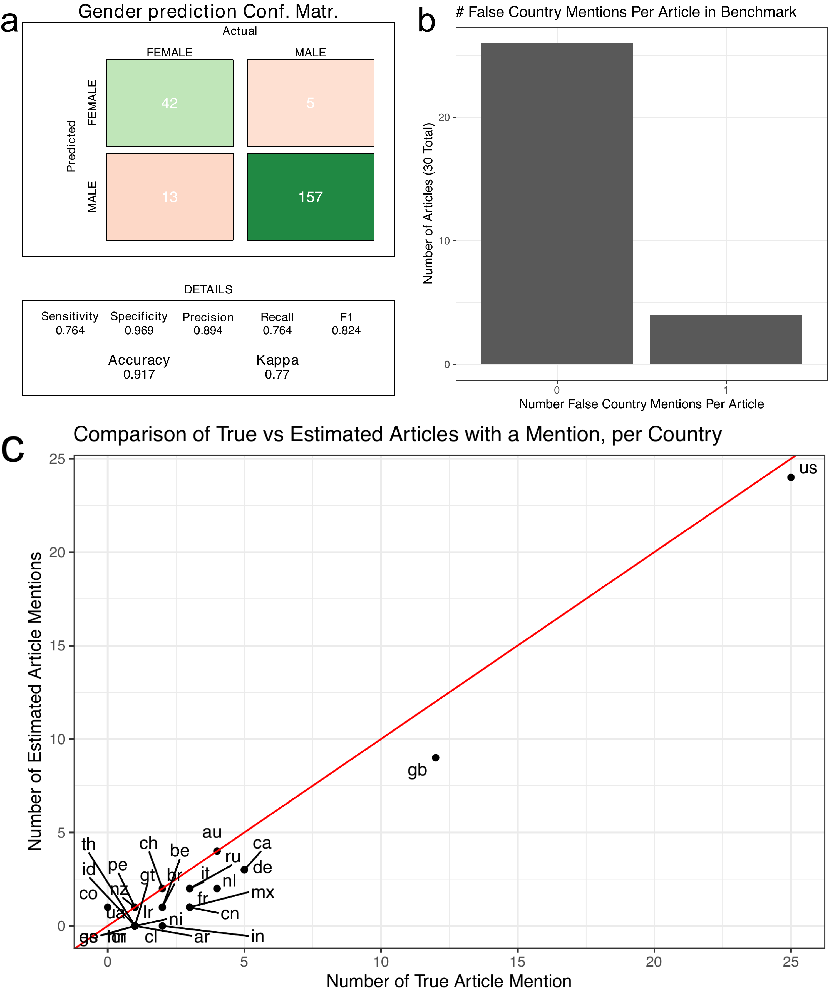

Supp1\_benchmark
================
Natalie Davidson
5/25/2021

## Overview

This notebook generates supplemental figure 1. This is the benchmark analysis to see how well our computational pipeline does in identifying gender and location mentions.

The **data** it uses to build the plots are here:

The benchmark dataset consists of 10 randomly chosen articles per year, for the years 2010, 2015, 2020. The benchmark dataset currently consists of 2 files:

1.  `benchmark_quote_table_hand_annotated` contains mapping between the speaker and their name and gender
    -   `benchmark_quote_table_raw` is the output from coreNLP which we will compare against
2.  `benchmark_location_table_hand_annotated` contains a mapping between all found (organizations, states, provencces, countries) with a (normalized country name, UN region, and UN sub-region)
    -   `benchmark_location_table_raw` is the output from coreNLP which we will compare against

The **setting + helper functions** to generate the plots are here:

1.  plotting related functions: `/utils/plotting_utils.R`

2.  reading + data processing related functions: `/analysis_scripts/analysis_utils.R`

## Read in the data

#### quote data

``` r
# get the project directory
proj_dir = here()

# get benchmark (bm) file and read it
bm_quote_file = paste(proj_dir, 
                    "/data/benchmark_data/benchmark_quote_table_hand_annotated.tsv", 
                    sep="")

bm_quote_df = read_benchmark_quote_file(bm_quote_file)
head(bm_quote_df)
```

    ##         file_id      true_speaker true_gender
    ## 1 4641259a.html  Sergio Baranzini        MALE
    ## 2 4641259a.html  Sergio Baranzini        MALE
    ## 3 4641259a.html Stephen Kingsmore        MALE
    ## 4 4641259a.html  Daniel Geschwind        MALE
    ## 5 4641259a.html Stephen Kingsmore        MALE
    ## 6 4641259a.html Stephen Kingsmore        MALE
    ##                                                                                                                                  quote
    ## 1                                                                 one was exposed to the perfect combination of environmental triggers
    ## 2 It isn't just sequence — they went from sequence to epigenome to expression. That's what really makes [the study] something special.
    ## 3                                                                           we really ought to look at sequencing of the brain tissue,
    ## 4                                                          What they've done here is create a very nice template for others to follow,
    ## 5                                                    Both twins came into the world with the same set of high risks for developing MS,
    ## 6                                                        There had to be some trigger that caused one to develop it and the other not,

``` r
# get quote file from processing pipeline and read it
raw_quote_file = paste(proj_dir, 
                    "/data/benchmark_data/benchmark_quote_table_raw.tsv", 
                    sep="")

raw_quote_df = read_corenlp_quote_files(raw_quote_file)

head(raw_quote_df)
```

    ##              file_id        est_speaker est_gender  canonical_speaker
    ## 1 d41586-020-00889-6              Addex       MALE       spokesperson
    ## 2 d41586-020-00889-6              Addex       MALE        Neena Nizar
    ## 3 d41586-020-00889-6              Addex       MALE       spokesperson
    ## 4 news.2010.179.html Adrian de Ferranti       MALE Adrian de Ferranti
    ## 5 d41586-020-01756-0    Alexis Kalergis       MALE            Unknown
    ## 6 news.2010.179.html      Andrew Osmond       MALE            Unknown
    ##         partial_name
    ## 1              Addex
    ## 2              Addex
    ## 3              Addex
    ## 4 Adrian de Ferranti
    ## 5           Kalergis
    ## 6      Andrew Osmond
    ##                                                                                                                                                                                                                  quote
    ## 1                                                                                                                                                                                   The COVID-19 situation is dynamic,
    ## 2                                                                                                                        I feel like we were chugging along on a train and then somebody dropped a huge boulder on it.
    ## 3                                                                                                         We are now seeing impacts on clinical-trial continuity in all the regions where we conduct clinical studies.
    ## 4 It is an endorsement of the council and it's also a message to us that we've got a lot to do and we've got a terrific organization to bring into the twenty-first century and continue with the job we have in hand.
    ## 5                                                                                                                                              all human vaccines used in Chile are obtained from foreign laboratories
    ## 6                                                                                                                                                                  outgoings are now substantially in excess of income

#### read location/mention data

``` r
# get benchmark (bm) file and read it
bm_loc_file = paste(proj_dir, 
                    "/data/benchmark_data/benchmark_location_table_hand_annotated.tsv", 
                    sep="")

bm_loc_df = read_benchmark_location_file(bm_loc_file)

raw_loc_file = paste(proj_dir, 
                    "/data/benchmark_data/benchmark_location_table_raw.tsv", 
                    sep="")

raw_loc_df = read_corenlp_location_files(raw_loc_file)
```

## Process Data

### Compare Gender predictions with hand annotation

``` r
# join the df to make comparison
compare_df = merge(bm_quote_df, raw_quote_df, by=c("file_id", "quote"), all.x=T)

compare_df = subset(compare_df, true_gender != "NOT_CLEAR")
compare_df = subset(compare_df, est_gender != "NO_EST")

#compare per quote
gender_idx = which(colnames(compare_df) == "est_gender")
true_gender_idx = which(colnames(compare_df) == "true_gender")
gender_match = apply(compare_df, 1, 
                    function(x) x[gender_idx] == x[true_gender_idx]) 

compare_df$is_gender_correct = gender_match

# compute confusion table
levels(compare_df$est_gender) = c("FEMALE", "MALE")
levels(compare_df$true_gender) = c("FEMALE", "MALE")
confusion_matrix <- confusionMatrix(as.factor(compare_df$est_gender),
                                    as.factor(compare_df$true_gender))
```

### Compare location mention predictions with hand annotation

``` r
# remove any predictions that are not a single country
alt_preds = c("NAN", "MULTI", "NONE", "NOT_FOUND")
raw_loc_df = subset(raw_loc_df, ! est_country_code %in% alt_preds)
bm_loc_df = subset(bm_loc_df, ! true_country_code %in% alt_preds)


# because we want to severly limit the amount of false positives,
# in our predictions we only consider an article to be 
# truely mention a country if there exists at least 2 country 
# associated nouns in the article
loc_dups = data.frame(table(raw_loc_df$file_id, raw_loc_df$est_country_code))
loc_keep = subset(loc_dups, Freq > 1)
raw_loc_df$freq_idx = paste(raw_loc_df$file_id, raw_loc_df$est_country_code, sep="_")
freq_pass = paste(loc_keep$Var1, loc_keep$Var2, sep="_")


# the all the mentions that pass
country_mention_est = unique(subset(raw_loc_df, 
                              select=c(file_id, est_country_code)) )
country_df_idx = paste(country_mention_est$file_id, 
                       country_mention_est$est_country_code, 
                       sep="_")
country_mention_est = country_mention_est[which(country_df_idx %in% freq_pass),]

# get the true mentions
country_mention_true = unique(subset(bm_loc_df, 
                              select=c(file_id, true_country_code)) )

# now, for each country see the number of articles that are a false positive
# and the number of articles that are missed
country_errors = NA
for(curr_country in union(country_mention_est$est_country_code,
                          country_mention_true$true_country_code)){
    
    true_set = subset(country_mention_true, true_country_code == curr_country)
    est_set = subset(country_mention_est, est_country_code == curr_country)

    files_fp = setdiff(est_set$file_id, true_set$file_id)
    if(length(files_fp) > 0){
        print(files_fp)
        print(curr_country)
    }
    files_missed = setdiff(true_set$file_id, est_set$file_id)
    
    res = data.frame(country_code = curr_country,
                     num_fp = length(files_fp),
                     num_missed = length(files_missed),
                     num_true = nrow(true_set),
                     num_est = nrow(est_set))
    country_errors = rbind(country_errors, res)
    
}
```

    ## [1] "news.2010.365.html"
    ## [1] "co"
    ## [1] "d41586-020-00889-6"
    ## [1] "gb"
    ## [1] "news.2010.179.html"
    ## [1] "it"
    ## [1] "russian-secret-service-to-vet-research-papers-1.18602"
    ## [1] "us"

``` r
country_errors = country_errors[-1,]
```

## Make the Figures

### gender plot

``` r
ggsave(file.path(proj_dir, "/figure_notebooks/tmp_files/supp_fig1_tmp/gg_gender.pdf"),
       draw_confusion_matrix(confusion_matrix, "FEMALE", "MALE", "Gender prediction Conf. Matr."),
       width = 5, height = 5, units = "in", device = "pdf")
```

### location FPR

``` r
gg_loc_hist = ggplot(country_errors, aes(x=as.factor(num_fp))) +
                geom_bar() +
                theme_bw() + 
                ylab("Number of Articles (30 Total)") +
                xlab("Number False Country Mentions Per Article") +
                ggtitle("# False Country Mentions Per Article in Benchmark") + 
                theme(legend.position = "none")
ggsave(file.path(proj_dir, "/figure_notebooks/tmp_files/supp_fig1_tmp/gg_loc_hist.pdf"),
       gg_loc_hist, width = 5, height = 5, units = "in", device = "pdf")

gg_loc_line = ggplot(country_errors, aes(x=num_true, 
                                         y=num_est, 
                                         label = country_code)) +
    geom_point() + geom_abline(slope = 1, intercept = 0, color = "red") +
    theme_bw() + geom_text_repel() + 
    xlab("Number of True Article Mention") + 
    ylab("Number of Estimated Article Mentions") +
    ggtitle("Comparison of True vs Estimated Articles with a Mention, per Country") + 
    scale_fill_brewer(palette="Set3") +
    theme(legend.position = "none")

ggsave(file.path(proj_dir, "/figure_notebooks/tmp_files/supp_fig1_tmp/gg_loc_line.pdf"),
       gg_loc_line, width = 7, height = 5, units = "in", device = "pdf")
```

### format figure

``` r
gg_gender = image_read_pdf(file.path(proj_dir,
                                  "/figure_notebooks/tmp_files/supp_fig1_tmp/gg_gender.pdf"))
gg_gender = image_annotate(gg_gender, "a", size = 30)


gg_loc_hist = image_read_pdf(file.path(proj_dir,
                                  "/figure_notebooks/tmp_files/supp_fig1_tmp/gg_loc_hist.pdf"))
gg_loc_hist = image_annotate(gg_loc_hist, "b", size = 30)


gg_loc_line = image_read_pdf(file.path(proj_dir,
                                  "/figure_notebooks/tmp_files/supp_fig1_tmp/gg_loc_line.pdf"))
gg_loc_line = image_annotate(gg_loc_line, "c", size = 30)


top_image <- image_append(image_scale(c(gg_gender, gg_loc_hist), "x3000"), stack = FALSE)
full_image <- image_append(image_scale(c(top_image, gg_loc_line), 3000), stack = TRUE)

print(full_image)
```

    ## # A tibble: 1 x 7
    ##   format width height colorspace matte filesize density
    ##   <chr>  <int>  <int> <chr>      <lgl>    <int> <chr>  
    ## 1 PNG     3000   3643 sRGB       TRUE         0 300x300



``` r
outfile = file.path(proj_dir,"/figure_notebooks/tmp_files/supp_fig1_tmp/supp_fig1.png")
image_write(full_image, format = "png", outfile)
```
